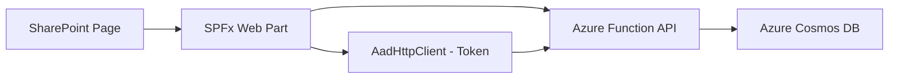

# How to Build a SharePoint Framework Web Part That Reads Data from Azure Cosmos DB

Author: [nawazdhandala](https://www.github.com/nawazdhandala)

Tags: SharePoint Framework, SPFx, Azure Cosmos DB, Web Part, React, Microsoft Graph, Azure Functions

Description: Build a SharePoint Framework web part that displays data from Azure Cosmos DB using an Azure Function as the backend API layer.

---

SharePoint Framework (SPFx) web parts are the modern way to extend SharePoint Online with custom functionality. While SharePoint lists and libraries are fine for simple data, sometimes you need to display data from external sources. Azure Cosmos DB is a popular choice for storing application data that needs to appear in SharePoint - product catalogs, IoT sensor readings, customer records, or any data that does not fit neatly into a SharePoint list.

You cannot connect directly from SPFx to Cosmos DB (and you should not - that would expose your connection strings in the browser). Instead, you build an Azure Function that acts as a secure API layer between your web part and Cosmos DB. In this guide, I will walk through the complete implementation.

## Architecture



The web part uses the SPFx `AadHttpClient` to get an Azure AD token and calls the Azure Function. The Function reads from Cosmos DB and returns the data. Authentication flows automatically through Azure AD - no separate login needed.

## Setting Up the Azure Function API

Create an Azure Function that serves as the backend API:

```bash
# Create the Function App
az functionapp create \
  --name func-spfx-api \
  --resource-group rg-spfx \
  --storage-account stspfxapi \
  --consumption-plan-location eastus \
  --runtime dotnet-isolated \
  --runtime-version 8 \
  --functions-version 4

# Enable Azure AD authentication
az webapp auth update \
  --name func-spfx-api \
  --resource-group rg-spfx \
  --enabled true \
  --action LoginWithAzureActiveDirectory
```

Here is the Azure Function that queries Cosmos DB:

```csharp
// Azure Function that reads product data from Cosmos DB
public class ProductApi
{
    private readonly Container _container;

    public ProductApi(CosmosClient cosmosClient)
    {
        _container = cosmosClient.GetContainer("ProductsDb", "Products");
    }

    [Function("GetProducts")]
    public async Task<HttpResponseData> GetProducts(
        [HttpTrigger(AuthorizationLevel.Anonymous, "get", Route = "products")]
        HttpRequestData req)
    {
        // Parse query parameters for filtering and paging
        var queryParams = System.Web.HttpUtility.ParseQueryString(req.Url.Query);
        var category = queryParams["category"];
        var pageSize = int.TryParse(queryParams["pageSize"], out var ps) ? ps : 20;
        var continuation = queryParams["continuation"];

        // Build the Cosmos DB query
        var queryText = "SELECT * FROM c";
        var queryDef = new QueryDefinition(queryText);

        if (!string.IsNullOrEmpty(category))
        {
            queryText = "SELECT * FROM c WHERE c.category = @category";
            queryDef = new QueryDefinition(queryText)
                .WithParameter("@category", category);
        }

        var options = new QueryRequestOptions
        {
            MaxItemCount = pageSize
        };

        var products = new List<Product>();
        string nextContinuation = null;

        using var iterator = _container.GetItemQueryIterator<Product>(
            queryDef, continuation, options);

        if (iterator.HasMoreResults)
        {
            var response = await iterator.ReadNextAsync();
            products.AddRange(response);
            nextContinuation = response.ContinuationToken;
        }

        // Build the response
        var httpResponse = req.CreateResponse(System.Net.HttpStatusCode.OK);
        await httpResponse.WriteAsJsonAsync(new
        {
            items = products,
            continuationToken = nextContinuation,
            count = products.Count
        });

        // Add CORS headers for SharePoint
        httpResponse.Headers.Add("Access-Control-Allow-Origin", "https://yourcompany.sharepoint.com");
        httpResponse.Headers.Add("Access-Control-Allow-Methods", "GET, OPTIONS");
        httpResponse.Headers.Add("Access-Control-Allow-Headers", "Authorization, Content-Type");

        return httpResponse;
    }

    [Function("GetProductById")]
    public async Task<HttpResponseData> GetProductById(
        [HttpTrigger(AuthorizationLevel.Anonymous, "get", Route = "products/{id}")]
        HttpRequestData req,
        string id)
    {
        try
        {
            var product = await _container.ReadItemAsync<Product>(
                id, new PartitionKey(id));

            var response = req.CreateResponse(System.Net.HttpStatusCode.OK);
            await response.WriteAsJsonAsync(product.Resource);
            return response;
        }
        catch (CosmosException ex) when (ex.StatusCode == System.Net.HttpStatusCode.NotFound)
        {
            return req.CreateResponse(System.Net.HttpStatusCode.NotFound);
        }
    }
}

public class Product
{
    public string Id { get; set; }
    public string Name { get; set; }
    public string Description { get; set; }
    public string Category { get; set; }
    public decimal Price { get; set; }
    public string ImageUrl { get; set; }
    public int StockQuantity { get; set; }
    public DateTime LastUpdated { get; set; }
}
```

## Creating the SPFx Web Part

Scaffold the SPFx project:

```bash
# Create the SPFx project
mkdir spfx-cosmos-viewer && cd spfx-cosmos-viewer
yo @microsoft/sharepoint

# When prompted:
# - Solution name: cosmos-product-viewer
# - Web part name: ProductViewer
# - Framework: React
```

## Building the Web Part Component

Here is the React component that displays Cosmos DB data:

```typescript
// src/webparts/productViewer/components/ProductViewer.tsx
import * as React from 'react';
import { useState, useEffect, useCallback } from 'react';
import { AadHttpClient, HttpClientResponse } from '@microsoft/sp-http';
import {
    DetailsList,
    IColumn,
    SelectionMode,
    Spinner,
    SpinnerSize,
    MessageBar,
    MessageBarType,
    SearchBox,
    Dropdown,
    IDropdownOption,
    PrimaryButton
} from '@fluentui/react';

interface IProductViewerProps {
    aadHttpClient: AadHttpClient;
    apiEndpoint: string;
}

interface IProduct {
    id: string;
    name: string;
    description: string;
    category: string;
    price: number;
    stockQuantity: number;
    lastUpdated: string;
}

const ProductViewer: React.FC<IProductViewerProps> = ({ aadHttpClient, apiEndpoint }) => {
    const [products, setProducts] = useState<IProduct[]>([]);
    const [loading, setLoading] = useState(true);
    const [error, setError] = useState<string | null>(null);
    const [selectedCategory, setSelectedCategory] = useState<string>('');
    const [continuation, setContinuation] = useState<string | null>(null);

    // Define the columns for the DetailsList
    const columns: IColumn[] = [
        { key: 'name', name: 'Product Name', fieldName: 'name', minWidth: 150, maxWidth: 250, isResizable: true },
        { key: 'category', name: 'Category', fieldName: 'category', minWidth: 100, maxWidth: 150 },
        {
            key: 'price',
            name: 'Price',
            fieldName: 'price',
            minWidth: 80,
            maxWidth: 100,
            onRender: (item: IProduct) => <span>${item.price.toFixed(2)}</span>
        },
        {
            key: 'stock',
            name: 'In Stock',
            fieldName: 'stockQuantity',
            minWidth: 80,
            maxWidth: 100,
            onRender: (item: IProduct) => (
                <span style={{ color: item.stockQuantity < 10 ? 'red' : 'green' }}>
                    {item.stockQuantity}
                </span>
            )
        },
        {
            key: 'updated',
            name: 'Last Updated',
            fieldName: 'lastUpdated',
            minWidth: 120,
            maxWidth: 180,
            onRender: (item: IProduct) => (
                <span>{new Date(item.lastUpdated).toLocaleDateString()}</span>
            )
        }
    ];

    // Category filter options
    const categoryOptions: IDropdownOption[] = [
        { key: '', text: 'All Categories' },
        { key: 'Electronics', text: 'Electronics' },
        { key: 'Clothing', text: 'Clothing' },
        { key: 'Home', text: 'Home & Garden' },
        { key: 'Books', text: 'Books' }
    ];

    // Fetch products from the Azure Function API
    const fetchProducts = useCallback(async (category?: string, continueToken?: string) => {
        setLoading(true);
        setError(null);

        try {
            let url = `${apiEndpoint}/api/products?pageSize=20`;
            if (category) url += `&category=${encodeURIComponent(category)}`;
            if (continueToken) url += `&continuation=${encodeURIComponent(continueToken)}`;

            // Use AadHttpClient to make an authenticated request
            const response: HttpClientResponse = await aadHttpClient.get(
                url,
                AadHttpClient.configurations.v1
            );

            if (!response.ok) {
                throw new Error(`API returned ${response.status}: ${response.statusText}`);
            }

            const data = await response.json();

            if (continueToken) {
                // Append to existing results for "load more"
                setProducts(prev => [...prev, ...data.items]);
            } else {
                setProducts(data.items);
            }

            setContinuation(data.continuationToken);
        } catch (err: any) {
            setError(err.message || 'Failed to fetch products');
        } finally {
            setLoading(false);
        }
    }, [aadHttpClient, apiEndpoint]);

    // Initial load
    useEffect(() => {
        fetchProducts();
    }, [fetchProducts]);

    // Handle category filter change
    const handleCategoryChange = (_event: React.FormEvent, option?: IDropdownOption) => {
        const category = option?.key as string || '';
        setSelectedCategory(category);
        setContinuation(null);
        fetchProducts(category);
    };

    // Handle load more
    const handleLoadMore = () => {
        if (continuation) {
            fetchProducts(selectedCategory, continuation);
        }
    };

    return (
        <div style={{ padding: '20px' }}>
            <h2>Product Catalog</h2>

            <div style={{ display: 'flex', gap: '16px', marginBottom: '16px' }}>
                <Dropdown
                    placeholder="Filter by category"
                    options={categoryOptions}
                    selectedKey={selectedCategory}
                    onChange={handleCategoryChange}
                    styles={{ root: { width: 200 } }}
                />
            </div>

            {error && (
                <MessageBar messageBarType={MessageBarType.error} dismissButtonAriaLabel="Close">
                    {error}
                </MessageBar>
            )}

            {loading && products.length === 0 ? (
                <Spinner size={SpinnerSize.large} label="Loading products..." />
            ) : (
                <>
                    <DetailsList
                        items={products}
                        columns={columns}
                        selectionMode={SelectionMode.none}
                        isHeaderVisible={true}
                    />

                    {continuation && (
                        <div style={{ marginTop: '16px', textAlign: 'center' }}>
                            <PrimaryButton
                                text="Load More"
                                onClick={handleLoadMore}
                                disabled={loading}
                            />
                        </div>
                    )}
                </>
            )}
        </div>
    );
};

export default ProductViewer;
```

## Configuring the Web Part for Azure AD Authentication

The web part needs to request an Azure AD token scoped to your Azure Function. Configure this in the web part class:

```typescript
// src/webparts/productViewer/ProductViewerWebPart.ts
import { BaseClientSideWebPart } from '@microsoft/sp-webpart-base';
import { AadHttpClient } from '@microsoft/sp-http';
import * as React from 'react';
import * as ReactDom from 'react-dom';
import ProductViewer from './components/ProductViewer';

export default class ProductViewerWebPart extends BaseClientSideWebPart<IProductViewerWebPartProps> {
    private aadHttpClient: AadHttpClient;

    protected async onInit(): Promise<void> {
        // Create the AadHttpClient scoped to your Azure Function's app registration
        this.aadHttpClient = await this.context.aadHttpClientFactory.getClient(
            'your-function-app-client-id'  // The Azure AD App ID for your Function App
        );
    }

    public render(): void {
        const element = React.createElement(ProductViewer, {
            aadHttpClient: this.aadHttpClient,
            apiEndpoint: this.properties.apiEndpoint || 'https://func-spfx-api.azurewebsites.net'
        });

        ReactDom.render(element, this.domElement);
    }

    protected onDispose(): void {
        ReactDom.unmountComponentAtNode(this.domElement);
    }
}
```

## Permissions Configuration

Add the Azure AD permission request to the SPFx package solution configuration:

```json
{
    "$schema": "https://developer.microsoft.com/json-schemas/spfx-build/package-solution.schema.json",
    "solution": {
        "name": "cosmos-product-viewer",
        "id": "your-solution-guid",
        "version": "1.0.0.0",
        "webApiPermissionRequests": [
            {
                "resource": "func-spfx-api",
                "scope": "user_impersonation"
            }
        ]
    }
}
```

After deploying the package, a SharePoint admin needs to approve the permission request in the SharePoint Admin Center under API access.

## Deploying the Web Part

Build and deploy the SPFx package:

```bash
# Build the production bundle
gulp bundle --ship

# Package the solution
gulp package-solution --ship

# The .sppkg file is in sharepoint/solution/
# Upload it to the SharePoint App Catalog
```

## Adding Caching for Performance

To avoid hitting the Azure Function on every page load, add a simple caching layer:

```typescript
// Simple cache implementation for API responses
class ApiCache {
    private cache: Map<string, { data: any; timestamp: number }> = new Map();
    private ttlMs: number;

    constructor(ttlMinutes: number = 5) {
        this.ttlMs = ttlMinutes * 60 * 1000;
    }

    get(key: string): any | null {
        const entry = this.cache.get(key);
        if (!entry) return null;

        if (Date.now() - entry.timestamp > this.ttlMs) {
            this.cache.delete(key);
            return null;
        }

        return entry.data;
    }

    set(key: string, data: any): void {
        this.cache.set(key, { data, timestamp: Date.now() });
    }
}
```

## Wrapping Up

Building an SPFx web part that reads from Azure Cosmos DB requires an API layer in between, but the pattern is clean and reusable. The Azure Function handles the Cosmos DB queries and authentication, the SPFx AadHttpClient handles the token acquisition silently, and the React component handles the rendering with Fluent UI components that match the SharePoint look and feel. This same pattern works for any external data source - swap Cosmos DB for a SQL database, a REST API, or any other backend, and the SPFx integration pattern stays the same.
