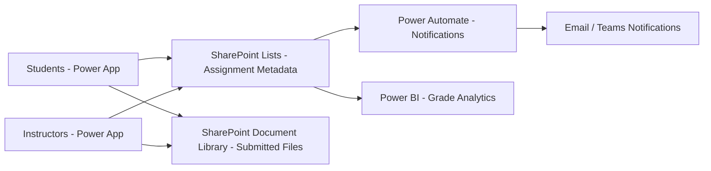

# How to Build a Student Assignment Submission Portal with Power Apps and SharePoint on Azure

Author: [nawazdhandala](https://www.github.com/nawazdhandala)

Tags: Power Apps, SharePoint, Azure, Education, Assignment Submission, Low-Code, Student Portal

Description: Build a student assignment submission portal using Power Apps for the frontend and SharePoint document libraries on Azure for file storage.

---

Schools and universities need a straightforward way for students to submit assignments and for instructors to review and grade them. Many institutions already have Microsoft 365 licenses, which means they have access to Power Apps and SharePoint without additional cost. Building a submission portal with these tools is fast, requires minimal coding, and integrates with the existing Microsoft ecosystem.

In this guide, I will build a complete assignment submission portal. Power Apps provides the student-facing interface. SharePoint stores the files and metadata. Power Automate handles notifications and workflow automation. Everything runs on your existing Microsoft 365 tenant backed by Azure infrastructure.

## Architecture



SharePoint serves as the backend. Assignment definitions, submissions, and grades are stored in SharePoint lists. Submitted files go into a document library with folder structure organized by course and assignment. Power Automate triggers notifications when submissions are received or grades are posted.

## Step 1 - Set Up the SharePoint Structure

Create a SharePoint site for the assignment portal with the necessary lists and libraries.

Navigate to your SharePoint admin center and create a new team site called "Assignment Portal." Then create the following lists and libraries.

**Courses List** - Stores course information.

| Column Name | Type | Notes |
|---|---|---|
| Title | Single line of text | Course name |
| CourseCode | Single line of text | e.g., CS101 |
| Instructor | Person | The instructor |
| Semester | Choice | Fall 2025, Spring 2026, etc. |
| IsActive | Yes/No | Whether the course is currently active |

**Assignments List** - Stores assignment definitions.

| Column Name | Type | Notes |
|---|---|---|
| Title | Single line of text | Assignment name |
| Course | Lookup | Links to Courses list |
| Description | Multiple lines of text | Assignment instructions |
| DueDate | Date and Time | Submission deadline |
| MaxPoints | Number | Maximum possible score |
| AcceptLateSubmissions | Yes/No | Whether late work is accepted |
| LatePenaltyPerDay | Number | Points deducted per day late |

**Submissions List** - Tracks each submission.

| Column Name | Type | Notes |
|---|---|---|
| Title | Single line of text | Auto-generated: StudentName - Assignment |
| Assignment | Lookup | Links to Assignments list |
| Student | Person | The submitting student |
| SubmittedDate | Date and Time | When the file was uploaded |
| Status | Choice | Submitted, Graded, Returned, Late |
| Score | Number | Instructor-assigned grade |
| Feedback | Multiple lines of text | Instructor feedback |
| FilePath | Hyperlink | Link to the submitted file |
| IsLate | Yes/No | Calculated based on due date |

Create these lists using the SharePoint REST API or PnP PowerShell.

```powershell
# Connect to the SharePoint site
Connect-PnPOnline -Url "https://yourtenent.sharepoint.com/sites/AssignmentPortal" -Interactive

# Create the Courses list
New-PnPList -Title "Courses" -Template GenericList
Add-PnPField -List "Courses" -DisplayName "CourseCode" -InternalName "CourseCode" -Type Text
Add-PnPField -List "Courses" -DisplayName "Semester" -InternalName "Semester" -Type Choice -Choices "Fall 2025","Spring 2026","Summer 2026"
Add-PnPField -List "Courses" -DisplayName "IsActive" -InternalName "IsActive" -Type Boolean

# Create the Assignments list
New-PnPList -Title "Assignments" -Template GenericList
Add-PnPField -List "Assignments" -DisplayName "Description" -InternalName "Description" -Type Note
Add-PnPField -List "Assignments" -DisplayName "DueDate" -InternalName "DueDate" -Type DateTime
Add-PnPField -List "Assignments" -DisplayName "MaxPoints" -InternalName "MaxPoints" -Type Number
Add-PnPField -List "Assignments" -DisplayName "AcceptLateSubmissions" -InternalName "AcceptLateSubmissions" -Type Boolean

# Create the Submissions list
New-PnPList -Title "Submissions" -Template GenericList
Add-PnPField -List "Submissions" -DisplayName "SubmittedDate" -InternalName "SubmittedDate" -Type DateTime
Add-PnPField -List "Submissions" -DisplayName "Status" -InternalName "Status" -Type Choice -Choices "Submitted","Graded","Returned","Late"
Add-PnPField -List "Submissions" -DisplayName "Score" -InternalName "Score" -Type Number
Add-PnPField -List "Submissions" -DisplayName "Feedback" -InternalName "Feedback" -Type Note

# Create the document library for submitted files
New-PnPList -Title "SubmittedFiles" -Template DocumentLibrary
```

## Step 2 - Build the Student Submission App

Create a new canvas app in Power Apps. The student app has three main screens: My Courses, Assignment List, and Submit Assignment.

The courses screen shows only courses the current student is enrolled in.

```
// Gallery Items formula for the Courses screen
// Filter courses to show only active ones the student is enrolled in
Filter(
    Courses,
    IsActive = true,
    User().Email in Enrollments.StudentEmail
)
```

The assignment list screen shows assignments for a selected course with their status.

```
// Gallery Items for the Assignments screen
// Show assignments for the selected course, sorted by due date
SortByColumns(
    AddColumns(
        Filter(
            Assignments,
            Course.Value = SelectedCourse.Title
        ),
        "MySubmission",
        LookUp(
            Submissions,
            Assignment.Value = ThisRecord.Title &&
            Student.Email = User().Email
        ),
        "DaysUntilDue",
        DateDiff(Today(), DueDate, TimeUnit.Days)
    ),
    "DueDate",
    SortOrder.Ascending
)
```

For the submission screen, create a form with a file upload control and a text area for comments.

```
// Submit button OnSelect formula
// Create a submission record and upload the file
Set(
    varSubmission,
    Patch(
        Submissions,
        Defaults(Submissions),
        {
            Title: User().FullName & " - " & SelectedAssignment.Title,
            Assignment: {
                Id: SelectedAssignment.ID,
                Value: SelectedAssignment.Title
            },
            Student: {
                Claims: "i:0#.f|membership|" & User().Email,
                DisplayName: User().FullName,
                Email: User().Email
            },
            SubmittedDate: Now(),
            Status: {Value: If(
                Now() > SelectedAssignment.DueDate,
                "Late",
                "Submitted"
            )},
            IsLate: Now() > SelectedAssignment.DueDate
        }
    )
);

// Upload the file to SharePoint document library
// Folder path: CourseCode/AssignmentTitle/StudentName/
Set(
    varFilePath,
    Concatenate(
        SelectedCourse.CourseCode, "/",
        SelectedAssignment.Title, "/",
        User().FullName, "/"
    )
);

// Notify the student
Notify(
    "Assignment submitted successfully!",
    NotificationType.Success
);

Navigate(AssignmentListScreen, ScreenTransition.Cover)
```

## Step 3 - Build the Instructor Grading App

The instructor app shows pending submissions and provides a grading interface.

```
// Gallery Items for pending submissions
// Show all ungraded submissions for courses the instructor teaches
Filter(
    Submissions,
    Status.Value = "Submitted" || Status.Value = "Late",
    Assignment.Value in Filter(
        Assignments,
        Course.Value in Filter(
            Courses,
            Instructor.Email = User().Email
        ).Title
    ).Title
)
```

The grading form lets instructors enter a score, provide feedback, and mark the submission as graded.

```
// Grade submission button OnSelect
Patch(
    Submissions,
    LookUp(Submissions, ID = SelectedSubmission.ID),
    {
        Score: Value(ScoreInput.Text),
        Feedback: FeedbackInput.Text,
        Status: {Value: "Graded"}
    }
);

// Trigger notification to student (handled by Power Automate)
Notify(
    "Grade saved for " & SelectedSubmission.Student.DisplayName,
    NotificationType.Success
);

// Move to next ungraded submission
Set(
    varNextSubmission,
    First(
        Filter(
            Submissions,
            Status.Value = "Submitted",
            ID <> SelectedSubmission.ID
        )
    )
);

If(
    !IsBlank(varNextSubmission),
    Navigate(GradeSubmissionScreen, ScreenTransition.Cover)
)
```

## Step 4 - Set Up Automated Notifications with Power Automate

Create Power Automate flows that notify students and instructors about important events.

**Flow 1: New Submission Notification** - When a new item is created in the Submissions list, email the course instructor.

Create a new automated flow with the trigger "When an item is created" pointing to the Submissions list. Add these actions:

1. Get the assignment details from the Assignments list
2. Get the course details from the Courses list
3. Send an email to the instructor

The email template should include the student name, assignment title, submission time, and whether it is late.

**Flow 2: Grade Posted Notification** - When a submission status changes to "Graded," notify the student.

```json
{
  "trigger": {
    "type": "SharePoint - When an item is modified",
    "list": "Submissions",
    "condition": "@equals(triggerBody()?['Status']?['Value'], 'Graded')"
  },
  "actions": [
    {
      "type": "Send an email (V2)",
      "to": "@{triggerBody()?['Student']?['Email']}",
      "subject": "Grade Posted: @{triggerBody()?['Title']}",
      "body": "Your assignment has been graded.\n\nScore: @{triggerBody()?['Score']} / @{body('Get_Assignment')?['MaxPoints']}\n\nFeedback: @{triggerBody()?['Feedback']}"
    },
    {
      "type": "Post message in a chat or channel",
      "team": "Course Teams Channel",
      "message": "Grade posted for @{triggerBody()?['Student']?['DisplayName']}"
    }
  ]
}
```

**Flow 3: Due Date Reminder** - A scheduled flow that runs daily and sends reminders for assignments due within 48 hours.

```json
{
  "trigger": {
    "type": "Recurrence",
    "frequency": "Day",
    "time": "08:00"
  },
  "actions": [
    {
      "type": "Get items",
      "list": "Assignments",
      "filter": "DueDate ge '@{utcNow()}' and DueDate le '@{addDays(utcNow(), 2)}'"
    },
    {
      "type": "Apply to each",
      "foreach": "Get_items_value",
      "actions": [
        {
          "type": "Get enrolled students for this course"
        },
        {
          "type": "Filter students who have not submitted"
        },
        {
          "type": "Send email to each unsubmitted student",
          "subject": "Reminder: @{items('Apply_to_each')?['Title']} due soon",
          "body": "This is a reminder that your assignment is due on @{items('Apply_to_each')?['DueDate']}."
        }
      ]
    }
  ]
}
```

## Step 5 - Build Grade Analytics with Power BI

Connect Power BI to the SharePoint lists to visualize grade distributions and trends.

Create a Power BI report with these visuals:
- Grade distribution histogram per assignment
- Average scores by course
- Submission timing analysis (how many students submit early vs at the deadline vs late)
- Individual student progress over time

The Power BI connection to SharePoint is straightforward. In Power BI Desktop, choose "Get Data" > "SharePoint Online List" and point it to your site URL. Select the Submissions, Assignments, and Courses lists.

## Permissions and Security

Set up the SharePoint permissions so students can only see their own submissions while instructors see all submissions for their courses. Use SharePoint item-level permissions or filtered views in the Power App to enforce this separation.

In the Power App, every data query should include a filter for the current user to prevent students from seeing other students' grades. This is enforced at the app level since SharePoint list-level permissions can be complex to manage at scale.

## Wrapping Up

Power Apps and SharePoint provide a practical, low-code approach to building a student assignment submission portal. SharePoint handles the data storage and file management. Power Apps provides the student and instructor interfaces. Power Automate keeps everyone informed with timely notifications. Power BI adds grade analytics. The entire solution runs on your existing Microsoft 365 infrastructure, which means no additional hosting costs and seamless integration with the tools your institution already uses. Start with the core submission workflow, add grading, then layer on notifications and analytics as you go.
