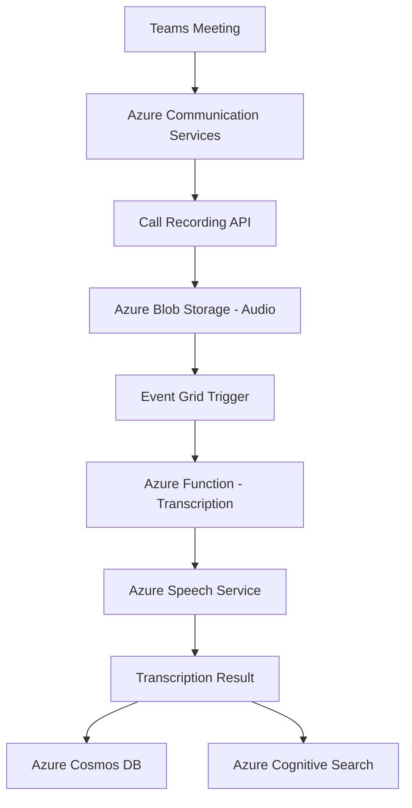

# How to Build a Teams Meeting Transcription Pipeline with Azure Communication Services and Cognitive Services

Author: [nawazdhandala](https://www.github.com/nawazdhandala)

Tags: Microsoft Teams, Azure Communication Services, Cognitive Services, Transcription, Speech-to-Text, Azure Functions, AI

Description: Build an automated meeting transcription pipeline that captures Teams meeting audio and converts it to searchable text using Azure Cognitive Services.

---

Meeting transcription is one of those features that sounds simple but involves a surprising amount of plumbing. You need to capture the meeting audio, send it to a speech-to-text service, associate the text with speakers, format the output, and store it somewhere accessible. If you want to do this at scale for an organization, you need automation.

In this guide, I will build a pipeline that captures audio from Microsoft Teams meetings using Azure Communication Services, transcribes it with Azure Cognitive Services Speech-to-Text, and stores the results for search and review.

## Pipeline Architecture



When a meeting starts and recording is enabled, Azure Communication Services captures the audio. When the recording is saved to blob storage, an Event Grid event triggers an Azure Function that submits the audio to the Speech Service for batch transcription. The transcribed text is stored in Cosmos DB and indexed in Cognitive Search.

## Setting Up Azure Communication Services

Create the Communication Services resource and configure it for Teams integration:

```bash
# Create Azure Communication Services resource
az communication create \
  --name acs-meeting-transcription \
  --resource-group rg-transcription \
  --location global \
  --data-location unitedstates

# Get the connection string
CONNECTION_STRING=$(az communication list-key \
  --name acs-meeting-transcription \
  --resource-group rg-transcription \
  --query primaryConnectionString -o tsv)
```

## Starting Call Recording

When a Teams meeting begins, your application can start recording through the Call Recording API. This requires a server-side call to join the meeting and start recording:

```csharp
// Service that manages Teams meeting recording via Azure Communication Services
public class MeetingRecordingService
{
    private readonly CallAutomationClient _callClient;
    private readonly ILogger<MeetingRecordingService> _logger;

    public MeetingRecordingService(string connectionString, ILogger<MeetingRecordingService> logger)
    {
        _callClient = new CallAutomationClient(connectionString);
        _logger = logger;
    }

    // Start recording a Teams meeting
    public async Task<string> StartRecordingAsync(string meetingUrl)
    {
        // Create a server call connection to the Teams meeting
        var locator = new TeamsMeetingLinkLocator(meetingUrl);

        // Configure recording options
        var recordingOptions = new StartRecordingOptions(new ServerCallLocator("serverCallId"))
        {
            RecordingContent = RecordingContent.Audio, // Audio only for transcription
            RecordingChannel = RecordingChannel.Mixed, // Mix all participants
            RecordingFormat = RecordingFormat.Wav       // WAV format for best quality
        };

        // Start the recording
        var response = await _callClient
            .GetCallRecording()
            .StartAsync(recordingOptions);

        _logger.LogInformation(
            "Recording started: {RecordingId}", response.Value.RecordingId);

        return response.Value.RecordingId;
    }

    // Stop recording and get the download location
    public async Task StopRecordingAsync(string recordingId)
    {
        await _callClient
            .GetCallRecording()
            .StopAsync(recordingId);

        _logger.LogInformation("Recording stopped: {RecordingId}", recordingId);
    }

    // Download the recording to blob storage
    public async Task<string> DownloadRecordingAsync(
        string contentLocation, BlobContainerClient blobContainer)
    {
        var recording = await _callClient
            .GetCallRecording()
            .DownloadStreamingAsync(new Uri(contentLocation));

        var blobName = $"recordings/{DateTime.UtcNow:yyyy/MM/dd}/{Guid.NewGuid()}.wav";
        var blobClient = blobContainer.GetBlobClient(blobName);

        await blobClient.UploadAsync(recording.Value);

        _logger.LogInformation("Recording saved to blob: {BlobName}", blobName);

        return blobClient.Uri.ToString();
    }
}
```

## Processing Recording Events

When a recording is ready, Azure Communication Services sends an event. Set up an Azure Function to handle it:

```csharp
// Azure Function that handles recording status events
public class RecordingEventHandler
{
    private readonly MeetingRecordingService _recordingService;
    private readonly BlobContainerClient _blobContainer;
    private readonly ILogger<RecordingEventHandler> _logger;

    [FunctionName("HandleRecordingEvent")]
    public async Task Run(
        [EventGridTrigger] EventGridEvent eventGridEvent,
        ILogger log)
    {
        log.LogInformation("Received recording event: {Type}", eventGridEvent.EventType);

        if (eventGridEvent.EventType == "Microsoft.Communication.RecordingFileStatusUpdated")
        {
            var data = eventGridEvent.Data.ToObjectFromJson<RecordingFileStatusUpdatedEvent>();

            if (data.RecordingStorageInfo?.RecordingChunks != null)
            {
                foreach (var chunk in data.RecordingStorageInfo.RecordingChunks)
                {
                    // Download the recording chunk
                    var blobUrl = await _recordingService.DownloadRecordingAsync(
                        chunk.ContentLocation, _blobContainer);

                    log.LogInformation(
                        "Recording chunk saved: {BlobUrl}", blobUrl);

                    // Trigger transcription
                    await SubmitForTranscriptionAsync(blobUrl, data.RecordingId);
                }
            }
        }
    }

    private async Task SubmitForTranscriptionAsync(string audioUrl, string recordingId)
    {
        // Queue a message to trigger the transcription function
        // This decouples recording download from transcription
    }
}
```

## Batch Transcription with Azure Speech Service

For meeting recordings that can be minutes or hours long, batch transcription is more efficient than real-time transcription:

```csharp
// Service that submits audio files for batch transcription
public class TranscriptionService
{
    private readonly HttpClient _httpClient;
    private readonly string _speechKey;
    private readonly string _speechRegion;
    private readonly ILogger<TranscriptionService> _logger;

    public TranscriptionService(
        IHttpClientFactory httpClientFactory,
        IConfiguration config,
        ILogger<TranscriptionService> logger)
    {
        _httpClient = httpClientFactory.CreateClient();
        _speechKey = config["Speech:Key"];
        _speechRegion = config["Speech:Region"];
        _logger = logger;
    }

    // Submit an audio file for batch transcription
    public async Task<string> SubmitTranscriptionAsync(
        string audioUrl, string meetingId)
    {
        var endpoint = $"https://{_speechRegion}.api.cognitive.microsoft.com" +
                       "/speechtotext/v3.1/transcriptions";

        var request = new
        {
            contentUrls = new[] { audioUrl },
            locale = "en-US",
            displayName = $"Meeting-{meetingId}-{DateTime.UtcNow:yyyyMMdd}",
            properties = new
            {
                // Enable speaker diarization to identify who said what
                diarizationEnabled = true,
                // Enable word-level timestamps for precise alignment
                wordLevelTimestampsEnabled = true,
                // Enable punctuation for readability
                punctuationMode = "DictatedAndAutomatic",
                // Profanity filter setting
                profanityFilterMode = "Masked"
            }
        };

        _httpClient.DefaultRequestHeaders.Clear();
        _httpClient.DefaultRequestHeaders.Add("Ocp-Apim-Subscription-Key", _speechKey);

        var response = await _httpClient.PostAsJsonAsync(endpoint, request);
        response.EnsureSuccessStatusCode();

        var result = await response.Content.ReadFromJsonAsync<TranscriptionResponse>();

        _logger.LogInformation(
            "Transcription submitted: {TranscriptionId}", result.Self);

        return result.Self;
    }

    // Check transcription status and retrieve results
    public async Task<TranscriptionResult> GetTranscriptionResultAsync(
        string transcriptionUrl)
    {
        _httpClient.DefaultRequestHeaders.Clear();
        _httpClient.DefaultRequestHeaders.Add("Ocp-Apim-Subscription-Key", _speechKey);

        var response = await _httpClient.GetFromJsonAsync<TranscriptionStatus>(
            transcriptionUrl);

        if (response.Status != "Succeeded")
        {
            return null; // Still processing
        }

        // Get the result files
        var filesResponse = await _httpClient.GetFromJsonAsync<TranscriptionFiles>(
            $"{transcriptionUrl}/files");

        var resultFile = filesResponse.Values
            .FirstOrDefault(f => f.Kind == "Transcription");

        if (resultFile == null)
        {
            throw new InvalidOperationException("No transcription result file found");
        }

        // Download the actual transcription content
        var transcription = await _httpClient.GetFromJsonAsync<TranscriptionResult>(
            resultFile.Links.ContentUrl);

        return transcription;
    }
}
```

## Processing and Storing Transcription Results

Once the transcription is complete, process it into a structured format and store it:

```csharp
// Function that polls for transcription completion and stores results
public class TranscriptionCompletionHandler
{
    private readonly TranscriptionService _transcriptionService;
    private readonly CosmosClient _cosmosClient;
    private readonly Container _transcriptContainer;

    [FunctionName("CheckTranscriptionStatus")]
    public async Task Run(
        [TimerTrigger("0 */5 * * * *")] TimerInfo timer, // Check every 5 minutes
        ILogger log)
    {
        // Get all pending transcription jobs
        var pendingJobs = await GetPendingJobsAsync();

        foreach (var job in pendingJobs)
        {
            var result = await _transcriptionService
                .GetTranscriptionResultAsync(job.TranscriptionUrl);

            if (result == null)
            {
                continue; // Still processing
            }

            // Transform the raw transcription into a structured document
            var transcript = new MeetingTranscript
            {
                Id = job.MeetingId,
                MeetingTitle = job.MeetingTitle,
                RecordedAt = job.RecordedAt,
                Duration = result.Duration,
                Segments = result.RecognizedPhrases
                    .OrderBy(p => p.OffsetInTicks)
                    .Select(phrase => new TranscriptSegment
                    {
                        Speaker = $"Speaker {phrase.Speaker}",
                        Text = phrase.NBest.FirstOrDefault()?.Display ?? "",
                        StartTime = TimeSpan.FromTicks(phrase.OffsetInTicks),
                        EndTime = TimeSpan.FromTicks(
                            phrase.OffsetInTicks + phrase.DurationInTicks),
                        Confidence = phrase.NBest.FirstOrDefault()?.Confidence ?? 0
                    })
                    .ToList(),
                FullText = string.Join(" ",
                    result.RecognizedPhrases
                        .OrderBy(p => p.OffsetInTicks)
                        .Select(p => p.NBest.FirstOrDefault()?.Display ?? ""))
            };

            // Store in Cosmos DB
            await _transcriptContainer.UpsertItemAsync(
                transcript,
                new PartitionKey(transcript.Id));

            // Mark the job as complete
            await MarkJobCompleteAsync(job.Id);

            log.LogInformation(
                "Transcription completed for meeting {MeetingId}: {SegmentCount} segments",
                job.MeetingId, transcript.Segments.Count);
        }
    }

    private async Task<List<TranscriptionJob>> GetPendingJobsAsync()
    {
        // Query Cosmos DB for pending transcription jobs
        var query = new QueryDefinition(
            "SELECT * FROM c WHERE c.status = 'Pending'");

        var jobs = new List<TranscriptionJob>();
        var container = _cosmosClient.GetContainer("Transcription", "Jobs");

        using var iterator = container.GetItemQueryIterator<TranscriptionJob>(query);
        while (iterator.HasMoreResults)
        {
            var response = await iterator.ReadNextAsync();
            jobs.AddRange(response);
        }

        return jobs;
    }

    private async Task MarkJobCompleteAsync(string jobId)
    {
        var container = _cosmosClient.GetContainer("Transcription", "Jobs");
        var operations = new List<PatchOperation>
        {
            PatchOperation.Set("/status", "Completed"),
            PatchOperation.Set("/completedAt", DateTime.UtcNow)
        };

        await container.PatchItemAsync<TranscriptionJob>(
            jobId, new PartitionKey(jobId), operations);
    }
}
```

## Making Transcripts Searchable

Index the transcripts in Azure Cognitive Search so users can find specific discussions:

```json
{
    "name": "meeting-transcripts",
    "fields": [
        { "name": "id", "type": "Edm.String", "key": true },
        { "name": "meetingTitle", "type": "Edm.String", "searchable": true },
        { "name": "recordedAt", "type": "Edm.DateTimeOffset", "filterable": true, "sortable": true },
        { "name": "fullText", "type": "Edm.String", "searchable": true },
        { "name": "duration", "type": "Edm.String" },
        { "name": "speakers", "type": "Collection(Edm.String)", "filterable": true }
    ]
}
```

With this index, users can search across all meeting transcripts for specific topics, decisions, or action items that were discussed.

## Wrapping Up

Building a Teams meeting transcription pipeline involves connecting several Azure services together: Communication Services for recording, Blob Storage for audio files, Speech Services for transcription, and Cosmos DB plus Cognitive Search for storage and retrieval. The batch transcription approach is more reliable than real-time transcription for meetings, and the speaker diarization feature helps distinguish who said what. Once the pipeline is running, your organization gets searchable, archived transcripts of every meeting - which is incredibly useful for compliance, knowledge management, and just plain remembering what was decided last Tuesday.
