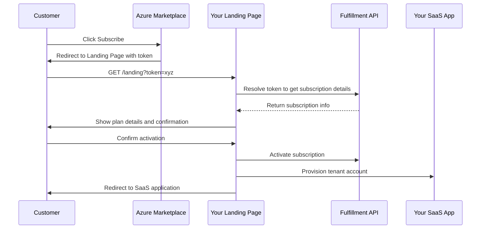

# How to Build a Transactable SaaS Offer on Azure Marketplace with Landing Page Integration

Author: [nawazdhandala](https://www.github.com/nawazdhandala)

Tags: Azure Marketplace, SaaS, Landing Page, Transactable Offers, Fulfillment API, ISV, Billing

Description: Build a transactable SaaS offer on the Azure Marketplace with a landing page that handles subscription activation and the fulfillment lifecycle.

---

When you list a SaaS product on the Azure Marketplace as a transactable offer, Microsoft handles the billing relationship with the customer. The customer purchases your SaaS subscription through the Azure portal, and Microsoft collects payment and sends you your share. But there is a piece in the middle that you need to build: the landing page.

The landing page is where customers land after clicking "Subscribe" in the Azure Marketplace. It is your responsibility to resolve the marketplace token, activate the subscription, and provision the customer's account. In this guide, I will walk through building the complete landing page integration and subscription lifecycle management for a transactable SaaS offer.

## The Subscription Lifecycle

Here is the full flow from purchase to active subscription:



## Setting Up the Landing Page Application

The landing page is a web application - typically an ASP.NET Core app or a Node.js server. Here is the core landing page controller:

```csharp
// Landing page controller that handles Marketplace subscription activation
[Controller]
[Route("landing")]
public class LandingPageController : Controller
{
    private readonly IMarketplaceFulfillmentClient _fulfillmentClient;
    private readonly ITenantProvisioningService _provisioningService;
    private readonly ILogger<LandingPageController> _logger;

    public LandingPageController(
        IMarketplaceFulfillmentClient fulfillmentClient,
        ITenantProvisioningService provisioningService,
        ILogger<LandingPageController> logger)
    {
        _fulfillmentClient = fulfillmentClient;
        _provisioningService = provisioningService;
        _logger = logger;
    }

    // This is where customers land after clicking Subscribe in the Marketplace
    [HttpGet]
    public async Task<IActionResult> Index([FromQuery] string token)
    {
        if (string.IsNullOrEmpty(token))
        {
            return BadRequest("Missing marketplace token");
        }

        // Resolve the token to get subscription details
        var subscription = await _fulfillmentClient.ResolveAsync(token);

        if (subscription == null)
        {
            _logger.LogError("Failed to resolve marketplace token");
            return BadRequest("Invalid marketplace token");
        }

        _logger.LogInformation(
            "Resolved subscription {SubscriptionId} for {Email}",
            subscription.Id, subscription.Purchaser.EmailId);

        // Show the activation page with subscription details
        var model = new ActivationViewModel
        {
            SubscriptionId = subscription.Id.ToString(),
            SubscriptionName = subscription.Name,
            PlanId = subscription.PlanId,
            PurchaserEmail = subscription.Purchaser.EmailId,
            PurchaserTenantId = subscription.Purchaser.TenantId,
            Quantity = subscription.Quantity,
            OfferId = subscription.OfferId
        };

        return View("Activate", model);
    }

    // Handle the activation confirmation
    [HttpPost("activate")]
    public async Task<IActionResult> Activate([FromForm] ActivationRequest request)
    {
        var subscriptionId = Guid.Parse(request.SubscriptionId);

        try
        {
            // Provision the tenant in your SaaS application
            var tenant = await _provisioningService.ProvisionAsync(new TenantRequest
            {
                MarketplaceSubscriptionId = subscriptionId,
                PlanId = request.PlanId,
                Email = request.Email,
                CompanyName = request.CompanyName
            });

            // Activate the subscription through the Fulfillment API
            await _fulfillmentClient.ActivateSubscriptionAsync(
                subscriptionId,
                request.PlanId);

            _logger.LogInformation(
                "Subscription {SubscriptionId} activated for tenant {TenantId}",
                subscriptionId, tenant.Id);

            // Redirect to the SaaS application
            return Redirect($"https://app.yoursaas.com/welcome?tenant={tenant.Id}");
        }
        catch (Exception ex)
        {
            _logger.LogError(ex,
                "Failed to activate subscription {SubscriptionId}",
                subscriptionId);

            return View("Error", new ErrorViewModel
            {
                Message = "Subscription activation failed. Please contact support."
            });
        }
    }
}
```

## Building the Fulfillment API Client

The Marketplace Fulfillment API is how your application communicates with the Marketplace about subscription status. Here is a client wrapper:

```csharp
// Client for the Azure Marketplace SaaS Fulfillment API v2
public class MarketplaceFulfillmentClient : IMarketplaceFulfillmentClient
{
    private readonly HttpClient _httpClient;
    private readonly IConfiguration _config;
    private const string BaseUrl = "https://marketplaceapi.microsoft.com/api/saas";

    public MarketplaceFulfillmentClient(
        IHttpClientFactory httpClientFactory,
        IConfiguration config)
    {
        _httpClient = httpClientFactory.CreateClient("MarketplaceApi");
        _config = config;
    }

    // Resolve a marketplace token to get subscription details
    public async Task<MarketplaceSubscription> ResolveAsync(string token)
    {
        var request = new HttpRequestMessage(HttpMethod.Post,
            $"{BaseUrl}/subscriptions/resolve?api-version=2018-08-31");

        request.Headers.Add("x-ms-marketplace-token", token);
        await AddAuthHeaderAsync(request);

        var response = await _httpClient.SendAsync(request);
        response.EnsureSuccessStatusCode();

        var content = await response.Content.ReadAsStringAsync();
        return JsonSerializer.Deserialize<MarketplaceSubscription>(content);
    }

    // Activate a subscription after provisioning is complete
    public async Task ActivateSubscriptionAsync(Guid subscriptionId, string planId)
    {
        var request = new HttpRequestMessage(HttpMethod.Post,
            $"{BaseUrl}/subscriptions/{subscriptionId}/activate?api-version=2018-08-31");

        request.Content = new StringContent(
            JsonSerializer.Serialize(new { planId }),
            Encoding.UTF8,
            "application/json");

        await AddAuthHeaderAsync(request);

        var response = await _httpClient.SendAsync(request);
        response.EnsureSuccessStatusCode();
    }

    // Get the current status of a subscription
    public async Task<MarketplaceSubscription> GetSubscriptionAsync(Guid subscriptionId)
    {
        var request = new HttpRequestMessage(HttpMethod.Get,
            $"{BaseUrl}/subscriptions/{subscriptionId}?api-version=2018-08-31");

        await AddAuthHeaderAsync(request);

        var response = await _httpClient.SendAsync(request);
        response.EnsureSuccessStatusCode();

        var content = await response.Content.ReadAsStringAsync();
        return JsonSerializer.Deserialize<MarketplaceSubscription>(content);
    }

    // Update the plan for a subscription (upgrade/downgrade)
    public async Task ChangePlanAsync(Guid subscriptionId, string newPlanId)
    {
        var request = new HttpRequestMessage(HttpMethod.Patch,
            $"{BaseUrl}/subscriptions/{subscriptionId}?api-version=2018-08-31");

        request.Content = new StringContent(
            JsonSerializer.Serialize(new { planId = newPlanId }),
            Encoding.UTF8,
            "application/json");

        await AddAuthHeaderAsync(request);

        var response = await _httpClient.SendAsync(request);
        response.EnsureSuccessStatusCode();
    }

    private async Task AddAuthHeaderAsync(HttpRequestMessage request)
    {
        var credential = new ClientSecretCredential(
            _config["Azure:TenantId"],
            _config["Azure:ClientId"],
            _config["Azure:ClientSecret"]);

        var token = await credential.GetTokenAsync(
            new TokenRequestContext(new[]
            {
                "20e940b3-4c77-4b0b-9a53-9e16a1b010a7/.default"
            }));

        request.Headers.Authorization =
            new AuthenticationHeaderValue("Bearer", token.Token);
    }
}
```

## Handling Marketplace Webhooks

The Marketplace sends webhooks to your application when subscription events occur - plan changes, cancellations, suspensions, and reinstatements. You need a webhook endpoint:

```csharp
// Webhook endpoint that handles Marketplace subscription lifecycle events
[ApiController]
[Route("api/marketplace/webhook")]
public class MarketplaceWebhookController : ControllerBase
{
    private readonly IMarketplaceFulfillmentClient _fulfillmentClient;
    private readonly ITenantService _tenantService;
    private readonly ILogger<MarketplaceWebhookController> _logger;

    [HttpPost]
    public async Task<IActionResult> HandleWebhook(
        [FromBody] MarketplaceWebhookPayload payload)
    {
        _logger.LogInformation(
            "Marketplace webhook: {Action} for subscription {SubscriptionId}",
            payload.Action, payload.SubscriptionId);

        // Always verify the webhook by checking the subscription status
        var subscription = await _fulfillmentClient
            .GetSubscriptionAsync(payload.SubscriptionId);

        switch (payload.Action)
        {
            case "ChangePlan":
                await HandlePlanChange(payload, subscription);
                break;

            case "ChangeQuantity":
                await HandleQuantityChange(payload, subscription);
                break;

            case "Unsubscribe":
                await HandleCancellation(payload);
                break;

            case "Suspend":
                await HandleSuspension(payload);
                break;

            case "Reinstate":
                await HandleReinstatement(payload);
                break;

            default:
                _logger.LogWarning("Unknown webhook action: {Action}", payload.Action);
                break;
        }

        return Ok();
    }

    private async Task HandlePlanChange(
        MarketplaceWebhookPayload payload,
        MarketplaceSubscription subscription)
    {
        // Update the tenant's plan in your system
        await _tenantService.UpdatePlanAsync(
            payload.SubscriptionId,
            subscription.PlanId);

        // Acknowledge the plan change to the Marketplace
        await _fulfillmentClient.UpdateOperationStatusAsync(
            payload.SubscriptionId,
            payload.OperationId,
            "Success");

        _logger.LogInformation(
            "Plan changed to {PlanId} for subscription {SubscriptionId}",
            subscription.PlanId, payload.SubscriptionId);
    }

    private async Task HandleCancellation(MarketplaceWebhookPayload payload)
    {
        // Deactivate the tenant's account
        await _tenantService.DeactivateAsync(payload.SubscriptionId);

        // Acknowledge the cancellation
        await _fulfillmentClient.UpdateOperationStatusAsync(
            payload.SubscriptionId,
            payload.OperationId,
            "Success");

        _logger.LogInformation(
            "Subscription {SubscriptionId} cancelled", payload.SubscriptionId);
    }

    private async Task HandleSuspension(MarketplaceWebhookPayload payload)
    {
        // Suspend the tenant (payment failed, etc.)
        await _tenantService.SuspendAsync(payload.SubscriptionId);
        _logger.LogWarning(
            "Subscription {SubscriptionId} suspended", payload.SubscriptionId);
    }

    private async Task HandleReinstatement(MarketplaceWebhookPayload payload)
    {
        // Reactivate the tenant after payment is resolved
        await _tenantService.ReactivateAsync(payload.SubscriptionId);
        _logger.LogInformation(
            "Subscription {SubscriptionId} reinstated", payload.SubscriptionId);
    }

    private async Task HandleQuantityChange(
        MarketplaceWebhookPayload payload,
        MarketplaceSubscription subscription)
    {
        await _tenantService.UpdateQuantityAsync(
            payload.SubscriptionId,
            subscription.Quantity);
    }
}
```

## Configuring Your Offer in Partner Center

When setting up the SaaS offer in Partner Center, you need to provide two URLs:

1. **Landing page URL**: `https://yoursaas.com/landing`
2. **Connection webhook URL**: `https://yoursaas.com/api/marketplace/webhook`

You also need to register an Azure AD application that the Fulfillment API uses for authentication. The app needs the "SaaS Fulfillment API" permission.

## Testing with the Marketplace Sandbox

Before going live, test everything using the Marketplace sandbox. The sandbox lets you simulate purchases, plan changes, and cancellations without real transactions:

```bash
# Generate a test token for the landing page
curl -X POST "https://marketplaceapi.microsoft.com/api/saas/subscriptions/resolve?api-version=2018-08-31" \
  -H "Authorization: Bearer $TOKEN" \
  -H "x-ms-marketplace-token: test-token-from-sandbox"
```

Test every webhook event type to ensure your application handles the full subscription lifecycle correctly.

## Wrapping Up

Building a transactable SaaS offer on the Azure Marketplace requires three main components: a landing page that resolves tokens and activates subscriptions, a webhook endpoint that handles lifecycle events, and a fulfillment API client that communicates subscription status back to Microsoft. The landing page is the customer's first impression of your product after purchasing, so invest in making it smooth. Handle errors gracefully, provide clear status messages, and redirect to your application as quickly as possible. Once the integration is solid, the Marketplace handles billing, invoicing, and payment collection, letting you focus on building your product.
