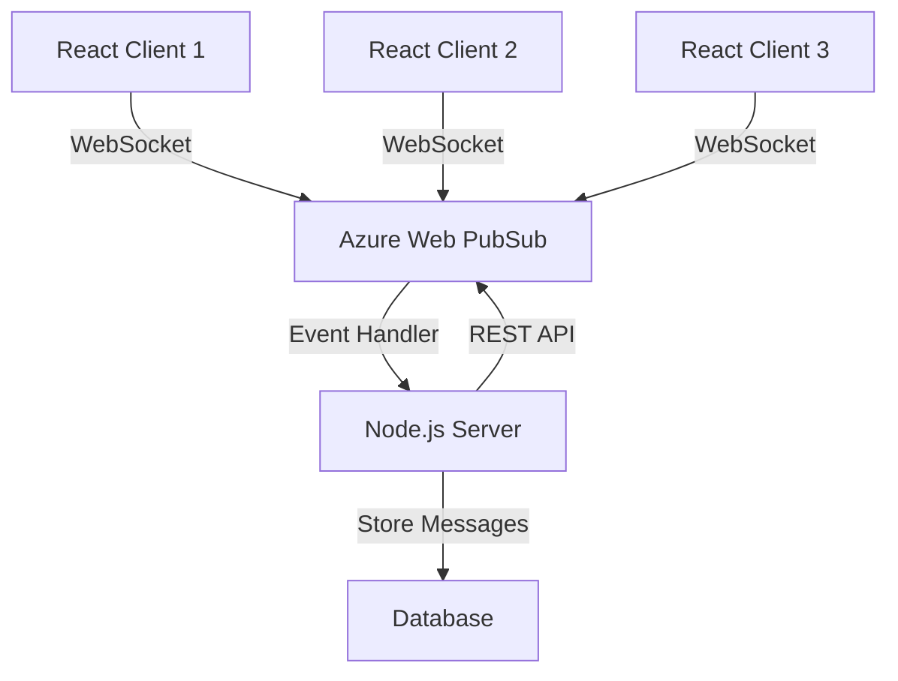

# How to Build a WebSocket Chat Application with Azure Web PubSub and React

Author: [nawazdhandala](https://www.github.com/nawazdhandala)

Tags: Azure Web PubSub, WebSocket, React, Chat, Real-Time, Node.js, JavaScript

Description: Build a real-time chat application using Azure Web PubSub for WebSocket management and React for the frontend user interface.

---

Building a chat application sounds simple until you start thinking about scale. A single Node.js server can handle a few thousand WebSocket connections, but what happens when you need to support tens of thousands of concurrent users? You either build a custom pub/sub layer with Redis or RabbitMQ, or you offload the connection management entirely.

Azure Web PubSub is a fully managed service that handles WebSocket connections at scale. Your server does not hold WebSocket connections directly. Instead, clients connect to Azure Web PubSub, and your server sends messages through the service's REST API. This means you can scale your backend servers independently of your WebSocket connection count.

In this post, we will build a complete chat application with rooms, user presence, and message history using Azure Web PubSub and React.

## Architecture



Clients connect to Azure Web PubSub via WebSockets. When a client sends a message, PubSub forwards it to your server through an event handler webhook. Your server processes the message, stores it, and uses the PubSub REST API to broadcast it to other clients.

## Step 1: Create the Azure Web PubSub Resource

```bash
# Create the Web PubSub service
az webpubsub create \
  --name chat-pubsub \
  --resource-group chat-rg \
  --sku Standard_S1 \
  --location eastus

# Get the connection string
az webpubsub key show \
  --name chat-pubsub \
  --resource-group chat-rg \
  --query primaryConnectionString -o tsv
```

## Step 2: Build the Backend Server

The server handles three things: generating client access tokens, processing incoming messages, and managing chat rooms.

```javascript
// server.js
// Backend server for the chat application
const express = require('express');
const { WebPubSubServiceClient } = require('@azure/web-pubsub');
const { WebPubSubEventHandler } = require('@azure/web-pubsub-express');

const app = express();
app.use(express.json());

const connectionString = process.env.WEBPUBSUB_CONNECTION_STRING;
const hubName = 'chat';

// Service client for sending messages and managing connections
const serviceClient = new WebPubSubServiceClient(connectionString, hubName);

// In-memory storage for messages and rooms
const messageHistory = new Map();  // room -> messages[]
const activeUsers = new Map();     // connectionId -> { userId, room }

// Event handler that processes WebSocket events from Azure Web PubSub
const handler = new WebPubSubEventHandler(hubName, {
  path: '/eventhandler',

  // Called when a client connects
  onConnected: async (req) => {
    const userId = req.context.userId;
    const connectionId = req.context.connectionId;
    console.log(`${userId} connected (${connectionId})`);
  },

  // Called when a client sends a message
  handleUserEvent: async (req, res) => {
    const userId = req.context.userId;
    const connectionId = req.context.connectionId;

    try {
      const event = JSON.parse(req.data);

      switch (event.type) {
        case 'join_room': {
          const { room } = event;
          // Add user to the room group
          await serviceClient.group(room).addConnection(connectionId);
          activeUsers.set(connectionId, { userId, room });

          // Send message history to the joining user
          const history = messageHistory.get(room) || [];
          await serviceClient.sendToConnection(connectionId, JSON.stringify({
            type: 'history',
            messages: history.slice(-50), // Last 50 messages
          }));

          // Notify the room about the new user
          await serviceClient.group(room).sendToAll(JSON.stringify({
            type: 'user_joined',
            userId,
            timestamp: new Date().toISOString(),
          }));
          break;
        }

        case 'message': {
          const { room, text } = event;
          const message = {
            id: Date.now().toString(),
            userId,
            text,
            room,
            timestamp: new Date().toISOString(),
          };

          // Store the message
          if (!messageHistory.has(room)) {
            messageHistory.set(room, []);
          }
          messageHistory.get(room).push(message);

          // Broadcast to the room
          await serviceClient.group(room).sendToAll(JSON.stringify({
            type: 'new_message',
            message,
          }));
          break;
        }

        case 'typing': {
          const { room } = event;
          // Broadcast typing indicator to others in the room
          await serviceClient.group(room).sendToAll(JSON.stringify({
            type: 'typing',
            userId,
          }), { filter: `userId ne '${userId}'` });
          break;
        }
      }

      res.success();
    } catch (err) {
      console.error('Error handling event:', err);
      res.fail(500, err.message);
    }
  },

  // Called when a client disconnects
  onDisconnected: async (req) => {
    const connectionId = req.context.connectionId;
    const userInfo = activeUsers.get(connectionId);

    if (userInfo) {
      // Notify the room that the user left
      await serviceClient.group(userInfo.room).sendToAll(JSON.stringify({
        type: 'user_left',
        userId: userInfo.userId,
        timestamp: new Date().toISOString(),
      }));
      activeUsers.delete(connectionId);
    }
  },
});

// Mount the event handler middleware
app.use(handler.getMiddleware());

// Endpoint to generate a client access token
app.get('/api/negotiate', async (req, res) => {
  const userId = req.query.userId;
  if (!userId) {
    return res.status(400).json({ error: 'userId is required' });
  }

  // Generate a token that allows the client to connect and send messages
  const token = await serviceClient.getClientAccessToken({
    userId,
    roles: ['webpubsub.sendToServerEvent', 'webpubsub.joinLeaveGroup'],
  });

  res.json({ url: token.url });
});

// List available rooms
app.get('/api/rooms', (req, res) => {
  const rooms = ['general', 'random', 'tech', 'gaming'];
  res.json(rooms);
});

const PORT = process.env.PORT || 3001;
app.listen(PORT, () => {
  console.log(`Server running on port ${PORT}`);
});
```

## Step 3: Build the React Frontend

The React app connects to Azure Web PubSub using a standard WebSocket and renders the chat interface.

```jsx
// src/hooks/useWebPubSub.js
// Custom hook that manages the WebSocket connection to Azure Web PubSub
import { useState, useEffect, useRef, useCallback } from 'react';

export function useWebPubSub(userId) {
  const [connected, setConnected] = useState(false);
  const [messages, setMessages] = useState([]);
  const [typingUsers, setTypingUsers] = useState([]);
  const wsRef = useRef(null);

  // Connect to Azure Web PubSub
  const connect = useCallback(async () => {
    // Get the access token from our backend
    const response = await fetch(`/api/negotiate?userId=${userId}`);
    const { url } = await response.json();

    // Open the WebSocket connection
    const ws = new WebSocket(url, 'json.webpubsub.azure.v1');
    wsRef.current = ws;

    ws.onopen = () => {
      setConnected(true);
      console.log('Connected to Web PubSub');
    };

    ws.onmessage = (event) => {
      const data = JSON.parse(event.data);

      // Handle different message types from the server
      if (data.type === 'message' && data.data) {
        const payload = JSON.parse(data.data);
        handleServerMessage(payload);
      }
    };

    ws.onclose = () => {
      setConnected(false);
      console.log('Disconnected from Web PubSub');
    };
  }, [userId]);

  function handleServerMessage(payload) {
    switch (payload.type) {
      case 'new_message':
        setMessages((prev) => [...prev, payload.message]);
        break;
      case 'history':
        setMessages(payload.messages);
        break;
      case 'typing':
        setTypingUsers((prev) => {
          const filtered = prev.filter((u) => u !== payload.userId);
          return [...filtered, payload.userId];
        });
        // Clear typing indicator after 3 seconds
        setTimeout(() => {
          setTypingUsers((prev) => prev.filter((u) => u !== payload.userId));
        }, 3000);
        break;
      case 'user_joined':
        setMessages((prev) => [...prev, {
          id: Date.now().toString(),
          userId: 'system',
          text: `${payload.userId} joined the room`,
          timestamp: payload.timestamp,
        }]);
        break;
      case 'user_left':
        setMessages((prev) => [...prev, {
          id: Date.now().toString(),
          userId: 'system',
          text: `${payload.userId} left the room`,
          timestamp: payload.timestamp,
        }]);
        break;
    }
  }

  // Send a message through the WebSocket
  function sendEvent(eventData) {
    if (wsRef.current && wsRef.current.readyState === WebSocket.OPEN) {
      wsRef.current.send(JSON.stringify({
        type: 'event',
        event: 'message',
        dataType: 'text',
        data: JSON.stringify(eventData),
      }));
    }
  }

  // Cleanup on unmount
  useEffect(() => {
    return () => {
      if (wsRef.current) {
        wsRef.current.close();
      }
    };
  }, []);

  return { connected, messages, typingUsers, connect, sendEvent };
}
```

```jsx
// src/App.jsx
// Main chat application component
import React, { useState, useRef, useEffect } from 'react';
import { useWebPubSub } from './hooks/useWebPubSub';

function App() {
  const [userId, setUserId] = useState('');
  const [currentRoom, setCurrentRoom] = useState('general');
  const [inputText, setInputText] = useState('');
  const [loggedIn, setLoggedIn] = useState(false);
  const messagesEndRef = useRef(null);

  const { connected, messages, typingUsers, connect, sendEvent } = useWebPubSub(userId);

  // Auto-scroll to bottom when new messages arrive
  useEffect(() => {
    messagesEndRef.current?.scrollIntoView({ behavior: 'smooth' });
  }, [messages]);

  async function handleLogin(e) {
    e.preventDefault();
    if (!userId.trim()) return;

    await connect();
    setLoggedIn(true);

    // Join the default room
    sendEvent({ type: 'join_room', room: currentRoom });
  }

  function handleSendMessage(e) {
    e.preventDefault();
    if (!inputText.trim()) return;

    sendEvent({
      type: 'message',
      room: currentRoom,
      text: inputText,
    });
    setInputText('');
  }

  function handleTyping() {
    sendEvent({ type: 'typing', room: currentRoom });
  }

  function handleRoomChange(room) {
    setCurrentRoom(room);
    sendEvent({ type: 'join_room', room });
  }

  if (!loggedIn) {
    return (
      <div style={{ padding: 40, maxWidth: 400, margin: '0 auto' }}>
        <h1>Chat App</h1>
        <form onSubmit={handleLogin}>
          <input
            value={userId}
            onChange={(e) => setUserId(e.target.value)}
            placeholder="Enter your username"
            style={{ width: '100%', padding: 10, marginBottom: 10 }}
          />
          <button type="submit" style={{ width: '100%', padding: 10 }}>
            Join Chat
          </button>
        </form>
      </div>
    );
  }

  return (
    <div style={{ display: 'flex', height: '100vh' }}>
      <div style={{ width: 200, borderRight: '1px solid #ccc', padding: 10 }}>
        <h3>Rooms</h3>
        {['general', 'random', 'tech', 'gaming'].map((room) => (
          <div
            key={room}
            onClick={() => handleRoomChange(room)}
            style={{
              padding: 8,
              cursor: 'pointer',
              background: room === currentRoom ? '#e0e0e0' : 'transparent',
            }}
          >
            #{room}
          </div>
        ))}
        <div style={{ marginTop: 20 }}>
          <small>{connected ? 'Connected' : 'Disconnected'}</small>
        </div>
      </div>

      <div style={{ flex: 1, display: 'flex', flexDirection: 'column' }}>
        <div style={{ flex: 1, overflow: 'auto', padding: 10 }}>
          {messages.map((msg) => (
            <div key={msg.id} style={{ marginBottom: 8 }}>
              <strong>{msg.userId}</strong>: {msg.text}
              <small style={{ color: '#999', marginLeft: 8 }}>
                {new Date(msg.timestamp).toLocaleTimeString()}
              </small>
            </div>
          ))}
          <div ref={messagesEndRef} />
        </div>

        {typingUsers.length > 0 && (
          <div style={{ padding: '0 10px', color: '#999', fontSize: 12 }}>
            {typingUsers.join(', ')} typing...
          </div>
        )}

        <form onSubmit={handleSendMessage} style={{ display: 'flex', padding: 10 }}>
          <input
            value={inputText}
            onChange={(e) => {
              setInputText(e.target.value);
              handleTyping();
            }}
            placeholder="Type a message..."
            style={{ flex: 1, padding: 10 }}
          />
          <button type="submit" style={{ padding: '10px 20px' }}>Send</button>
        </form>
      </div>
    </div>
  );
}

export default App;
```

## Step 4: Configure the Event Handler in Azure

Register your server's webhook URL with the Azure Web PubSub service.

```bash
# Set the event handler URL (your deployed server endpoint)
az webpubsub hub create \
  --name chat-pubsub \
  --resource-group chat-rg \
  --hub-name chat \
  --event-handler url-template="https://your-server.azurewebsites.net/eventhandler" \
    user-event-pattern="*" \
    system-event="connect,connected,disconnected"
```

## Security Considerations

In production, always validate the incoming webhook requests from Azure Web PubSub. The `@azure/web-pubsub-express` middleware handles signature validation automatically when you provide the connection string. You should also add authentication to the `/api/negotiate` endpoint so that only authenticated users can get WebSocket access tokens.

## Scaling

Azure Web PubSub Standard tier supports up to 100,000 concurrent connections per unit. You can add units for more capacity. Since your backend server does not hold WebSocket connections, it remains stateless and can scale horizontally with standard load balancing. The message history storage should be moved to a database like Cosmos DB or Redis for persistence across server restarts.

## Summary

Azure Web PubSub takes the hard parts of WebSocket management off your plate. Your server does not manage connections, does not worry about sticky sessions, and does not need to scale with the number of connected clients. The service handles all of that. Your backend just processes events and publishes messages through the REST API. Combined with React on the frontend, you get a responsive chat experience that can scale to hundreds of thousands of concurrent users without changing your server architecture.
