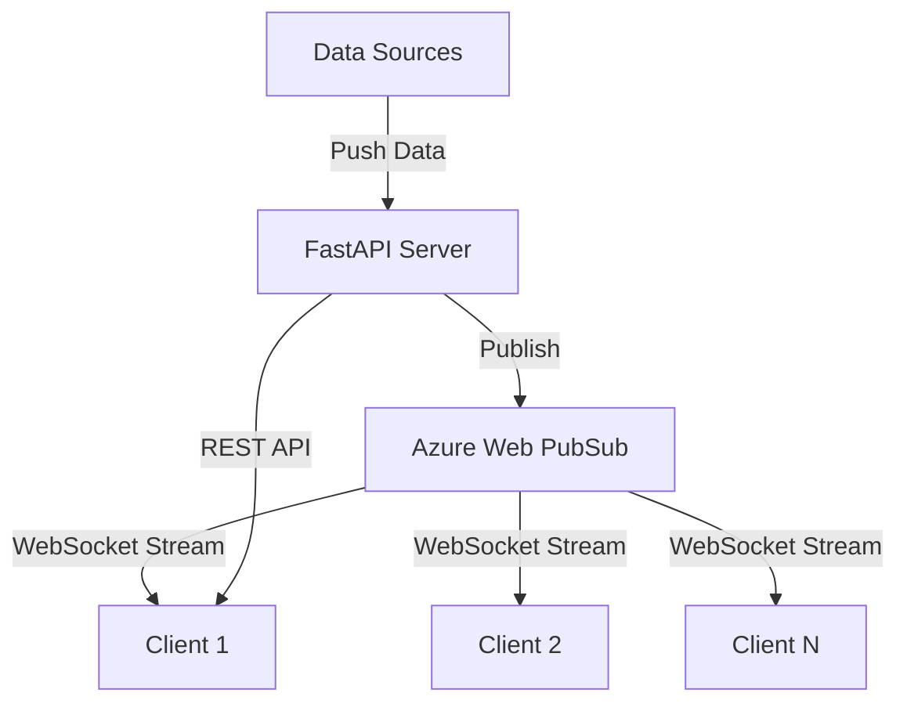

# How to Build a WebSocket Streaming API with FastAPI and Azure Web PubSub

Author: [nawazdhandala](https://www.github.com/nawazdhandala)

Tags: FastAPI, Azure Web PubSub, WebSocket, Streaming, Python, Real-Time, API

Description: Build a WebSocket streaming API using FastAPI and Azure Web PubSub for scalable real-time data delivery to connected clients.

---

Streaming APIs deliver data to clients continuously rather than in a single request-response cycle. Think stock price tickers, live sports scores, IoT sensor dashboards, or log tailing. WebSockets are the natural transport for this, but managing thousands of WebSocket connections on your Python server is problematic - Python's GIL and single-threaded nature make it a poor fit for connection-heavy workloads.

Azure Web PubSub solves this by offloading WebSocket connection management to a managed service. Your FastAPI server publishes data to the PubSub service, and the service handles delivering it to all connected clients. This means your Python server can focus on the data processing logic and scale independently of the number of connected clients.

## Architecture



The FastAPI server processes data from various sources and publishes it to Azure Web PubSub. Clients connect directly to the PubSub service for the WebSocket stream and use the FastAPI REST API for things like authentication and configuration.

## Prerequisites

- Python 3.10+
- An Azure account
- Azure CLI

## Step 1: Create the Azure Web PubSub Resource

```bash
# Create the Web PubSub service
az webpubsub create \
  --name streaming-pubsub \
  --resource-group streaming-rg \
  --sku Standard_S1 \
  --location eastus

# Get the connection string
az webpubsub key show \
  --name streaming-pubsub \
  --resource-group streaming-rg \
  --query primaryConnectionString -o tsv
```

## Step 2: Set Up the Project

```bash
# Create the project
mkdir streaming-api && cd streaming-api
python -m venv venv
source venv/bin/activate

# Install dependencies
pip install fastapi uvicorn azure-messaging-webpubsubservice azure-identity pydantic python-dotenv
```

## Step 3: Build the PubSub Service Layer

Create a service class that wraps the Azure Web PubSub client.

```python
# src/pubsub_service.py
# Manages communication with Azure Web PubSub
import json
import time
from datetime import datetime
from azure.messaging.webpubsubservice import WebPubSubServiceClient

class PubSubService:
    """Handles all interactions with Azure Web PubSub."""

    def __init__(self, connection_string: str, hub_name: str = "streaming"):
        # Create the service client for publishing messages
        self.client = WebPubSubServiceClient.from_connection_string(
            connection_string, hub=hub_name
        )
        self.hub_name = hub_name

    def get_client_token(self, user_id: str, roles: list[str] = None, groups: list[str] = None):
        """
        Generate a client access token for WebSocket connection.
        The token determines what the client can do (join groups, send messages, etc).
        """
        token = self.client.get_client_access_token(
            user_id=user_id,
            roles=roles or ["webpubsub.joinLeaveGroup"],
            groups=groups or [],
            minutes_to_expire=60,  # Token valid for 1 hour
        )
        return {
            "url": token["url"],
            "token": token["token"],
            "expiresOn": datetime.utcnow().isoformat(),
        }

    def publish_to_group(self, group: str, data: dict):
        """Publish a message to a specific group (channel)."""
        self.client.send_to_group(
            group,
            message=json.dumps(data),
            content_type="application/json",
        )

    def publish_to_all(self, data: dict):
        """Publish a message to all connected clients."""
        self.client.send_to_all(
            message=json.dumps(data),
            content_type="application/json",
        )

    def publish_to_user(self, user_id: str, data: dict):
        """Send a message to a specific user."""
        self.client.send_to_user(
            user_id,
            message=json.dumps(data),
            content_type="application/json",
        )

    def add_user_to_group(self, user_id: str, group: str):
        """Add a user to a group so they receive group messages."""
        self.client.add_user_to_group(group, user_id)

    def remove_user_from_group(self, user_id: str, group: str):
        """Remove a user from a group."""
        self.client.remove_user_from_group(group, user_id)

    def check_connection(self, connection_id: str) -> bool:
        """Check if a specific connection is still active."""
        return self.client.connection_exists(connection_id)
```

## Step 4: Build the FastAPI Application

```python
# src/main.py
# FastAPI application with WebSocket streaming via Azure Web PubSub
import os
import asyncio
import random
from datetime import datetime
from contextlib import asynccontextmanager

from fastapi import FastAPI, HTTPException, Query, BackgroundTasks
from fastapi.middleware.cors import CORSMiddleware
from pydantic import BaseModel
from dotenv import load_dotenv

from pubsub_service import PubSubService

load_dotenv()

# Initialize the PubSub service
pubsub = PubSubService(
    connection_string=os.environ["WEBPUBSUB_CONNECTION_STRING"],
    hub_name="streaming",
)

# Track active streams
active_streams: dict[str, bool] = {}


@asynccontextmanager
async def lifespan(app: FastAPI):
    """Start background data streams when the app starts."""
    # Start the stock price simulator
    active_streams["stock-prices"] = True
    asyncio.create_task(stock_price_stream())

    # Start the system metrics simulator
    active_streams["system-metrics"] = True
    asyncio.create_task(system_metrics_stream())

    yield

    # Stop all streams on shutdown
    for key in active_streams:
        active_streams[key] = False


app = FastAPI(title="Streaming API", lifespan=lifespan)

app.add_middleware(
    CORSMiddleware,
    allow_origins=["*"],
    allow_methods=["*"],
    allow_headers=["*"],
)


# --- Data Models ---

class TokenResponse(BaseModel):
    url: str
    token: str


class StreamConfig(BaseModel):
    group: str
    interval_ms: int = 1000


# --- API Endpoints ---

@app.get("/api/negotiate", response_model=TokenResponse)
def negotiate(
    user_id: str = Query(..., description="Unique user identifier"),
    groups: str = Query("", description="Comma-separated list of groups to join"),
):
    """
    Get a WebSocket connection token.
    The client uses this URL to establish a WebSocket connection to Azure Web PubSub.
    """
    group_list = [g.strip() for g in groups.split(",") if g.strip()]

    token_data = pubsub.get_client_token(
        user_id=user_id,
        roles=["webpubsub.joinLeaveGroup"],
        groups=group_list,
    )

    return TokenResponse(url=token_data["url"], token=token_data["token"])


@app.get("/api/streams")
def list_streams():
    """List available data streams and their status."""
    return {
        "streams": [
            {
                "name": "stock-prices",
                "group": "stocks",
                "description": "Real-time stock price updates",
                "interval": "1 second",
                "active": active_streams.get("stock-prices", False),
            },
            {
                "name": "system-metrics",
                "group": "metrics",
                "description": "System CPU, memory, and disk metrics",
                "interval": "5 seconds",
                "active": active_streams.get("system-metrics", False),
            },
        ]
    }


@app.post("/api/streams/{stream_name}/subscribe")
def subscribe_to_stream(stream_name: str, user_id: str = Query(...)):
    """Subscribe a user to a data stream."""
    group_map = {
        "stock-prices": "stocks",
        "system-metrics": "metrics",
    }

    group = group_map.get(stream_name)
    if not group:
        raise HTTPException(status_code=404, detail=f"Stream {stream_name} not found")

    pubsub.add_user_to_group(user_id, group)
    return {"subscribed": True, "stream": stream_name, "group": group}


@app.post("/api/streams/{stream_name}/unsubscribe")
def unsubscribe_from_stream(stream_name: str, user_id: str = Query(...)):
    """Unsubscribe a user from a data stream."""
    group_map = {
        "stock-prices": "stocks",
        "system-metrics": "metrics",
    }

    group = group_map.get(stream_name)
    if not group:
        raise HTTPException(status_code=404, detail=f"Stream {stream_name} not found")

    pubsub.remove_user_from_group(user_id, group)
    return {"unsubscribed": True, "stream": stream_name}


@app.post("/api/publish")
def publish_message(group: str = Query(...), message: dict = None):
    """Manually publish a message to a group (for testing)."""
    pubsub.publish_to_group(group, message or {"test": True})
    return {"published": True, "group": group}


@app.get("/health")
def health():
    return {"status": "healthy", "activeStreams": len(active_streams)}


# --- Background Data Streams ---

async def stock_price_stream():
    """
    Simulate real-time stock price updates.
    In production, this would read from a market data feed.
    """
    symbols = {
        "AAPL": 185.0,
        "GOOGL": 140.0,
        "MSFT": 420.0,
        "AMZN": 178.0,
        "TSLA": 245.0,
    }

    while active_streams.get("stock-prices", False):
        # Generate price updates for each symbol
        updates = []
        for symbol, base_price in symbols.items():
            # Simulate price movement
            change_pct = random.uniform(-0.5, 0.5)
            new_price = round(base_price * (1 + change_pct / 100), 2)
            symbols[symbol] = new_price

            updates.append({
                "symbol": symbol,
                "price": new_price,
                "change": round(change_pct, 3),
                "volume": random.randint(1000, 50000),
            })

        # Publish to the stocks group
        pubsub.publish_to_group("stocks", {
            "type": "stock_update",
            "timestamp": datetime.utcnow().isoformat(),
            "data": updates,
        })

        await asyncio.sleep(1)  # Update every second


async def system_metrics_stream():
    """
    Simulate system metrics updates.
    In production, this would read from monitoring agents.
    """
    while active_streams.get("system-metrics", False):
        metrics = {
            "type": "system_metrics",
            "timestamp": datetime.utcnow().isoformat(),
            "data": {
                "cpu": {
                    "usage_percent": round(random.uniform(10, 90), 1),
                    "cores": 8,
                    "load_avg": [
                        round(random.uniform(1, 4), 2),
                        round(random.uniform(1, 3), 2),
                        round(random.uniform(0.5, 2), 2),
                    ],
                },
                "memory": {
                    "total_gb": 32,
                    "used_gb": round(random.uniform(8, 28), 1),
                    "usage_percent": round(random.uniform(25, 87), 1),
                },
                "disk": {
                    "read_mb_s": round(random.uniform(0, 500), 1),
                    "write_mb_s": round(random.uniform(0, 200), 1),
                    "usage_percent": round(random.uniform(30, 80), 1),
                },
                "network": {
                    "rx_mb_s": round(random.uniform(0, 100), 1),
                    "tx_mb_s": round(random.uniform(0, 50), 1),
                    "connections": random.randint(100, 5000),
                },
            },
        }

        pubsub.publish_to_group("metrics", metrics)
        await asyncio.sleep(5)  # Update every 5 seconds
```

## Step 5: Build the Client

Here is a minimal JavaScript client that connects to the stream.

```javascript
// client.js
// Browser client for consuming the WebSocket stream
async function connectToStream(userId, streams) {
  // Get the connection URL from our API
  const groups = streams.join(',');
  const response = await fetch(
    `http://localhost:8000/api/negotiate?user_id=${userId}&groups=${groups}`
  );
  const { url } = await response.json();

  // Connect to Azure Web PubSub
  const ws = new WebSocket(url, 'json.webpubsub.azure.v1');

  ws.onopen = () => {
    console.log('Connected to streaming API');
  };

  ws.onmessage = (event) => {
    const message = JSON.parse(event.data);

    // Handle group messages
    if (message.type === 'message' && message.group) {
      const data = JSON.parse(message.data);
      handleStreamData(message.group, data);
    }
  };

  ws.onclose = () => {
    console.log('Disconnected - reconnecting in 3s...');
    setTimeout(() => connectToStream(userId, streams), 3000);
  };

  return ws;
}

function handleStreamData(group, data) {
  switch (data.type) {
    case 'stock_update':
      console.log('Stock prices:', data.data);
      break;
    case 'system_metrics':
      console.log('System metrics:', data.data);
      break;
    default:
      console.log(`${group}:`, data);
  }
}

// Connect and subscribe to stock prices and system metrics
connectToStream('user-123', ['stocks', 'metrics']);
```

## Step 6: Add Custom Data Sources

Here is how to add a custom data source that streams data from an external API.

```python
# src/sources/custom_source.py
# Stream data from an external API to connected clients
import httpx
import asyncio
from pubsub_service import PubSubService

async def stream_weather_data(pubsub: PubSubService, cities: list[str], interval: int = 60):
    """
    Fetch weather data for multiple cities and stream it to the weather group.
    """
    async with httpx.AsyncClient() as client:
        while True:
            updates = []
            for city in cities:
                try:
                    # Replace with your actual weather API
                    response = await client.get(
                        f"https://api.weatherapi.com/v1/current.json",
                        params={"key": "your-api-key", "q": city},
                    )
                    data = response.json()
                    updates.append({
                        "city": city,
                        "temp_c": data["current"]["temp_c"],
                        "condition": data["current"]["condition"]["text"],
                        "humidity": data["current"]["humidity"],
                    })
                except Exception as e:
                    print(f"Failed to get weather for {city}: {e}")

            if updates:
                pubsub.publish_to_group("weather", {
                    "type": "weather_update",
                    "data": updates,
                })

            await asyncio.sleep(interval)
```

## Deployment

```bash
# Build and deploy to Azure Container Apps
az containerapp create \
  --name streaming-api \
  --resource-group streaming-rg \
  --environment streaming-env \
  --image myregistry.azurecr.io/streaming-api:v1 \
  --target-port 8000 \
  --ingress external \
  --env-vars \
    WEBPUBSUB_CONNECTION_STRING=secretref:pubsub-connection \
  --min-replicas 1 \
  --max-replicas 5
```

## Scaling Considerations

The beauty of this architecture is that your FastAPI server and the WebSocket connections scale independently. You can have 10,000 clients connected to Azure Web PubSub while running just one or two FastAPI instances. If your data sources become the bottleneck, scale the FastAPI instances. If you need more WebSocket connections, scale the PubSub service units.

Azure Web PubSub Standard tier supports 100,000 concurrent connections per unit. For most streaming use cases, a single unit handles the connection load, and your bottleneck is the data processing on the FastAPI side.

## Summary

We built a WebSocket streaming API where FastAPI handles the data processing and Azure Web PubSub handles the WebSocket connections. This separation is the key insight - Python is excellent for data processing and business logic, but it is not ideal for managing thousands of long-lived connections. By offloading the connection management to a managed service, your Python server stays lean and focused. The group-based message routing lets you create multiple independent data streams, and clients can subscribe to only the streams they need. This architecture works well for dashboards, monitoring tools, live data feeds, and any scenario where you need to push continuous updates to many clients.
