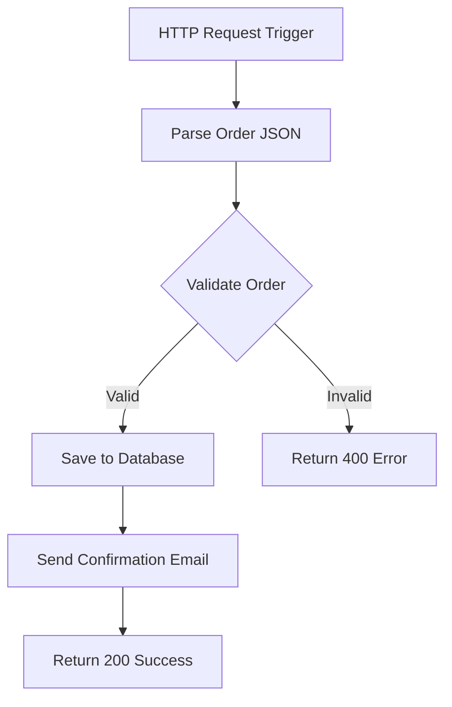

# How to Build a Workflow Automation with Azure Logic Apps Standard

Author: [nawazdhandala](https://www.github.com/nawazdhandala)

Tags: Azure, Logic Apps, Workflow Automation, Standard Plan, Integration, Serverless, No-Code

Description: Build production-grade workflow automations with Azure Logic Apps Standard plan using stateful and stateless workflows with code-first definitions.

---

Azure Logic Apps Standard is the newer, more developer-friendly version of Logic Apps. Unlike the Consumption plan (which runs a single workflow per resource), Standard runs on the Azure Functions runtime and supports multiple workflows in a single resource, local development, and deployment from VS Code or CI/CD pipelines. If you are building production workflow automations, Standard is the way to go.

## Standard vs Consumption

Before we build anything, let's clarify the differences. The Consumption plan is the original Logic Apps experience - you design workflows in the Azure Portal designer, each resource hosts one workflow, and you pay per action execution. The Standard plan runs on a dedicated App Service plan (or as a container), supports multiple workflows per resource, offers local development with VS Code, and gives you both stateful and stateless workflow options.

Standard is better for production workloads because of its deployment model (CI/CD friendly), performance (stateless workflows are faster), and cost predictability (fixed hosting cost instead of per-action pricing).

## Creating a Logic Apps Standard Resource

Start by creating the resource using the Azure CLI.

```bash
# Create a resource group
az group create --name rg-workflows --location eastus2

# Create an App Service plan for the Logic App (WorkflowStandard is the SKU)
az appservice plan create \
  --name plan-workflows \
  --resource-group rg-workflows \
  --location eastus2 \
  --sku WS1 \
  --is-linux false

# Create a storage account (required for Logic Apps Standard runtime)
az storage account create \
  --name stworkflowsruntime \
  --resource-group rg-workflows \
  --location eastus2 \
  --sku Standard_LRS

# Create the Logic App Standard resource
az logicapp create \
  --name logic-order-workflows \
  --resource-group rg-workflows \
  --plan plan-workflows \
  --storage-account stworkflowsruntime \
  --runtime-version ~4
```

## Project Structure

A Logic Apps Standard project has a specific structure. Each workflow lives in its own folder with a `workflow.json` file.

```
my-logic-app/
  host.json                    # Runtime configuration
  connections.json             # Connector configurations
  parameters.json              # Environment-specific parameters
  workflow1/
    workflow.json              # The workflow definition
  workflow2/
    workflow.json              # Another workflow
  .funcignore                  # Files to exclude from deployment
```

## Building Your First Workflow

Let's build a workflow that processes incoming orders. When an HTTP request comes in with order data, the workflow validates the order, writes it to a database, and sends a confirmation email.

Here is the `workflow.json` for a stateful HTTP-triggered workflow.

```json
{
  "definition": {
    "$schema": "https://schema.management.azure.com/providers/Microsoft.Logic/schemas/2016-06-01/workflowdefinition.json#",
    "actions": {
      "Parse_Order": {
        "type": "ParseJson",
        "inputs": {
          "content": "@triggerBody()",
          "schema": {
            "type": "object",
            "properties": {
              "orderId": { "type": "string" },
              "customerId": { "type": "string" },
              "items": {
                "type": "array",
                "items": {
                  "type": "object",
                  "properties": {
                    "productId": { "type": "string" },
                    "quantity": { "type": "integer" },
                    "unitPrice": { "type": "number" }
                  }
                }
              },
              "totalAmount": { "type": "number" }
            }
          }
        },
        "runAfter": {}
      },
      "Validate_Order": {
        "type": "If",
        "expression": {
          "and": [
            {
              "greater": ["@body('Parse_Order')?['totalAmount']", 0]
            },
            {
              "not": {
                "equals": ["@body('Parse_Order')?['customerId']", ""]
              }
            }
          ]
        },
        "actions": {
          "Save_to_Database": {
            "type": "Http",
            "inputs": {
              "method": "POST",
              "uri": "@parameters('apiBaseUrl')/orders",
              "headers": {
                "Content-Type": "application/json"
              },
              "body": "@body('Parse_Order')"
            },
            "runAfter": {}
          },
          "Send_Confirmation": {
            "type": "Http",
            "inputs": {
              "method": "POST",
              "uri": "@parameters('apiBaseUrl')/notifications",
              "headers": {
                "Content-Type": "application/json"
              },
              "body": {
                "to": "@body('Parse_Order')?['customerId']",
                "template": "order-confirmation",
                "data": {
                  "orderId": "@body('Parse_Order')?['orderId']",
                  "totalAmount": "@body('Parse_Order')?['totalAmount']"
                }
              }
            },
            "runAfter": {
              "Save_to_Database": ["Succeeded"]
            }
          },
          "Return_Success": {
            "type": "Response",
            "inputs": {
              "statusCode": 200,
              "body": {
                "status": "accepted",
                "orderId": "@body('Parse_Order')?['orderId']"
              }
            },
            "runAfter": {
              "Send_Confirmation": ["Succeeded"]
            }
          }
        },
        "else": {
          "actions": {
            "Return_Validation_Error": {
              "type": "Response",
              "inputs": {
                "statusCode": 400,
                "body": {
                  "error": "Invalid order data",
                  "details": "Order must have a positive total and a customer ID"
                }
              },
              "runAfter": {}
            }
          }
        },
        "runAfter": {
          "Parse_Order": ["Succeeded"]
        }
      }
    },
    "triggers": {
      "manual": {
        "type": "Request",
        "kind": "Http",
        "inputs": {
          "method": "POST",
          "schema": {
            "type": "object",
            "properties": {
              "orderId": { "type": "string" },
              "customerId": { "type": "string" },
              "items": { "type": "array" },
              "totalAmount": { "type": "number" }
            }
          }
        }
      }
    },
    "contentVersion": "1.0.0.0"
  },
  "kind": "Stateful"
}
```

## Stateful vs Stateless Workflows

Standard Logic Apps support two kinds of workflows.

**Stateful workflows** persist the state of every action execution. You can review run history, resubmit failed runs, and debug step by step. They are slower because of the storage overhead but give you full observability.

**Stateless workflows** run entirely in memory. They are faster and cheaper but do not persist run history. Use them for high-throughput, low-latency scenarios where you do not need to inspect individual runs.

Change the `kind` field in `workflow.json` to switch between them:

```json
{
  "definition": { ... },
  "kind": "Stateless"
}
```

## Workflow Flow Visualization

Here is the order processing workflow visualized.



## Parameters and Configuration

Use parameters for environment-specific values like API URLs, connection strings, and feature flags.

```json
{
  "apiBaseUrl": {
    "type": "String",
    "value": "https://api.myapp.com/v1"
  },
  "enableNotifications": {
    "type": "Bool",
    "value": true
  },
  "maxOrderAmount": {
    "type": "Int",
    "value": 10000
  }
}
```

Reference parameters in your workflow with `@parameters('apiBaseUrl')`. Override them per environment using application settings in the format `Workflows.{parameterName}`.

## Local Development with VS Code

Install the Azure Logic Apps (Standard) extension for VS Code. It lets you create, edit, run, and debug workflows locally before deploying.

```bash
# Initialize a new Logic Apps Standard project
# (VS Code extension creates this structure)
mkdir my-logic-app && cd my-logic-app

# Create the host.json
cat > host.json << 'EOF'
{
  "version": "2.0",
  "extensionBundle": {
    "id": "Microsoft.Azure.Functions.ExtensionBundle.Workflows",
    "version": "[1.*, 2.0.0)"
  }
}
EOF
```

## Deploying from CI/CD

Deploy Logic Apps Standard like you would deploy an Azure Function - zip the project and push it.

```bash
# Build and zip the project
cd my-logic-app
zip -r ../deploy.zip . -x ".git/*" "node_modules/*"

# Deploy to Azure
az logicapp deployment source config-zip \
  --name logic-order-workflows \
  --resource-group rg-workflows \
  --src ../deploy.zip
```

For GitHub Actions or Azure DevOps, use the `azure/functions-action` with the Logic App resource.

## Monitoring and Diagnostics

Enable Application Insights for your Logic App to get execution traces, dependency tracking, and performance metrics.

```bash
# Enable Application Insights
az logicapp config appsettings set \
  --name logic-order-workflows \
  --resource-group rg-workflows \
  --settings "APPINSIGHTS_INSTRUMENTATIONKEY=your-key" \
  "APPLICATIONINSIGHTS_CONNECTION_STRING=InstrumentationKey=your-key"
```

For stateful workflows, you can also view run history in the Azure Portal, step through each action's inputs and outputs, and resubmit failed runs.

## Summary

Azure Logic Apps Standard gives you the best of both worlds - the visual workflow designer for business users and the code-first development model for engineers. Use stateful workflows when you need observability and debugging, stateless workflows when you need speed, and deploy everything through CI/CD. With multiple workflows per resource and the Azure Functions runtime underneath, Standard is ready for production workloads.
