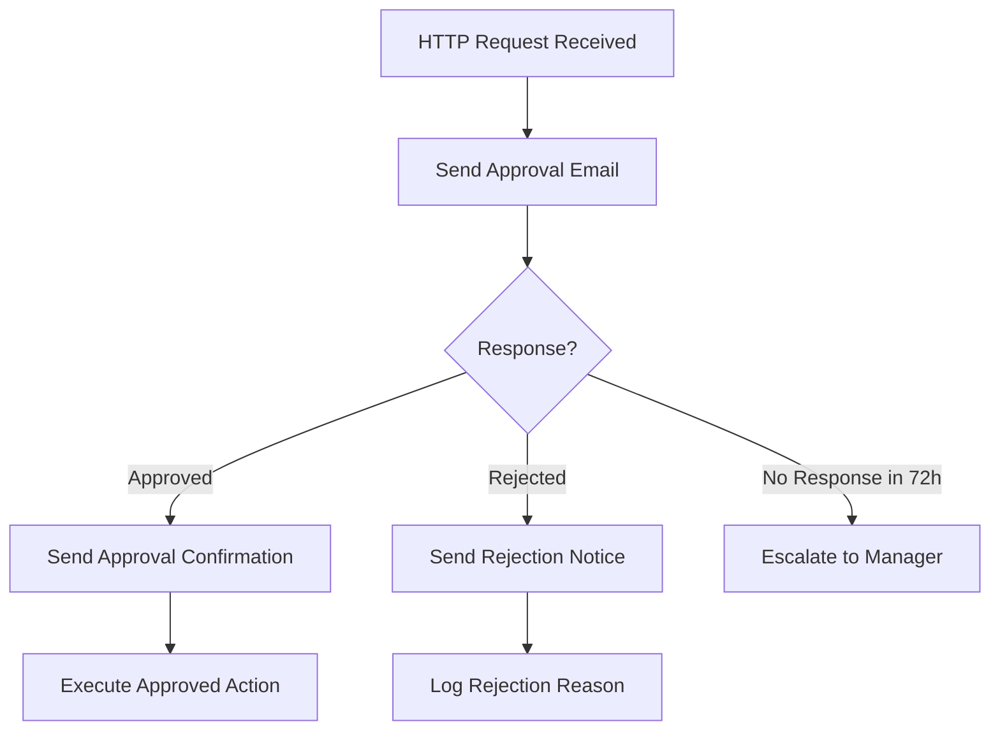

# How to Build an Approval Workflow in Azure Logic Apps with Email Notifications

Author: [nawazdhandala](https://www.github.com/nawazdhandala)

Tags: Azure, Logic Apps, Workflow, Approval, Email, Automation, Business Process

Description: Build a complete approval workflow in Azure Logic Apps that sends email notifications and handles approve or reject responses automatically.

---

Approval workflows are one of the most common business process automations. Whether it is purchase order approvals, access requests, content review, or deployment sign-offs, the pattern is the same: someone submits a request, an approver gets notified, they approve or reject, and the workflow continues based on their decision. Azure Logic Apps makes this surprisingly easy to build without writing any code.

In this post, I will walk through building a complete approval workflow step by step, starting with a simple single-approver flow and then extending it to handle multiple approvers, escalation, and custom responses.

## What We Are Building

Here is the flow we will create:



## Step 1: Create the Logic App

```bash
# Create a resource group for the Logic App
az group create --name rg-workflows --location eastus

# Create a consumption-tier Logic App
az logic workflow create \
  --resource-group rg-workflows \
  --name la-approval-workflow \
  --location eastus \
  --definition '{
    "definition": {
      "$schema": "https://schema.management.azure.com/providers/Microsoft.Logic/schemas/2016-06-01/workflowdefinition.json#",
      "triggers": {},
      "actions": {}
    }
  }'
```

For the rest of the configuration, we will use the portal designer since it provides visual building and the approval connector setup requires OAuth authentication.

## Step 2: Configure the Trigger

Open the Logic App in the portal and click "Logic app designer."

For this example, we will use an HTTP trigger so any system can kick off the approval process. Click "Add a trigger" and search for "When a HTTP request is received."

Configure the trigger with a JSON schema that describes the approval request:

```json
{
  "type": "object",
  "properties": {
    "requestId": {
      "type": "string"
    },
    "requestedBy": {
      "type": "string"
    },
    "requestedByEmail": {
      "type": "string"
    },
    "requestType": {
      "type": "string"
    },
    "description": {
      "type": "string"
    },
    "amount": {
      "type": "number"
    },
    "approverEmail": {
      "type": "string"
    }
  },
  "required": ["requestId", "requestedBy", "requestedByEmail", "requestType", "description", "approverEmail"]
}
```

After saving, the trigger generates a POST URL you can use to submit approval requests.

## Step 3: Add the Approval Action

Click "+ New step" and search for "Approvals." Select "Start and wait for an approval."

Configure the approval:

- **Approval type**: Approve/Reject - First to respond
- **Title**: Use dynamic content: `Approval Request: [requestType] from [requestedBy]`
- **Assigned to**: Use dynamic content: `[approverEmail]`
- **Details**: Build a descriptive message using dynamic content:

```
A new approval request has been submitted.

Request ID: [requestId]
Requested By: [requestedBy]
Type: [requestType]
Description: [description]
Amount: $[amount]

Please review and approve or reject this request.
```

- **Item link**: Optionally link to your internal system where the request lives
- **Item link description**: "View request details"

The "Start and wait for an approval" action does exactly what it says - it sends an actionable email to the approver and then pauses the workflow until the approver responds. The email includes Approve and Reject buttons directly in the email body.

## Step 4: Add the Condition Logic

After the approval action, add a "Condition" action. This evaluates the response:

- Set the condition to: `Outcome` is equal to `Approve`

The `Outcome` field comes from the approval action's output.

### In the "True" Branch (Approved)

Add an "Send an email (V2)" action using the Office 365 Outlook connector:

- **To**: Use dynamic content `[requestedByEmail]`
- **Subject**: `Your request [requestId] has been approved`
- **Body**:

```html
<p>Hello [requestedBy],</p>
<p>Your [requestType] request has been <strong>approved</strong>.</p>
<p><strong>Request ID:</strong> [requestId]</p>
<p><strong>Description:</strong> [description]</p>
<p><strong>Approved by:</strong> [Responses Approver name]</p>
<p><strong>Comments:</strong> [Responses Comments]</p>
<p>The requested action will be processed shortly.</p>
```

After the notification email, add whatever action needs to happen when the request is approved. For example, you might call another API, create a resource, or trigger an Azure Automation runbook.

### In the "False" Branch (Rejected)

Add another "Send an email (V2)" action:

- **To**: `[requestedByEmail]`
- **Subject**: `Your request [requestId] has been rejected`
- **Body**:

```html
<p>Hello [requestedBy],</p>
<p>Your [requestType] request has been <strong>rejected</strong>.</p>
<p><strong>Request ID:</strong> [requestId]</p>
<p><strong>Rejected by:</strong> [Responses Approver name]</p>
<p><strong>Reason:</strong> [Responses Comments]</p>
<p>If you have questions, please contact the approver directly.</p>
```

## Step 5: Add a Timeout with Escalation

The approval action can wait indefinitely by default. In production, you want a timeout with an escalation path.

Wrap the approval action in a "Scope" action, and then add a parallel branch with a "Delay" action set to 72 hours. After the delay, add an escalation path.

A simpler approach is to use the built-in timeout on the approval action:

1. Click on the approval action
2. Click the three dots menu and select "Settings"
3. Under "Timeout", set it to `PT72H` (72 hours in ISO 8601 duration format)
4. Enable "Run After" on a subsequent action to handle the timeout case

When the approval times out, the action status is "TimedOut." You can add a parallel branch that runs when the approval action times out:

Add a new action after the approval, click "Configure run after," and select only "Has timed out." This action runs only when the approval was not responded to in time:

- Send an escalation email to the manager
- Or re-trigger the approval with a different approver
- Or auto-reject with a timeout reason

## Step 6: Test the Workflow

Submit a test request using curl or any HTTP client:

```bash
# Send a test approval request to the Logic App
# Replace the URL with your Logic App's HTTP trigger URL
curl -X POST \
  "https://prod-XX.eastus.logic.azure.com:443/workflows/YOUR_WORKFLOW_ID/triggers/manual/paths/invoke?api-version=2016-10-01&sp=%2Ftriggers%2Fmanual%2Frun&sv=1.0&sig=YOUR_SIG" \
  -H "Content-Type: application/json" \
  -d '{
    "requestId": "REQ-001",
    "requestedBy": "John Smith",
    "requestedByEmail": "john@company.com",
    "requestType": "Software Purchase",
    "description": "Need a JetBrains All Products Pack license for development",
    "amount": 649,
    "approverEmail": "manager@company.com"
  }'
```

The approver should receive an email with Approve and Reject buttons within a few seconds.

## Extending the Workflow: Multi-Level Approvals

For requests that need multiple approvals (for example, anything over $5,000 needs both manager and VP approval):

After the initial trigger, add a condition that checks the amount:

```
If amount is greater than 5000:
  - Send approval to manager
  - If manager approves, send approval to VP
  - If VP approves, process the request
  - If VP rejects, notify requester
  - If manager rejects, notify requester
If amount is less than or equal to 5000:
  - Send approval to manager only
  - If approved, process the request
```

This creates a sequential approval chain where each level must approve before the next is asked.

## Extending the Workflow: Parallel Approvals

Sometimes you need multiple people to approve simultaneously (for example, both the finance team and the legal team must approve):

Use the "Start and wait for an approval" action with the type set to "Approve/Reject - Everyone must approve" and list multiple email addresses in the "Assigned to" field.

The action will not complete until every listed approver has responded, and the overall outcome is "Approve" only if all approvers approved.

## Tracking Approval Status

For audit and tracking purposes, add a step at the beginning and end of the workflow that logs to a data store. Azure Table Storage is a cheap and simple option:

```json
{
  "type": "ApiConnection",
  "inputs": {
    "host": {
      "connection": {
        "name": "@parameters('$connections')['azuretables']['connectionId']"
      }
    },
    "method": "post",
    "path": "/v2/storageAccounts/{storageAccountName}/tables/ApprovalLog/entities",
    "body": {
      "PartitionKey": "@{triggerBody()?['requestType']}",
      "RowKey": "@{triggerBody()?['requestId']}",
      "RequestedBy": "@{triggerBody()?['requestedBy']}",
      "Status": "Pending",
      "SubmittedAt": "@{utcNow()}"
    }
  }
}
```

Update the record when the approval completes with the outcome, approver name, comments, and completion timestamp.

## Security Considerations

- **Restrict who can trigger the workflow.** If using an HTTP trigger, consider adding API key authentication or restricting by IP address in the Logic App's access control settings.
- **Do not include sensitive data in email bodies.** Approval emails should contain enough context to make a decision but should not include passwords, keys, or personally identifiable information beyond what is necessary.
- **Use managed connectors with organizational accounts.** When setting up the Office 365 email connector, use a service account rather than a personal account.
- **Enable diagnostic logging.** Turn on Logic App diagnostic logs and send them to a Log Analytics workspace for audit trail purposes.

## Wrapping Up

Azure Logic Apps makes approval workflows accessible without writing code. The built-in Approvals connector handles the hard parts - sending actionable emails, waiting for responses, and tracking who responded and when. Start with the single-approver pattern in this post, test it thoroughly with your team, and then extend it with multi-level approvals, escalation paths, and audit logging as your business process requirements grow.
