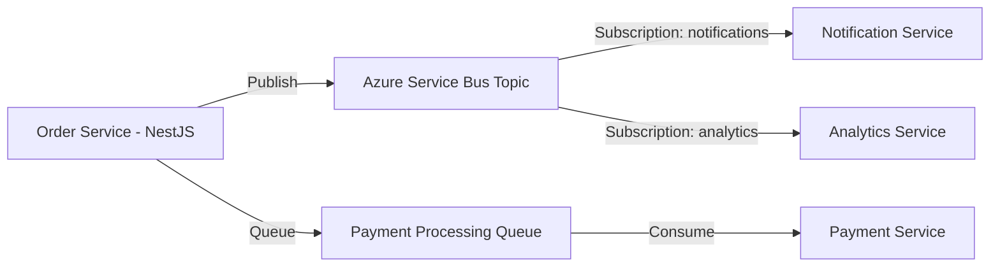

# How to Build an Event-Driven Microservice with Azure Service Bus and NestJS

Author: [nawazdhandala](https://www.github.com/nawazdhandala)

Tags: Azure Service Bus, NestJS, Event-Driven, Microservices, TypeScript, Messaging, Queue

Description: Build an event-driven microservice architecture using Azure Service Bus for messaging and NestJS for the application framework with queues and topics.

---

Event-driven architectures decouple services by using messages instead of direct API calls. When Service A needs to tell Service B that something happened, it publishes a message to a queue or topic. Service B picks it up when it is ready. If Service B is down, the message waits in the queue. If Service B is slow, messages accumulate and get processed at Service B's pace. This decoupling makes your system more resilient and scalable.

Azure Service Bus is a fully managed enterprise message broker that supports both queues (point-to-point) and topics (publish-subscribe). NestJS, with its modular architecture and built-in microservice support, is an excellent framework for building services that communicate through Service Bus.

In this post, we will build two microservices that communicate through Azure Service Bus: an Order Service that publishes order events and a Notification Service that subscribes to those events.

## Architecture



## Step 1: Create Azure Service Bus Resources

```bash
# Create a Service Bus namespace
az servicebus namespace create \
  --name order-events-ns \
  --resource-group microservices-rg \
  --sku Standard \
  --location eastus

# Create a topic for order events
az servicebus topic create \
  --name order-events \
  --namespace-name order-events-ns \
  --resource-group microservices-rg

# Create subscriptions for each consumer
az servicebus topic subscription create \
  --name notifications \
  --topic-name order-events \
  --namespace-name order-events-ns \
  --resource-group microservices-rg

az servicebus topic subscription create \
  --name analytics \
  --topic-name order-events \
  --namespace-name order-events-ns \
  --resource-group microservices-rg

# Create a queue for payment processing
az servicebus queue create \
  --name payment-requests \
  --namespace-name order-events-ns \
  --resource-group microservices-rg \
  --enable-dead-lettering-on-message-expiration true

# Get the connection string
az servicebus namespace authorization-rule keys list \
  --name RootManageSharedAccessKey \
  --namespace-name order-events-ns \
  --resource-group microservices-rg \
  --query primaryConnectionString -o tsv
```

## Step 2: Set Up the NestJS Project

```bash
# Create the Order Service
npx @nestjs/cli new order-service
cd order-service

# Install Azure Service Bus SDK
npm install @azure/service-bus @nestjs/config class-validator class-transformer uuid
```

## Step 3: Build the Service Bus Module

Create a reusable NestJS module for Azure Service Bus operations.

```typescript
// src/service-bus/service-bus.module.ts
// Reusable module for Azure Service Bus integration
import { Module, Global } from '@nestjs/common';
import { ServiceBusService } from './service-bus.service';

@Global()
@Module({
  providers: [ServiceBusService],
  exports: [ServiceBusService],
})
export class ServiceBusModule {}
```

```typescript
// src/service-bus/service-bus.service.ts
// Service that wraps Azure Service Bus client operations
import { Injectable, OnModuleDestroy, Logger } from '@nestjs/common';
import { ServiceBusClient, ServiceBusSender, ServiceBusReceiver } from '@azure/service-bus';
import { ConfigService } from '@nestjs/config';

@Injectable()
export class ServiceBusService implements OnModuleDestroy {
  private client: ServiceBusClient;
  private senders: Map<string, ServiceBusSender> = new Map();
  private receivers: Map<string, ServiceBusReceiver> = new Map();
  private readonly logger = new Logger(ServiceBusService.name);

  constructor(private config: ConfigService) {
    const connectionString = this.config.get<string>('SERVICE_BUS_CONNECTION_STRING');
    this.client = new ServiceBusClient(connectionString);
    this.logger.log('Service Bus client initialized');
  }

  // Get or create a sender for a topic or queue
  getSender(topicOrQueue: string): ServiceBusSender {
    if (!this.senders.has(topicOrQueue)) {
      const sender = this.client.createSender(topicOrQueue);
      this.senders.set(topicOrQueue, sender);
    }
    return this.senders.get(topicOrQueue);
  }

  // Send a single message to a topic or queue
  async sendMessage(topicOrQueue: string, body: any, properties?: Record<string, any>) {
    const sender = this.getSender(topicOrQueue);
    await sender.sendMessages({
      body,
      applicationProperties: properties || {},
      contentType: 'application/json',
    });
    this.logger.debug(`Message sent to ${topicOrQueue}`);
  }

  // Send a batch of messages for better throughput
  async sendBatch(topicOrQueue: string, messages: any[]) {
    const sender = this.getSender(topicOrQueue);
    const batch = await sender.createMessageBatch();

    for (const msg of messages) {
      if (!batch.tryAddMessage({ body: msg, contentType: 'application/json' })) {
        // Batch is full, send what we have and start a new one
        await sender.sendMessages(batch);
        const newBatch = await sender.createMessageBatch();
        newBatch.tryAddMessage({ body: msg, contentType: 'application/json' });
      }
    }

    // Send the remaining messages
    if (batch.count > 0) {
      await sender.sendMessages(batch);
    }
    this.logger.debug(`Batch of ${messages.length} messages sent to ${topicOrQueue}`);
  }

  // Subscribe to messages from a topic subscription
  subscribe(
    topicName: string,
    subscriptionName: string,
    handler: (message: any) => Promise<void>,
    errorHandler?: (error: Error) => void,
  ) {
    const key = `${topicName}/${subscriptionName}`;
    const receiver = this.client.createReceiver(topicName, subscriptionName);
    this.receivers.set(key, receiver);

    receiver.subscribe({
      processMessage: async (message) => {
        try {
          await handler(message.body);
          await receiver.completeMessage(message);
        } catch (err) {
          this.logger.error(`Failed to process message: ${err.message}`);
          // Abandon the message so it can be retried
          await receiver.abandonMessage(message);
        }
      },
      processError: async (args) => {
        this.logger.error(`Service Bus error: ${args.error.message}`);
        if (errorHandler) errorHandler(args.error);
      },
    });

    this.logger.log(`Subscribed to ${key}`);
  }

  // Subscribe to messages from a queue
  subscribeToQueue(
    queueName: string,
    handler: (message: any) => Promise<void>,
  ) {
    const receiver = this.client.createReceiver(queueName);
    this.receivers.set(queueName, receiver);

    receiver.subscribe({
      processMessage: async (message) => {
        try {
          await handler(message.body);
          await receiver.completeMessage(message);
        } catch (err) {
          this.logger.error(`Failed to process queue message: ${err.message}`);
          await receiver.abandonMessage(message);
        }
      },
      processError: async (args) => {
        this.logger.error(`Queue error: ${args.error.message}`);
      },
    });

    this.logger.log(`Subscribed to queue: ${queueName}`);
  }

  // Cleanup on module destroy
  async onModuleDestroy() {
    for (const sender of this.senders.values()) {
      await sender.close();
    }
    for (const receiver of this.receivers.values()) {
      await receiver.close();
    }
    await this.client.close();
    this.logger.log('Service Bus client closed');
  }
}
```

## Step 4: Build the Order Service

The Order Service creates orders and publishes events to the Service Bus topic.

```typescript
// src/orders/orders.service.ts
// Order service that publishes events to Azure Service Bus
import { Injectable, Logger } from '@nestjs/common';
import { ServiceBusService } from '../service-bus/service-bus.service';
import { v4 as uuidv4 } from 'uuid';

interface Order {
  id: string;
  customerId: string;
  items: Array<{ productId: string; name: string; price: number; quantity: number }>;
  total: number;
  status: string;
  createdAt: string;
}

@Injectable()
export class OrdersService {
  private readonly logger = new Logger(OrdersService.name);
  private orders: Map<string, Order> = new Map();

  constructor(private serviceBus: ServiceBusService) {}

  async createOrder(customerId: string, items: any[]): Promise<Order> {
    const order: Order = {
      id: uuidv4(),
      customerId,
      items,
      total: items.reduce((sum, i) => sum + i.price * i.quantity, 0),
      status: 'created',
      createdAt: new Date().toISOString(),
    };

    this.orders.set(order.id, order);

    // Publish the order.created event to the topic
    await this.serviceBus.sendMessage('order-events', {
      eventType: 'order.created',
      orderId: order.id,
      customerId: order.customerId,
      total: order.total,
      items: order.items,
      timestamp: order.createdAt,
    }, {
      eventType: 'order.created',  // Application property for filtering
    });

    // Also send a payment request to the queue
    await this.serviceBus.sendMessage('payment-requests', {
      orderId: order.id,
      customerId: order.customerId,
      amount: order.total,
      currency: 'USD',
    });

    this.logger.log(`Order ${order.id} created and events published`);
    return order;
  }

  async updateStatus(orderId: string, status: string): Promise<Order> {
    const order = this.orders.get(orderId);
    if (!order) throw new Error('Order not found');

    order.status = status;

    // Publish a status change event
    await this.serviceBus.sendMessage('order-events', {
      eventType: `order.${status}`,
      orderId: order.id,
      customerId: order.customerId,
      status,
      timestamp: new Date().toISOString(),
    }, {
      eventType: `order.${status}`,
    });

    return order;
  }
}
```

```typescript
// src/orders/orders.controller.ts
// REST controller for order operations
import { Controller, Post, Body, Patch, Param } from '@nestjs/common';
import { OrdersService } from './orders.service';

@Controller('orders')
export class OrdersController {
  constructor(private ordersService: OrdersService) {}

  @Post()
  async create(@Body() body: { customerId: string; items: any[] }) {
    return this.ordersService.createOrder(body.customerId, body.items);
  }

  @Patch(':id/status')
  async updateStatus(@Param('id') id: string, @Body() body: { status: string }) {
    return this.ordersService.updateStatus(id, body.status);
  }
}
```

## Step 5: Build the Notification Service

The Notification Service subscribes to order events and sends notifications.

```typescript
// notification-service/src/notification.handler.ts
// Handles incoming order events and sends notifications
import { Injectable, OnModuleInit, Logger } from '@nestjs/common';
import { ServiceBusService } from './service-bus/service-bus.service';

@Injectable()
export class NotificationHandler implements OnModuleInit {
  private readonly logger = new Logger(NotificationHandler.name);

  constructor(private serviceBus: ServiceBusService) {}

  // Start listening for messages when the module initializes
  onModuleInit() {
    this.serviceBus.subscribe(
      'order-events',
      'notifications',
      this.handleOrderEvent.bind(this),
    );

    this.logger.log('Notification handler started');
  }

  async handleOrderEvent(event: any) {
    this.logger.log(`Received event: ${event.eventType} for order ${event.orderId}`);

    switch (event.eventType) {
      case 'order.created':
        await this.sendOrderConfirmation(event);
        break;
      case 'order.shipped':
        await this.sendShippingNotification(event);
        break;
      case 'order.delivered':
        await this.sendDeliveryNotification(event);
        break;
      default:
        this.logger.debug(`Unhandled event type: ${event.eventType}`);
    }
  }

  private async sendOrderConfirmation(event: any) {
    this.logger.log(
      `Sending order confirmation to customer ${event.customerId} for order ${event.orderId}`
    );
    // In production: call email/SMS/push notification service
  }

  private async sendShippingNotification(event: any) {
    this.logger.log(
      `Sending shipping notification to customer ${event.customerId} for order ${event.orderId}`
    );
  }

  private async sendDeliveryNotification(event: any) {
    this.logger.log(
      `Sending delivery notification to customer ${event.customerId} for order ${event.orderId}`
    );
  }
}
```

## Message Filtering with Subscription Rules

Azure Service Bus supports SQL-like filter rules on subscriptions so consumers only receive relevant messages.

```bash
# Create a subscription rule that only receives 'order.shipped' events
az servicebus topic subscription rule create \
  --name shipped-only \
  --subscription-name shipping-notifications \
  --topic-name order-events \
  --namespace-name order-events-ns \
  --resource-group microservices-rg \
  --filter-sql-expression "eventType = 'order.shipped'"
```

## Error Handling and Dead Letter Queue

Messages that fail processing too many times are moved to the dead letter queue. Monitor this queue and set up alerts.

```typescript
// Monitor the dead letter queue for failed messages
async function processDeadLetters(serviceBus: ServiceBusService) {
  const dlqReceiver = serviceBus.client.createReceiver('payment-requests', {
    subQueueType: 'deadLetter',
  });

  const messages = await dlqReceiver.receiveMessages(10, { maxWaitTimeInMs: 5000 });

  for (const msg of messages) {
    console.log('Dead letter message:', {
      body: msg.body,
      reason: msg.deadLetterReason,
      description: msg.deadLetterErrorDescription,
      enqueuedTime: msg.enqueuedTimeUtc,
    });
    // Decide: retry, log, or discard
    await dlqReceiver.completeMessage(msg);
  }

  await dlqReceiver.close();
}
```

## Deployment

Both services are deployed independently, which is the whole point of microservices. Each has its own container and can be scaled independently.

```bash
# Deploy the Order Service to Azure Container Apps
az containerapp create \
  --name order-service \
  --resource-group microservices-rg \
  --environment microservices-env \
  --image myregistry.azurecr.io/order-service:v1 \
  --target-port 3000 \
  --ingress external \
  --env-vars SERVICE_BUS_CONNECTION_STRING=secretref:sb-connection

# Deploy the Notification Service (no ingress needed - it only consumes messages)
az containerapp create \
  --name notification-service \
  --resource-group microservices-rg \
  --environment microservices-env \
  --image myregistry.azurecr.io/notification-service:v1 \
  --min-replicas 1 \
  --env-vars SERVICE_BUS_CONNECTION_STRING=secretref:sb-connection
```

## Summary

Azure Service Bus and NestJS form a solid foundation for event-driven microservices. Service Bus handles the reliable message delivery, retries, and dead letter queues. NestJS provides the structure and dependency injection that keeps your service code organized. The key design decisions are choosing between queues (point-to-point) and topics (publish-subscribe) based on your communication pattern, and using subscription filters to ensure each consumer only processes relevant messages. This architecture scales naturally because adding a new consumer is just creating a new subscription - no changes to the publisher required.
