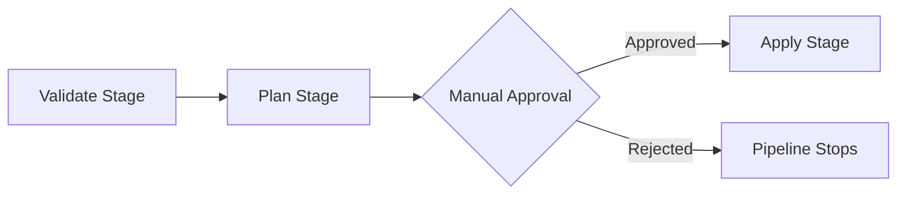

# How to Build Azure DevOps Pipelines for Terraform Plan and Apply with Approval Gates

Author: [nawazdhandala](https://www.github.com/nawazdhandala)

Tags: Azure DevOps, Terraform, CI/CD, Pipelines, Infrastructure as Code, Approval Gates, DevOps

Description: Build a complete Azure DevOps pipeline for Terraform with separate plan and apply stages, manual approval gates, and artifact publishing.

---

Running Terraform from your laptop works fine when you are the only one making changes. But the moment a team is involved, you need a pipeline. Azure DevOps Pipelines give you a way to run Terraform plan on every pull request, publish the plan as an artifact, require manual approval, and then apply it. This separation between plan and apply is critical for production infrastructure - you want a human to review what will change before it actually changes.

This post covers building a multi-stage Azure DevOps pipeline with Terraform init, validate, plan, and apply stages, plus manual approval gates between plan and apply.

## Prerequisites

Before we start, you need a few things set up:

- An Azure DevOps project with a Git repository containing your Terraform code
- A service connection to Azure (Service Principal with Contributor access)
- A storage account for Terraform remote state
- An environment called "production" in Azure DevOps (we will configure approval on this)

## The Pipeline Structure

The pipeline has three stages: Validate, Plan, and Apply. Validate runs `terraform init` and `terraform validate`. Plan generates the execution plan and publishes it as a pipeline artifact. Apply downloads that artifact and runs `terraform apply` using the saved plan.



## The Full Pipeline YAML

Here is the complete pipeline definition. I will break down each section after showing the whole thing.

```yaml
# azure-pipelines.yml
trigger:
  branches:
    include:
      - main
  paths:
    include:
      - terraform/**

# Run plan on PRs but not apply
pr:
  branches:
    include:
      - main
  paths:
    include:
      - terraform/**

variables:
  - name: terraformVersion
    value: '1.7.0'
  - name: workingDirectory
    value: '$(System.DefaultWorkingDirectory)/terraform'
  - name: backendResourceGroup
    value: 'rg-terraform-state'
  - name: backendStorageAccount
    value: 'stterraformstate001'
  - name: backendContainer
    value: 'tfstate'
  - name: backendKey
    value: 'production.terraform.tfstate'
  - name: serviceConnection
    value: 'azure-production-sc'

stages:
  # Stage 1: Validate the Terraform configuration
  - stage: Validate
    displayName: 'Terraform Validate'
    jobs:
      - job: Validate
        displayName: 'Init and Validate'
        pool:
          vmImage: 'ubuntu-latest'
        steps:
          - task: TerraformInstaller@1
            displayName: 'Install Terraform $(terraformVersion)'
            inputs:
              terraformVersion: $(terraformVersion)

          - task: TerraformTaskV4@4
            displayName: 'Terraform Init'
            inputs:
              provider: 'azurerm'
              command: 'init'
              workingDirectory: $(workingDirectory)
              backendServiceArm: $(serviceConnection)
              backendAzureRmResourceGroupName: $(backendResourceGroup)
              backendAzureRmStorageAccountName: $(backendStorageAccount)
              backendAzureRmContainerName: $(backendContainer)
              backendAzureRmKey: $(backendKey)

          - task: TerraformTaskV4@4
            displayName: 'Terraform Validate'
            inputs:
              provider: 'azurerm'
              command: 'validate'
              workingDirectory: $(workingDirectory)

  # Stage 2: Generate and publish the plan
  - stage: Plan
    displayName: 'Terraform Plan'
    dependsOn: Validate
    jobs:
      - job: Plan
        displayName: 'Generate Plan'
        pool:
          vmImage: 'ubuntu-latest'
        steps:
          - task: TerraformInstaller@1
            displayName: 'Install Terraform $(terraformVersion)'
            inputs:
              terraformVersion: $(terraformVersion)

          - task: TerraformTaskV4@4
            displayName: 'Terraform Init'
            inputs:
              provider: 'azurerm'
              command: 'init'
              workingDirectory: $(workingDirectory)
              backendServiceArm: $(serviceConnection)
              backendAzureRmResourceGroupName: $(backendResourceGroup)
              backendAzureRmStorageAccountName: $(backendStorageAccount)
              backendAzureRmContainerName: $(backendContainer)
              backendAzureRmKey: $(backendKey)

          # Run plan and save to a file
          - task: TerraformTaskV4@4
            displayName: 'Terraform Plan'
            inputs:
              provider: 'azurerm'
              command: 'plan'
              workingDirectory: $(workingDirectory)
              environmentServiceNameAzureRM: $(serviceConnection)
              commandOptions: '-out=tfplan -input=false'

          # Show the plan in human-readable format for the logs
          - script: |
              cd $(workingDirectory)
              terraform show -no-color tfplan > tfplan.txt
            displayName: 'Generate Plan Output'

          # Publish the binary plan file as an artifact
          - publish: '$(workingDirectory)/tfplan'
            artifact: 'tfplan-binary'
            displayName: 'Publish Plan Binary'

          # Publish the readable plan for reviewers
          - publish: '$(workingDirectory)/tfplan.txt'
            artifact: 'tfplan-readable'
            displayName: 'Publish Readable Plan'

  # Stage 3: Apply with approval gate
  - stage: Apply
    displayName: 'Terraform Apply'
    dependsOn: Plan
    # Only run apply on main branch, not on PRs
    condition: and(succeeded(), eq(variables['Build.SourceBranch'], 'refs/heads/main'))
    jobs:
      - deployment: Apply
        displayName: 'Apply Plan'
        pool:
          vmImage: 'ubuntu-latest'
        # This environment has approval gates configured
        environment: 'production'
        strategy:
          runOnce:
            deploy:
              steps:
                - checkout: self

                - task: TerraformInstaller@1
                  displayName: 'Install Terraform $(terraformVersion)'
                  inputs:
                    terraformVersion: $(terraformVersion)

                - task: TerraformTaskV4@4
                  displayName: 'Terraform Init'
                  inputs:
                    provider: 'azurerm'
                    command: 'init'
                    workingDirectory: $(workingDirectory)
                    backendServiceArm: $(serviceConnection)
                    backendAzureRmResourceGroupName: $(backendResourceGroup)
                    backendAzureRmStorageAccountName: $(backendStorageAccount)
                    backendAzureRmContainerName: $(backendContainer)
                    backendAzureRmKey: $(backendKey)

                # Download the plan artifact from the Plan stage
                - download: current
                  artifact: 'tfplan-binary'
                  displayName: 'Download Plan'

                # Copy the plan file to the working directory
                - script: |
                    cp $(Pipeline.Workspace)/tfplan-binary/tfplan $(workingDirectory)/tfplan
                  displayName: 'Copy Plan to Working Directory'

                # Apply the exact plan that was reviewed
                - task: TerraformTaskV4@4
                  displayName: 'Terraform Apply'
                  inputs:
                    provider: 'azurerm'
                    command: 'apply'
                    workingDirectory: $(workingDirectory)
                    environmentServiceNameAzureRM: $(serviceConnection)
                    commandOptions: '-input=false tfplan'
```

## Setting Up the Approval Gate

The pipeline references an environment called `production`. To add an approval gate:

1. Go to Pipelines > Environments in Azure DevOps
2. Click on the `production` environment (create it if it does not exist)
3. Click the three dots menu and select "Approvals and checks"
4. Add an "Approvals" check
5. Add the team members or groups who can approve
6. Set a timeout (48 hours is typical)

When the pipeline reaches the Apply stage, it will pause and send notifications to the approvers. They can review the plan artifact and either approve or reject.

## Why Publish the Plan as an Artifact

You might wonder why we save the plan to a file instead of just running `terraform plan` and then `terraform apply`. The answer is consistency. Between the time you run plan and the time you run apply, the real-world state could change. Someone could modify a resource in the portal, or another pipeline could make changes.

By saving the plan with `-out=tfplan`, you capture the exact set of changes at plan time. When you apply that saved plan, Terraform will execute exactly those changes - no more, no less. If the state has drifted, Terraform will refuse to apply the stale plan and you will need to re-run the pipeline.

## Handling Multiple Environments

For multiple environments, you can use templates and variable groups. Create a template file for the stages and parameterize the environment-specific values.

```yaml
# templates/terraform-stages.yml
parameters:
  - name: environment
    type: string
  - name: serviceConnection
    type: string
  - name: backendKey
    type: string

stages:
  - stage: 'Plan_${{ parameters.environment }}'
    displayName: 'Plan - ${{ parameters.environment }}'
    jobs:
      - job: Plan
        pool:
          vmImage: 'ubuntu-latest'
        steps:
          # ... same plan steps with parameterized values

  - stage: 'Apply_${{ parameters.environment }}'
    displayName: 'Apply - ${{ parameters.environment }}'
    dependsOn: 'Plan_${{ parameters.environment }}'
    jobs:
      - deployment: Apply
        environment: '${{ parameters.environment }}'
        # ... same apply steps
```

Then in your main pipeline, call the template for each environment.

## Best Practices

Lock your Terraform version. Pin it in the pipeline variable and in your `required_version` constraint in Terraform. Version mismatches between local development and CI cause painful debugging sessions.

Use separate state files per environment. Never share a state file between dev and prod. The backend key variable should include the environment name.

Add a `terraform fmt -check` step. This catches formatting issues early and keeps your codebase clean.

Consider adding `tflint` or `checkov` as additional validation steps. These tools catch security misconfigurations and best-practice violations before they reach production.

Always use the `-input=false` flag in CI pipelines. Without it, Terraform might prompt for input and the pipeline will hang indefinitely.

## Conclusion

A well-structured Azure DevOps pipeline for Terraform gives your team confidence that infrastructure changes are reviewed, approved, and applied consistently. The plan-artifact-approve-apply pattern ensures that what gets reviewed is exactly what gets deployed. Combined with environment-based approval gates, you have a solid foundation for managing Azure infrastructure at scale.
