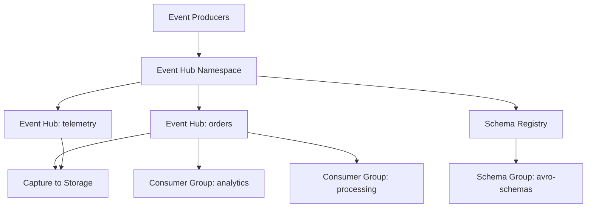

# How to Build Azure Event Hub Namespace with Capture and Schema Registry in Terraform

Author: [nawazdhandala](https://www.github.com/nawazdhandala)

Tags: Terraform, Azure, Event Hubs, Schema Registry, Streaming, IaC, Data

Description: Deploy an Azure Event Hubs namespace with event capture to storage, schema registry for data governance, and consumer groups using Terraform.

---

Azure Event Hubs is a managed event streaming platform capable of handling millions of events per second. When you add Capture, events are automatically saved to Azure Storage or Data Lake for long-term retention and batch processing. When you add Schema Registry, producers and consumers share a contract about the shape of the data, preventing schema drift from breaking your pipeline.

Setting up all three - Event Hubs, Capture, and Schema Registry - involves several interconnected resources. Terraform handles the dependency chain and gives you a repeatable deployment.

## What We Are Building



## The Foundation: Resource Group and Storage

Start with the resource group and the storage account where captured events will be written.

```hcl
resource "azurerm_resource_group" "main" {
  name     = "rg-eventhubs-prod"
  location = "eastus"
}

# Storage account for Event Hub Capture
resource "azurerm_storage_account" "capture" {
  name                     = "steventhubcapture001"
  resource_group_name      = azurerm_resource_group.main.name
  location                 = azurerm_resource_group.main.location
  account_tier             = "Standard"
  account_replication_type = "LRS"
  # Capture writes Avro files, so no need for premium storage
  account_kind = "StorageV2"

  # Enable blob versioning for data protection
  blob_properties {
    versioning_enabled = true
  }
}

# Container where captured events will be stored
resource "azurerm_storage_container" "capture" {
  name                  = "eventhub-capture"
  storage_account_name  = azurerm_storage_account.capture.name
  container_access_type = "private"
}
```

## Event Hubs Namespace

The namespace is the top-level container for event hubs, schema groups, and authorization rules.

```hcl
# Event Hubs namespace with Standard tier (required for Capture)
resource "azurerm_eventhub_namespace" "main" {
  name                = "evhns-streaming-prod"
  location            = azurerm_resource_group.main.location
  resource_group_name = azurerm_resource_group.main.name
  sku                 = "Standard"
  capacity            = 2

  # Auto-inflate allows automatic scaling of throughput units
  auto_inflate_enabled     = true
  maximum_throughput_units = 10

  # Network rules for restricting access
  network_rulesets {
    default_action                 = "Deny"
    trusted_service_access_enabled = true

    # Allow access from your application VNet
    virtual_network_rule {
      subnet_id = var.app_subnet_id
    }

    # Allow specific IPs (e.g., your CI/CD runners)
    ip_rule {
      ip_mask = var.cicd_runner_ip
      action  = "Allow"
    }
  }

  tags = {
    environment = "production"
    team        = "data-platform"
  }
}
```

The Standard SKU is the minimum required for Capture. If you need Schema Registry (which we do), Standard also supports it. The Premium SKU adds features like dedicated clusters and larger message sizes.

## Event Hubs with Capture Enabled

Now create the event hubs themselves with Capture configured.

```hcl
# Event Hub for order events with capture enabled
resource "azurerm_eventhub" "orders" {
  name                = "evh-orders"
  namespace_name      = azurerm_eventhub_namespace.main.name
  resource_group_name = azurerm_resource_group.main.name
  partition_count     = 8
  message_retention   = 7

  # Capture configuration - automatically saves events to storage
  capture_description {
    enabled             = true
    encoding            = "Avro"
    interval_in_seconds = 300
    size_limit_in_bytes = 314572800
    skip_empty_archives = true

    destination {
      name                = "EventHubArchive.AzureBlockBlob"
      archive_name_format = "{Namespace}/{EventHub}/{PartitionId}/{Year}/{Month}/{Day}/{Hour}/{Minute}/{Second}"
      blob_container_name = azurerm_storage_container.capture.name
      storage_account_id  = azurerm_storage_account.capture.id
    }
  }
}

# Event Hub for telemetry data
resource "azurerm_eventhub" "telemetry" {
  name                = "evh-telemetry"
  namespace_name      = azurerm_eventhub_namespace.main.name
  resource_group_name = azurerm_resource_group.main.name
  partition_count     = 16
  message_retention   = 3

  capture_description {
    enabled             = true
    encoding            = "Avro"
    interval_in_seconds = 60
    size_limit_in_bytes = 524288000
    skip_empty_archives = true

    destination {
      name                = "EventHubArchive.AzureBlockBlob"
      archive_name_format = "{Namespace}/{EventHub}/{PartitionId}/{Year}/{Month}/{Day}/{Hour}/{Minute}/{Second}"
      blob_container_name = azurerm_storage_container.capture.name
      storage_account_id  = azurerm_storage_account.capture.id
    }
  }
}
```

Key Capture settings explained:

- **interval_in_seconds**: How often to flush captured data to storage. 300 seconds (5 minutes) for orders is fine since order volume is lower. 60 seconds for telemetry because high-volume data should be flushed more frequently.
- **size_limit_in_bytes**: Maximum capture file size before a new file is started. 300 MB for orders, 500 MB for telemetry.
- **skip_empty_archives**: Do not create empty Avro files when there is no data. This keeps your storage clean.
- **archive_name_format**: The folder structure in blob storage. The format above creates a hierarchy by namespace, event hub, partition, and time.

## Consumer Groups

Consumer groups let multiple applications read from the same event hub independently, each maintaining their own position.

```hcl
# Consumer group for the analytics pipeline
resource "azurerm_eventhub_consumer_group" "orders_analytics" {
  name                = "cg-analytics"
  namespace_name      = azurerm_eventhub_namespace.main.name
  eventhub_name       = azurerm_eventhub.orders.name
  resource_group_name = azurerm_resource_group.main.name
  user_metadata       = "Spark Structured Streaming analytics pipeline"
}

# Consumer group for the order processing service
resource "azurerm_eventhub_consumer_group" "orders_processing" {
  name                = "cg-processing"
  namespace_name      = azurerm_eventhub_namespace.main.name
  eventhub_name       = azurerm_eventhub.orders.name
  resource_group_name = azurerm_resource_group.main.name
  user_metadata       = "Order processing microservice"
}

# Consumer group for telemetry monitoring
resource "azurerm_eventhub_consumer_group" "telemetry_monitoring" {
  name                = "cg-monitoring"
  namespace_name      = azurerm_eventhub_namespace.main.name
  eventhub_name       = azurerm_eventhub.telemetry.name
  resource_group_name = azurerm_resource_group.main.name
  user_metadata       = "Real-time telemetry monitoring dashboard"
}
```

Each event hub comes with a `$Default` consumer group, but you should create named consumer groups for each application. Sharing the default consumer group between applications leads to checkpoint conflicts and missed events.

## Schema Registry

Schema Registry provides centralized schema management for your event data. Producers register schemas, and consumers validate incoming data against them.

```hcl
# Schema registry group for Avro schemas
resource "azurerm_eventhub_namespace_schema_group" "avro" {
  name                 = "avro-schemas"
  namespace_id         = azurerm_eventhub_namespace.main.id
  schema_compatibility = "Forward"
  schema_type          = "Avro"
}
```

The `schema_compatibility` setting controls how schema evolution is handled:

- **Forward**: New schemas can be read by consumers using the old schema. You can add optional fields or remove fields.
- **Backward**: Old schemas can be read by consumers using the new schema. You can add fields with defaults or remove optional fields.
- **Full**: Both forward and backward compatible. The safest option but the most restrictive.
- **None**: No compatibility checking. Not recommended for production.

## Authorization Rules

Create shared access policies for producers and consumers.

```hcl
# Authorization rule for order producers (Send only)
resource "azurerm_eventhub_authorization_rule" "orders_producer" {
  name                = "orders-producer"
  namespace_name      = azurerm_eventhub_namespace.main.name
  eventhub_name       = azurerm_eventhub.orders.name
  resource_group_name = azurerm_resource_group.main.name
  listen              = false
  send                = true
  manage              = false
}

# Authorization rule for order consumers (Listen only)
resource "azurerm_eventhub_authorization_rule" "orders_consumer" {
  name                = "orders-consumer"
  namespace_name      = azurerm_eventhub_namespace.main.name
  eventhub_name       = azurerm_eventhub.orders.name
  resource_group_name = azurerm_resource_group.main.name
  listen              = true
  send                = false
  manage              = false
}
```

Follow the principle of least privilege - producers only need Send, consumers only need Listen. Never give applications Manage access.

## Outputs

Export connection strings and other values for application configuration.

```hcl
# Output connection strings for application configuration
output "namespace_connection_string" {
  value     = azurerm_eventhub_namespace.main.default_primary_connection_string
  sensitive = true
}

output "orders_producer_connection_string" {
  value     = azurerm_eventhub_authorization_rule.orders_producer.primary_connection_string
  sensitive = true
}

output "orders_consumer_connection_string" {
  value     = azurerm_eventhub_authorization_rule.orders_consumer.primary_connection_string
  sensitive = true
}

output "capture_storage_account" {
  value = azurerm_storage_account.capture.name
}

output "capture_container" {
  value = azurerm_storage_container.capture.name
}
```

## Monitoring Captured Data

After deployment, you can verify that Capture is working by checking the storage container.

```bash
# List captured files in the storage container
az storage blob list \
  --account-name steventhubcapture001 \
  --container-name eventhub-capture \
  --output table
```

Captured files are written in Avro format with the folder structure you defined in `archive_name_format`. Each file contains the events from a single partition within the capture interval.

## Cost Optimization

Throughput units are the primary cost driver for Event Hubs Standard. With auto-inflate, you only pay for the throughput units you actually use, up to the maximum you configured. Review your throughput unit usage in Azure Monitor and adjust the base and maximum values accordingly.

Capture adds a small per-event cost, but it is significantly cheaper than building your own event archival pipeline. The storage costs for captured Avro files are typically minimal.

## Conclusion

Terraform gives you a clean way to deploy the full Event Hubs stack - namespace, event hubs with capture, consumer groups, schema registry, and authorization rules. The configuration we built provides event streaming with automatic archival to storage, schema governance through the schema registry, and proper access control with least-privilege authorization rules. This foundation supports real-time processing and batch analytics on the same event data.
