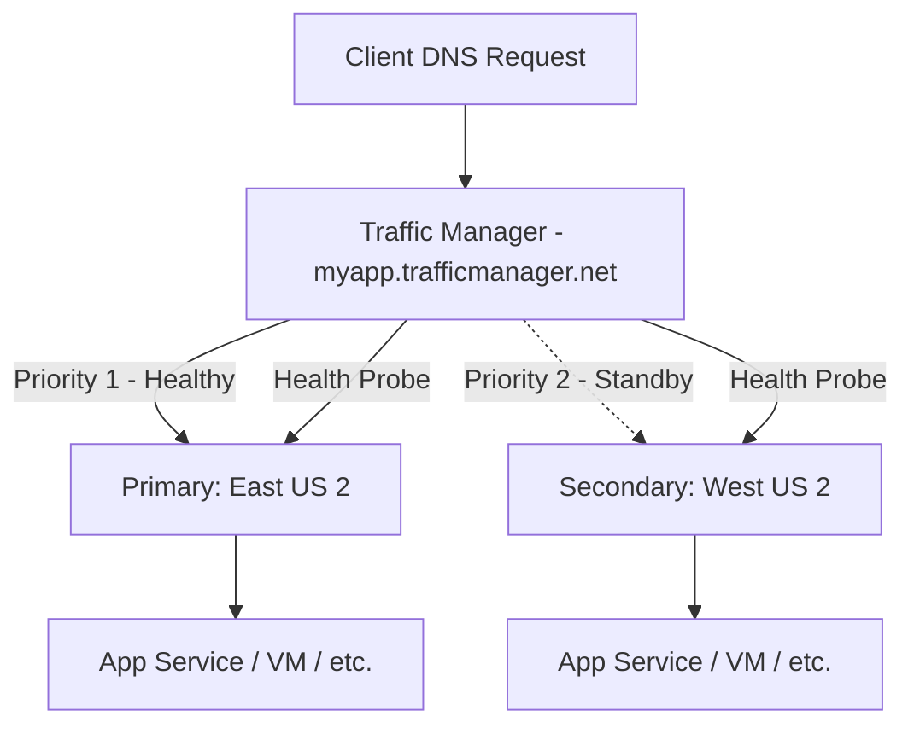

# How to Build Azure Traffic Manager Profiles with Priority Routing in Terraform

Author: [nawazdhandala](https://www.github.com/nawazdhandala)

Tags: Azure, Traffic Manager, Terraform, Load Balancing, DNS, High Availability, Disaster Recovery

Description: Learn how to deploy Azure Traffic Manager profiles with priority-based routing for active-passive failover using Terraform configurations.

---

Azure Traffic Manager is a DNS-based traffic load balancer that distributes traffic across Azure regions or external endpoints. Unlike Application Gateway or Azure Load Balancer, which operate at the network level, Traffic Manager works at the DNS level. When a client requests your domain, Traffic Manager resolves it to the IP address of the healthiest or most appropriate endpoint based on your routing method.

Priority routing is the simplest and most commonly used method for disaster recovery. It sends all traffic to a primary endpoint and automatically fails over to secondary endpoints when the primary goes down. Think of it as active-passive failover at the DNS layer.

## When to Use Priority Routing

Priority routing fits scenarios where you have:

- A primary region that handles all traffic under normal conditions
- One or more standby regions that take over during outages
- Applications where you want deterministic routing rather than load distribution
- Compliance requirements that mandate traffic stays in a specific region unless there is a failure

Other routing methods like weighted, performance, or geographic make sense for different use cases, but priority routing is the go-to for straightforward disaster recovery.

## Architecture

The setup deploys Traffic Manager with endpoints in two regions. Under normal conditions, all traffic goes to the primary. If the primary health probe fails, traffic shifts to the secondary.



## Terraform Configuration

Let us build the complete setup. We will create web apps in two regions as endpoints, then configure Traffic Manager to route between them.

```hcl
# Provider and configuration
terraform {
  required_version = ">= 1.5.0"

  required_providers {
    azurerm = {
      source  = "hashicorp/azurerm"
      version = "~> 3.80"
    }
  }
}

provider "azurerm" {
  features {}
}

variable "app_name" {
  type    = string
  default = "webapp"
}

variable "environment" {
  type    = string
  default = "prod"
}

# Regions for primary and secondary endpoints
variable "primary_location" {
  type    = string
  default = "eastus2"
}

variable "secondary_location" {
  type    = string
  default = "westus2"
}

locals {
  name_prefix = "${var.app_name}-${var.environment}"
  tags = {
    Environment = var.environment
    ManagedBy   = "terraform"
  }
}
```

## Resource Group and App Service Setup

Create the web apps that serve as Traffic Manager endpoints. In a real deployment, these would be your production application instances.

```hcl
# Resource group
resource "azurerm_resource_group" "tm" {
  name     = "rg-${local.name_prefix}-tm"
  location = var.primary_location
  tags     = local.tags
}

# App Service Plan - Primary Region
resource "azurerm_service_plan" "primary" {
  name                = "plan-${local.name_prefix}-primary"
  location            = var.primary_location
  resource_group_name = azurerm_resource_group.tm.name
  os_type             = "Linux"
  sku_name            = "P1v3"   # Production tier for reliability
  tags                = local.tags
}

# App Service - Primary Region
resource "azurerm_linux_web_app" "primary" {
  name                = "app-${local.name_prefix}-primary"
  location            = var.primary_location
  resource_group_name = azurerm_resource_group.tm.name
  service_plan_id     = azurerm_service_plan.primary.id

  site_config {
    always_on = true
    application_stack {
      node_version = "20-lts"
    }
  }

  app_settings = {
    REGION = var.primary_location
  }

  tags = local.tags
}

# App Service Plan - Secondary Region
resource "azurerm_service_plan" "secondary" {
  name                = "plan-${local.name_prefix}-secondary"
  location            = var.secondary_location
  resource_group_name = azurerm_resource_group.tm.name
  os_type             = "Linux"
  sku_name            = "P1v3"
  tags                = local.tags
}

# App Service - Secondary Region
resource "azurerm_linux_web_app" "secondary" {
  name                = "app-${local.name_prefix}-secondary"
  location            = var.secondary_location
  resource_group_name = azurerm_resource_group.tm.name
  service_plan_id     = azurerm_service_plan.secondary.id

  site_config {
    always_on = true
    application_stack {
      node_version = "20-lts"
    }
  }

  app_settings = {
    REGION = var.secondary_location
  }

  tags = local.tags
}
```

## Traffic Manager Profile

The profile defines the routing method and health check configuration.

```hcl
# Traffic Manager Profile with priority routing
resource "azurerm_traffic_manager_profile" "main" {
  name                   = "tm-${local.name_prefix}"
  resource_group_name    = azurerm_resource_group.tm.name
  traffic_routing_method = "Priority"   # Active-passive failover

  # DNS configuration
  dns_config {
    relative_name = "tm-${local.name_prefix}"   # Results in tm-webapp-prod.trafficmanager.net
    ttl           = 30                            # Low TTL for faster failover
  }

  # Health check configuration - how Traffic Manager monitors endpoints
  monitor_config {
    protocol                     = "HTTPS"
    port                         = 443
    path                         = "/health"        # Your health check endpoint
    interval_in_seconds          = 10               # Check every 10 seconds
    timeout_in_seconds           = 5                # Wait 5 seconds for response
    tolerated_number_of_failures = 3                # Fail after 3 consecutive failures

    # Custom headers for health checks (optional)
    custom_header {
      name  = "host"
      value = "myapp.contoso.com"   # Send the correct Host header
    }

    # Expected status code ranges
    expected_status_code_ranges = ["200-299"]
  }

  tags = local.tags
}
```

The DNS TTL is set to 30 seconds, which is a good balance between quick failover and DNS query volume. Lower TTLs mean faster failover but more DNS queries (and cost). In an emergency, 30 seconds is acceptable for most applications.

The health check configuration is critical. Traffic Manager marks an endpoint as unhealthy after `tolerated_number_of_failures` consecutive failed probes. With the settings above, that is 3 failures at 10-second intervals, meaning failover kicks in about 30 seconds after the primary goes down, plus the DNS TTL propagation time.

## Traffic Manager Endpoints

Now add the endpoints with their priority values. Lower numbers mean higher priority.

```hcl
# Primary endpoint - receives all traffic when healthy
resource "azurerm_traffic_manager_azure_endpoint" "primary" {
  name               = "ep-primary"
  profile_id         = azurerm_traffic_manager_profile.main.id
  target_resource_id = azurerm_linux_web_app.primary.id
  priority           = 1    # Highest priority - gets traffic first
  weight             = 100
  enabled            = true

  # Custom headers sent with health probes for this endpoint
  custom_header {
    name  = "X-Health-Check"
    value = "traffic-manager"
  }
}

# Secondary endpoint - receives traffic only when primary is unhealthy
resource "azurerm_traffic_manager_azure_endpoint" "secondary" {
  name               = "ep-secondary"
  profile_id         = azurerm_traffic_manager_profile.main.id
  target_resource_id = azurerm_linux_web_app.secondary.id
  priority           = 2    # Second priority - failover target
  weight             = 100
  enabled            = true

  custom_header {
    name  = "X-Health-Check"
    value = "traffic-manager"
  }
}
```

## Adding External Endpoints

Traffic Manager is not limited to Azure resources. You can add external endpoints for services running on other cloud providers or on-premises.

```hcl
# External endpoint example - an on-premises or third-party service
resource "azurerm_traffic_manager_external_endpoint" "onprem" {
  name        = "ep-onprem"
  profile_id  = azurerm_traffic_manager_profile.main.id
  target      = "onprem.contoso.com"
  priority    = 3    # Third priority - last resort
  weight      = 100
  enabled     = true

  # Geographic location hint for the endpoint
  endpoint_location = "East US"
}
```

## Nested Profiles for Complex Routing

For more sophisticated setups, you can nest Traffic Manager profiles. For example, use priority routing at the top level for failover between regions, and weighted routing within each region for gradual deployments.

```hcl
# Inner profile for the primary region - weighted routing between app versions
resource "azurerm_traffic_manager_profile" "primary_region" {
  name                   = "tm-${local.name_prefix}-primary"
  resource_group_name    = azurerm_resource_group.tm.name
  traffic_routing_method = "Weighted"

  dns_config {
    relative_name = "tm-${local.name_prefix}-primary"
    ttl           = 30
  }

  monitor_config {
    protocol                     = "HTTPS"
    port                         = 443
    path                         = "/health"
    interval_in_seconds          = 10
    timeout_in_seconds           = 5
    tolerated_number_of_failures = 3
  }

  tags = local.tags
}

# Reference the nested profile as an endpoint in the parent profile
resource "azurerm_traffic_manager_nested_endpoint" "primary_nested" {
  name                    = "ep-primary-nested"
  profile_id              = azurerm_traffic_manager_profile.main.id
  target_resource_id      = azurerm_traffic_manager_profile.primary_region.id
  priority                = 1
  weight                  = 100
  minimum_child_endpoints = 1   # At least 1 child endpoint must be healthy
}
```

## Monitoring and Alerts

Set up alerts to notify you when failover occurs.

```hcl
# Action group for notifications
resource "azurerm_monitor_action_group" "tm_alerts" {
  name                = "ag-tm-alerts"
  resource_group_name = azurerm_resource_group.tm.name
  short_name          = "tmalerts"

  email_receiver {
    name          = "ops-team"
    email_address = "ops@contoso.com"
  }
}

# Alert when an endpoint goes degraded
resource "azurerm_monitor_metric_alert" "endpoint_degraded" {
  name                = "alert-tm-endpoint-degraded"
  resource_group_name = azurerm_resource_group.tm.name
  scopes              = [azurerm_traffic_manager_profile.main.id]
  description         = "Alert when a Traffic Manager endpoint becomes degraded"
  severity            = 1   # Critical

  criteria {
    metric_namespace = "Microsoft.Network/trafficManagerProfiles"
    metric_name      = "ProbeAgentCurrentEndpointStateByProfileResourceId"
    aggregation      = "Maximum"
    operator         = "LessThan"
    threshold        = 1   # 0 means endpoint is degraded
  }

  action {
    action_group_id = azurerm_monitor_action_group.tm_alerts.id
  }
}
```

## Outputs

```hcl
output "traffic_manager_fqdn" {
  value       = azurerm_traffic_manager_profile.main.fqdn
  description = "The FQDN of the Traffic Manager profile"
}

output "traffic_manager_profile_id" {
  value       = azurerm_traffic_manager_profile.main.id
  description = "The resource ID of the Traffic Manager profile"
}

output "primary_app_url" {
  value       = "https://${azurerm_linux_web_app.primary.default_hostname}"
  description = "Direct URL to the primary app (for testing)"
}

output "secondary_app_url" {
  value       = "https://${azurerm_linux_web_app.secondary.default_hostname}"
  description = "Direct URL to the secondary app (for testing)"
}
```

## Testing Failover

After deployment, test the failover behavior by stopping the primary app and watching Traffic Manager switch to the secondary.

```bash
# Check current DNS resolution
nslookup tm-webapp-prod.trafficmanager.net

# Stop the primary app to trigger failover
az webapp stop --name app-webapp-prod-primary --resource-group rg-webapp-prod-tm

# Wait 30-60 seconds for health checks to detect the failure
sleep 60

# Check DNS again - should now resolve to the secondary
nslookup tm-webapp-prod.trafficmanager.net

# Restart the primary to restore normal routing
az webapp start --name app-webapp-prod-primary --resource-group rg-webapp-prod-tm
```

## Wrapping Up

Azure Traffic Manager with priority routing gives you a straightforward active-passive failover setup at the DNS level. The combination of configurable health probes, low TTL settings, and priority-based endpoint selection means your application can survive regional outages with minimal downtime. With Terraform managing the configuration, you can replicate this setup across environments and test failover behavior in staging before relying on it in production.
