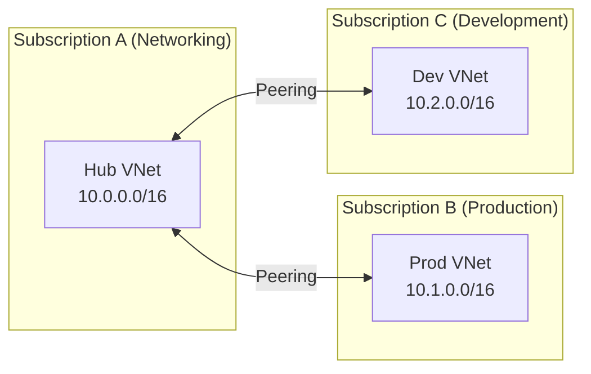

# How to Build Azure Virtual Network Peering with Terraform Across Multiple Subscriptions

Author: [nawazdhandala](https://www.github.com/nawazdhandala)

Tags: Terraform, Azure, VNet Peering, Multi-Subscription, Networking, Infrastructure as Code, Cross-Subscription

Description: Set up Azure virtual network peering across multiple subscriptions using Terraform with proper authentication, provider aliases, and bidirectional peering.

---

Virtual network peering in Azure is straightforward when both VNets are in the same subscription. You create two peering resources - one from each side - and you are done. But when the VNets live in different subscriptions, things get more interesting. You need provider aliases, cross-subscription authentication, and careful handling of permissions. This is the scenario most enterprises face because their networking, production, and development workloads typically live in separate subscriptions.

In this post, I will walk through setting up cross-subscription VNet peering with Terraform, covering authentication patterns, the bidirectional peering requirement, and common issues you will encounter.

## How VNet Peering Works

VNet peering creates a direct network link between two virtual networks. Traffic between peered VNets travels through the Azure backbone network - it never touches the public internet. The link is low latency and high bandwidth.

The critical thing to understand is that peering is not transitive. If VNet A is peered with VNet B, and VNet B is peered with VNet C, VNet A cannot communicate with VNet C through B. You need either direct peering or a hub-spoke topology with routing.

For cross-subscription peering:



Each peering connection requires a resource on both sides. The peering from VNet A to VNet B is a separate resource from the peering from VNet B to VNet A. Both must exist for the peering to be active.

## Authentication Setup

Cross-subscription Terraform requires authentication to multiple subscriptions. There are two main approaches:

**Option 1: Single service principal with access to both subscriptions.** This is simpler but less common in enterprises where subscriptions have separate owners.

**Option 2: Separate service principals per subscription with provider aliases.** This is the typical enterprise pattern.

Here is the provider configuration for option 2:

```hcl
# providers.tf - Configure multiple Azure providers for cross-subscription access

terraform {
  required_version = ">= 1.5.0"
  required_providers {
    azurerm = {
      source  = "hashicorp/azurerm"
      version = "~> 3.80"
    }
  }
}

# Default provider - networking subscription (where the hub lives)
provider "azurerm" {
  features {}
  subscription_id = var.networking_subscription_id
  # Uses default credentials (ARM_CLIENT_ID, etc.)
}

# Provider alias for production subscription
provider "azurerm" {
  alias           = "production"
  features {}
  subscription_id = var.production_subscription_id
  client_id       = var.production_client_id
  client_secret   = var.production_client_secret
  tenant_id       = var.tenant_id
}

# Provider alias for development subscription
provider "azurerm" {
  alias           = "development"
  features {}
  subscription_id = var.development_subscription_id
  client_id       = var.development_client_id
  client_secret   = var.development_client_secret
  tenant_id       = var.tenant_id
}
```

```hcl
# variables.tf - Subscription and authentication variables

variable "tenant_id" {
  description = "Azure AD tenant ID (shared across subscriptions)"
  type        = string
}

variable "networking_subscription_id" {
  description = "Subscription ID for the networking hub"
  type        = string
}

variable "production_subscription_id" {
  description = "Subscription ID for production workloads"
  type        = string
}

variable "production_client_id" {
  description = "Service principal client ID for production subscription"
  type        = string
  sensitive   = true
}

variable "production_client_secret" {
  description = "Service principal secret for production subscription"
  type        = string
  sensitive   = true
}

variable "development_subscription_id" {
  description = "Subscription ID for development workloads"
  type        = string
}

variable "development_client_id" {
  description = "Service principal client ID for development subscription"
  type        = string
  sensitive   = true
}

variable "development_client_secret" {
  description = "Service principal secret for development subscription"
  type        = string
  sensitive   = true
}
```

## Building the VNet Resources

First, create or reference the virtual networks in each subscription:

```hcl
# vnets.tf - Virtual networks in each subscription

# Hub VNet in the networking subscription (default provider)
resource "azurerm_resource_group" "hub" {
  name     = "rg-hub-networking"
  location = "eastus2"
}

resource "azurerm_virtual_network" "hub" {
  name                = "vnet-hub"
  location            = azurerm_resource_group.hub.location
  resource_group_name = azurerm_resource_group.hub.name
  address_space       = ["10.0.0.0/16"]
}

# Production VNet in the production subscription
resource "azurerm_resource_group" "prod" {
  provider = azurerm.production
  name     = "rg-prod-networking"
  location = "eastus2"
}

resource "azurerm_virtual_network" "prod" {
  provider            = azurerm.production
  name                = "vnet-prod"
  location            = azurerm_resource_group.prod.location
  resource_group_name = azurerm_resource_group.prod.name
  address_space       = ["10.1.0.0/16"]
}

# Development VNet in the development subscription
resource "azurerm_resource_group" "dev" {
  provider = azurerm.development
  name     = "rg-dev-networking"
  location = "eastus2"
}

resource "azurerm_virtual_network" "dev" {
  provider            = azurerm.development
  name                = "vnet-dev"
  location            = azurerm_resource_group.dev.location
  resource_group_name = azurerm_resource_group.dev.name
  address_space       = ["10.2.0.0/16"]
}
```

## Creating the Peering Connections

Now the peering - remember, each peering requires two resources (one from each side):

```hcl
# peering.tf - Bidirectional peering between hub and spokes

# --- Hub to Production peering ---

# Peering from hub to production (runs in networking subscription)
resource "azurerm_virtual_network_peering" "hub_to_prod" {
  name                      = "peer-hub-to-prod"
  resource_group_name       = azurerm_resource_group.hub.name
  virtual_network_name      = azurerm_virtual_network.hub.name
  remote_virtual_network_id = azurerm_virtual_network.prod.id

  # Allow traffic forwarded from the production VNet
  allow_forwarded_traffic = true

  # If hub has a VPN/ExpressRoute gateway, allow spokes to use it
  allow_gateway_transit = true
}

# Peering from production to hub (runs in production subscription)
resource "azurerm_virtual_network_peering" "prod_to_hub" {
  provider                  = azurerm.production
  name                      = "peer-prod-to-hub"
  resource_group_name       = azurerm_resource_group.prod.name
  virtual_network_name      = azurerm_virtual_network.prod.name
  remote_virtual_network_id = azurerm_virtual_network.hub.id

  allow_forwarded_traffic = true

  # Use the hub's gateway for on-premises connectivity
  use_remote_gateways = false  # Set to true when hub has a VPN gateway
}

# --- Hub to Development peering ---

# Peering from hub to development
resource "azurerm_virtual_network_peering" "hub_to_dev" {
  name                      = "peer-hub-to-dev"
  resource_group_name       = azurerm_resource_group.hub.name
  virtual_network_name      = azurerm_virtual_network.hub.name
  remote_virtual_network_id = azurerm_virtual_network.dev.id

  allow_forwarded_traffic = true
  allow_gateway_transit   = true
}

# Peering from development to hub
resource "azurerm_virtual_network_peering" "dev_to_hub" {
  provider                  = azurerm.development
  name                      = "peer-dev-to-hub"
  resource_group_name       = azurerm_resource_group.dev.name
  virtual_network_name      = azurerm_virtual_network.dev.name
  remote_virtual_network_id = azurerm_virtual_network.hub.id

  allow_forwarded_traffic = true
  use_remote_gateways     = false
}
```

## Scaling with a Module

For organizations with many subscriptions, create a module that handles the bidirectional peering:

```hcl
# modules/vnet-peering/main.tf - Reusable cross-subscription peering module

variable "hub_vnet_name" {
  type = string
}

variable "hub_vnet_id" {
  type = string
}

variable "hub_resource_group_name" {
  type = string
}

variable "spoke_vnet_name" {
  type = string
}

variable "spoke_vnet_id" {
  type = string
}

variable "spoke_resource_group_name" {
  type = string
}

variable "allow_gateway_transit" {
  type    = bool
  default = false
}

variable "use_remote_gateways" {
  type    = bool
  default = false
}

# Hub-side peering (uses the default provider)
resource "azurerm_virtual_network_peering" "hub_to_spoke" {
  name                      = "peer-hub-to-${var.spoke_vnet_name}"
  resource_group_name       = var.hub_resource_group_name
  virtual_network_name      = var.hub_vnet_name
  remote_virtual_network_id = var.spoke_vnet_id
  allow_forwarded_traffic   = true
  allow_gateway_transit     = var.allow_gateway_transit
}

# Spoke-side peering (uses the spoke provider passed via the providers meta-argument)
resource "azurerm_virtual_network_peering" "spoke_to_hub" {
  name                      = "peer-${var.spoke_vnet_name}-to-hub"
  resource_group_name       = var.spoke_resource_group_name
  virtual_network_name      = var.spoke_vnet_name
  remote_virtual_network_id = var.hub_vnet_id
  allow_forwarded_traffic   = true
  use_remote_gateways       = var.use_remote_gateways
}
```

Call the module with explicit provider passing:

```hcl
# main.tf - Use the peering module for each spoke subscription

module "peering_prod" {
  source = "./modules/vnet-peering"

  providers = {
    azurerm = azurerm.production  # Spoke-side provider
  }

  hub_vnet_name           = azurerm_virtual_network.hub.name
  hub_vnet_id             = azurerm_virtual_network.hub.id
  hub_resource_group_name = azurerm_resource_group.hub.name
  spoke_vnet_name         = azurerm_virtual_network.prod.name
  spoke_vnet_id           = azurerm_virtual_network.prod.id
  spoke_resource_group_name = azurerm_resource_group.prod.name
  allow_gateway_transit   = true
}
```

Wait - there is a catch. The module above uses a single provider, but the hub-side peering needs the default provider and the spoke-side needs the spoke provider. You need to configure the module with multiple provider aliases. This requires using the `configuration_aliases` feature:

```hcl
# modules/vnet-peering/providers.tf
terraform {
  required_providers {
    azurerm = {
      source                = "hashicorp/azurerm"
      configuration_aliases = [azurerm.hub, azurerm.spoke]
    }
  }
}
```

Then update the resources to use the correct provider aliases and pass them in from the calling module.

## Permission Requirements

The service principal creating the peering needs the `Network Contributor` role (or specifically `Microsoft.Network/virtualNetworks/virtualNetworkPeerings/write`) on both virtual networks. This is the most common point of failure - the principal has access to its own subscription but not the remote VNet.

```hcl
# Grant the production SP permission to read the hub VNet for peering
resource "azurerm_role_assignment" "prod_sp_on_hub_vnet" {
  scope                = azurerm_virtual_network.hub.id
  role_definition_name = "Network Contributor"
  principal_id         = data.azuread_service_principal.production.object_id
}
```

## Common Issues

**Address space overlap.** Peering fails if the VNets have overlapping address spaces. Plan your IP ranges carefully before deploying.

**Peering state stuck at "Initiated".** This means only one side of the peering exists. Both sides must be created for the peering to become "Connected."

**Gateway transit conflicts.** Only one peering per VNet can use `use_remote_gateways = true` for a given gateway. If multiple spokes try to use the same gateway, ensure the hub has `allow_gateway_transit = true`.

## Wrapping Up

Cross-subscription VNet peering with Terraform requires careful provider configuration and permission management, but the pattern is straightforward once you understand the pieces. Use provider aliases for each subscription, create bidirectional peering resources, and ensure service principals have the right cross-subscription permissions. For organizations with many spokes, wrap the peering logic in a module to avoid repetition and ensure consistency.
