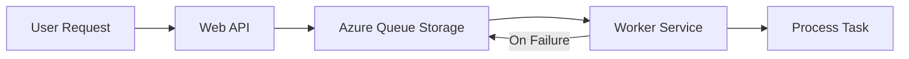

# How to Build Background Workers with Azure Queue Storage and .NET Worker Service

Author: [nawazdhandala](https://www.github.com/nawazdhandala)

Tags: Azure Queue Storage, .NET Worker Service, Background Jobs, C#, Message Queue, Azure Storage, Microservices

Description: Learn how to build reliable background workers using Azure Queue Storage and .NET Worker Service to decouple long-running tasks from your web application.

---

Long-running tasks have no business living inside an HTTP request. When a user uploads a file that needs processing, or when an order needs to trigger an email, a payment charge, and an inventory update, you want to acknowledge the request immediately and handle the work in the background. Azure Queue Storage provides a simple, durable message queue, and .NET Worker Service gives you a long-running host process that can consume those messages reliably.

In this post, we will build a complete solution: a web API that enqueues messages and a worker service that processes them.

## The Architecture

The pattern is straightforward. Your web API receives a request, drops a message on a queue, and returns a response to the user. A separate worker process picks up messages from the queue and processes them at its own pace. If the worker crashes or the message processing fails, the message becomes visible again after a timeout and gets retried.



Azure Queue Storage is not the fanciest message queue out there. It does not have topics, subscriptions, or dead-letter queues like Azure Service Bus. But it is cheap, reliable, and simple. If your requirements are "put a message in, take a message out, retry on failure," it is the right tool.

## Setting Up Azure Queue Storage

You can use the Azure CLI to create a storage account and queue.

```bash
# Create a resource group
az group create --name worker-demo-rg --location eastus

# Create a storage account
az storage account create \
  --name workerdemostore \
  --resource-group worker-demo-rg \
  --location eastus \
  --sku Standard_LRS

# Create a queue
az storage queue create \
  --name order-processing \
  --account-name workerdemostore
```

## Creating the Web API (Message Producer)

First, let's build the API that enqueues messages.

```bash
dotnet new webapi -n OrderApi
cd OrderApi
dotnet add package Azure.Storage.Queues
```

Define a message model and set up the queue client.

```csharp
// Models/OrderMessage.cs
// Message payload that gets serialized to JSON and placed on the queue
namespace OrderApi.Models;

public class OrderMessage
{
    public string OrderId { get; set; } = string.Empty;
    public string CustomerId { get; set; } = string.Empty;
    public string ProductName { get; set; } = string.Empty;
    public int Quantity { get; set; }
    public decimal TotalAmount { get; set; }
    public DateTime CreatedAt { get; set; } = DateTime.UtcNow;
}
```

Register the queue client in your DI container.

```csharp
// Program.cs
using Azure.Storage.Queues;

var builder = WebApplication.CreateBuilder(args);

// Register the QueueClient as a singleton
builder.Services.AddSingleton(sp =>
{
    var connectionString = builder.Configuration.GetConnectionString("AzureStorage");

    // Create the queue client with options for base64 encoding
    var client = new QueueClient(
        connectionString,
        "order-processing",
        new QueueClientOptions
        {
            // Messages are base64 encoded by default for compatibility
            MessageEncoding = QueueMessageEncoding.Base64
        });

    // Make sure the queue exists
    client.CreateIfNotExists();
    return client;
});

builder.Services.AddControllers();
var app = builder.Build();
app.MapControllers();
app.Run();
```

Now create the controller that accepts orders and enqueues them.

```csharp
// Controllers/OrdersController.cs
using Azure.Storage.Queues;
using Microsoft.AspNetCore.Mvc;
using OrderApi.Models;
using System.Text.Json;

[ApiController]
[Route("api/[controller]")]
public class OrdersController : ControllerBase
{
    private readonly QueueClient _queueClient;
    private readonly ILogger<OrdersController> _logger;

    public OrdersController(QueueClient queueClient, ILogger<OrdersController> logger)
    {
        _queueClient = queueClient;
        _logger = logger;
    }

    [HttpPost]
    public async Task<IActionResult> CreateOrder([FromBody] OrderMessage order)
    {
        // Generate a unique order ID
        order.OrderId = Guid.NewGuid().ToString();
        order.CreatedAt = DateTime.UtcNow;

        // Serialize the order to JSON and send it to the queue
        string messageBody = JsonSerializer.Serialize(order);
        await _queueClient.SendMessageAsync(messageBody);

        _logger.LogInformation("Order {OrderId} enqueued for processing", order.OrderId);

        // Return immediately - the worker will handle processing
        return Accepted(new { orderId = order.OrderId, status = "Queued" });
    }
}
```

Notice we return `Accepted` (HTTP 202), not `OK` (HTTP 200). This signals to the caller that the request has been accepted for processing but is not yet complete.

## Creating the Worker Service (Message Consumer)

Now build the worker that processes messages from the queue.

```bash
dotnet new worker -n OrderWorker
cd OrderWorker
dotnet add package Azure.Storage.Queues
```

The worker service template creates a `Worker` class that inherits from `BackgroundService`. This runs as a long-lived process.

```csharp
// Worker.cs
using Azure.Storage.Queues;
using Azure.Storage.Queues.Models;
using System.Text.Json;

namespace OrderWorker;

public class OrderProcessingWorker : BackgroundService
{
    private readonly QueueClient _queueClient;
    private readonly ILogger<OrderProcessingWorker> _logger;

    public OrderProcessingWorker(QueueClient queueClient, ILogger<OrderProcessingWorker> logger)
    {
        _queueClient = queueClient;
        _logger = logger;
    }

    protected override async Task ExecuteAsync(CancellationToken stoppingToken)
    {
        _logger.LogInformation("Order Processing Worker started");

        while (!stoppingToken.IsCancellationRequested)
        {
            try
            {
                // Try to receive a message with a 30-second visibility timeout
                // The message becomes invisible to other consumers for 30 seconds
                QueueMessage? message = await _queueClient.ReceiveMessageAsync(
                    visibilityTimeout: TimeSpan.FromSeconds(30),
                    cancellationToken: stoppingToken);

                if (message?.Body != null)
                {
                    await ProcessMessageAsync(message, stoppingToken);
                }
                else
                {
                    // No messages available - wait before polling again
                    // This prevents hammering the queue when it is empty
                    await Task.Delay(TimeSpan.FromSeconds(5), stoppingToken);
                }
            }
            catch (OperationCanceledException)
            {
                // Shutdown requested - exit gracefully
                break;
            }
            catch (Exception ex)
            {
                _logger.LogError(ex, "Error receiving message from queue");
                await Task.Delay(TimeSpan.FromSeconds(10), stoppingToken);
            }
        }

        _logger.LogInformation("Order Processing Worker stopped");
    }

    private async Task ProcessMessageAsync(QueueMessage message, CancellationToken ct)
    {
        try
        {
            // Deserialize the message body
            var order = JsonSerializer.Deserialize<OrderMessage>(message.Body.ToString());

            if (order == null)
            {
                _logger.LogWarning("Received null order message, deleting");
                await _queueClient.DeleteMessageAsync(message.MessageId, message.PopReceipt, ct);
                return;
            }

            _logger.LogInformation("Processing order {OrderId} for customer {CustomerId}",
                order.OrderId, order.CustomerId);

            // Simulate order processing steps
            await ChargePayment(order);
            await UpdateInventory(order);
            await SendConfirmationEmail(order);

            // Delete the message after successful processing
            await _queueClient.DeleteMessageAsync(message.MessageId, message.PopReceipt, ct);

            _logger.LogInformation("Order {OrderId} processed successfully", order.OrderId);
        }
        catch (Exception ex)
        {
            // Do NOT delete the message - it will become visible again after the timeout
            // and will be retried automatically
            _logger.LogError(ex, "Failed to process message {MessageId}, will retry",
                message.MessageId);

            // Check if the message has been dequeued too many times
            if (message.DequeueCount > 5)
            {
                _logger.LogError("Message {MessageId} exceeded retry limit, moving to poison queue",
                    message.MessageId);
                await MoveToPoison(message, ct);
            }
        }
    }

    private async Task MoveToPoison(QueueMessage message, CancellationToken ct)
    {
        // Create a poison queue for messages that repeatedly fail
        var poisonClient = new QueueClient(
            _queueClient.AccountName,  // reuse account
            "order-processing-poison");
        await poisonClient.CreateIfNotExistsAsync(cancellationToken: ct);
        await poisonClient.SendMessageAsync(message.Body.ToString(), ct);
        await _queueClient.DeleteMessageAsync(message.MessageId, message.PopReceipt, ct);
    }

    // Simulated processing methods
    private async Task ChargePayment(OrderMessage order)
    {
        _logger.LogInformation("Charging payment of {Amount} for order {OrderId}",
            order.TotalAmount, order.OrderId);
        await Task.Delay(1000); // Simulate API call
    }

    private async Task UpdateInventory(OrderMessage order)
    {
        _logger.LogInformation("Updating inventory for {Product} x{Qty}",
            order.ProductName, order.Quantity);
        await Task.Delay(500);
    }

    private async Task SendConfirmationEmail(OrderMessage order)
    {
        _logger.LogInformation("Sending confirmation email for order {OrderId}", order.OrderId);
        await Task.Delay(500);
    }
}
```

## Handling Poison Messages

Messages that fail repeatedly need special handling. Azure Queue Storage tracks the dequeue count for each message. After a certain number of failures, you should move the message to a poison queue for manual inspection rather than letting it retry forever.

The code above already handles this with the `DequeueCount` check. In production, you would typically alert on messages entering the poison queue so someone can investigate.

## Scaling the Worker

You can run multiple instances of the worker to process messages in parallel. Azure Queue Storage handles the coordination automatically. When one worker receives a message, that message becomes invisible to all other workers for the visibility timeout period.

You can also process multiple messages per poll.

```csharp
// Receive up to 10 messages at once for batch processing
QueueMessage[] messages = await _queueClient.ReceiveMessagesAsync(
    maxMessages: 10,
    visibilityTimeout: TimeSpan.FromMinutes(2),
    cancellationToken: stoppingToken);

// Process messages in parallel
var tasks = messages.Select(m => ProcessMessageAsync(m, stoppingToken));
await Task.WhenAll(tasks);
```

## Deploying the Worker

The worker service can be deployed anywhere that supports .NET: Azure App Service, Azure Container Apps, Azure Kubernetes Service, or even a plain VM. My preference for worker services is Azure Container Apps because you can scale based on queue length.

```bash
# Build a Docker image
docker build -t order-worker .

# Push to Azure Container Registry
az acr build --registry myRegistry --image order-worker:v1 .

# Deploy to Container Apps with queue-based scaling
az containerapp create \
  --name order-worker \
  --resource-group worker-demo-rg \
  --image myRegistry.azurecr.io/order-worker:v1 \
  --min-replicas 1 \
  --max-replicas 10 \
  --scale-rule-name queue-rule \
  --scale-rule-type azure-queue \
  --scale-rule-metadata queueName=order-processing \
  --scale-rule-auth connection=storage-connection
```

## Wrapping Up

The combination of Azure Queue Storage and .NET Worker Service gives you a solid foundation for background processing. The queue decouples your producers from your consumers, messages survive restarts and crashes, and scaling is as simple as running more workers. Keep your messages small (they have a 64KB limit), make your processing idempotent, handle poison messages, and you will have a reliable background processing pipeline.
