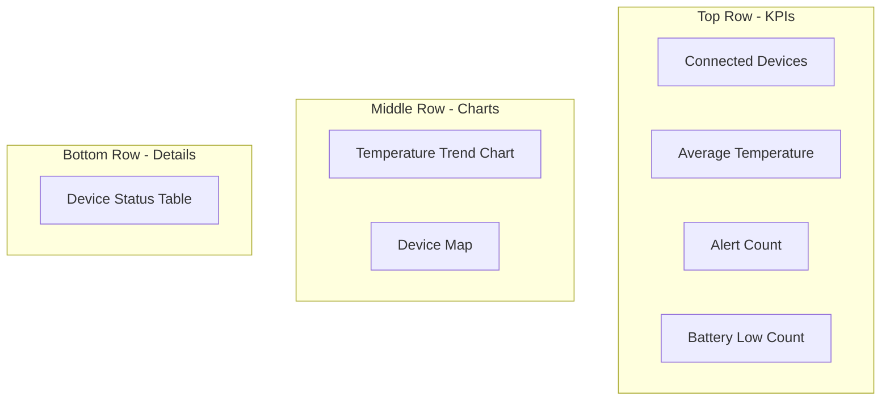

# How to Build Custom Dashboards with Real-Time Device Data in Azure IoT Central

Author: [nawazdhandala](https://www.github.com/nawazdhandala)

Tags: Azure IoT Central, Custom Dashboards, Real-Time Data, IoT Visualization, Device Monitoring, Data Analytics, Dashboard Design

Description: A practical guide to building custom dashboards in Azure IoT Central that display real-time device telemetry, properties, and fleet-level analytics.

---

Dashboards are the primary way operators interact with an IoT system day to day. A well-designed dashboard surfaces the information that matters, hides the noise, and enables quick decisions. Azure IoT Central provides a flexible dashboard builder that lets you create application-level dashboards for fleet oversight and device-level views for drilling into individual devices. No coding is needed, but thoughtful design makes the difference between a dashboard people actually use and one they ignore.

This guide covers building both types of dashboards, selecting the right visualization tiles, and organizing everything for operational efficiency.

## Dashboard Types in IoT Central

IoT Central supports two kinds of dashboards:

1. **Application dashboards** - Shared dashboards visible to all users of the application. These show fleet-level data, cross-device comparisons, and aggregate metrics.
2. **Device template views** - Per-device dashboards defined in the device template. These show up when an operator clicks on a specific device.

Both use the same tile-based builder, but they serve different purposes. Application dashboards answer "how is my fleet doing?" while device views answer "what is this specific device doing?"

## Creating an Application Dashboard

Navigate to your IoT Central application and click Dashboard in the left navigation. If this is your first custom dashboard, you will see the default dashboard. Click Edit to modify it, or create a new one by clicking New dashboard.

### Adding a Fleet Overview Tile

Start with a KPI tile that shows the total count of connected devices. Click Add tile, select the KPI type, and configure:

- **Title:** "Connected Devices"
- **Device group:** All devices
- **Telemetry:** Select any telemetry field
- **Aggregation:** Count
- **Time range:** Last 5 minutes

This gives you an at-a-glance count of how many devices have sent data recently.

### Adding a Telemetry Chart

For monitoring trends across your fleet, add a line chart tile.

- **Title:** "Temperature Across Fleet"
- **Device group:** Select your device group
- **Telemetry:** Temperature
- **Aggregation:** Average
- **Time range:** Last 24 hours
- **Group by:** Device name

This shows temperature trends for each device on a single chart, making it easy to spot outliers.

### Adding a Map Tile

If your devices report location data, a map tile provides spatial context.

- **Title:** "Device Locations"
- **Device group:** All devices
- **Location property:** Select the location property from your device template
- **Color by:** You can color-code markers based on a telemetry value (e.g., temperature) to show hot spots

### Adding a Property Grid

A property grid shows tabular data for multiple devices. This is useful for fleet management tasks.

- **Title:** "Device Status"
- **Device group:** All devices
- **Columns:** Device name, firmware version, last activity time, battery level

Operators can sort and filter this grid to find specific devices or identify patterns like a batch of devices running outdated firmware.

## Designing Effective Dashboard Layouts

IoT Central's dashboard builder uses a grid layout where you can resize and position tiles freely. Here are layout principles that work well for operational dashboards:

**Put the most important information at the top left.** This is where people look first. Place your critical KPIs and status indicators here.

**Use the golden layout pattern.** Wide summary tiles across the top, detailed charts in the middle, and tables at the bottom.

**Limit tiles per dashboard to 8-12.** More than that creates visual overload. Create multiple dashboards for different audiences or purposes instead of cramming everything onto one page.

## Building Device Template Views

Device template views appear when an operator clicks into a specific device. These are defined in the device template and apply to all devices using that template.

Go to Device Templates, select your template, and click Views. You have several view types:

### Visualizing the Device

This is the default device dashboard. Add tiles that show the device's telemetry over time.

A good device view includes:

**Temperature and humidity line chart** - Shows the primary sensor data over the last 24 hours. Dual-axis charts work well when the scales differ significantly.

**Air quality gauge** - A gauge or KPI tile showing the current AQI reading with color-coded thresholds. Set ranges like 0-50 (green), 51-100 (yellow), 101-200 (orange), 201+ (red).

**Battery level indicator** - A simple last-known-value tile with a warning threshold at 20%.

**Event timeline** - If your device sends event telemetry (errors, warnings, state changes), a table showing recent events with timestamps.

### Editing Device and Cloud Data

Create a form view that lets operators modify writable properties. This is the operator's interface for configuring individual devices.

Add form fields for:

- Reporting interval (with min/max validation)
- Temperature calibration offset
- Device display name (cloud property)
- Deployment notes (cloud property)

Cloud properties are stored in IoT Central only and are not sent to the device. They are useful for metadata like deployment location, asset tags, or notes.

### About View

This view shows static device information - properties that rarely change.

Include:

- Device ID
- Firmware version
- Manufacturer
- Model number
- Serial number
- Provisioning date

## Adding Conditional Formatting

Some tiles support conditional formatting, which changes the appearance based on data values. This is particularly useful for KPI and last-known-value tiles.

For a temperature KPI tile, set up conditional formatting:

| Condition | Color | Meaning |
|---|---|---|
| Value < 20 | Blue | Below normal range |
| 20 <= Value <= 30 | Green | Normal operating range |
| 30 < Value <= 35 | Orange | Warning range |
| Value > 35 | Red | Critical - action needed |

Conditional formatting turns your dashboard into an at-a-glance status board where operators can spot problems by color alone.

## Using Device Groups for Dashboard Filtering

Device groups let you segment your fleet by any property or cloud property. Create groups like:

- "Building A Sensors" - filtered by a cloud property for building assignment
- "Low Battery Devices" - filtered by battery level < 20%
- "Firmware v1.x" - filtered by firmware version property
- "High Priority" - filtered by a priority cloud property

Each dashboard tile can be scoped to a specific device group. This lets you create focused dashboards for different buildings, regions, or device types without duplicating the entire dashboard.

## Real-Time vs. Historical Data

IoT Central tiles can show data in two modes:

**Real-time** - Data updates as new telemetry arrives. Use this for operational dashboards where operators need to see current conditions. The refresh rate depends on how frequently devices send telemetry.

**Historical** - Data shows trends over a configurable time window (last hour, last 24 hours, last 7 days, etc.). Use this for trend analysis and capacity planning dashboards.

A good operational dashboard typically mixes both: real-time KPIs at the top showing current state, and historical charts below showing trends.

## Sharing and Access Control

Application dashboards are visible to all users by default. IoT Central supports role-based access with three built-in roles:

- **Administrator** - Full access, can edit dashboards
- **Builder** - Can create and edit dashboards and device templates
- **Operator** - Can view dashboards and interact with devices, but cannot modify templates or dashboard layouts

For external stakeholders who need visibility but should not modify anything, create custom roles with read-only dashboard access.

## Exporting Dashboard Data

Sometimes a dashboard is not enough and operators need the underlying data. IoT Central supports continuous data export to destinations like:

- Azure Event Hubs
- Azure Service Bus
- Webhook endpoints
- Azure Data Explorer
- Blob Storage

Set up a data export to feed the same telemetry into Power BI for richer analytics, or into a data lake for long-term storage and machine learning.

## Wrapping Up

Building effective dashboards in Azure IoT Central is less about mastering the tile builder and more about understanding what your operators need to see. Start with a clear question - "what decisions does this dashboard help me make?" - and work backward to the data and visualizations that support those decisions. Keep fleet dashboards focused on anomalies and status, device views focused on recent history and configuration, and resist the temptation to show everything on a single screen. A dashboard that surfaces three critical signals clearly is worth more than one that shows fifty metrics nobody reads.
