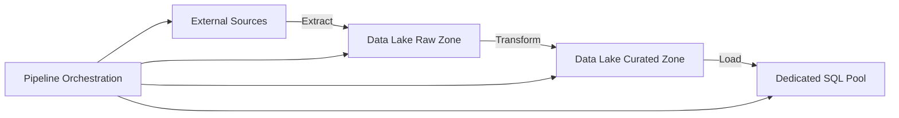

# How to Build ETL Pipelines in Azure Synapse Analytics

Author: [nawazdhandala](https://www.github.com/nawazdhandala)

Tags: Azure, Synapse Analytics, ETL, Data Pipelines, Data Engineering, Data Integration, Azure Data Factory

Description: Learn how to build end-to-end ETL pipelines in Azure Synapse Analytics using Synapse Pipelines for data ingestion, transformation, and loading.

---

Azure Synapse Analytics includes a built-in pipeline orchestration engine that is essentially Azure Data Factory embedded directly in the Synapse workspace. This means you can build, schedule, and monitor ETL (Extract, Transform, Load) pipelines without leaving Synapse Studio. If you have used Azure Data Factory before, the experience is nearly identical - same activities, same connectors, same visual editor.

This guide walks through building a practical ETL pipeline that ingests raw data from external sources, transforms it, and loads it into a dedicated SQL pool for analytics.

## ETL Pipeline Architecture

A typical Synapse ETL pipeline follows this pattern:



The three zones in the data lake represent different stages of data maturity:
- **Raw zone**: Data as-is from the source. No transformations.
- **Curated zone**: Cleaned, validated, and transformed data. Ready for analysis.
- **Dedicated SQL pool**: Optimized star schema for high-performance analytics.

## Prerequisites

- An Azure Synapse workspace with a linked data lake storage account
- A dedicated SQL pool (for the final load step)
- Source data in an accessible location (Azure SQL, Blob Storage, REST API, etc.)
- Data pipeline contributor role in the Synapse workspace

## Step 1: Set Up Linked Services

Linked services are connections to external data sources and targets. You need them before building pipeline activities.

**Create a linked service for Azure SQL Database (source):**

1. In Synapse Studio, go to Manage > Linked services.
2. Click "New".
3. Select "Azure SQL Database".
4. Configure the connection with server name, database, and credentials.
5. Test the connection and create it.

**Create a linked service for the data lake (already exists by default):**

The workspace's primary storage account is automatically available as a linked service called `<workspace-name>-WorkspaceDefaultStorage`.

You can also create linked services via pipeline JSON definitions:

```json
{
    "name": "AzureSqlSource",
    "type": "AzureSqlDatabase",
    "typeProperties": {
        "connectionString": "Server=tcp:source-server.database.windows.net;Database=SourceDB;User ID=reader;Password=<password>;Encrypt=True;"
    }
}
```

## Step 2: Build the Extract Stage

The first pipeline extracts data from the source and lands it in the raw zone of your data lake.

**Using the Copy Data activity:**

1. In Synapse Studio, go to Integrate > click "+" > Pipeline.
2. Name it "Extract_Sales_Data".
3. Drag a "Copy Data" activity onto the canvas.
4. Configure the source:
   - Source dataset: Azure SQL Database table
   - Query: A SQL query to extract data

```sql
-- Source query for incremental extraction
-- Only extract records modified since the last pipeline run
SELECT
    OrderId,
    ProductId,
    CustomerId,
    OrderDate,
    Quantity,
    UnitPrice,
    Quantity * UnitPrice AS TotalAmount,
    LastModified
FROM dbo.Orders
WHERE LastModified >= @{pipeline().parameters.LastRunTimestamp}
```

5. Configure the sink:
   - Sink dataset: Azure Data Lake Storage Gen2
   - Path: `raw/sales/year=@{formatDateTime(utcnow(),'yyyy')}/month=@{formatDateTime(utcnow(),'MM')}/day=@{formatDateTime(utcnow(),'dd')}/`
   - Format: Parquet

This extracts data incrementally (only new and modified records) and writes it to a date-partitioned folder structure in the data lake.

## Step 3: Build the Transform Stage

For transformations, you have two main options in Synapse: Data Flows (visual, code-free) and Spark notebooks (code-based).

### Option A: Data Flows (Visual Transformation)

Data Flows provide a visual interface for building transformations using a drag-and-drop designer.

1. Create a new Data Flow named "Transform_Sales".
2. Add a Source pointing to the raw Parquet files.
3. Add transformation steps:

- **Filter**: Remove invalid records (null OrderId, negative quantities)
- **Derived Column**: Calculate derived fields
- **Aggregate**: Create summary metrics
- **Lookup**: Join with dimension tables
- **Sink**: Write to the curated zone

The Data Flow visually looks like a pipeline of transformations. Behind the scenes, Synapse compiles it into a Spark job.

### Option B: Spark Notebook (Code-Based Transformation)

For more complex transformations, use a PySpark notebook.

```python
# Read raw sales data from the data lake
from pyspark.sql.functions import col, when, lit, current_timestamp

raw_sales = spark.read.parquet(
    "abfss://synapse-data@synapsedatalake2026.dfs.core.windows.net/raw/sales/"
)

# Data quality checks - filter out invalid records
clean_sales = (
    raw_sales
    .filter(col("OrderId").isNotNull())
    .filter(col("Quantity") > 0)
    .filter(col("UnitPrice") > 0)
)

# Enrich with product dimension data
products = spark.read.parquet(
    "abfss://synapse-data@synapsedatalake2026.dfs.core.windows.net/dimensions/products/"
)

# Join sales with product dimension to add category information
enriched_sales = (
    clean_sales
    .join(products, "ProductId", "left")
    .select(
        clean_sales["*"],
        products["ProductCategory"],
        products["ProductName"],
        products["Brand"]
    )
    .withColumn("ProcessedTimestamp", current_timestamp())
)

# Write to curated zone in Delta Lake format for ACID guarantees
enriched_sales.write \
    .format("delta") \
    .mode("append") \
    .partitionBy("OrderDate") \
    .save("abfss://synapse-data@synapsedatalake2026.dfs.core.windows.net/curated/sales/")
```

## Step 4: Build the Load Stage

Load the curated data into the dedicated SQL pool for high-performance analytics queries.

**Using the Copy Data activity with PolyBase:**

1. Add another Copy Data activity to the pipeline.
2. Source: Data Lake (curated zone, Parquet or Delta files).
3. Sink: Dedicated SQL Pool table.
4. Under sink settings, select "PolyBase" as the copy method for fastest bulk loading.

**Using SQL Scripts:**

Alternatively, load data using the COPY INTO statement, which is often faster and simpler:

```sql
-- Load curated data into the dedicated SQL pool
-- COPY INTO is the recommended approach for bulk loading
COPY INTO dbo.FactSales
(OrderId, ProductId, CustomerId, OrderDate, Quantity, UnitPrice, TotalAmount,
 ProductCategory, ProductName, Brand)
FROM 'https://synapsedatalake2026.dfs.core.windows.net/synapse-data/curated/sales/*.parquet'
WITH (
    FILE_TYPE = 'PARQUET',
    CREDENTIAL = (IDENTITY = 'Managed Identity')
);
```

## Step 5: Orchestrate the Full Pipeline

Now connect the three stages into a single orchestrated pipeline.

1. Create a master pipeline called "ETL_Sales_Full".
2. Add three activities in sequence:
   - Execute Pipeline: "Extract_Sales_Data"
   - Execute Pipeline or Notebook Activity: "Transform_Sales"
   - Script Activity or Copy Activity: Load into SQL Pool

Connect them with success dependency arrows so each stage runs only after the previous one succeeds.

Add error handling:

```
Pipeline Activities:
  1. Extract_Sales_Data (Copy Activity)
     |-- On Success --> Transform_Sales (Notebook Activity)
     |-- On Failure --> Send_Alert_Email (Web Activity)

  2. Transform_Sales (Notebook Activity)
     |-- On Success --> Load_SQL_Pool (Copy Activity)
     |-- On Failure --> Send_Alert_Email (Web Activity)

  3. Load_SQL_Pool (Copy Activity)
     |-- On Success --> Log_Success (Stored Procedure Activity)
     |-- On Failure --> Send_Alert_Email (Web Activity)
```

## Step 6: Add Parameters and Dynamic Content

Make your pipeline reusable by adding parameters.

```json
{
    "name": "ETL_Sales_Full",
    "properties": {
        "parameters": {
            "LastRunTimestamp": {
                "type": "string",
                "defaultValue": "2020-01-01T00:00:00Z"
            },
            "TargetDate": {
                "type": "string",
                "defaultValue": "@utcnow()"
            }
        }
    }
}
```

Use these parameters in activities with expressions:

```
@pipeline().parameters.LastRunTimestamp
@formatDateTime(pipeline().parameters.TargetDate, 'yyyy-MM-dd')
```

## Step 7: Schedule the Pipeline

Set up a trigger to run the pipeline automatically.

**Schedule trigger** (runs at fixed intervals):

1. In Synapse Studio, go to the pipeline.
2. Click "Add trigger" > "New/Edit".
3. Create a schedule trigger:
   - Recurrence: Every day at 2:00 AM UTC
   - Start date: 2026-02-16
   - Time zone: UTC

**Tumbling window trigger** (processes time windows sequentially):

Use tumbling window triggers when each pipeline run processes a specific time window and you need guaranteed sequential processing.

```json
{
    "name": "DailySalesTrigger",
    "type": "TumblingWindowTrigger",
    "typeProperties": {
        "frequency": "Hour",
        "interval": 24,
        "startTime": "2026-02-16T02:00:00Z",
        "delay": "00:15:00",
        "maxConcurrency": 1,
        "retryPolicy": {
            "count": 3,
            "intervalInSeconds": 300
        }
    }
}
```

## Step 8: Monitor Pipeline Runs

Synapse Studio provides built-in monitoring for pipeline executions.

1. Go to Monitor > Pipeline runs.
2. View status, duration, and any errors for each run.
3. Click on a run to see activity-level details.
4. For Spark notebook activities, click through to see the Spark UI.

Set up alerts for pipeline failures:

```bash
# Create an alert for pipeline failures using Azure Monitor
az monitor activity-log alert create \
  --name synapse-pipeline-failure \
  --resource-group rg-synapse \
  --condition category=Administrative and operationName="Microsoft.Synapse/workspaces/pipelines/runs/write" and status=Failed \
  --action-group ops-team-alerts
```

## Best Practices

1. **Use incremental loading**: Extract only new/changed records using watermark columns (like LastModified) instead of full table reloads.
2. **Partition your data lake files**: Use date-based partitions for time-series data. This enables partition pruning during queries and transformations.
3. **Use Delta Lake format**: Delta provides ACID transactions, schema enforcement, and time travel over your data lake files.
4. **Separate extraction from transformation**: Keep the raw zone as a faithful copy of the source. Apply transformations in a separate stage.
5. **Idempotent pipeline design**: Design pipelines so they can be re-run safely without creating duplicates. Use merge/upsert operations.
6. **Test with small datasets first**: Before running against production data, test your pipeline with a subset.

## Wrapping Up

Building ETL pipelines in Azure Synapse Analytics brings together data ingestion, transformation, and loading in a single workspace. The pipeline orchestration engine handles scheduling, dependency management, and monitoring. For transformations, you can choose between visual Data Flows for simpler logic and Spark notebooks for complex processing. The key to a reliable ETL pipeline is incremental loading, proper error handling, and idempotent design so failures are recoverable without manual intervention.
