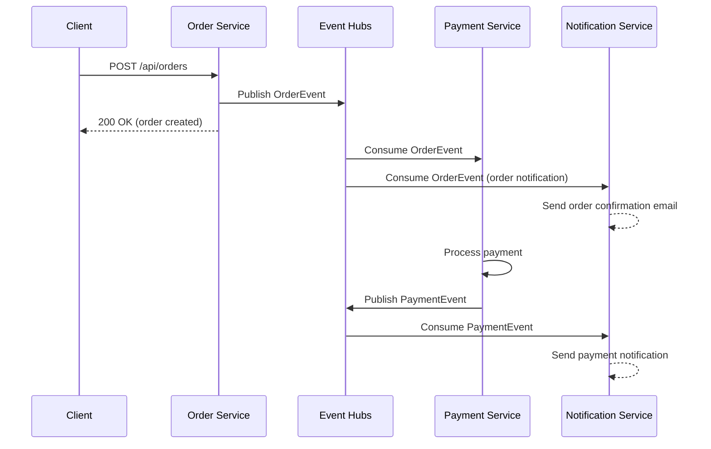

# How to Build Event-Driven Microservices with Azure Event Hubs and Spring Boot

Author: [nawazdhandala](https://www.github.com/nawazdhandala)

Tags: Azure Event Hubs, Spring Boot, Event-Driven Architecture, Microservices, Java, Spring Cloud Stream, Kafka

Description: Learn how to build event-driven microservices using Azure Event Hubs and Spring Boot with Spring Cloud Stream for scalable real-time event processing.

---

Event-driven architecture decouples services by having them communicate through events rather than direct API calls. When the Order Service creates an order, it publishes an event. The Inventory Service, Payment Service, and Notification Service each consume that event independently. No service needs to know about the others. Azure Event Hubs provides the event streaming backbone, and Spring Boot with Spring Cloud Stream gives you a clean programming model for producing and consuming events.

In this post, we will build a set of event-driven microservices that communicate through Azure Event Hubs. We will use Spring Cloud Stream with the Kafka binder because Event Hubs exposes a Kafka-compatible endpoint, which means you get the full Spring Kafka ecosystem without managing Kafka clusters.

## Why Event Hubs with Kafka Protocol?

Azure Event Hubs supports the Apache Kafka protocol natively. This means you can use any Kafka client library, including Spring Cloud Stream's Kafka binder, to talk to Event Hubs. The advantages are:

- No Kafka cluster to manage - Azure handles infrastructure
- Familiar Kafka APIs and tooling
- Easy migration path if you are already using Kafka
- Automatic scaling and built-in redundancy
- Pay-per-throughput-unit pricing

## Setting Up Azure Event Hubs

Create an Event Hubs namespace with Kafka support enabled.

```bash
# Create resource group
az group create --name eventhubs-micro-rg --location eastus

# Create Event Hubs namespace (Standard or higher for Kafka support)
az eventhubs namespace create \
  --name my-eventhubs-kafka \
  --resource-group eventhubs-micro-rg \
  --location eastus \
  --sku Standard \
  --enable-kafka true

# Create event hubs (topics in Kafka terminology)
az eventhubs eventhub create \
  --name order-events \
  --namespace-name my-eventhubs-kafka \
  --resource-group eventhubs-micro-rg \
  --partition-count 4

az eventhubs eventhub create \
  --name payment-events \
  --namespace-name my-eventhubs-kafka \
  --resource-group eventhubs-micro-rg \
  --partition-count 4

az eventhubs eventhub create \
  --name notification-events \
  --namespace-name my-eventhubs-kafka \
  --resource-group eventhubs-micro-rg \
  --partition-count 2

# Get the connection string for Kafka configuration
az eventhubs namespace authorization-rule keys list \
  --namespace-name my-eventhubs-kafka \
  --resource-group eventhubs-micro-rg \
  --name RootManageSharedAccessKey \
  --query primaryConnectionString -o tsv
```

## Project Structure

We will build three microservices: Order Service (producer), Payment Service (consumer and producer), and Notification Service (consumer).

```
event-driven-demo/
  order-service/
  payment-service/
  notification-service/
  common/           # Shared event models
```

## Shared Event Models

Define event classes shared across services.

```java
// common/src/main/java/com/example/events/OrderEvent.java
package com.example.events;

// Event published when an order is created or updated
public class OrderEvent {
    private String eventId;
    private String orderId;
    private String customerId;
    private String productName;
    private int quantity;
    private double totalAmount;
    private String status;  // CREATED, PAID, SHIPPED, CANCELLED
    private long timestamp;

    public OrderEvent() {}

    // Constructor, getters, setters omitted for brevity
    public String getEventId() { return eventId; }
    public void setEventId(String eventId) { this.eventId = eventId; }
    public String getOrderId() { return orderId; }
    public void setOrderId(String orderId) { this.orderId = orderId; }
    public String getCustomerId() { return customerId; }
    public void setCustomerId(String customerId) { this.customerId = customerId; }
    public String getProductName() { return productName; }
    public void setProductName(String productName) { this.productName = productName; }
    public int getQuantity() { return quantity; }
    public void setQuantity(int quantity) { this.quantity = quantity; }
    public double getTotalAmount() { return totalAmount; }
    public void setTotalAmount(double totalAmount) { this.totalAmount = totalAmount; }
    public String getStatus() { return status; }
    public void setStatus(String status) { this.status = status; }
    public long getTimestamp() { return timestamp; }
    public void setTimestamp(long timestamp) { this.timestamp = timestamp; }
}
```

```java
// common/src/main/java/com/example/events/PaymentEvent.java
package com.example.events;

// Event published when a payment is processed
public class PaymentEvent {
    private String paymentId;
    private String orderId;
    private double amount;
    private String status;  // SUCCESS, FAILED
    private String failureReason;
    private long timestamp;

    public PaymentEvent() {}

    // Getters and setters
    public String getPaymentId() { return paymentId; }
    public void setPaymentId(String paymentId) { this.paymentId = paymentId; }
    public String getOrderId() { return orderId; }
    public void setOrderId(String orderId) { this.orderId = orderId; }
    public double getAmount() { return amount; }
    public void setAmount(double amount) { this.amount = amount; }
    public String getStatus() { return status; }
    public void setStatus(String status) { this.status = status; }
    public String getFailureReason() { return failureReason; }
    public void setFailureReason(String failureReason) { this.failureReason = failureReason; }
    public long getTimestamp() { return timestamp; }
    public void setTimestamp(long timestamp) { this.timestamp = timestamp; }
}
```

## Order Service Configuration

The Order Service accepts HTTP requests and publishes events to Event Hubs via the Kafka protocol.

```yaml
# order-service/src/main/resources/application.yml
spring:
  cloud:
    stream:
      kafka:
        binder:
          brokers: my-eventhubs-kafka.servicebus.windows.net:9093
          configuration:
            # SASL authentication for Event Hubs Kafka endpoint
            security.protocol: SASL_SSL
            sasl.mechanism: PLAIN
            sasl.jaas.config: >
              org.apache.kafka.common.security.plain.PlainLoginModule required
              username="$ConnectionString"
              password="Endpoint=sb://my-eventhubs-kafka.servicebus.windows.net/;SharedAccessKeyName=RootManageSharedAccessKey;SharedAccessKey=your-key";
      bindings:
        orderEvents-out-0:
          destination: order-events
          content-type: application/json

  # Function definition for the producer
  cloud.function.definition: ""
```

```java
// order-service/src/main/java/com/example/order/OrderController.java
import com.example.events.OrderEvent;
import org.springframework.cloud.stream.function.StreamBridge;
import org.springframework.web.bind.annotation.*;
import org.slf4j.Logger;
import org.slf4j.LoggerFactory;

import java.util.UUID;

@RestController
@RequestMapping("/api/orders")
public class OrderController {

    private static final Logger log = LoggerFactory.getLogger(OrderController.class);
    private final StreamBridge streamBridge;

    public OrderController(StreamBridge streamBridge) {
        this.streamBridge = streamBridge;
    }

    @PostMapping
    public OrderEvent createOrder(@RequestBody OrderEvent order) {
        // Set event metadata
        order.setEventId(UUID.randomUUID().toString());
        order.setOrderId(UUID.randomUUID().toString());
        order.setStatus("CREATED");
        order.setTimestamp(System.currentTimeMillis());

        // Publish the order event to Event Hubs
        boolean sent = streamBridge.send("orderEvents-out-0", order);
        log.info("Order event published: {} (sent: {})", order.getOrderId(), sent);

        return order;
    }
}
```

## Payment Service

The Payment Service consumes order events, processes payments, and publishes payment events.

```yaml
# payment-service/src/main/resources/application.yml
spring:
  cloud:
    stream:
      kafka:
        binder:
          brokers: my-eventhubs-kafka.servicebus.windows.net:9093
          configuration:
            security.protocol: SASL_SSL
            sasl.mechanism: PLAIN
            sasl.jaas.config: >
              org.apache.kafka.common.security.plain.PlainLoginModule required
              username="$ConnectionString"
              password="Endpoint=sb://...";
      bindings:
        processOrder-in-0:
          destination: order-events
          group: payment-service
          content-type: application/json
        paymentEvents-out-0:
          destination: payment-events
          content-type: application/json

  cloud.function.definition: processOrder
```

```java
// payment-service/src/main/java/com/example/payment/PaymentProcessor.java
import com.example.events.OrderEvent;
import com.example.events.PaymentEvent;
import org.springframework.cloud.stream.function.StreamBridge;
import org.springframework.context.annotation.Bean;
import org.springframework.context.annotation.Configuration;
import org.slf4j.Logger;
import org.slf4j.LoggerFactory;

import java.util.UUID;
import java.util.function.Consumer;

@Configuration
public class PaymentProcessor {

    private static final Logger log = LoggerFactory.getLogger(PaymentProcessor.class);
    private final StreamBridge streamBridge;

    public PaymentProcessor(StreamBridge streamBridge) {
        this.streamBridge = streamBridge;
    }

    @Bean
    public Consumer<OrderEvent> processOrder() {
        return orderEvent -> {
            log.info("Received order event: {} for amount {}",
                orderEvent.getOrderId(), orderEvent.getTotalAmount());

            // Process the payment
            PaymentEvent payment = new PaymentEvent();
            payment.setPaymentId(UUID.randomUUID().toString());
            payment.setOrderId(orderEvent.getOrderId());
            payment.setAmount(orderEvent.getTotalAmount());
            payment.setTimestamp(System.currentTimeMillis());

            try {
                // Simulate payment processing
                chargeCustomer(orderEvent);
                payment.setStatus("SUCCESS");
                log.info("Payment successful for order {}", orderEvent.getOrderId());
            } catch (Exception e) {
                payment.setStatus("FAILED");
                payment.setFailureReason(e.getMessage());
                log.error("Payment failed for order {}: {}", orderEvent.getOrderId(), e.getMessage());
            }

            // Publish payment event
            streamBridge.send("paymentEvents-out-0", payment);
        };
    }

    private void chargeCustomer(OrderEvent order) {
        // Simulate payment gateway call
        if (order.getTotalAmount() > 10000) {
            throw new RuntimeException("Amount exceeds limit");
        }
        log.info("Charged {} for customer {}", order.getTotalAmount(), order.getCustomerId());
    }
}
```

## Notification Service

The Notification Service listens to both order and payment events and sends notifications.

```java
// notification-service/src/main/java/com/example/notification/NotificationConsumer.java
import com.example.events.OrderEvent;
import com.example.events.PaymentEvent;
import org.springframework.context.annotation.Bean;
import org.springframework.context.annotation.Configuration;
import org.slf4j.Logger;
import org.slf4j.LoggerFactory;

import java.util.function.Consumer;

@Configuration
public class NotificationConsumer {

    private static final Logger log = LoggerFactory.getLogger(NotificationConsumer.class);

    // Listen for order creation events
    @Bean
    public Consumer<OrderEvent> orderNotification() {
        return event -> {
            log.info("Order notification: Order {} created for customer {}",
                event.getOrderId(), event.getCustomerId());
            // Send order confirmation email
            sendEmail(event.getCustomerId(),
                "Order Confirmation",
                "Your order " + event.getOrderId() + " has been received.");
        };
    }

    // Listen for payment events
    @Bean
    public Consumer<PaymentEvent> paymentNotification() {
        return event -> {
            if ("SUCCESS".equals(event.getStatus())) {
                log.info("Payment notification: Payment successful for order {}",
                    event.getOrderId());
                sendEmail(null, "Payment Received",
                    "Payment of $" + event.getAmount() + " received for order " + event.getOrderId());
            } else {
                log.warn("Payment notification: Payment failed for order {}",
                    event.getOrderId());
                sendEmail(null, "Payment Failed",
                    "Payment failed for order " + event.getOrderId() + ": " + event.getFailureReason());
            }
        };
    }

    private void sendEmail(String recipient, String subject, String body) {
        // In production, use an email service like SendGrid
        log.info("Sending email - To: {}, Subject: {}, Body: {}", recipient, subject, body);
    }
}
```

## The Complete Event Flow

Here is how events flow through the system.



## Error Handling and Retries

Configure retry behavior for consumers.

```yaml
spring:
  cloud:
    stream:
      bindings:
        processOrder-in-0:
          consumer:
            max-attempts: 3
            back-off-initial-interval: 1000
            back-off-max-interval: 10000
            back-off-multiplier: 2.0
      kafka:
        bindings:
          processOrder-in-0:
            consumer:
              enable-dlq: true        # Enable dead letter queue
              dlq-name: order-events-dlq
```

## Scaling Considerations

Event Hubs partitions determine your maximum parallelism. If you have 4 partitions for the order-events hub, you can run up to 4 instances of each consumer group. Running more instances than partitions means some instances will be idle.

For the Payment Service, which might be CPU-intensive, you could scale to 4 instances. For the Notification Service, which is I/O-bound, 2 instances might be enough.

## Wrapping Up

Building event-driven microservices with Azure Event Hubs and Spring Boot gives you loose coupling, independent scaling, and resilience. The Kafka protocol compatibility means you can use the mature Spring Cloud Stream Kafka binder without managing Kafka infrastructure. Each service publishes events when something interesting happens and consumes events it cares about. Start with a few event types, keep your events small and focused, and add services as your system grows.
