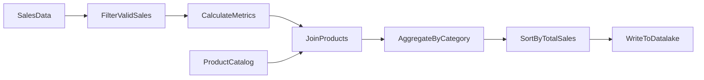

# How to Build Mapping Data Flows in Azure Data Factory for ETL Transformations

Author: [nawazdhandala](https://www.github.com/nawazdhandala)

Tags: Azure Data Factory, Mapping Data Flows, ETL, Data Transformation, Spark, Azure

Description: Learn how to build mapping data flows in Azure Data Factory to perform code-free ETL transformations powered by Apache Spark behind the scenes.

---

Azure Data Factory excels at orchestrating data movement, but what about data transformation? The Copy activity moves data as-is, which is fine for simple ingestion. When you need to join datasets, aggregate values, pivot rows, or apply business logic during the data load, you need mapping data flows.

Mapping data flows provide a visual, code-free experience for building data transformations. Behind the scenes, they run on Apache Spark clusters managed by ADF. You design your transformation logic in a drag-and-drop canvas, and ADF translates it into optimized Spark code. No need to write Spark or Python yourself.

In this post, I will show you how to build a mapping data flow that reads raw sales data, cleans it, joins it with a product dimension, aggregates the results, and writes the output to a data lake.

## Key Concepts

Before we start building, here are the important concepts:

- **Source** - where your data comes from (can be a dataset, inline, or a data flow output)
- **Transformation** - a step that changes the data (filter, join, aggregate, derived column, etc.)
- **Sink** - where the transformed data goes
- **Data preview** - lets you see sample data at any point in the flow during design time
- **Debug mode** - runs the flow against real data using a temporary Spark cluster

## Prerequisites

1. Azure Data Factory instance
2. Azure Data Lake Storage Gen2 or Blob Storage with source data
3. Datasets configured for your source and sink locations

Note: Mapping data flows require the Azure Integration Runtime (not self-hosted). They spin up Spark clusters, which are Azure-managed.

## Step 1: Enable Debug Mode

Before building the flow, turn on debug mode. This provisions a Spark cluster that lets you preview data at each transformation step as you design.

1. In ADF Studio, go to **Author**
2. Create a new data flow (click **+** > **Data flow** > **Mapping data flow**)
3. Toggle the **Data flow debug** switch at the top of the canvas
4. Choose the cluster size (4 cores is enough for development) and the time-to-live (60 minutes is a good default)
5. Wait a few minutes for the cluster to start

The cluster stays alive for the TTL period. You will not need to wait again as long as you work within that window.

## Step 2: Add Sources

Let us say we have two source files: sales transactions and a product catalog.

### Sales Source

1. Click "Add Source" on the canvas
2. Name it `SalesData`
3. Choose your dataset (or create an inline source)
4. Go to the **Source options** tab and configure file format settings
5. Click the **Data preview** tab to verify the data looks correct

### Product Source

1. Click "Add Source" again (you can have multiple sources)
2. Name it `ProductCatalog`
3. Point it to your product dataset

## Step 3: Add Transformations

Now we will build the transformation pipeline step by step.

### Filter Invalid Records

Click the **+** next to the SalesData source and select **Filter**.

Name it `FilterValidSales`. In the expression builder, enter:

```
// Keep only records where quantity is greater than 0 and price is not null
Quantity > 0 && !isNull(UnitPrice)
```

The expression builder uses a Data Flow Expression Language that is similar to Spark SQL expressions. It supports functions for string manipulation, date operations, conditional logic, and more.

### Add Derived Columns

Click **+** after the filter and select **Derived column**.

Name it `CalculateMetrics`. Add new columns:

```
// Calculate total amount for each line item
TotalAmount = Quantity * UnitPrice

// Extract year and month from the transaction date
SaleYear = year(TransactionDate)
SaleMonth = month(TransactionDate)

// Clean up product code by trimming whitespace and converting to uppercase
CleanProductCode = upper(trim(ProductCode))
```

Derived columns can modify existing columns or create new ones. This is where you apply business logic.

### Join with Product Catalog

Click **+** after the derived column and select **Join**.

Name it `JoinProducts`. Configure it:

- **Left stream** - select `CalculateMetrics`
- **Right stream** - select `ProductCatalog`
- **Join type** - Left outer (keeps all sales even if product lookup fails)
- **Join condition** - `CleanProductCode == ProductCatalog@ProductCode`

The join step merges the two data streams based on matching keys, just like a SQL JOIN.

### Aggregate by Product Category

Click **+** after the join and select **Aggregate**.

Name it `AggregateByCategory`. Configure:

- **Group by** - select `CategoryName` and `SaleYear` and `SaleMonth`
- **Aggregates**:

```
// Sum total sales amount per category per month
TotalSales = sum(TotalAmount)

// Count number of transactions
TransactionCount = count()

// Calculate average order value
AvgOrderValue = avg(TotalAmount)
```

### Sort the Results

Click **+** after the aggregate and select **Sort**.

Name it `SortByTotalSales`. Sort by `TotalSales` in descending order.

## Step 4: Add a Sink

Click **+** after the sort and select **Sink**.

Name it `WriteToDatalake`. Configure:

- **Dataset** - select your output Parquet or Delta Lake dataset
- **Settings** tab:
  - **File name option** - "Output to single file" or "Pattern" (partitioned output)
  - **Partition option** - for large datasets, partition by `SaleYear` and `SaleMonth`

The complete flow should look something like this.



## Step 5: Preview and Test

Use the Data preview tab on any transformation to see what the data looks like at that point. This is one of the best features of mapping data flows - you can validate your logic step by step before running the full pipeline.

Click on the `AggregateByCategory` transformation, then click "Data preview" > "Refresh". You should see the aggregated results with category names, sales totals, and transaction counts.

## Step 6: Add the Data Flow to a Pipeline

Data flows do not run on their own. You need to add them to a pipeline.

1. Create a new pipeline or open an existing one
2. From the Activities pane, expand **Move & transform**
3. Drag a **Data flow** activity onto the canvas
4. Select your mapping data flow
5. Configure the compute settings:

```json
// Data flow activity settings in the pipeline
{
  "name": "RunSalesTransformation",
  "type": "ExecuteDataFlow",
  "typeProperties": {
    "dataflow": {
      "referenceName": "df_sales_transformation",
      "type": "DataFlowReference"
    },
    "compute": {
      // Choose cluster size based on data volume
      "coreCount": 8,
      "computeType": "General"
    },
    // Staging linked service for data movement
    "staging": {
      "linkedService": {
        "referenceName": "ls_staging_blob",
        "type": "LinkedServiceReference"
      },
      "folderPath": "staging"
    }
  }
}
```

The staging linked service is used for intermediate data during certain operations. Point it to a blob storage container.

## Transformation Types Reference

Here is a quick reference of the most useful transformations available in mapping data flows:

| Transformation | Purpose |
|---------------|---------|
| Filter | Remove rows based on a condition |
| Derived Column | Add or modify columns with expressions |
| Join | Combine two streams on matching keys |
| Aggregate | Group and summarize data |
| Sort | Order rows by column values |
| Select | Choose, rename, or reorder columns |
| Pivot | Convert row values into columns |
| Unpivot | Convert columns into row values |
| Lookup | Single-row lookup from a reference dataset |
| Union | Combine rows from multiple streams |
| Conditional Split | Route rows to different outputs based on conditions |
| Window | Running aggregations and ranking functions |
| Exists | Filter rows based on existence in another stream |
| Flatten | Expand arrays or nested structures |
| Alter Row | Mark rows for insert, update, delete, or upsert |

## Performance Tips

Mapping data flows run on Spark, so Spark optimization principles apply:

1. **Right-size the cluster** - start with General purpose, 8 cores. Scale up for larger datasets.
2. **Partition your data** - use round-robin or hash partitioning for large joins and aggregations.
3. **Push filters early** - apply filter transformations as early as possible to reduce data volume.
4. **Avoid unnecessary columns** - use Select transformations to drop columns you do not need. Less data means faster processing.
5. **Use broadcast joins** - for small lookup tables, enable broadcasting on the smaller side of the join.
6. **Set TTL on debug clusters** - avoid paying for idle debug clusters. Set a reasonable TTL.

## Wrapping Up

Mapping data flows in Azure Data Factory give you a powerful, visual way to build ETL transformations without writing code. The Apache Spark engine behind them handles large-scale data processing efficiently. Start with simple transformations like filter and derived column, then build up to joins and aggregations as your requirements grow. The data preview feature makes it easy to validate your logic step by step, and the integration with ADF pipelines means you can orchestrate your data flows alongside copy activities, stored procedures, and any other pipeline activities.
