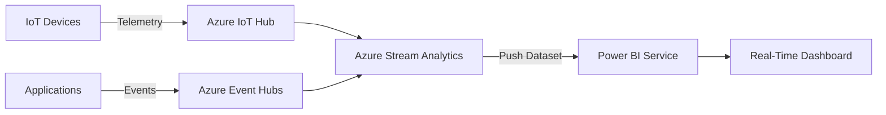

# How to Build Real-Time Power BI Dashboards with Azure Stream Analytics

Author: [nawazdhandala](https://www.github.com/nawazdhandala)

Tags: Power BI, Azure Stream Analytics, Real-Time, Dashboards, Streaming, IoT, Azure

Description: Build real-time Power BI dashboards powered by Azure Stream Analytics to visualize streaming data from IoT devices, applications, and event sources.

---

Standard Power BI reports refresh on a schedule - hourly, daily, or somewhere in between. But some scenarios demand live data. Manufacturing floor monitoring, live website analytics, IoT sensor dashboards, and financial trading all need data that updates in seconds, not hours. Azure Stream Analytics processes streaming data in real time and can push results directly to Power BI, where they show up on dashboards within seconds.

This guide covers the full pipeline from streaming data source to real-time Power BI dashboard.

## Architecture



## Understanding Power BI Streaming Datasets

Power BI has three types of datasets for real-time scenarios:

1. **Push dataset**: Data is pushed to Power BI via API or Stream Analytics. Supports full Power BI visuals. Data is stored and available for historical reporting.
2. **Streaming dataset**: Data is pushed but not stored. Only a few visual types are available. Good for pure live monitoring.
3. **PubNub streaming dataset**: Data comes from a PubNub stream. Very specific use case.

Azure Stream Analytics creates a push dataset in Power BI. This is the best option because you get both real-time updates and historical data.

## Step 1: Set Up the Streaming Data Source

You need a source of streaming data. The most common options are Azure Event Hubs and Azure IoT Hub.

### Option A: Azure Event Hubs

If your data comes from applications, use Event Hubs. Create a namespace and event hub as described in Event Hubs documentation, then send events from your application.

### Option B: Azure IoT Hub

If your data comes from IoT devices, use IoT Hub. It adds device management, per-device authentication, and device-to-cloud messaging on top of the event streaming capability.

For this guide, we will use Event Hubs with simulated temperature sensor data.

### Simulated Data Generator

Here is a quick Node.js script to generate test data:

```javascript
// Simulated temperature sensor data generator
// Sends events to Azure Event Hubs every second
const { EventHubProducerClient } = require("@azure/event-hubs");

const connectionString = "YOUR_EVENT_HUB_CONNECTION_STRING";
const eventHubName = "sensor-data";

async function main() {
    const producer = new EventHubProducerClient(connectionString, eventHubName);

    // Send events every second
    setInterval(async () => {
        const batch = await producer.createBatch();

        // Generate readings for 5 sensors
        for (let sensorId = 1; sensorId <= 5; sensorId++) {
            const event = {
                body: {
                    sensorId: `sensor-${sensorId}`,
                    temperature: 20 + Math.random() * 15,
                    humidity: 40 + Math.random() * 30,
                    timestamp: new Date().toISOString(),
                    location: sensorId <= 3 ? "BuildingA" : "BuildingB"
                }
            };
            batch.tryAdd(event);
        }

        await producer.sendBatch(batch);
        console.log(`Sent ${batch.count} events`);
    }, 1000);
}

main().catch(console.error);
```

## Step 2: Create the Stream Analytics Job

### Create the Job

1. In the Azure portal, search for "Stream Analytics jobs" and click Create.
2. Enter a name, select your resource group, and set the location.
3. Choose Cloud hosting (unless you need edge processing).
4. Set streaming units to 3 (the minimum for production - adjust based on throughput).
5. Click Create.

### Configure the Input

1. Go to the job > Inputs > Add stream input > Event Hub.
2. Name it `sensor-input`.
3. Select your Event Hub namespace and event hub.
4. Use the Listen policy.
5. Set serialization to JSON, UTF-8.

### Configure the Power BI Output

1. Go to Outputs > Add > Power BI.
2. Authorize with your Power BI account.
3. Configure:
   - Output alias: `powerbi-output`
   - Group workspace: Select your Power BI workspace
   - Dataset name: `SensorDashboard`
   - Table name: `SensorReadings`
   - Authentication mode: User token (or Managed Identity for production)

### Write the Stream Analytics Query

```sql
-- Aggregate sensor readings in 10-second windows
-- This reduces the data volume pushed to Power BI
-- while still providing near-real-time updates
SELECT
    sensorId,
    location,
    AVG(temperature) AS avgTemperature,
    MAX(temperature) AS maxTemperature,
    MIN(temperature) AS minTemperature,
    AVG(humidity) AS avgHumidity,
    COUNT(*) AS readingCount,
    System.Timestamp() AS windowEnd
INTO
    [powerbi-output]
FROM
    [sensor-input]
GROUP BY
    sensorId,
    location,
    TumblingWindow(second, 10)
```

This query aggregates readings into 10-second windows. Each window produces one row per sensor in Power BI. You get near-real-time updates without flooding Power BI with raw events.

### Additional Useful Queries

Detect temperature anomalies:

```sql
-- Alert when temperature exceeds a threshold
-- Output to a separate Power BI dataset for alerts
SELECT
    sensorId,
    location,
    temperature,
    System.Timestamp() AS alertTime,
    'HighTemperature' AS alertType
INTO
    [powerbi-alerts]
FROM
    [sensor-input]
WHERE
    temperature > 30
```

Calculate running averages:

```sql
-- Sliding window average over the last 5 minutes
-- Provides a smoother trend line in Power BI
SELECT
    sensorId,
    AVG(temperature) AS rollingAvgTemp,
    System.Timestamp() AS windowEnd
INTO
    [powerbi-trends]
FROM
    [sensor-input]
GROUP BY
    sensorId,
    SlidingWindow(minute, 5)
```

## Step 3: Start the Stream Analytics Job

1. Go to the job Overview page.
2. Click Start.
3. Choose "Now" for the output start time.
4. Click Start.

The job takes a minute or two to start. Once running, it continuously processes events from Event Hubs and pushes results to Power BI.

## Step 4: Build the Power BI Dashboard

### Find the Streaming Dataset

1. Go to Power BI service (app.powerbi.com).
2. Navigate to your workspace.
3. Look for the dataset named "SensorDashboard" (it was created automatically by Stream Analytics).

### Create a Report

1. Click on the dataset to create a report.
2. Add visuals:

**Line Chart - Temperature Trend**
- X-axis: windowEnd
- Y-axis: avgTemperature
- Legend: sensorId

**Card - Current Average Temperature**
- Value: avgTemperature (average)

**Bar Chart - Readings by Location**
- X-axis: location
- Y-axis: readingCount (sum)

**Table - Latest Readings**
- Columns: sensorId, avgTemperature, maxTemperature, avgHumidity, windowEnd

3. Save the report.

### Pin Visuals to a Dashboard

Dashboards in Power BI support auto-refresh for streaming datasets:

1. Hover over a visual in the report and click the pin icon.
2. Select "New dashboard" and name it "Real-Time Sensor Monitoring".
3. Pin each visual to the same dashboard.
4. Open the dashboard.

The tiles on the dashboard will auto-refresh as new data arrives from Stream Analytics. The refresh interval depends on the data volume and your Power BI license tier.

### Add Streaming Tiles Directly

For the fastest updates, add streaming tiles directly to the dashboard:

1. On the dashboard, click Edit > Add a tile.
2. Select "Custom Streaming Data".
3. Choose the SensorDashboard dataset.
4. Configure the visual (line chart, gauge, card, etc.).
5. Set the time window for display (e.g., last 10 minutes).

Streaming tiles update faster than pinned report visuals because they connect directly to the push dataset.

## Step 5: Handle Late-Arriving Data

Real-world streaming data arrives out of order. A sensor might send a reading at 10:00:00, but network latency delivers it at 10:00:05. Stream Analytics handles this with late arrival and out-of-order policies.

Configure these in the Event ordering section of the job:

- **Out-of-order events**: Set a tolerance window (e.g., 5 seconds). Events within this window are reordered.
- **Late-arriving events**: Set a tolerance window (e.g., 10 seconds). Events arriving later than this are dropped or adjusted.

For Power BI dashboards, dropping very late events is usually acceptable since the dashboard shows the current state, not perfect historical records.

## Step 6: Scale and Optimize

### Streaming Units

Stream Analytics performance scales with streaming units (SUs). Monitor the SU utilization metric:

- Below 80%: Your job has headroom.
- Above 80%: Consider adding more SUs.
- At 100%: Events are being delayed or dropped.

### Reduce Power BI Push Volume

Power BI push datasets have rate limits:

- 1 million rows per hour per dataset.
- 5 API calls per second per dataset.
- 200,000 rows per API call.

If you exceed these limits, data loss occurs. Strategies to stay within limits:

- Increase the tumbling window size (e.g., 30 seconds instead of 10).
- Aggregate more aggressively (fewer output columns).
- Filter out low-priority events before the output.

### Use Managed Identity

For production, use Managed Identity instead of user token for the Power BI output:

1. Enable system-assigned managed identity on the Stream Analytics job.
2. In Power BI, add the managed identity as a member of the workspace.
3. Update the output configuration to use Managed Identity.

This avoids token expiration issues that can break the pipeline.

## Monitoring

### Stream Analytics Metrics

Monitor these in Azure Monitor:

- **Input Events**: Events received from Event Hubs.
- **Output Events**: Events sent to Power BI.
- **Runtime Errors**: Query or output errors.
- **Watermark Delay**: How far behind the job is processing.

### Alerts

Set up alerts for:

- Watermark delay exceeding your latency requirement.
- Runtime errors exceeding zero.
- SU utilization exceeding 80%.

## Wrapping Up

Azure Stream Analytics and Power BI together provide a straightforward path to real-time dashboards. Stream Analytics handles the continuous query processing over event streams, aggregating and filtering data before pushing it to Power BI. The key decisions are choosing the right window size for your aggregation (balancing freshness against volume), designing queries that stay within Power BI's push rate limits, and using the right visual types on the dashboard. For production deployments, use Managed Identity authentication, monitor SU utilization, and set up alerts for watermark delay and errors.
