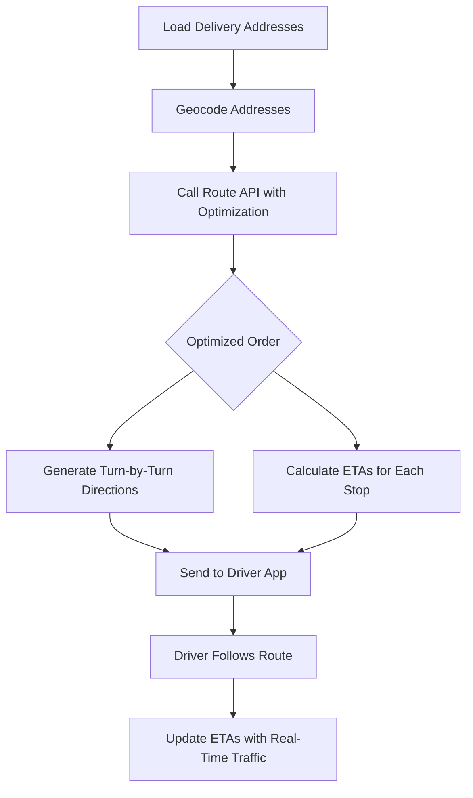

# How to Calculate Multi-Stop Delivery Routes Using Azure Maps Route API

Author: [nawazdhandala](https://www.github.com/nawazdhandala)

Tags: Azure Maps, Route API, Delivery Routing, Route Optimization, Logistics, Geospatial, Fleet Management

Description: Learn how to calculate optimized multi-stop delivery routes using the Azure Maps Route API with waypoint optimization and traffic-aware routing.

---

Delivery route planning is one of those problems that sounds simple but gets complicated fast. You have a warehouse, a list of delivery addresses, and a fleet of drivers. You need to figure out the best order to visit the stops and the fastest roads to take between them. The Azure Maps Route API handles this with features for multi-stop routing, waypoint optimization, traffic-aware travel times, and route constraints like vehicle dimensions and hazardous materials.

This guide shows you how to use the Route API to calculate delivery routes, optimize stop order, and handle real-world constraints.

## The Routing Problem

Consider a delivery scenario: a driver starts at a distribution center, needs to deliver packages to 8 locations across a city, and return to the center. Without optimization, you might route the stops in the order they appear in the delivery manifest. With optimization, the API reorders the stops to minimize total travel time or distance.

The difference can be dramatic. On a typical urban route with 10 stops, optimized ordering can save 30-40% of driving time compared to the naive order.

## Getting a Route Between Two Points

Let us start with the basics - routing from point A to point B.

```python
# simple_route.py - Get a route between two points
import requests

AZURE_MAPS_KEY = "your-subscription-key"

def get_route(origin: tuple, destination: tuple) -> dict:
    """Calculate a route between two coordinate pairs.

    Args:
        origin: (latitude, longitude) tuple
        destination: (latitude, longitude) tuple
    """
    url = "https://atlas.microsoft.com/route/directions/json"

    params = {
        "api-version": "1.0",
        "subscription-key": AZURE_MAPS_KEY,
        "query": f"{origin[0]},{origin[1]}:{destination[0]},{destination[1]}",
        "travelMode": "car",
        "traffic": "true",  # Use real-time traffic data
        "routeType": "fastest"  # Options: fastest, shortest, eco, thrilling
    }

    response = requests.get(url, params=params)
    response.raise_for_status()
    data = response.json()

    route = data["routes"][0]
    summary = route["summary"]

    return {
        "distanceKm": summary["lengthInMeters"] / 1000,
        "durationMinutes": summary["travelTimeInSeconds"] / 60,
        "trafficDelayMinutes": summary.get("trafficDelayInSeconds", 0) / 60,
        "departureTime": summary.get("departureTime", ""),
        "arrivalTime": summary.get("arrivalTime", ""),
        "legs": route["legs"]
    }

# Seattle distribution center to first delivery stop
route = get_route(
    origin=(47.6062, -122.3321),
    destination=(47.6553, -122.3035)
)

print(f"Distance: {route['distanceKm']:.1f} km")
print(f"Duration: {route['durationMinutes']:.0f} minutes")
print(f"Traffic delay: {route['trafficDelayMinutes']:.0f} minutes")
```

## Multi-Stop Routing

For delivery routes with multiple stops, pass all waypoints in the query string separated by colons.

```python
# multi_stop_route.py - Route through multiple delivery stops
import requests

AZURE_MAPS_KEY = "your-subscription-key"

def get_multi_stop_route(waypoints: list, optimize: bool = False) -> dict:
    """Calculate a route through multiple waypoints.

    Args:
        waypoints: List of (latitude, longitude) tuples
        optimize: If True, reorder waypoints for minimum travel time
    """
    # Build the query string with all waypoints
    query = ":".join([f"{wp[0]},{wp[1]}" for wp in waypoints])

    url = "https://atlas.microsoft.com/route/directions/json"
    params = {
        "api-version": "1.0",
        "subscription-key": AZURE_MAPS_KEY,
        "query": query,
        "travelMode": "car",
        "traffic": "true",
        "routeType": "fastest",
        "computeBestOrder": str(optimize).lower()  # Optimize waypoint order
    }

    response = requests.get(url, params=params)
    response.raise_for_status()
    data = response.json()

    route = data["routes"][0]
    summary = route["summary"]

    result = {
        "totalDistanceKm": summary["lengthInMeters"] / 1000,
        "totalDurationMinutes": summary["travelTimeInSeconds"] / 60,
        "trafficDelayMinutes": summary.get("trafficDelayInSeconds", 0) / 60,
        "legs": []
    }

    # Parse each leg of the route
    for i, leg in enumerate(route["legs"]):
        leg_summary = leg["summary"]
        result["legs"].append({
            "legIndex": i,
            "distanceKm": leg_summary["lengthInMeters"] / 1000,
            "durationMinutes": leg_summary["travelTimeInSeconds"] / 60,
            "departureTime": leg_summary.get("departureTime", ""),
            "arrivalTime": leg_summary.get("arrivalTime", "")
        })

    # If optimization was used, get the optimized order
    if optimize and "optimizedWaypoints" in data["routes"][0]:
        result["optimizedOrder"] = [
            wp["optimizedIndex"]
            for wp in data["routes"][0]["optimizedWaypoints"]
        ]

    return result

# Define delivery stops
# Start: Distribution Center, End: Distribution Center (round trip)
distribution_center = (47.6062, -122.3321)

delivery_stops = [
    (47.6553, -122.3035),  # Stop 1: University District
    (47.6205, -122.3493),  # Stop 2: Queen Anne
    (47.6015, -122.3345),  # Stop 3: Pioneer Square
    (47.6253, -122.3222),  # Stop 4: Capitol Hill
    (47.6456, -122.3344),  # Stop 5: Wallingford
    (47.5810, -122.3355),  # Stop 6: SODO
    (47.6680, -122.3840),  # Stop 7: Ballard
    (47.6130, -122.3170),  # Stop 8: Central District
]

# Build the full route: start -> stops -> back to start
all_waypoints = [distribution_center] + delivery_stops + [distribution_center]

# Calculate without optimization
print("--- Without Optimization ---")
unoptimized = get_multi_stop_route(all_waypoints, optimize=False)
print(f"Total distance: {unoptimized['totalDistanceKm']:.1f} km")
print(f"Total duration: {unoptimized['totalDurationMinutes']:.0f} minutes")

# Calculate with optimization
print("\n--- With Optimization ---")
optimized = get_multi_stop_route(all_waypoints, optimize=True)
print(f"Total distance: {optimized['totalDistanceKm']:.1f} km")
print(f"Total duration: {optimized['totalDurationMinutes']:.0f} minutes")

if 'optimizedOrder' in optimized:
    print(f"Optimized stop order: {optimized['optimizedOrder']}")

# Calculate savings
savings = unoptimized['totalDurationMinutes'] - optimized['totalDurationMinutes']
print(f"\nTime saved with optimization: {savings:.0f} minutes")
```

## Handling Vehicle Constraints

Real delivery vehicles have constraints - weight limits, height restrictions, and some carry hazardous materials. The Route API supports these constraints.

```python
def get_truck_route(waypoints: list, vehicle_params: dict) -> dict:
    """Calculate a truck route with vehicle constraints."""
    query = ":".join([f"{wp[0]},{wp[1]}" for wp in waypoints])

    url = "https://atlas.microsoft.com/route/directions/json"
    params = {
        "api-version": "1.0",
        "subscription-key": AZURE_MAPS_KEY,
        "query": query,
        "travelMode": "truck",  # Use truck routing instead of car
        "traffic": "true",
        "vehicleWidth": vehicle_params.get("widthMeters", 2.5),
        "vehicleHeight": vehicle_params.get("heightMeters", 3.5),
        "vehicleLength": vehicle_params.get("lengthMeters", 12.0),
        "vehicleWeight": vehicle_params.get("weightKg", 20000),
        "vehicleAxleWeight": vehicle_params.get("axleWeightKg", 10000),
        "vehicleLoadType": vehicle_params.get("loadType", "otherHazmatGeneral")
    }

    response = requests.get(url, params=params)
    response.raise_for_status()
    return response.json()

# Route a large delivery truck with height and weight restrictions
truck_route = get_truck_route(
    waypoints=[
        (47.6062, -122.3321),
        (47.6553, -122.3035),
        (47.6062, -122.3321)
    ],
    vehicle_params={
        "widthMeters": 2.55,
        "heightMeters": 4.1,
        "lengthMeters": 16.5,
        "weightKg": 36000,
        "axleWeightKg": 11500
    }
)
```

Truck routing avoids roads with low bridges, weight-restricted bridges, and narrow streets that a car could navigate but a truck cannot.

## Time Windows and Departure Time

For delivery planning, you often need to calculate routes for a specific departure time. Traffic conditions vary dramatically throughout the day.

```python
# Calculate a route with a specific departure time
from datetime import datetime, timedelta

def get_timed_route(waypoints: list, departure_time: datetime) -> dict:
    """Calculate a route for a specific departure time."""
    query = ":".join([f"{wp[0]},{wp[1]}" for wp in waypoints])

    params = {
        "api-version": "1.0",
        "subscription-key": AZURE_MAPS_KEY,
        "query": query,
        "travelMode": "car",
        "traffic": "true",
        "departAt": departure_time.strftime("%Y-%m-%dT%H:%M:%S"),
        "computeBestOrder": "true"
    }

    response = requests.get(
        "https://atlas.microsoft.com/route/directions/json",
        params=params
    )
    response.raise_for_status()
    return response.json()

# Compare morning rush hour vs. midday routes
morning_route = get_timed_route(
    all_waypoints,
    datetime(2026, 2, 16, 8, 0, 0)  # 8:00 AM
)

midday_route = get_timed_route(
    all_waypoints,
    datetime(2026, 2, 16, 11, 0, 0)  # 11:00 AM
)
```

## Extracting Turn-by-Turn Directions

For driver guidance, extract the detailed instructions from the route response.

```python
def get_directions(route_response: dict) -> list:
    """Extract turn-by-turn directions from a route response."""
    directions = []
    route = route_response["routes"][0]

    for leg_index, leg in enumerate(route["legs"]):
        for step in leg.get("guidance", {}).get("instructions", []):
            directions.append({
                "leg": leg_index,
                "instruction": step.get("message", ""),
                "distanceMeters": step.get("routeOffsetInMeters", 0),
                "maneuver": step.get("maneuver", ""),
                "street": step.get("street", "")
            })

    return directions
```

## Route Visualization

Here is how the multi-stop route flow looks from planning to execution.



## Route Matrix for Fleet Planning

When you have multiple drivers and need to assign stops efficiently, the Route Matrix API calculates travel times between all pairs of origins and destinations.

```python
def get_route_matrix(origins: list, destinations: list) -> list:
    """Calculate travel time between all origin-destination pairs."""
    url = "https://atlas.microsoft.com/route/matrix/json"

    # Build the request body
    body = {
        "origins": {
            "type": "MultiPoint",
            "coordinates": [[lon, lat] for lat, lon in origins]
        },
        "destinations": {
            "type": "MultiPoint",
            "coordinates": [[lon, lat] for lat, lon in destinations]
        }
    }

    params = {
        "api-version": "1.0",
        "subscription-key": AZURE_MAPS_KEY,
        "travelMode": "car"
    }

    response = requests.post(url, params=params, json=body)
    response.raise_for_status()
    data = response.json()

    # Parse the matrix
    matrix = []
    for row in data["matrix"]:
        matrix_row = []
        for cell in row:
            if cell["statusCode"] == 200:
                matrix_row.append({
                    "durationMinutes": cell["response"]["routeSummary"]["travelTimeInSeconds"] / 60,
                    "distanceKm": cell["response"]["routeSummary"]["lengthInMeters"] / 1000
                })
            else:
                matrix_row.append(None)
        matrix.append(matrix_row)

    return matrix

# Calculate travel times from 3 warehouses to 5 delivery zones
warehouses = [
    (47.6062, -122.3321),
    (47.5510, -122.3200),
    (47.6680, -122.3840)
]

delivery_zones = [
    (47.6205, -122.3493),
    (47.6553, -122.3035),
    (47.6015, -122.3345),
    (47.6253, -122.3222),
    (47.5810, -122.3355)
]

matrix = get_route_matrix(warehouses, delivery_zones)

# Find the closest warehouse for each delivery zone
for j, zone in enumerate(delivery_zones):
    min_time = float('inf')
    best_warehouse = None
    for i in range(len(warehouses)):
        if matrix[i][j] and matrix[i][j]['durationMinutes'] < min_time:
            min_time = matrix[i][j]['durationMinutes']
            best_warehouse = i
    print(f"Delivery zone {j+1}: best warehouse = {best_warehouse+1} ({min_time:.0f} min)")
```

## Cost and Rate Limit Considerations

The Route API pricing depends on the operation type:

- Simple routes (up to 5 waypoints): 1 transaction each
- Routes with more than 5 waypoints: charged per waypoint
- Route matrix: charged per cell in the matrix
- Waypoint optimization adds additional cost

For high-volume applications, cache frequently requested routes and use the route matrix for batch planning instead of individual route calculations.

## Wrapping Up

The Azure Maps Route API handles everything from simple point-to-point navigation to complex multi-vehicle fleet optimization. The key features for delivery routing are waypoint optimization (which reorders stops for efficiency), traffic-aware timing (which accounts for real-world conditions), and vehicle constraints (which ensure routes are actually drivable by your fleet). Start with basic multi-stop routing, measure the time savings from optimization, and layer in traffic timing and vehicle constraints as your delivery operation grows in complexity.
