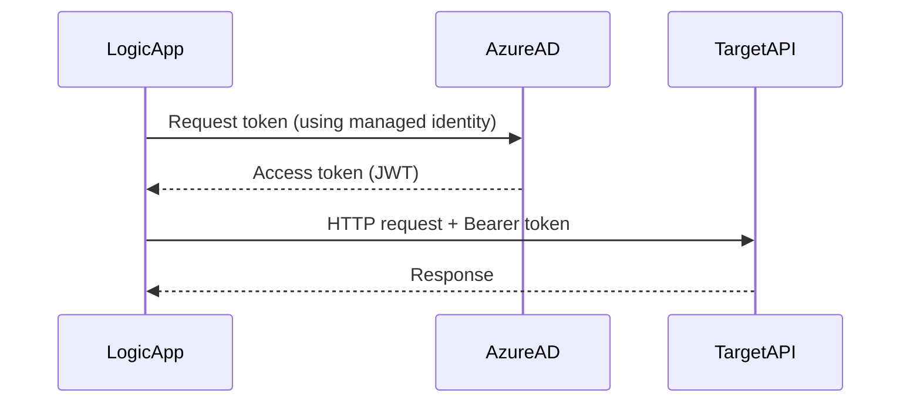

# How to Call REST APIs from Azure Logic Apps with Managed Identity

Author: [nawazdhandala](https://www.github.com/nawazdhandala)

Tags: Azure, Logic Apps, Managed Identity, REST API, Authentication, Azure AD, Security

Description: Use Azure Managed Identity in Logic Apps to securely call REST APIs protected by Azure AD without managing credentials or secrets.

---

Storing API keys and secrets in your Logic Apps workflow is a security risk. Keys get leaked in source control, expire without notice, and create rotation headaches. Azure Managed Identity solves this by giving your Logic App an identity in Azure Active Directory that can authenticate to other services without any credentials in your code or configuration. The Azure platform handles token acquisition and renewal automatically.

## How Managed Identity Works with Logic Apps

When you enable Managed Identity on a Logic App, Azure creates a service principal in Azure AD tied to that resource. When your workflow needs to call an API protected by Azure AD, the Logic App requests an access token from Azure AD using its managed identity. Azure AD issues a token, and the Logic App includes it in the Authorization header of the API call. No secrets, no keys, no rotation needed.



## Enabling Managed Identity

Logic Apps supports both system-assigned and user-assigned managed identities.

**System-assigned**: Created automatically with the Logic App, tied to its lifecycle. When you delete the Logic App, the identity is deleted too.

**User-assigned**: A standalone Azure resource that you create and assign to one or more Logic Apps. Useful when multiple Logic Apps need the same identity.

```bash
# Enable system-assigned managed identity on a Logic App Standard
az logicapp identity assign \
  --name logic-order-workflows \
  --resource-group rg-workflows

# Get the principal ID (you will need this for role assignments)
PRINCIPAL_ID=$(az logicapp identity show \
  --name logic-order-workflows \
  --resource-group rg-workflows \
  --query "principalId" \
  --output tsv)

echo "Principal ID: $PRINCIPAL_ID"
```

For user-assigned identity:

```bash
# Create a user-assigned managed identity
az identity create \
  --name id-logic-workflows \
  --resource-group rg-workflows \
  --location eastus2

# Get the identity resource ID
IDENTITY_ID=$(az identity show \
  --name id-logic-workflows \
  --resource-group rg-workflows \
  --query "id" \
  --output tsv)

# Assign it to the Logic App
az logicapp identity assign \
  --name logic-order-workflows \
  --resource-group rg-workflows \
  --identities "$IDENTITY_ID"
```

## Calling Azure Resource Manager APIs

The simplest use case is calling Azure management APIs. Grant the Logic App's identity the appropriate RBAC role on the target resource, then call the ARM API with managed identity authentication.

```bash
# Grant the Logic App's identity Reader access on a resource group
az role assignment create \
  --assignee "$PRINCIPAL_ID" \
  --role "Reader" \
  --scope "/subscriptions/{sub-id}/resourceGroups/rg-production"
```

Now use the HTTP action with managed identity authentication in your workflow.

```json
{
  "List_Virtual_Machines": {
    "type": "Http",
    "inputs": {
      "method": "GET",
      "uri": "https://management.azure.com/subscriptions/{sub-id}/resourceGroups/rg-production/providers/Microsoft.Compute/virtualMachines?api-version=2023-09-01",
      "authentication": {
        "type": "ManagedServiceIdentity",
        "audience": "https://management.azure.com/"
      }
    },
    "runAfter": {}
  }
}
```

The `authentication` block tells Logic Apps to acquire a token for the specified audience using its managed identity. The audience must match the Azure AD application that protects the target API.

## Calling Your Own APIs Protected by Azure AD

If you have a custom API (running on App Service, AKS, or elsewhere) that is protected by Azure AD, you can call it with managed identity too.

First, register your API in Azure AD (if not already) and note the Application ID URI.

```bash
# Register your API application in Azure AD
APP_ID=$(az ad app create \
  --display-name "My Order API" \
  --identifier-uris "api://my-order-api" \
  --query "appId" \
  --output tsv)

# Create a service principal for the app
az ad sp create --id "$APP_ID"
```

Grant the Logic App's managed identity permission to call the API.

```bash
# Assign a role or API permission to the Logic App's identity
# Option 1: App role assignment
az ad app permission grant \
  --id "$PRINCIPAL_ID" \
  --api "$APP_ID" \
  --scope "Orders.ReadWrite"
```

Now call the API from your workflow.

```json
{
  "Get_Orders": {
    "type": "Http",
    "inputs": {
      "method": "GET",
      "uri": "https://api.myapp.com/v1/orders",
      "authentication": {
        "type": "ManagedServiceIdentity",
        "audience": "api://my-order-api"
      }
    },
    "runAfter": {}
  }
}
```

## Calling Azure Services Directly

Many Azure services accept Azure AD tokens. Here are common examples.

### Azure Key Vault

```json
{
  "Get_Secret": {
    "type": "Http",
    "inputs": {
      "method": "GET",
      "uri": "https://kv-myapp.vault.azure.net/secrets/api-key?api-version=7.4",
      "authentication": {
        "type": "ManagedServiceIdentity",
        "audience": "https://vault.azure.net"
      }
    },
    "runAfter": {}
  }
}
```

Grant the identity access first.

```bash
# Grant the Logic App Key Vault Secrets User role
az role assignment create \
  --assignee "$PRINCIPAL_ID" \
  --role "Key Vault Secrets User" \
  --scope "/subscriptions/{sub-id}/resourceGroups/rg-app/providers/Microsoft.KeyVault/vaults/kv-myapp"
```

### Azure Storage

```json
{
  "List_Blobs": {
    "type": "Http",
    "inputs": {
      "method": "GET",
      "uri": "https://stmyapp.blob.core.windows.net/documents?restype=container&comp=list",
      "headers": {
        "x-ms-version": "2021-08-06"
      },
      "authentication": {
        "type": "ManagedServiceIdentity",
        "audience": "https://storage.azure.com/"
      }
    },
    "runAfter": {}
  }
}
```

### Microsoft Graph API

```json
{
  "Get_User_Profile": {
    "type": "Http",
    "inputs": {
      "method": "GET",
      "uri": "https://graph.microsoft.com/v1.0/users/@{body('Parse_Input')?['userEmail']}",
      "authentication": {
        "type": "ManagedServiceIdentity",
        "audience": "https://graph.microsoft.com"
      }
    },
    "runAfter": {}
  }
}
```

For Graph API calls, you need to grant the managed identity the appropriate Graph API permissions (User.Read.All, Mail.Send, etc.) through Azure AD admin consent.

## Using User-Assigned Identity

When you have multiple managed identities (both system-assigned and user-assigned), specify which one to use in the authentication block.

```json
{
  "Call_API_With_Specific_Identity": {
    "type": "Http",
    "inputs": {
      "method": "GET",
      "uri": "https://api.example.com/data",
      "authentication": {
        "type": "ManagedServiceIdentity",
        "identity": "/subscriptions/{sub-id}/resourceGroups/rg-workflows/providers/Microsoft.ManagedIdentity/userAssignedIdentities/id-logic-workflows",
        "audience": "api://my-api"
      }
    },
    "runAfter": {}
  }
}
```

## Bicep Template for the Full Setup

Here is a Bicep template that creates a Logic App with managed identity and the necessary role assignments.

```bicep
// Bicep: Logic App with managed identity and role assignments
param location string = resourceGroup().location

// Logic App with system-assigned managed identity
resource logicApp 'Microsoft.Web/sites@2023-01-01' = {
  name: 'logic-order-workflows'
  location: location
  kind: 'functionapp,workflowapp'
  identity: {
    type: 'SystemAssigned'
  }
  properties: {
    // ... other properties
  }
}

// Key Vault for secrets
resource keyVault 'Microsoft.KeyVault/vaults@2023-07-01' existing = {
  name: 'kv-myapp'
}

// Grant the Logic App access to Key Vault secrets
resource kvRoleAssignment 'Microsoft.Authorization/roleAssignments@2022-04-01' = {
  name: guid(keyVault.id, logicApp.id, 'Key Vault Secrets User')
  scope: keyVault
  properties: {
    roleDefinitionId: subscriptionResourceId(
      'Microsoft.Authorization/roleDefinitions',
      '4633458b-17de-408a-b874-0445c86b69e6' // Key Vault Secrets User
    )
    principalId: logicApp.identity.principalId
    principalType: 'ServicePrincipal'
  }
}
```

## Troubleshooting

If you get a 401 or 403 error when using managed identity, check these things.

Verify the identity is enabled: `az logicapp identity show --name logic-order-workflows --resource-group rg-workflows`.

Verify the role assignment exists: `az role assignment list --assignee "$PRINCIPAL_ID" --output table`.

Check the audience value. It must exactly match the application ID URI or the resource URI of the target service. A common mistake is using the wrong audience.

Role assignments can take up to 5 minutes to propagate. If you just created the assignment, wait a few minutes and retry.

For Graph API permissions, make sure an Azure AD admin has granted consent for the application permissions.

## Summary

Managed Identity is the recommended way to authenticate Logic Apps to Azure services and custom APIs. It eliminates credentials from your workflows, handles token lifecycle automatically, and integrates with Azure RBAC for fine-grained access control. Enable it on your Logic App, grant the identity the appropriate roles on target resources, and use the `ManagedServiceIdentity` authentication type in your HTTP actions. No more secrets to manage, rotate, or accidentally expose.
