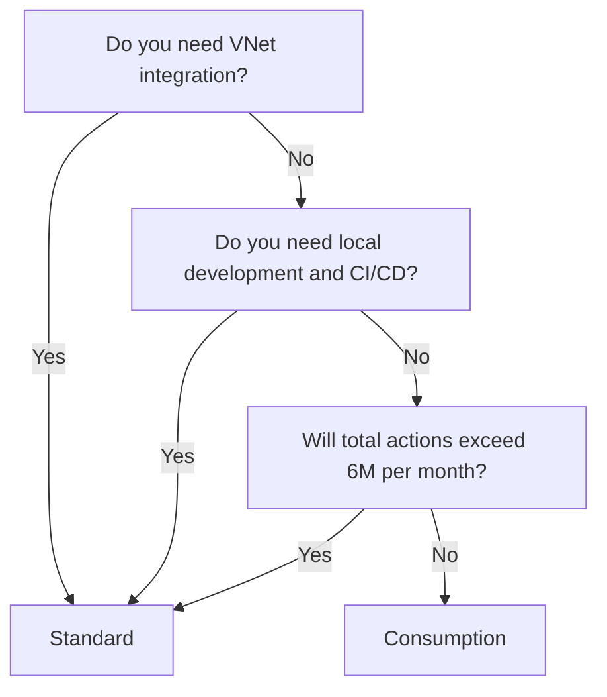

# How to Choose Between Azure Logic Apps Standard and Consumption Pricing Plans

Author: [nawazdhandala](https://www.github.com/nawazdhandala)

Tags: Azure, Logic Apps, Pricing, Standard, Consumption, Serverless, Cost Optimization

Description: A detailed comparison of Azure Logic Apps Standard and Consumption plans to help you pick the right hosting model for your integration workflows.

---

Azure Logic Apps offers two hosting plans with fundamentally different pricing models, performance characteristics, and capabilities. Picking the wrong one can mean either paying too much for simple workflows or hitting limitations with complex enterprise integrations. In this post, I will break down both plans across the dimensions that actually matter when you are making the decision for your team.

## The Two Hosting Models

### Consumption (Multi-Tenant)

The Consumption plan is the original Logic Apps model. Each Logic App is a single workflow that runs in Microsoft's shared multi-tenant infrastructure. You pay per action execution - every trigger check, every action that fires, and every connector call counts toward your bill.

### Standard (Single-Tenant)

The Standard plan runs on the Azure App Service platform (specifically the Azure Functions runtime). A single Standard Logic App resource can contain multiple workflows. You pay for a dedicated compute plan (similar to an App Service plan) rather than per-execution pricing.

## Side-by-Side Comparison

| Feature | Consumption | Standard |
|---|---|---|
| Pricing model | Pay-per-execution | App Service plan (fixed compute) |
| Workflows per resource | 1 | Multiple |
| Designer | Azure portal only | Azure portal + VS Code |
| Local development | No | Yes (VS Code with extension) |
| Source control | ARM template export | Native file-based project |
| VNet integration | Limited (ISE retired) | Full VNet integration |
| Built-in connectors | Shared pricing | Run locally, no per-call cost |
| Managed connectors | Per-call pricing | Per-call pricing |
| Stateful and stateless | Stateful only | Both stateful and stateless |
| Minimum cost | $0 (pay only for what you use) | Starts at ~$150/month (WS1 plan) |
| Scale model | Automatic, managed by Azure | Scale out based on plan size |
| SLA | 99.9% | 99.95% |
| Run history | Azure-managed | Stored in associated storage account |
| Custom code | Limited (inline code action) | Azure Functions extension, custom .NET code |

## When Consumption Makes More Sense

### Low-Volume, Sporadic Workflows

If your workflow runs a few times a day or even a few times an hour, the Consumption plan's per-execution pricing is hard to beat. At $0.000025 per action execution for standard connectors and $0.000125 per enterprise connector call, a workflow that runs 100 times a day with 10 actions each costs roughly $0.75 per month.

### Quick Prototypes and Simple Integrations

If you need to wire up a quick integration - say, posting a Teams message when a new row appears in a SharePoint list - the Consumption plan lets you build and deploy in the portal without any tooling setup. There is no App Service plan to manage, no storage account to worry about, and no deployment pipeline to configure.

### Many Independent, Low-Traffic Workflows

If you have 50 different small workflows that each run infrequently, the Consumption plan makes financial sense. Each one costs pennies per month. Putting all of them on a Standard plan would mean paying $150+ per month even if total execution volume is tiny.

### Budget Predictability at Small Scale

For small-scale usage, the Consumption plan's cost is directly proportional to usage. If usage drops to zero, cost drops to zero. There is no baseline cost to worry about.

## When Standard Makes More Sense

### High-Volume Workflows

If your workflows execute thousands of times per day, the per-execution cost of the Consumption plan adds up. A workflow that fires 10,000 times per day with 15 actions each costs about $112 per month on Consumption. A Standard WS1 plan at $150 per month handles that volume and much more, and it can host multiple workflows.

Here is a rough break-even calculation:

```
Consumption cost per action: $0.000025 (standard connector)
Standard WS1 monthly cost: ~$150

Break-even point:
$150 / $0.000025 = 6,000,000 actions per month
That is roughly 200,000 actions per day
Or about 13,000 workflow runs per day at 15 actions each
```

If your total action count across all workflows exceeds roughly 6 million per month, Standard starts winning on cost.

### VNet Integration Requirements

If your workflows need to reach resources inside a virtual network (private endpoints for storage, databases behind a firewall, etc.), the Standard plan is your only option now that the Integration Service Environment (ISE) has been retired. Standard Logic Apps support full VNet integration through the App Service plan.

### Enterprise Development Practices

The Standard plan is built for professional development workflows:

- **VS Code development**: Write and test workflows locally before deploying
- **Git-based source control**: Workflows are stored as JSON files in a project structure that maps naturally to a Git repository
- **CI/CD pipelines**: Deploy using Azure DevOps, GitHub Actions, or any CI/CD tool that supports App Service deployments
- **Environment-specific configuration**: Use app settings for connection strings and parameters that vary between dev, staging, and production

### Stateless Workflows

Standard supports stateless workflows, which do not persist run history and execute faster because there is no storage I/O for state tracking. These are ideal for high-throughput, request-response patterns where you do not need to debug past runs.

### Custom Code Requirements

If your integration logic requires custom .NET code beyond what the inline code action supports, Standard lets you call Azure Functions extensions directly and run more complex code within the workflow.

## Cost Comparison Scenarios

Let me walk through three realistic scenarios.

### Scenario 1: Small Business with 5 Simple Workflows

- 5 workflows, each running about 20 times per day
- Average of 8 actions per workflow run
- All standard connectors

**Consumption cost:**
- Daily actions: 5 workflows x 20 runs x 8 actions = 800 actions
- Monthly actions: 800 x 30 = 24,000
- Monthly cost: 24,000 x $0.000025 = $0.60

**Standard cost:**
- Minimum WS1 plan: ~$150/month

**Winner: Consumption** - by a huge margin at this scale.

### Scenario 2: Mid-Size Company with Integration Platform

- 30 workflows of varying complexity
- Total of about 50,000 runs per day
- Mix of standard and enterprise connectors
- Need VNet access to a private SQL database

**Consumption cost:**
- Average 12 actions per run
- Daily actions: 50,000 x 12 = 600,000
- Monthly actions: 600,000 x 30 = 18,000,000
- Standard connector actions: ~15,000,000 x $0.000025 = $375
- Enterprise connector actions: ~3,000,000 x $0.000125 = $375
- Monthly cost: ~$750

**Standard cost:**
- WS2 plan (for the volume): ~$300/month
- Built-in connector actions: $0 (run locally)
- Enterprise connector actions still apply
- Monthly cost: ~$300 + managed connector costs

**Winner: Standard** - especially since Consumption cannot do VNet integration.

### Scenario 3: Enterprise with Strict Compliance Requirements

- 100+ workflows
- Source control and CI/CD mandatory
- Must pass security audit
- Private network access required
- Run history must be retained in a controlled storage account

**Consumption:** Cannot meet VNet requirement, source control is limited, run history storage is not controllable. Not viable.

**Standard:** Meets all requirements. Cost depends on plan size but is justified by the capabilities.

**Winner: Standard** - the only option that meets the requirements.

## Migration Considerations

If you have existing Consumption Logic Apps and want to move to Standard, keep these things in mind:

- The workflow definition format is slightly different. Microsoft provides a migration tool, but manual adjustments are often needed.
- Connector authentication works differently. Consumption uses shared API connections; Standard uses connection objects within the workflow project.
- Triggers behave slightly differently. Some Consumption triggers do not have exact equivalents in Standard.
- Run history from Consumption workflows does not migrate. You lose historical data.

My recommendation: run Consumption and Standard in parallel during migration. Redirect traffic to Standard workflows gradually and decommission Consumption workflows once you have verified the Standard ones work correctly.

## A Practical Decision Framework



## Wrapping Up

The Consumption plan is the right choice for low-volume, simple, or prototype workflows where the per-execution pricing keeps costs minimal. The Standard plan is the right choice for high-volume, enterprise, or security-sensitive scenarios where you need VNet integration, professional development practices, and predictable compute costs. Many organizations end up using both - Consumption for small, ad-hoc workflows and Standard as their core integration platform. Start by estimating your monthly action volume and checking whether you need VNet access; those two factors alone will point you in the right direction.
