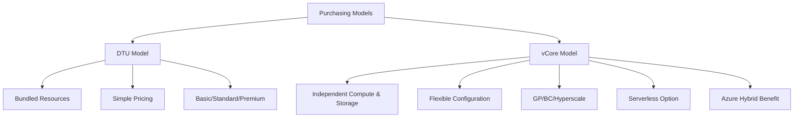

# How to Choose Between DTU and vCore Purchasing Models in Azure SQL Database

Author: [nawazdhandala](https://www.github.com/nawazdhandala)

Tags: Azure SQL, DTU, vCore, Pricing, Cost Optimization, Azure, Database

Description: Understand the differences between DTU and vCore purchasing models in Azure SQL Database so you can pick the right one for your workload and budget.

---

One of the first decisions you face when setting up an Azure SQL Database is choosing between the DTU-based and vCore-based purchasing models. This choice affects your costs, performance characteristics, and the flexibility you have in tuning your database. I have seen teams pick the wrong model and either overpay or end up with performance issues they did not expect. Let me break down both options so you can make an informed decision.

## What Is the DTU Model?

DTU stands for Database Transaction Unit. It is a blended measure of CPU, memory, and I/O resources bundled together into a single number. You do not get to configure these resources independently. Instead, you pick a tier (Basic, Standard, or Premium) and a performance level within that tier, and you get a pre-configured bundle of resources.

Think of it like ordering a meal combo at a restaurant. You get a burger, fries, and a drink as a package. You cannot swap the fries for a salad or get a bigger drink with a smaller burger. The bundle is fixed.

DTU tiers break down like this:

- **Basic**: 5 DTUs. Suitable for small, infrequently used databases. Max storage is 2 GB.
- **Standard**: 10 to 3000 DTUs. The workhorse tier for most production workloads. Max storage up to 1 TB.
- **Premium**: 125 to 4000 DTUs. High-performance tier with low-latency I/O. Max storage up to 4 TB. Supports in-memory OLTP.

## What Is the vCore Model?

The vCore (virtual Core) model separates compute and storage, giving you independent control over each. You choose the number of virtual CPU cores, and storage is billed separately based on how much you provision.

Using the restaurant analogy, this is like ordering a la carte. You pick exactly how many cores you want, how much memory you need, and how much storage to provision, all independently.

The vCore model has three service tiers:

- **General Purpose**: Balanced compute and storage for typical business workloads. Uses remote storage.
- **Business Critical**: High-performance with local SSD storage. Supports in-memory OLTP. Comes with a built-in readable secondary replica.
- **Hyperscale**: Highly scalable storage up to 100 TB with rapid scale-out capabilities and fast backups.

Within the vCore model, you also choose between compute tiers:

- **Provisioned**: You pay for a fixed amount of compute resources regardless of usage.
- **Serverless**: The database auto-scales based on demand and can auto-pause when idle. You pay per-second for compute actually used.

## Key Differences at a Glance

Here is a comparison to clarify the major differences.



**Resource control**: DTU bundles everything together. vCore lets you tune compute and storage independently.

**Pricing transparency**: DTU pricing is simpler to understand. vCore gives you more visibility into what you are paying for.

**License benefits**: The vCore model supports Azure Hybrid Benefit, which lets you use existing SQL Server licenses to save up to 55% on Azure SQL. DTU does not offer this.

**Serverless option**: Only available in the vCore model. If you have databases with intermittent usage, the serverless tier can dramatically reduce costs.

**Hyperscale tier**: Only available in the vCore model. If you need databases larger than 4 TB or require near-instantaneous backups regardless of database size, Hyperscale is the way to go.

**In-memory OLTP**: Available in Premium (DTU) and Business Critical (vCore).

## When to Choose DTU

The DTU model makes sense in several scenarios.

**You want simplicity.** If you do not want to think about CPU cores, memory ratios, or storage tiers, DTU gives you an easy slider. Pick a performance level and go.

**Your workloads are straightforward.** Standard web applications, small business applications, and simple CRUD operations work perfectly fine on DTU-based databases.

**You are just getting started with Azure SQL.** The DTU model has a lower learning curve. You can always migrate to vCore later if your needs become more complex.

**You do not have existing SQL Server licenses.** Since you cannot apply Azure Hybrid Benefit to DTU, there is no license-related cost disadvantage if you do not have licenses to begin with.

**Budget predictability matters most.** DTU pricing is fixed and easy to forecast. You know exactly what you will pay each month.

## When to Choose vCore

The vCore model is the better choice in these scenarios.

**You have existing SQL Server licenses.** Azure Hybrid Benefit can save you 30-55% on compute costs. This alone can make vCore significantly cheaper than DTU.

**You need to match on-premises performance.** If you know your SQL Server workload requires specific CPU and memory characteristics, vCore lets you map those requirements directly. A database that needs 8 cores and 40 GB of RAM on-premises can be provisioned with similar specs in vCore.

**You want the serverless tier.** For development, testing, or production databases with intermittent usage, serverless compute is only available in the vCore model.

**You need Hyperscale.** Databases larger than 4 TB, or workloads that need rapid scale-out and near-instant point-in-time restores regardless of database size, require the Hyperscale tier.

**You want a built-in readable secondary.** The Business Critical tier includes a free readable replica that can offload read queries, which is not available in DTU tiers.

**You are running a standardized fleet.** If you manage many databases across different environments (dev, staging, production), vCore's consistent sizing model makes it easier to standardize configurations.

## Cost Comparison

Let me compare costs for a few common scenarios. These are approximate and vary by region, but they illustrate the relative pricing.

**Small database (development)**:
- DTU: Basic tier, 5 DTUs, 2 GB storage - roughly $5/month
- vCore: Serverless, 0.5-2 vCores, auto-pause enabled - roughly $5-10/month when idle (near $0 if auto-paused)

For small dev databases, both are inexpensive. Serverless wins if the database sits idle most of the time.

**Medium database (production web app)**:
- DTU: Standard S3, 100 DTUs, 250 GB - roughly $150/month
- vCore: General Purpose, 2 vCores, 250 GB - roughly $185/month (without Hybrid Benefit) or roughly $100/month (with Hybrid Benefit)

If you have licenses, vCore is cheaper. Without licenses, DTU might edge out on price.

**Large database (high-performance OLTP)**:
- DTU: Premium P4, 500 DTUs, 1 TB - roughly $1,800/month
- vCore: Business Critical, 8 vCores, 1 TB - roughly $2,200/month (without Hybrid Benefit) or roughly $1,200/month (with Hybrid Benefit)

Again, Azure Hybrid Benefit makes a huge difference at higher tiers.

## How to Migrate Between Models

The good news is that you are not permanently locked into either model. You can convert a DTU database to vCore and vice versa. Azure provides a mapping between DTU levels and vCore configurations.

Here is the rough mapping:

- Basic (5 DTUs) maps to General Purpose, 1 vCore
- Standard S3 (100 DTUs) maps to General Purpose, 2 vCores
- Premium P2 (250 DTUs) maps to Business Critical, 2 vCores
- Premium P6 (1000 DTUs) maps to Business Critical, 8 vCores

To change the model in the Azure Portal, go to your database, click "Compute + storage", and switch between DTU and vCore configurations. The migration happens online with a brief connectivity interruption at the end when connections are switched over.

Via Azure CLI:

```bash
# Change a DTU database to vCore General Purpose with 2 cores
az sql db update \
    --resource-group myResourceGroup \
    --server myserver \
    --name mydb \
    --edition GeneralPurpose \
    --family Gen5 \
    --capacity 2
```

## My Recommendation

If you are starting fresh and do not have SQL Server licenses, start with DTU for simplicity. The Standard tier covers a wide range of workloads, and the pricing is easy to understand and predict.

If you have SQL Server licenses with Software Assurance, go with vCore immediately to take advantage of Azure Hybrid Benefit. The cost savings are substantial.

If you need advanced features like serverless auto-pause, Hyperscale storage, or built-in readable replicas, vCore is your only option.

And regardless of which model you choose, remember that you can switch later. Do not overthink this decision upfront. Pick what seems right, monitor your usage for a few weeks, and adjust if needed. Azure makes it relatively painless to switch between models, so you are not making an irreversible commitment.

## Summary

The DTU model offers simplicity and bundled pricing, making it great for straightforward workloads and teams that do not want to manage resource configurations. The vCore model provides flexibility, license portability, and access to advanced features like serverless and Hyperscale. Your choice should depend on your existing licenses, workload complexity, and need for specific features. Either way, both models support the same underlying Azure SQL Database engine, so your data and queries will work identically on either one.
