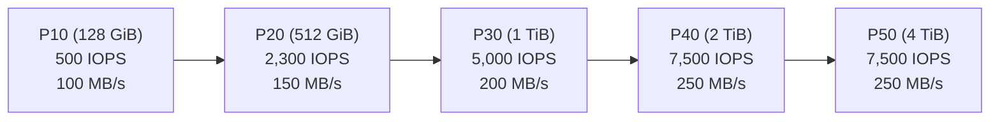
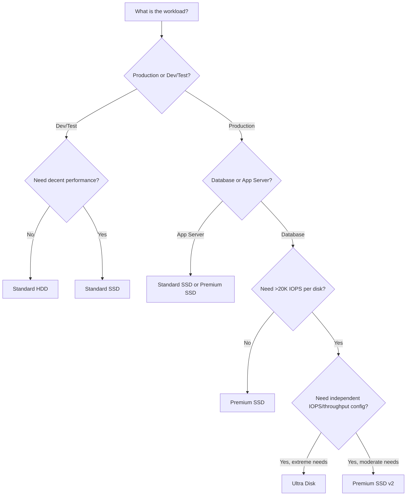

# How to Choose Between Standard HDD, Standard SSD, Premium SSD, and Ultra Disks in Azure

Author: [nawazdhandala](https://www.github.com/nawazdhandala)

Tags: Azure, Managed Disks, Standard HDD, Standard SSD, Premium SSD, Ultra Disk, Performance

Description: A practical comparison of Azure Managed Disk types to help you pick the right storage tier for your workload based on performance, cost, and use case.

---

Azure offers four managed disk types, each targeting different workload profiles. Picking the wrong one means either overpaying for performance you do not need or struggling with I/O bottlenecks that hurt your application. In this guide, I will break down each disk type, compare their performance characteristics, and help you match the right disk to your workload.

## The Four Disk Types at a Glance

**Standard HDD** is the cheapest option, built on traditional spinning hard drives. It provides the lowest performance but is fine for workloads that are not latency-sensitive.

**Standard SSD** uses solid-state drives and delivers better performance and reliability than Standard HDD at a modest price increase. It is the general-purpose option.

**Premium SSD** offers high-performance SSD storage with guaranteed IOPS and throughput. It is designed for production workloads that need consistent, low-latency performance.

**Ultra Disk** delivers the highest possible performance with configurable IOPS and throughput independent of disk size. It is built for the most demanding workloads like SAP HANA, top-tier databases, and transaction-heavy systems.

## Performance Comparison

Here are the key performance metrics for each tier at a 512 GiB disk size.

| Metric | Standard HDD | Standard SSD | Premium SSD | Ultra Disk |
|--------|-------------|-------------|-------------|------------|
| Max IOPS | 500 | 500 | 2,300 | 160,000 |
| Max Throughput | 60 MB/s | 60 MB/s | 150 MB/s | 4,000 MB/s |
| Latency | ~10ms | ~5ms | ~2ms | <1ms |
| SLA | No single-disk SLA | 99.5% | 99.9% | 99.9% |
| Cost (512 GiB/month) | ~$22 | ~$38 | ~$73 | ~$130+ |

Note that these numbers vary by disk size. Larger disks generally get better IOPS and throughput within each tier.

## Standard HDD: When to Use It

Standard HDD disks are backed by magnetic spinning drives. They are the cheapest storage option in Azure.

Good fit for:
- Development and test environments where performance does not matter
- Backup storage and archival
- Batch processing workloads that process data sequentially
- Infrequently accessed data

Not a good fit for:
- Production applications
- Databases of any kind
- Anything user-facing where latency matters

```bash
# Create a Standard HDD disk
az disk create \
  --name backup-disk \
  --resource-group my-resource-group \
  --location eastus \
  --sku Standard_LRS \
  --size-gb 1024
```

## Standard SSD: The Balanced Option

Standard SSD is the step up from HDD. It provides consistent performance with lower latency and better IOPS than HDD, at a reasonable price premium.

Good fit for:
- Web servers and application servers with moderate I/O
- Development and test environments that need better performance than HDD
- Lightly loaded databases
- Non-critical production workloads

Not a good fit for:
- I/O intensive databases
- Workloads requiring guaranteed IOPS
- Applications with strict latency requirements

```bash
# Create a Standard SSD disk
az disk create \
  --name app-server-disk \
  --resource-group my-resource-group \
  --location eastus \
  --sku StandardSSD_LRS \
  --size-gb 256
```

## Premium SSD: Production Workhorse

Premium SSD is the go-to choice for most production workloads. It provides guaranteed IOPS and throughput based on the disk size, with consistently low latency.

Good fit for:
- Production databases (SQL Server, PostgreSQL, MySQL)
- Enterprise applications
- Virtual desktop infrastructure
- Any workload requiring consistent, guaranteed performance

Not a good fit for:
- Cost-sensitive workloads with low I/O requirements (overkill)
- Workloads requiring more than 20,000 IOPS per disk

```bash
# Create a Premium SSD disk (note: requires a compatible VM size)
az disk create \
  --name production-db-disk \
  --resource-group my-resource-group \
  --location eastus \
  --sku Premium_LRS \
  --size-gb 512
```

Premium SSD performance scales with disk size. Here is how IOPS and throughput scale.



## Ultra Disk: Maximum Performance

Ultra Disks are Azure's highest-performance storage option. They let you configure IOPS and throughput independently from disk size, which is unique among Azure disk types.

Good fit for:
- SAP HANA and other in-memory databases
- High-frequency trading systems
- SQL Server with extreme IOPS requirements
- Large-scale OLTP databases
- Workloads needing sub-millisecond latency

Not a good fit for:
- OS disks (Ultra Disks can only be used as data disks)
- Workloads that do not need high I/O performance (too expensive)
- Disk snapshots (not supported for Ultra Disks)

```bash
# Create an Ultra Disk with custom IOPS and throughput
# Ultra Disks let you configure IOPS and throughput independently
az disk create \
  --name ultra-db-disk \
  --resource-group my-resource-group \
  --location eastus \
  --zone 1 \
  --sku UltraSSD_LRS \
  --size-gb 512 \
  --disk-iops-read-write 50000 \
  --disk-mbps-read-write 1000
```

Ultra Disks have some restrictions. They are only available in certain regions and availability zones, they require specific VM series (like Es_v3, Ds_v3, M series), and they do not support disk snapshots or imaging.

## Premium SSD v2: The Middle Ground

Azure also offers Premium SSD v2, which sits between Premium SSD and Ultra Disk. Like Ultra Disks, it lets you independently configure IOPS and throughput, but at a lower price point.

```bash
# Create a Premium SSD v2 disk
az disk create \
  --name premiumv2-disk \
  --resource-group my-resource-group \
  --location eastus \
  --zone 1 \
  --sku PremiumV2_LRS \
  --size-gb 512 \
  --disk-iops-read-write 10000 \
  --disk-mbps-read-write 250
```

## Decision Framework

Here is how I approach disk selection for new deployments.



## Cost Optimization Tips

Premium SSD disks charge for the provisioned size tier, not actual usage. A P10 (128 GiB) disk costs the same whether you store 1 GiB or 128 GiB. So do not over-provision size unless you need the extra IOPS.

Standard SSD and Standard HDD charge for provisioned size and transactions. If your workload has very high transaction counts on Standard disks, you might actually pay more than Premium SSD after transaction charges.

Ultra Disks charge separately for capacity, IOPS, and throughput. Start with the minimum you need and scale up. You can adjust IOPS and throughput on Ultra Disks without detaching them from the VM.

Consider disk bursting. Premium SSD disks under P30 (1 TiB) can burst up to 3,500 IOPS and 170 MB/s for short periods. If your workload has occasional spikes, a smaller Premium SSD with bursting might be cheaper than a larger disk with permanently high IOPS.

## Checking VM Compatibility

Not all VM sizes support all disk types. Premium SSDs require Premium-storage-capable VMs (most DS, ES, FS, GS, and M series). Ultra Disks have even more specific VM requirements.

```bash
# Check which VM sizes support Premium storage in your region
az vm list-sizes \
  --location eastus \
  --query "[?contains(name, 'Standard_D')].{Name:name, MaxDataDisks:maxDataDiskCount}" \
  --output table

# Check Ultra Disk availability in a region
az vm list-skus \
  --location eastus \
  --resource-type disks \
  --query "[?name=='UltraSSD_LRS'].{Name:name, Zones:locationInfo[0].zones}" \
  --output table
```

## Practical Recommendation

For most production workloads, start with Premium SSD. It gives you predictable performance with low latency at a reasonable price. Only move to Ultra Disks or Premium SSD v2 if you have specific performance requirements that Premium SSD cannot meet. Use Standard SSD for non-production environments and Standard HDD only for cold storage and backups.

The right disk type depends entirely on your workload. Measure your actual I/O requirements with Azure Monitor before making a final decision, especially for existing workloads you are migrating to Azure.
