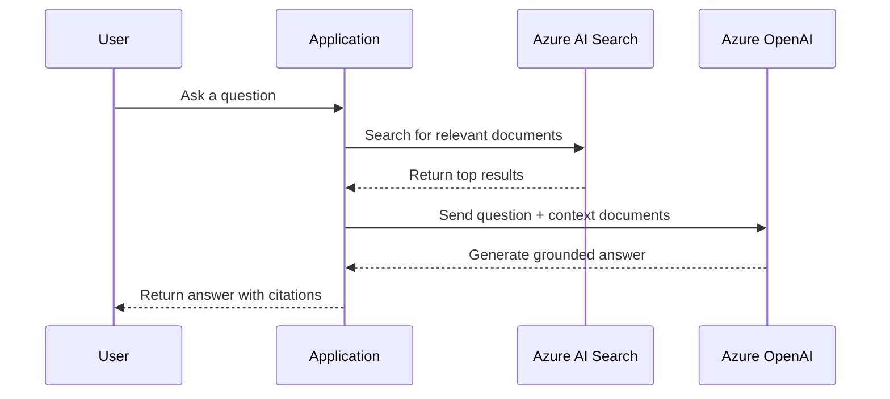

# How to Combine Azure AI Search with Azure OpenAI for an Intelligent Q&A System

Author: [nawazdhandala](https://www.github.com/nawazdhandala)

Tags: Azure AI Search, Azure OpenAI, RAG, Q&A System, GPT, LLM, Azure

Description: Build an intelligent question and answer system by combining Azure AI Search with Azure OpenAI using the retrieval-augmented generation pattern.

---

Large language models like GPT-4 are impressive at generating text, but they have a fundamental limitation: they only know what was in their training data. When you need answers based on your own private documents, company knowledge base, or recent data, you need to ground the model's responses in your actual content. This is where retrieval-augmented generation (RAG) comes in.

The RAG pattern is straightforward. When a user asks a question, you first search your document store for relevant content, then pass that content to the language model along with the question. The model generates an answer based on the retrieved documents rather than relying solely on its training data.

Azure AI Search and Azure OpenAI are a natural pairing for this pattern. In this post, I will walk through building a complete Q&A system using both services.

## Architecture Overview

Here is how the system works end to end.



The application sits in the middle, orchestrating the search and generation steps. This separation keeps things flexible - you can swap out the search engine or the language model independently.

## Prerequisites

You need the following Azure resources:

1. **Azure AI Search** (Basic tier or higher) with an index containing your documents
2. **Azure OpenAI** with a GPT-4 or GPT-4o deployment
3. Python 3.8+ with the required packages

```bash
# Install the required Python packages
pip install azure-search-documents==11.6.0 openai
```

I will assume you already have a search index populated with documents. If not, check out the Azure AI Search documentation for getting started with indexing.

## Step 1: Set Up the Search Client

First, configure the search client to retrieve relevant documents.

```python
# search_client.py - Configure Azure AI Search client
from azure.search.documents import SearchClient
from azure.core.credentials import AzureKeyCredential

# Search service configuration
SEARCH_ENDPOINT = "https://<your-service>.search.windows.net"
SEARCH_KEY = "<your-query-key>"
INDEX_NAME = "knowledge-base"

search_client = SearchClient(
    endpoint=SEARCH_ENDPOINT,
    index_name=INDEX_NAME,
    credential=AzureKeyCredential(SEARCH_KEY)
)

def search_documents(query: str, top: int = 5) -> list[dict]:
    """Search for documents relevant to the user's question."""
    results = search_client.search(
        search_text=query,
        # Use semantic ranking for better relevance
        query_type="semantic",
        semantic_configuration_name="my-semantic-config",
        # Request captions for context
        query_caption="extractive",
        top=top,
        select=["title", "content", "url"]
    )

    documents = []
    for result in results:
        documents.append({
            "title": result["title"],
            "content": result["content"],
            "url": result.get("url", ""),
            "score": result["@search.score"],
            # Include semantic captions if available
            "captions": [c.text for c in result.get("@search.captions", [])]
        })

    return documents
```

Using semantic ranking here is important because it gives you better relevance, especially for natural language questions. The captions are useful too - they identify the most relevant passages in each document.

## Step 2: Set Up the OpenAI Client

Configure the Azure OpenAI client for generating answers.

```python
# openai_client.py - Configure Azure OpenAI client
from openai import AzureOpenAI

# Azure OpenAI configuration
OPENAI_ENDPOINT = "https://<your-resource>.openai.azure.com/"
OPENAI_KEY = "<your-openai-key>"
DEPLOYMENT_NAME = "gpt-4o"  # Your deployment name

openai_client = AzureOpenAI(
    api_key=OPENAI_KEY,
    api_version="2024-06-01",
    azure_endpoint=OPENAI_ENDPOINT
)
```

## Step 3: Build the RAG Pipeline

Now connect the search and generation steps into a single pipeline.

```python
# rag_pipeline.py - The core RAG pipeline
def build_context(documents: list[dict]) -> str:
    """Format retrieved documents into context for the LLM."""
    context_parts = []
    for i, doc in enumerate(documents, 1):
        context_parts.append(
            f"[Document {i}: {doc['title']}]\n{doc['content']}\n"
        )
    return "\n---\n".join(context_parts)

def generate_answer(question: str, context: str) -> dict:
    """Generate an answer using Azure OpenAI with the retrieved context."""
    # System prompt that instructs the model to use the provided context
    system_message = """You are a helpful assistant that answers questions based on the provided documents.

Rules:
- Only answer based on the information in the provided documents.
- If the documents do not contain enough information to answer, say so clearly.
- Cite which document(s) you used in your answer using [Document N] notation.
- Be concise and direct in your answers."""

    user_message = f"""Context documents:
{context}

Question: {question}

Please answer the question based on the context documents above."""

    response = openai_client.chat.completions.create(
        model=DEPLOYMENT_NAME,
        messages=[
            {"role": "system", "content": system_message},
            {"role": "user", "content": user_message}
        ],
        temperature=0.3,  # Lower temperature for more factual responses
        max_tokens=800
    )

    return {
        "answer": response.choices[0].message.content,
        "usage": {
            "prompt_tokens": response.usage.prompt_tokens,
            "completion_tokens": response.usage.completion_tokens
        }
    }

def ask_question(question: str) -> dict:
    """Full RAG pipeline: search, build context, generate answer."""
    # Step 1: Retrieve relevant documents
    documents = search_documents(question, top=5)

    if not documents:
        return {
            "answer": "I could not find any relevant documents to answer your question.",
            "sources": []
        }

    # Step 2: Build context from retrieved documents
    context = build_context(documents)

    # Step 3: Generate an answer using the LLM
    result = generate_answer(question, context)

    # Include source information for citations
    sources = [{"title": doc["title"], "url": doc["url"]} for doc in documents]

    return {
        "answer": result["answer"],
        "sources": sources,
        "token_usage": result["usage"]
    }
```

## Step 4: Add Hybrid and Vector Search

For the best retrieval quality, combine keyword search with vector search. This requires generating embeddings for the query.

```python
# hybrid_search.py - Enhanced search with vector capabilities
from azure.search.documents.models import VectorizedQuery

def get_query_embedding(text: str) -> list[float]:
    """Generate an embedding for the search query."""
    response = openai_client.embeddings.create(
        input=text,
        model="text-embedding-ada-002"
    )
    return response.data[0].embedding

def hybrid_search(query: str, top: int = 5) -> list[dict]:
    """Perform hybrid search combining keyword and vector retrieval."""
    # Generate query embedding
    query_vector = get_query_embedding(query)

    vector_query = VectorizedQuery(
        vector=query_vector,
        k_nearest_neighbors=top,
        fields="contentVector"
    )

    results = search_client.search(
        search_text=query,
        vector_queries=[vector_query],
        query_type="semantic",
        semantic_configuration_name="my-semantic-config",
        top=top,
        select=["title", "content", "url"]
    )

    documents = []
    for result in results:
        documents.append({
            "title": result["title"],
            "content": result["content"],
            "url": result.get("url", ""),
            "score": result["@search.score"]
        })

    return documents
```

## Step 5: Handle Context Window Limits

One practical challenge with RAG is fitting the retrieved documents within the model's context window. If your documents are long, you need a strategy for truncation.

```python
# context_management.py - Handle context window limits
def truncate_context(documents: list[dict], max_tokens: int = 6000) -> str:
    """Build context that fits within token limits.

    A rough estimate is 1 token per 4 characters for English text.
    """
    context_parts = []
    total_chars = 0
    # Approximate character limit based on token budget
    char_limit = max_tokens * 4

    for i, doc in enumerate(documents, 1):
        # Format this document
        doc_text = f"[Document {i}: {doc['title']}]\n{doc['content']}\n"

        # Check if adding this document exceeds the limit
        if total_chars + len(doc_text) > char_limit:
            # Truncate this document to fit remaining space
            remaining = char_limit - total_chars
            if remaining > 200:  # Only include if there is meaningful space left
                doc_text = doc_text[:remaining] + "\n[...truncated]"
                context_parts.append(doc_text)
            break

        context_parts.append(doc_text)
        total_chars += len(doc_text)

    return "\n---\n".join(context_parts)
```

## Step 6: Use the Built-In "On Your Data" Feature

Azure OpenAI also has a built-in "On Your Data" feature that handles the RAG pattern automatically. Instead of writing the search and context assembly code yourself, you configure the data source directly in the API call.

```python
# on_your_data.py - Use Azure OpenAI's built-in data source integration
response = openai_client.chat.completions.create(
    model=DEPLOYMENT_NAME,
    messages=[
        {"role": "user", "content": "What is our company's vacation policy?"}
    ],
    extra_body={
        "data_sources": [
            {
                "type": "azure_search",
                "parameters": {
                    "endpoint": SEARCH_ENDPOINT,
                    "index_name": INDEX_NAME,
                    "authentication": {
                        "type": "api_key",
                        "key": SEARCH_KEY
                    },
                    # Enable semantic ranking
                    "query_type": "semantic",
                    "semantic_configuration": "my-semantic-config",
                    "top_n_documents": 5
                }
            }
        ]
    }
)

# The response includes citations automatically
print(response.choices[0].message.content)
# Access citation information
if hasattr(response.choices[0].message, "context"):
    for citation in response.choices[0].message.context.get("citations", []):
        print(f"Source: {citation['title']} - {citation['url']}")
```

This built-in approach is simpler but gives you less control over the retrieval and prompting steps.

## Production Considerations

When moving to production, keep these things in mind:

- **Prompt engineering matters** - spend time refining your system prompt. The instructions for how the model should use the context directly impact answer quality.
- **Monitor token usage** - each question costs tokens for both the context (input) and the answer (output). Track this to manage costs.
- **Cache frequent queries** - if the same questions come up repeatedly, cache the answers to reduce latency and cost.
- **Add guardrails** - validate that answers are grounded in the retrieved documents. Some teams use a separate LLM call to check for hallucination.
- **Log everything** - log the queries, retrieved documents, and generated answers. This data is essential for improving the system over time.

## Wrapping Up

Combining Azure AI Search with Azure OpenAI gives you a robust Q&A system that can answer questions based on your own data. The RAG pattern keeps the language model grounded in your actual content, dramatically reducing hallucination. Whether you build the pipeline yourself for maximum control or use the built-in "On Your Data" feature for simplicity, the core idea is the same: retrieve first, then generate. This approach works for internal knowledge bases, customer support bots, document analysis tools, and any scenario where you need accurate, cited answers from a specific corpus of documents.
