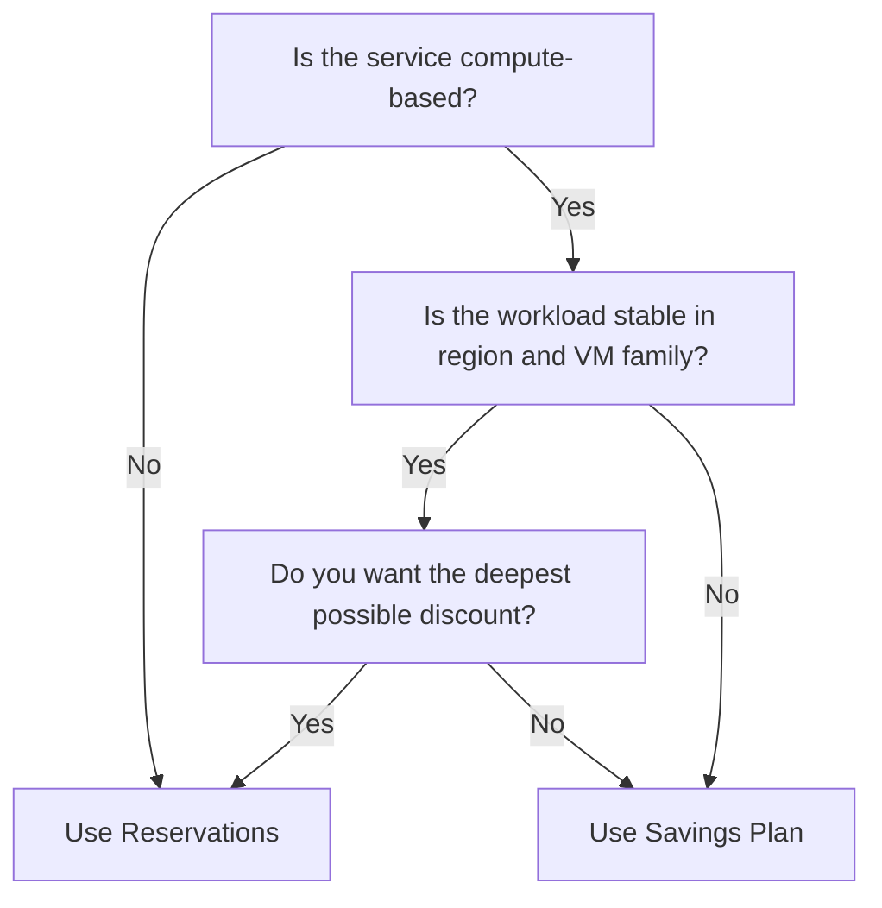

# How to Compare Azure Reservations vs Savings Plans and Choose the Right Option

Author: [nawazdhandala](https://www.github.com/nawazdhandala)

Tags: Azure, Cost Optimization, Reservations, Savings Plans, Cloud Finance, FinOps, Azure Billing

Description: Learn how to compare Azure Reservations and Savings Plans side by side so you can pick the discount model that saves the most money for your workloads.

---

If you have been running workloads on Azure for any length of time, you have probably noticed that pay-as-you-go pricing adds up fast. Microsoft offers two commitment-based discount programs - Reservations and Savings Plans - that can cut your bill by 30 to 72 percent depending on the resource and term. The catch is that picking the wrong one can lock you into a commitment that does not match how your infrastructure actually behaves.

In this post I will break down both options, compare them across the dimensions that matter, and walk through a decision framework you can use today.

## What Are Azure Reservations?

Azure Reservations let you commit to a specific resource type, in a specific region, for one or three years. In exchange, Azure gives you a significant discount compared to pay-as-you-go rates. Reservations cover a wide range of services:

- Virtual machines (specific VM series and size)
- SQL Database vCores
- Cosmos DB throughput (RU/s)
- Azure Synapse Analytics
- App Service stamps
- Storage capacity
- Many more

The key word here is "specific." When you buy a reservation for a Standard_D4s_v5 VM in East US, that discount only applies to Standard_D4s_v5 instances in East US (or, with instance size flexibility turned on, other sizes within the same series family).

### Instance Size Flexibility

One thing that trips people up is instance size flexibility. For VMs, Azure allows reservation discounts to float across sizes within the same series. So a D4s_v5 reservation could cover two D2s_v5 instances. This is enabled by default for most VM reservations and helps reduce waste.

## What Are Azure Savings Plans?

Azure Savings Plans work differently. Instead of committing to a specific resource, you commit to a fixed hourly spend amount (for example, $10/hour) for one or three years. Azure then applies the best available discount to your eligible compute usage, regardless of VM family, size, or region.

There are two types:

- **Compute Savings Plan** - covers VMs, Azure Dedicated Hosts, Azure Container Instances, Azure Functions Premium, and Azure App Service. This is the broadest option and works across regions.
- **Machine Learning Savings Plan** - specifically for Azure Machine Learning compute.

The Compute Savings Plan is the one most teams care about because it gives you region and VM family flexibility that reservations simply cannot match.

## Side-by-Side Comparison

Here is a comparison table that captures the main differences:

| Dimension | Reservations | Savings Plans |
|---|---|---|
| Commitment type | Specific resource type, size, region | Hourly dollar amount |
| Flexibility | Limited to same series (with instance size flexibility) | Any eligible compute, any region |
| Discount depth | Generally deeper (up to 72%) | Slightly less deep (up to 65%) |
| Scope options | Single subscription, shared across subscriptions, resource group, management group | Single subscription, shared across subscriptions, management group |
| Supported services | VMs, SQL, Cosmos DB, storage, and many more | Primarily compute (VMs, ACI, Functions Premium, App Service) |
| Term | 1 year or 3 years | 1 year or 3 years |
| Payment options | All upfront, monthly, or no upfront | All upfront, monthly, or no upfront |
| Cancellation | Possible with early termination fee (12% of remaining amount) | Not cancellable |
| Exchange | Can exchange for different reservation | Not exchangeable |

## When Reservations Make More Sense

Reservations tend to be the better choice when your workloads are predictable and stable. Here are the scenarios where I would lean toward reservations:

**Steady-state database workloads.** If you are running SQL Managed Instance or Cosmos DB with consistent throughput, reservations give you the deepest discounts on those services. Savings Plans do not cover database services at all.

**Non-compute services.** For things like Azure Storage reserved capacity, Azure Synapse, or Azure Data Explorer, reservations are your only commitment-based discount option. Savings Plans only cover compute.

**Workloads locked to a region.** If your compliance requirements or architecture mean your VMs will always run in a single region on a single VM family, the deeper discount from reservations is worth the reduced flexibility.

**Predictable VM families.** If you know you are going to be running D-series VMs for the foreseeable future and you are not planning any migrations, reservations will typically save you a few more percentage points than a savings plan would.

## When Savings Plans Make More Sense

Savings Plans shine when you need flexibility. Here are the scenarios that favor them:

**Mixed or evolving VM families.** If your team is actively modernizing and you might shift from D-series to E-series or from Intel to AMD (Dads_v5), the savings plan discount follows you automatically.

**Multi-region deployments.** If you run workloads across East US, West Europe, and Southeast Asia, a single savings plan covers all of them. With reservations, you would need separate purchases for each region.

**Dynamic workloads.** If your compute usage fluctuates across different service types - some months heavy on VMs, other months heavy on ACI or Functions Premium - a savings plan adapts without any intervention on your part.

**Teams new to commitment-based discounts.** If you are just starting with FinOps and not yet confident in your forecasting, savings plans are more forgiving. You commit to a dollar amount rather than a specific resource, so the risk of buying something you do not use is lower.

## A Decision Framework

Here is a simple flow you can follow:



In practice, most organizations end up using both. You might reserve your known, stable database and storage workloads while covering your compute layer with a savings plan.

## How to Check What Microsoft Recommends for Your Account

Azure Cost Management has built-in recommendation engines for both options. Here is how to find them.

For reservations, navigate to the Azure portal, go to Cost Management + Billing, then click on Reservations. You will see a "Recommended" tab that analyzes your usage over the past 7, 30, or 60 days and suggests specific reservations.

For savings plans, go to Cost Management + Billing, then Savings Plans. The recommendations here look at your total compute spend and suggest hourly commitment amounts.

You can also pull recommendations programmatically using the Azure CLI:

```bash
# Get reservation recommendations for a subscription
# The lookBackPeriod can be Last7Days, Last30Days, or Last60Days
az consumption reservation recommendation list \
  --scope "subscriptions/<your-subscription-id>" \
  --look-back-period Last30Days \
  --resource-type VirtualMachines

# Get savings plan recommendations via the REST API
# This uses the Benefit Utilization Summaries endpoint
az rest --method get \
  --url "https://management.azure.com/subscriptions/<sub-id>/providers/Microsoft.CostManagement/benefitRecommendations?api-version=2022-10-01" \
  --query "value[].properties.{term:term,commitmentAmount:commitmentGranularity,savings:savingsAmount}"
```

Compare the projected savings from both recommendations before committing.

## Combining Both for Maximum Savings

The strategy I have seen work best for mid-to-large organizations looks like this:

1. **Reserve your databases and storage first.** These services only support reservations, and the discounts are substantial.
2. **Identify your baseline compute.** Look at the last 90 days of VM usage and find the floor - the minimum number of vCPUs you always have running.
3. **Cover the baseline with a savings plan.** Set the hourly commitment to match your baseline compute spend after reservation discounts are applied.
4. **Use reservations for any remaining predictable, single-family VM workloads.** If you have a cluster of GPU VMs that never changes, a reservation on top of your savings plan can squeeze out additional savings.
5. **Leave burst capacity on pay-as-you-go.** Do not try to commit to cover your peaks. That is where waste happens.

## Monitoring Your Commitment Utilization

After you buy either reservations or savings plans, you need to track utilization. Unused commitment is wasted money.

In the Azure portal, go to Cost Management + Billing, then Reservations or Savings Plans. Each one shows a utilization chart. You want this above 95 percent for reservations and close to 100 percent for savings plans.

Set up alerts if utilization drops below a threshold. You can do this through Azure Monitor action groups or by using Power BI with the Cost Management connector for more detailed reporting.

## Practical Tips From Experience

- Start with a 1-year term if this is your first commitment purchase. The discount is smaller, but you learn what works before locking in for 3 years.
- Review recommendations monthly. Workloads change, and what was optimal 6 months ago might not be today.
- Use management group scope for both reservations and savings plans in multi-subscription environments. This maximizes the chance that your commitment gets utilized.
- Keep a spreadsheet or use Azure Cost Management exports to track your commitment purchases, their expiration dates, and projected renewals.
- Factor in the cancellation policy. Reservations can be cancelled (with a fee). Savings plans cannot. If there is any chance your compute needs will drop significantly, the savings plan commitment is riskier.

## Wrapping Up

Azure Reservations and Savings Plans are not competitors - they are complementary tools. Reservations give you the deepest discounts on specific, predictable workloads, while Savings Plans provide broad flexibility across your entire compute footprint. The best approach for most teams is to use both strategically: reserve what you know for certain, cover your compute baseline with a savings plan, and leave your variable capacity on pay-as-you-go. Start with the built-in Azure recommendations, monitor your utilization weekly, and adjust each quarter as your workloads evolve.
