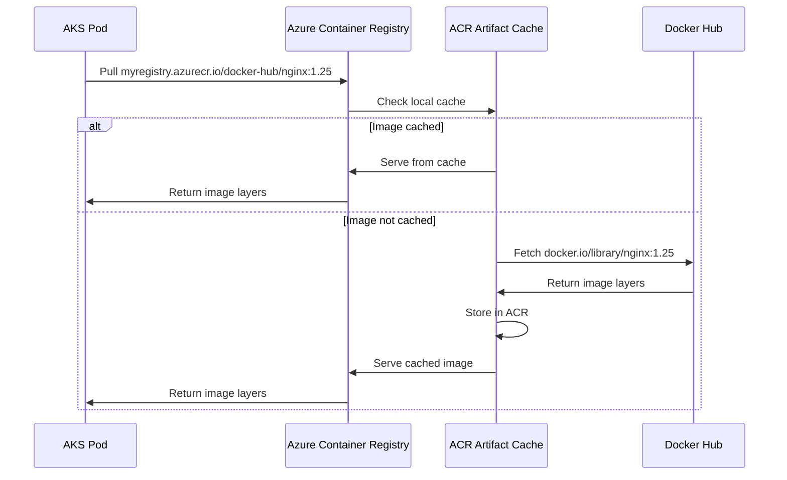

# How to Configure ACR Artifact Cache for Pulling Public Images Through Private Registry

Author: [nawazdhandala](https://www.github.com/nawazdhandala)

Tags: ACR, Artifact Cache, Container Registry, Docker Hub, Azure, Image Management, Security

Description: Learn how to set up Azure Container Registry artifact cache to pull and cache public container images through your private registry.

---

Pulling container images directly from Docker Hub and other public registries in production creates several problems. Rate limits throttle your image pulls, your builds fail when the public registry is down, you have no control over image content changes, and your pods expose your cluster's IP addresses to external services. ACR artifact cache solves all of these by proxying and caching public images through your private Azure Container Registry. Once configured, your cluster pulls from ACR, and ACR handles fetching and caching the upstream images. In this guide, I will walk through setting up ACR artifact cache for Docker Hub, GitHub Container Registry, and other public sources.

## How ACR Artifact Cache Works

When you configure a cache rule, ACR acts as a pull-through cache for a specific upstream registry. The first time you pull an image through the cache, ACR fetches it from the upstream registry and stores it locally. Subsequent pulls are served from ACR's local cache, bypassing the upstream entirely. ACR periodically refreshes the cached images based on your configuration.

The benefits are significant:

- **No rate limiting** - Docker Hub limits free accounts to 100 pulls per 6 hours. With caching, you pull once from Docker Hub and serve unlimited pulls from ACR.
- **Faster pulls** - ACR is in your Azure region, usually much closer to your AKS cluster than Docker Hub.
- **Reliability** - If Docker Hub goes down, your cached images are still available.
- **Security** - You can scan cached images for vulnerabilities before using them.
- **Network control** - Your AKS cluster only talks to ACR, not to external registries.

## Prerequisites

You need an ACR instance (Premium tier is recommended for the full feature set, but artifact cache works on all tiers), Azure CLI 2.45 or later, and optionally a Docker Hub account for authenticated pulls with higher rate limits.

## Step 1: Create a Cache Rule for Docker Hub

A cache rule maps a source registry path to a target repository in your ACR.

```bash
# Create a cache rule for Docker Hub official images
az acr cache create \
  --registry myregistry \
  --name docker-hub-cache \
  --source-repo docker.io/library/* \
  --target-repo docker-hub/*
```

This rule caches any image from Docker Hub's official library (like `nginx`, `redis`, `postgres`) under the `docker-hub/` prefix in your ACR. When you pull `myregistry.azurecr.io/docker-hub/nginx:1.25`, ACR fetches `docker.io/library/nginx:1.25` and caches it.

For non-official Docker Hub images (those under an organization or user namespace), create a separate rule.

```bash
# Cache rules for specific Docker Hub organizations
az acr cache create \
  --registry myregistry \
  --name grafana-cache \
  --source-repo docker.io/grafana/* \
  --target-repo docker-hub/grafana/*

az acr cache create \
  --registry myregistry \
  --name bitnami-cache \
  --source-repo docker.io/bitnami/* \
  --target-repo docker-hub/bitnami/*
```

## Step 2: Set Up Authenticated Caching

Docker Hub rate limits are stricter for unauthenticated pulls. Configure ACR with Docker Hub credentials to get higher limits.

First, store the Docker Hub credentials in ACR.

```bash
# Create a credential set for Docker Hub
az acr credential-set create \
  --registry myregistry \
  --name docker-hub-creds \
  --login-server docker.io \
  --username-id https://myvault.vault.azure.net/secrets/dockerhub-username \
  --password-id https://myvault.vault.azure.net/secrets/dockerhub-password
```

The credentials are stored in Azure Key Vault and referenced by their secret URIs. Now update the cache rule to use these credentials.

```bash
# Update the cache rule to use authenticated pulls
az acr cache update \
  --registry myregistry \
  --name docker-hub-cache \
  --cred-set docker-hub-creds
```

## Step 3: Create Cache Rules for Other Registries

ACR artifact cache supports many upstream registries. Here are the most common ones.

For GitHub Container Registry (ghcr.io):

```bash
# Cache GitHub Container Registry images
az acr cache create \
  --registry myregistry \
  --name ghcr-cache \
  --source-repo ghcr.io/* \
  --target-repo ghcr/*
```

For Quay.io:

```bash
# Cache Quay.io images
az acr cache create \
  --registry myregistry \
  --name quay-cache \
  --source-repo quay.io/* \
  --target-repo quay/*
```

For Kubernetes container images (registry.k8s.io):

```bash
# Cache Kubernetes official images
az acr cache create \
  --registry myregistry \
  --name k8s-cache \
  --source-repo registry.k8s.io/* \
  --target-repo k8s/*
```

For Microsoft Container Registry (mcr.microsoft.com):

```bash
# Cache Microsoft container images
az acr cache create \
  --registry myregistry \
  --name mcr-cache \
  --source-repo mcr.microsoft.com/* \
  --target-repo mcr/*
```

## Step 4: Update Your AKS Deployments

Now update your Kubernetes manifests to pull through ACR instead of directly from public registries.

Before (pulling from Docker Hub directly):

```yaml
# Old way - direct pull from Docker Hub
containers:
  - name: redis
    image: redis:7.2
  - name: nginx
    image: nginx:1.25
```

After (pulling through ACR cache):

```yaml
# New way - pull through ACR artifact cache
containers:
  - name: redis
    image: myregistry.azurecr.io/docker-hub/redis:7.2
  - name: nginx
    image: myregistry.azurecr.io/docker-hub/nginx:1.25
```

The image path changes to include your ACR hostname and the target repository prefix you configured in the cache rule.

## Step 5: Configure AKS to Pull from ACR

Make sure your AKS cluster has pull access to ACR.

```bash
# Attach ACR to AKS (simplest method)
az aks update \
  --resource-group myResourceGroup \
  --name myCluster \
  --attach-acr myregistry

# Or configure pull access manually
ACR_ID=$(az acr show --name myregistry --query id -o tsv)
KUBELET_ID=$(az aks show \
  --resource-group myResourceGroup \
  --name myCluster \
  --query identityProfile.kubeletidentity.objectId -o tsv)

az role assignment create \
  --assignee $KUBELET_ID \
  --role AcrPull \
  --scope $ACR_ID
```

## Step 6: Verify Cache Functionality

Pull an image through the cache and verify it works.

```bash
# Pull an image through the cache
docker pull myregistry.azurecr.io/docker-hub/nginx:1.25

# List cached repositories
az acr repository list --name myregistry --output table

# Check the specific cached image
az acr repository show-tags \
  --name myregistry \
  --repository docker-hub/nginx \
  --output table
```

The first pull triggers ACR to fetch from Docker Hub. Subsequent pulls are served from the ACR cache.

## Step 7: Automate Image Path Updates with Kustomize

If you have many deployments, manually updating every image reference is tedious. Use Kustomize to transform image paths.

```yaml
# kustomization.yaml
# Automatically rewrite image references to use ACR cache
apiVersion: kustomize.config.k8s.io/v1beta1
kind: Kustomization
resources:
  - deployment.yaml
images:
  # Rewrite Docker Hub official images
  - name: nginx
    newName: myregistry.azurecr.io/docker-hub/nginx
  - name: redis
    newName: myregistry.azurecr.io/docker-hub/redis
  - name: postgres
    newName: myregistry.azurecr.io/docker-hub/postgres
  # Rewrite GHCR images
  - name: ghcr.io/external-secrets/external-secrets
    newName: myregistry.azurecr.io/ghcr/external-secrets/external-secrets
```

This transforms all image references at deploy time without modifying the original YAML files.

## Cache Rule Management

List and manage your cache rules.

```bash
# List all cache rules
az acr cache list --registry myregistry --output table

# Show details of a specific rule
az acr cache show --registry myregistry --name docker-hub-cache

# Delete a cache rule (does not delete cached images)
az acr cache delete --registry myregistry --name old-cache-rule
```

## The Caching Flow

Here is how the caching works end-to-end.



## Security Scanning of Cached Images

One of the major benefits of caching is the ability to scan public images before using them. Enable Microsoft Defender for container registries to automatically scan cached images.

```bash
# Check scan results for a cached image
az acr repository show \
  --name myregistry \
  --image docker-hub/nginx:1.25 \
  --query "changeableAttributes"
```

You can also set up Azure Policy to prevent deployment of images with critical vulnerabilities, even cached ones.

## Handling Cache Staleness

ACR refreshes cached images when they are pulled and the upstream has a newer digest for the same tag. If you need the latest version of a tag, pull it again and ACR will check the upstream.

For production, pin to specific digests rather than mutable tags.

```yaml
# Pin to a specific digest for reproducible deployments
containers:
  - name: nginx
    image: myregistry.azurecr.io/docker-hub/nginx@sha256:abc123def456...
```

## Best Practices

**Cache everything your cluster needs.** Audit your deployments to find every public image reference and create cache rules for them. A single uncached image is a single point of failure during a Docker Hub outage.

**Use authenticated caching.** Docker Hub rate limits unauthenticated pulls aggressively. Set up credential sets with a paid Docker Hub account for higher limits during the initial cache warm-up.

**Pin image tags in production.** The `:latest` tag is mutable and can change without notice. Use specific version tags or digests.

**Monitor cache hit rates.** Track how often images are served from cache versus fetched from upstream. A high upstream fetch rate might indicate your cache rules are not covering all images.

**Regularly scan cached images.** Just because an image was safe when you first cached it does not mean a vulnerability will not be disclosed later. Enable continuous scanning.

ACR artifact cache is one of those features that eliminates an entire category of production issues - rate limiting, upstream outages, and uncontrolled public dependencies. The setup is straightforward, and once in place, your AKS cluster becomes completely independent of public registry availability.
