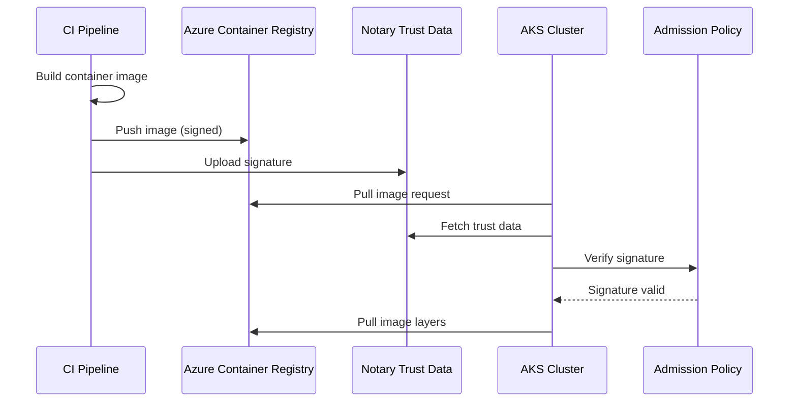

# How to Configure ACR Content Trust for Signed Container Image Verification

Author: [nawazdhandala](https://www.github.com/nawazdhandala)

Tags: ACR, Content Trust, Container Security, Docker, Image Signing, Notary, Azure

Description: Learn how to enable and configure Azure Container Registry content trust for signing and verifying container images in your CI/CD pipeline.

---

When you pull a container image from a registry, how do you know it has not been tampered with? Without image signing, you are trusting that the registry contents match what your CI pipeline built. Content trust adds a cryptographic layer of verification - images are signed by the publisher, and consumers can verify those signatures before running the image. Azure Container Registry (ACR) supports Docker Content Trust (DCT) based on The Update Framework (TUF), and in this post, I will show you how to set it up end-to-end.

## What Content Trust Gives You

Content trust provides two guarantees:

**Image integrity** - The image you pull is byte-for-byte identical to what the publisher pushed. Nobody has modified it in transit or at rest.

**Publisher verification** - The image was pushed by someone who holds the signing key. Even if an attacker gains access to the registry, they cannot push a signed image without the private key.

This is particularly important in regulated environments where you need to prove the provenance of every container running in production.

## How ACR Content Trust Works

ACR uses the Notary v1 protocol for content trust. When you push a signed image, the Docker client creates a signature using your private key and uploads it to the registry's trust data. When someone pulls the image with content trust enabled, the client downloads the trust data, verifies the signature, and only pulls the image if the signature is valid.

The signing infrastructure uses two types of keys:

- **Root key** - The master key that delegates trust. Keep this offline and secure.
- **Repository signing key** - Delegates trust for a specific repository. This is what you use day-to-day.

## Prerequisites

You need an ACR instance on the Premium tier (content trust is not available on Basic or Standard), Docker CLI installed, and Azure CLI authenticated with push access to the registry.

## Step 1: Enable Content Trust on ACR

Content trust must be enabled at the registry level.

```bash
# Enable content trust on the ACR instance
az acr config content-trust update \
  --registry myregistry \
  --status enabled
```

Verify the setting.

```bash
# Check content trust status
az acr config content-trust show \
  --registry myregistry
```

## Step 2: Set Up Docker Content Trust Locally

Configure your Docker client to use content trust by default.

```bash
# Enable Docker Content Trust globally
export DOCKER_CONTENT_TRUST=1

# Point to your ACR as the Notary server
export DOCKER_CONTENT_TRUST_SERVER=https://myregistry.azurecr.io

# Log in to ACR
az acr login --name myregistry
```

When `DOCKER_CONTENT_TRUST=1` is set, every docker push and docker pull operation will use content trust.

## Step 3: Push a Signed Image

Now push an image and Docker will automatically create the signing keys on first use.

```bash
# Tag your image for ACR
docker tag myapp:latest myregistry.azurecr.io/myapp:v1.0

# Push the image - Docker will prompt for key passphrases
docker push myregistry.azurecr.io/myapp:v1.0
```

On the first push, Docker will:

1. Generate a root key (if you do not already have one) and ask for a passphrase
2. Generate a repository signing key and ask for a passphrase
3. Sign the image tag
4. Push the image and the signature

The root key is stored at `~/.docker/trust/private/root_keys/`. Back this up immediately and store it somewhere secure. If you lose the root key, you cannot sign new images for any repository that was initialized with it.

## Step 4: Verify a Signed Image

To verify that an image is signed, use docker trust inspect.

```bash
# Inspect the trust data for an image
docker trust inspect --pretty myregistry.azurecr.io/myapp:v1.0
```

This shows the signers, the tags that are signed, and the signing key fingerprints. You should see output like:

```
Signatures for myregistry.azurecr.io/myapp

SIGNED TAG    DIGEST                                                           SIGNERS
v1.0          abc123def456...                                                  myregistry

List of signers and their keys:

SIGNER        KEYS
myregistry    abc123def456

Administrative keys for myregistry.azurecr.io/myapp

  Repository Key: abc123def456789...
  Root Key:       def456abc123789...
```

## Step 5: Pull with Verification

When content trust is enabled, pulling an unsigned image will fail.

```bash
# This will succeed - the image is signed
docker pull myregistry.azurecr.io/myapp:v1.0

# This will fail if the image is not signed
docker pull myregistry.azurecr.io/someother:latest
# Error: remote trust data does not exist
```

This is the enforcement mechanism. Only signed images can be pulled when content trust is enabled.

## Step 6: Delegate Signing to CI/CD

In a real pipeline, you do not want to enter passphrases interactively. Set up key delegation for automated signing.

First, export the repository signing key.

```bash
# Export the repository key
docker trust key export myregistry.azurecr.io/myapp --output repo-key.pem
```

Then configure your CI/CD pipeline to use the key. Here is an example for Azure DevOps.

```yaml
# azure-pipelines.yaml
# CI/CD pipeline with automated image signing
steps:
  - task: Docker@2
    displayName: 'Build and Push'
    inputs:
      containerRegistry: 'myACRConnection'
      repository: 'myapp'
      command: 'buildAndPush'
      Dockerfile: '**/Dockerfile'
      tags: '$(Build.BuildId)'
    env:
      # Enable content trust for the push
      DOCKER_CONTENT_TRUST: 1
      # Passphrase for the repository signing key
      DOCKER_CONTENT_TRUST_REPOSITORY_PASSPHRASE: $(signingPassphrase)
```

Store the signing key passphrase as a secret variable in your pipeline. The key itself should be loaded from a secure key vault.

## Step 7: Key Rotation

Periodically rotating signing keys is good practice. To rotate the repository signing key:

```bash
# Generate a new delegation key
docker trust key generate newkey

# Add the new key as a signer
docker trust signer add --key newkey.pub newsigner myregistry.azurecr.io/myapp

# Remove the old signer
docker trust signer remove oldsigner myregistry.azurecr.io/myapp
```

Root key rotation is more involved and should be done rarely since it requires re-signing all repository keys.

## Step 8: Enforce Signed Images in AKS

Having signed images is only half the story. You also need to ensure that AKS only runs signed images. Use Azure Policy or admission controllers to enforce this.

With Azure Policy, apply a built-in policy that requires images from trusted registries.

```bash
# Assign policy to only allow images from your ACR
az policy assignment create \
  --name "only-signed-images" \
  --display-name "Only allow signed container images" \
  --policy "febd0533-8e55-448f-b837-bd0e06f16469" \
  --scope "/subscriptions/<sub-id>/resourceGroups/myResourceGroup" \
  --params '{"allowedContainerImagesRegex": {"value": "^myregistry\\.azurecr\\.io/.+$"}}'
```

For stronger enforcement, use a Gatekeeper policy that checks image signatures using the Ratify project.

```yaml
# ratify-constraint.yaml
# Gatekeeper constraint that requires image signatures
apiVersion: constraints.gatekeeper.sh/v1beta1
kind: RatifyVerification
metadata:
  name: require-signed-images
spec:
  match:
    kinds:
      - apiGroups: [""]
        kinds: ["Pod"]
    namespaces:
      - default
      - production
  parameters:
    # Require at least one valid signature
    artifactVerificationPolicies:
      type: notation
      trustedIdentities:
        - "x509.subject: CN=myregistry.azurecr.io"
```

## The Signing and Verification Flow

Here is the complete flow from build to deployment.



## Troubleshooting

**"remote trust data does not exist" error.** The image tag has not been signed. Push it again with `DOCKER_CONTENT_TRUST=1` enabled.

**"could not rotate trust to a new trusted root" error.** This usually means the root key is not available locally. Import it from your backup.

**Slow pulls with content trust.** The signature verification adds a small overhead to each pull. This is usually negligible but can add up if you have many pods starting simultaneously.

**Lost root key.** This is the worst-case scenario. You cannot recover a lost root key. You will need to delete the trust data for affected repositories and re-initialize them with a new root key. Always keep multiple backups of the root key in secure, separate locations.

## Best Practices

**Never store root keys on CI machines.** Root keys should be on an air-gapped machine or in a hardware security module. Only repository signing keys should be on CI machines.

**Use separate signing keys per team.** Delegate signing authority to different teams by creating separate signing keys for each team's repositories.

**Audit signing activity.** ACR logs all push and trust operations. Send these to your SIEM to detect unauthorized signing attempts.

Content trust adds a meaningful layer of security to your container supply chain. It is not complicated to set up, and once it is running, it provides continuous assurance that every image in your cluster was built by your pipeline and has not been tampered with.
