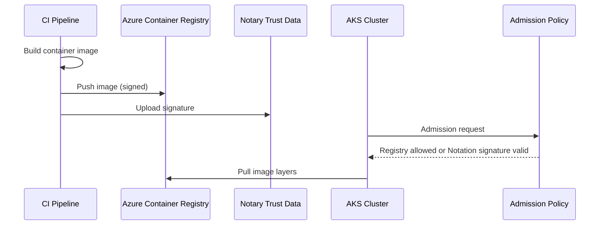

# How to Configure ACR Content Trust for Signed Container Image Verification

Author: [nawazdhandala](https://www.github.com/nawazdhandala)

Tags: ACR, Content Trust, Container Security, Docker, Image Signing, Notary, Azure

Description: Learn how to enable and configure Azure Container Registry content trust for signing and verifying container images in your CI/CD pipeline.

---

When you pull a container image from a registry, how do you know it has not been tampered with? Without image signing, you are trusting that the registry contents match what your CI pipeline built. Content trust adds a cryptographic layer of verification - images are signed by the publisher, and consumers can verify those signatures before running the image. Azure Container Registry (ACR) supports Docker Content Trust (DCT) based on The Update Framework (TUF) for registries that already had it enabled before May 31, 2026. DCT is deprecated and is scheduled for removal from ACR on March 31, 2028, so new deployments should plan a migration to Notary Project and Notation.

## What Content Trust Gives You

Content trust provides two guarantees:

**Image integrity** - The image you pull is byte-for-byte identical to what the publisher pushed. Nobody has modified it in transit or at rest.

**Publisher verification** - The image was pushed by someone who holds the signing key. Even if an attacker gains access to the registry, they cannot push a signed image without the private key.

This is particularly important in regulated environments where you need to prove the provenance of every container running in production.

## How ACR Content Trust Works

ACR uses the Notary v1 protocol for content trust. When you push a signed image, the Docker client creates a signature using your private key and uploads it to the registry's trust data. When someone pulls the image with content trust enabled, the client downloads the trust data, verifies the signature, and only pulls the image if the signature is valid.

The signing infrastructure uses several keys. The two keys you manage most directly are:

- **Root key** - The master key that delegates trust. Keep this offline and secure.
- **Repository signing key** - Delegates trust for a specific repository. This is what you use day-to-day.

## Prerequisites

You need an existing ACR instance on the Premium tier that already has content trust enabled or had enabled it before May 31, 2026. Content trust is not available on Basic or Standard, and Microsoft no longer allows DCT to be enabled on new registries or registries that did not previously enable it. You also need Docker CLI installed, Azure CLI authenticated with push access to the registry, and the `AcrImageSigner` role in addition to `AcrPush` for the identity that signs images.

## Step 1: Enable Content Trust on ACR

Content trust must be enabled at the registry level. This only works for registries that enabled DCT before Microsoft's May 31, 2026 cutoff.

```bash
# Enable content trust on the ACR instance

az acr config content-trust update \
  --registry myregistry \
  --status enabled
```

Verify the setting.

```bash
# Check content trust status
az acr config content-trust show \
  --registry myregistry
```

## Step 2: Set Up Docker Content Trust Locally

Configure your Docker client to use content trust by default.

```bash
# Enable Docker Content Trust globally
export DOCKER_CONTENT_TRUST=1

# Point to your ACR as the Notary server
export DOCKER_CONTENT_TRUST_SERVER=https://myregistry.azurecr.io

# Log in to ACR
az acr login --name myregistry
```

When `DOCKER_CONTENT_TRUST=1` is set, every docker push and docker pull operation will use content trust.

Before pushing signed images, make sure the signing identity has the `AcrImageSigner` role scoped to the registry.

```bash
# Grant signing permissions
REGISTRY_ID=$(az acr show --name myregistry --query id --output tsv)

az role assignment create \
  --scope "$REGISTRY_ID" \
  --role AcrImageSigner \
  --assignee user@contoso.com

# Refresh the local token after role changes
az acr login --name myregistry
```

## Step 3: Push a Signed Image

Now push an image and Docker will automatically create the signing keys on first use.

```bash
# Tag your image for ACR
docker tag myapp:latest myregistry.azurecr.io/myapp:v1.0

# Push the image - Docker will prompt for key passphrases
docker push myregistry.azurecr.io/myapp:v1.0
```

On the first push, Docker will:

1. Generate a root key (if you do not already have one) and ask for a passphrase
2. Generate a repository signing key and ask for a passphrase
3. Sign the image tag
4. Push the image and the signature

The root key is stored at `~/.docker/trust/private/root_keys/`. Back this up immediately and store it somewhere secure. If you lose the root key, you cannot sign new images for any repository that was initialized with it.

## Step 4: Verify a Signed Image

To verify that an image is signed, use docker trust inspect.

```bash
# Inspect the trust data for an image
docker trust inspect --pretty myregistry.azurecr.io/myapp:v1.0
```

This shows the signers, the tags that are signed, and the signing key fingerprints. You should see output like:

```text
Signatures for myregistry.azurecr.io/myapp

SIGNED TAG    DIGEST                                                           SIGNERS
v1.0          abc123def456...                                                  myregistry

List of signers and their keys:

SIGNER        KEYS
myregistry    abc123def456

Administrative keys for myregistry.azurecr.io/myapp

  Repository Key: abc123def456789...
  Root Key:       def456abc123789...
```

## Step 5: Pull with Verification

When content trust is enabled, pulling an unsigned image will fail.

```bash
# This will succeed - the image is signed
docker pull myregistry.azurecr.io/myapp:v1.0

# This will fail if the image is not signed
docker pull myregistry.azurecr.io/someother:latest
# Error: remote trust data does not exist
```

This is the enforcement mechanism. Only signed images can be pulled when content trust is enabled.

## Step 6: Delegate Signing to CI/CD

In a real pipeline, you do not want to enter passphrases interactively. Set up a delegation key for automated signing.

First, generate a delegation key on a secure development machine and add it as a signer for the repository.

```bash
# Generate a delegation key pair
docker trust key generate ci-signer

# Add the delegation public key as a signer
docker trust signer add --key ci-signer.pub ci-signer myregistry.azurecr.io/myapp
```

The private key is imported into your local Docker trust store when it is generated. Upload the private key file from `~/.docker/trust/private/` as an Azure Pipelines secure file, and configure your CI/CD pipeline to use it. Here is an example for Azure DevOps.

```yaml
# azure-pipelines.yaml
# CI/CD pipeline with automated image signing
variables:
  containerRegistryServiceConnection: myACRConnection
  imageRepository: myapp
  tag: $(Build.BuildId)

steps:
  - task: Docker@2
    displayName: 'Login'
    inputs:
      command: 'login'
      containerRegistry: '$(containerRegistryServiceConnection)'

  - task: DownloadSecureFile@1
    name: signingKey
    inputs:
      secureFile: '<delegation-key-id>.key'

  - script: |
      mkdir -p "$(DOCKER_CONFIG)/trust/private"
      cp "$(signingKey.secureFilePath)" "$(DOCKER_CONFIG)/trust/private/"
    displayName: 'Install signing key'

  - task: Docker@2
    displayName: 'Build'
    inputs:
      containerRegistry: '$(containerRegistryServiceConnection)'
      repository: '$(imageRepository)'
      command: 'build'
      Dockerfile: '**/Dockerfile'
      tags: '$(tag)'

  - task: Docker@2
    displayName: 'Push signed image'
    inputs:
      containerRegistry: '$(containerRegistryServiceConnection)'
      repository: '$(imageRepository)'
      command: 'push'
      tags: '$(tag)'
    env:
      # Enable content trust for the push
      DOCKER_CONTENT_TRUST: 1
      # Passphrase for the delegation private key
      DOCKER_CONTENT_TRUST_REPOSITORY_PASSPHRASE: $(signingPassphrase)
```

Store the signing key passphrase as a secret variable in your pipeline. The service connection identity also needs the `AcrImageSigner` role in the target registry.

## Step 7: Key Rotation

Periodically rotating signing keys is good practice. To rotate the repository signing key:

```bash
# Generate a new delegation key
docker trust key generate newkey

# Add the new key as a signer
docker trust signer add --key newkey.pub newsigner myregistry.azurecr.io/myapp

# Remove the old signer
docker trust signer remove oldsigner myregistry.azurecr.io/myapp
```

Root key rotation is more involved and should be done rarely since it requires re-signing all repository keys.

## Step 8: Enforce Signed Images in AKS

Having signed images is only half the story. Docker Content Trust is enforced by Docker clients, but AKS does not automatically verify DCT signatures when it pulls images. Use Azure Policy to restrict where images can come from, and use Notation/Ratify if you need Kubernetes admission-time signature verification.

With Azure Policy, apply a built-in policy that requires images from trusted registries. This does not verify DCT signatures; it only limits image sources.

```bash
# Assign policy to only allow images from your ACR
az policy assignment create \
  --name "only-acr-images" \
  --display-name "Only allow images from my ACR" \
  --policy "febd0533-8e55-448f-b837-bd0e06f16469" \
  --scope "/subscriptions/<sub-id>/resourceGroups/myResourceGroup" \
  --params '{"allowedContainerImagesRegex": {"value": "^myregistry\\.azurecr\\.io/.+$"}, "effect": {"value": "Deny"}}'
```

For stronger enforcement, sign images with Notation and use Ratify with Azure Policy or Gatekeeper to check Notary Project signatures. Ratify verifies Notary Project or other supported signature formats; it is not a DCT/Notary v1 verifier. The Gatekeeper policy is installed from the Ratify library after Ratify is configured with a Notation verifier and trust policy.

```bash
# Install the Ratify Gatekeeper template and default constraint
kubectl apply -f https://notaryproject.github.io/ratify/library/default/template.yaml
kubectl apply -f https://notaryproject.github.io/ratify/library/default/samples/constraint.yaml
```

## The Signing and Verification Flow

Here is the complete flow from build to deployment.


```mermaid
sequenceDiagram
    participant CI as CI Pipeline
    participant ACR as Azure Container Registry
    participant Notary as Notary Trust Data
    participant AKS as AKS Cluster
    participant Policy as Admission Policy

    CI->>CI: Build container image
    CI->>ACR: Push image (signed)
    CI->>Notary: Upload signature
    AKS->>Policy: Admission request
    Policy-->>AKS: Registry allowed or Notation signature valid
    AKS->>ACR: Pull image layers
```

## Troubleshooting

**"remote trust data does not exist" error.** The image tag has not been signed. Push it again with `DOCKER_CONTENT_TRUST=1` enabled.

**"could not rotate trust to a new trusted root" error.** This usually means the root key is not available locally. Import it from your backup.

**Slow pulls with content trust.** The signature verification adds a small overhead to each pull. This is usually negligible but can add up if you have many pods starting simultaneously.

**Lost root key.** This is the worst-case scenario. You cannot recover a lost root key. You will need to delete the trust data for affected repositories and re-initialize them with a new root key. Always keep multiple backups of the root key in secure, separate locations.

## Best Practices

**Never store root keys on CI machines.** Root keys should be on an air-gapped machine or in a hardware security module. Only repository signing keys should be on CI machines.

**Use separate signing keys per team.** Delegate signing authority to different teams by creating separate signing keys for each team's repositories.

**Audit signing activity.** ACR logs all push and trust operations. Send these to your SIEM to detect unauthorized signing attempts.

Content trust adds a meaningful layer of security to your container supply chain for Docker clients that enforce it. Because ACR DCT is deprecated, use it only for existing DCT workflows and plan to move cluster enforcement to Notary Project, Notation, Ratify, or another supported admission-time verification system.
