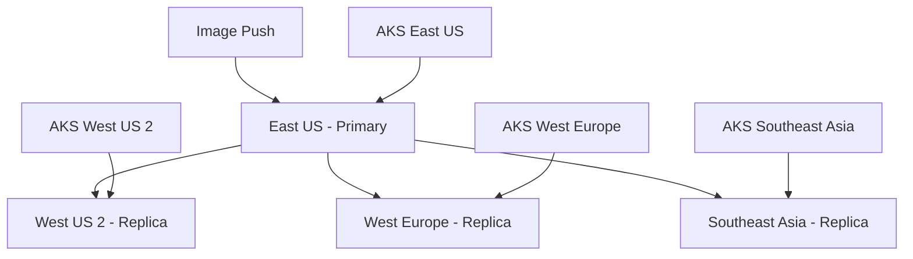

# How to Configure ACR Geo-Replication with Automatic Failover for Disaster Recovery

Author: [nawazdhandala](https://www.github.com/nawazdhandala)

Tags: ACR, Azure Container Registry, Geo-Replication, Disaster Recovery, Azure, Containers, High Availability

Description: Learn how to configure Azure Container Registry geo-replication for multi-region image availability and automatic failover during regional outages.

---

Your AKS cluster in East US is pulling container images from ACR in East US. Everything is fast and reliable. Then one morning, Azure East US has a partial outage and your ACR endpoint goes down. Every pod that gets rescheduled fails to start because it cannot pull its image. Your application is technically running in a healthy region, but it cannot scale or self-heal because the image source is unavailable.

ACR geo-replication solves this by replicating your container images across multiple Azure regions. When one region goes down, image pulls automatically route to the nearest healthy replica. Your clusters keep running as if nothing happened.

## Prerequisites

ACR geo-replication requires the Premium SKU. If you are on Basic or Standard, you need to upgrade first.

```bash
# Check your current ACR SKU
az acr show --name myacr --query sku.name -o tsv

# Upgrade to Premium if needed
az acr update --name myacr --sku Premium
```

The Premium SKU costs more, but for production workloads the investment in geo-replication and availability is worth every cent.

## Enabling Geo-Replication

Adding a replication is a single command. ACR will start copying all existing images to the new region immediately.

```bash
# Add a replication in West US 2
az acr replication create \
  --registry myacr \
  --location westus2

# Add another in West Europe for global coverage
az acr replication create \
  --registry myacr \
  --location westeurope

# Add one in Southeast Asia
az acr replication create \
  --registry myacr \
  --location southeastasia

# List all replications
az acr replication list --registry myacr -o table
```

Each replication creates a full copy of your registry in the target region. New images pushed to any replication endpoint are automatically synced to all other regions.

## Understanding the Replication Architecture

When you push an image to ACR, it goes to the region closest to you (or the region you are pushing to). ACR then asynchronously replicates that image to all other configured regions. The replication happens in the background and typically completes within seconds for small images and a few minutes for large ones.



Each AKS cluster pulls from its closest replication. If that replication is unavailable, traffic automatically routes to the next closest healthy one.

## Configuring Zone Redundancy

Within each region, you can enable zone redundancy to protect against availability zone failures. This replicates the registry data across multiple zones within the same region.

```bash
# Create a zone-redundant replication
az acr replication create \
  --registry myacr \
  --location eastus2 \
  --zone-redundancy enabled

# Update an existing replication to be zone redundant
# Note: you cannot change zone redundancy on existing replications
# You need to delete and recreate
az acr replication delete --registry myacr --location westus2
az acr replication create \
  --registry myacr \
  --location westus2 \
  --zone-redundancy enabled
```

Zone redundancy protects against failure of a single availability zone within a region. Combined with geo-replication, you get protection against both zone and region failures.

## How Automatic Failover Works

ACR uses Azure Traffic Manager behind the scenes to route image pull requests. When a client (like an AKS node) pulls an image using the registry's FQDN (for example, `myacr.azurecr.io`), the DNS resolution returns the IP of the closest healthy replication.

The failover process works like this.

1. AKS kubelet requests `myacr.azurecr.io/myapp:v1.2.3`.
2. DNS resolves to the closest healthy ACR replication endpoint.
3. If the closest replication is unhealthy, DNS resolves to the next closest one.
4. The image pull succeeds from the healthy replication.

This is transparent to your AKS configuration. You do not need to change any image references or pull secrets. The same `myacr.azurecr.io` address works across all regions.

## Testing Failover

You can simulate a failover scenario by disabling a replication and observing that pulls still work.

```bash
# Check the health of all replications
az acr replication list --registry myacr -o table

# Pull an image from your AKS cluster and note the response time
# Normal pull from the local region should be fast
time docker pull myacr.azurecr.io/myapp:latest

# To test failover, you can check the replication status
az acr replication show \
  --registry myacr \
  --location eastus \
  --query "status" -o json
```

For a more thorough test, deploy a pod in each region and verify it can pull images.

```yaml
# pull-test-pod.yaml
# Simple pod to test image pull from ACR
apiVersion: v1
kind: Pod
metadata:
  name: acr-pull-test
spec:
  containers:
    - name: test
      image: myacr.azurecr.io/myapp:latest
      command: ["sleep", "3600"]
  restartPolicy: Never
```

## Monitoring Replication Health

Set up monitoring to know when a replication is unhealthy before it affects your workloads.

```bash
# Check replication status programmatically
az acr replication list --registry myacr --query "[].{Location:location, Status:status.displayStatus}" -o table

# Set up an Azure Monitor alert for replication failures
az monitor metrics alert create \
  --name "acr-replication-lag" \
  --resource-group myRG \
  --scopes "/subscriptions/<sub-id>/resourceGroups/myRG/providers/Microsoft.ContainerRegistry/registries/myacr" \
  --condition "avg SuccessfulPullCount < 1 where Geolocation includes westus2" \
  --description "ACR replication in West US 2 may be unhealthy" \
  --action-group "/subscriptions/<sub-id>/resourceGroups/myRG/providers/microsoft.insights/actionGroups/ops-team"
```

You should also monitor the replication lag to know how long it takes for images to propagate.

```bash
# Check webhook notifications for replication events
az acr webhook create \
  --registry myacr \
  --name replicationNotify \
  --actions chart_push chart_delete push delete \
  --uri "https://your-webhook-endpoint.example.com/acr-events" \
  --scope "myapp:*"
```

## Optimizing Pull Performance

With geo-replication in place, there are additional steps to optimize image pull performance for your AKS clusters.

### Enable Dedicated Data Endpoints

By default, all image data goes through the registry's single endpoint. Dedicated data endpoints provide region-specific data endpoints that can improve throughput.

```bash
# Enable dedicated data endpoints
az acr update --name myacr --data-endpoint-enabled true

# Verify the data endpoints
az acr show --name myacr --query "dataEndpointHostNames" -o json
```

### Use Artifact Streaming

For large images, Azure offers artifact streaming that allows pods to start before the full image is downloaded.

```bash
# Enable artifact streaming on the ACR
az acr artifact-streaming create \
  --registry myacr \
  --repository myapp \
  --filter "v*"
```

### Configure AKS Image Pull Caching

Combine ACR geo-replication with AKS node-level image caching.

```yaml
# deployment-with-pull-policy.yaml
# Use IfNotPresent to leverage local node image cache
apiVersion: apps/v1
kind: Deployment
metadata:
  name: myapp
spec:
  replicas: 3
  selector:
    matchLabels:
      app: myapp
  template:
    metadata:
      labels:
        app: myapp
    spec:
      containers:
        - name: app
          image: myacr.azurecr.io/myapp:v1.2.3
          # IfNotPresent means the node uses its cached copy if available
          # This reduces ACR pull traffic and speeds up pod starts
          imagePullPolicy: IfNotPresent
```

## Cost Considerations

Each geo-replication adds to your ACR bill. The cost includes the Premium tier base price per replicated region plus storage costs for the duplicated images. For a registry with 100 GB of images replicated to 3 additional regions, you are looking at roughly 4x the storage cost.

To manage costs, consider these strategies.

```bash
# Set up a retention policy to automatically delete old untagged manifests
az acr config retention update \
  --registry myacr \
  --status enabled \
  --days 30 \
  --type UntaggedManifests

# Purge old tags that are no longer in use
az acr run \
  --registry myacr \
  --cmd "acr purge --filter 'myapp:.*' --ago 90d --untagged --keep 10" \
  /dev/null
```

## Multi-Region AKS Deployment Pattern

Here is a complete pattern for deploying the same application across multiple regions, each pulling from its local ACR replication.

```bash
# Create AKS clusters in multiple regions, all attached to the same ACR
REGIONS=("eastus" "westus2" "westeurope")

for REGION in "${REGIONS[@]}"; do
  # Create a cluster in each region
  az aks create \
    --resource-group "aks-${REGION}-rg" \
    --name "aks-${REGION}" \
    --location "$REGION" \
    --attach-acr myacr \
    --node-count 3

  # Ensure ACR has a replication in this region
  az acr replication create \
    --registry myacr \
    --location "$REGION" 2>/dev/null || true
done
```

Each cluster uses the same image reference (`myacr.azurecr.io/myapp:v1.2.3`), but the pull is served from the local replication, keeping latency low and providing automatic failover.

## Wrapping Up

ACR geo-replication is a straightforward way to build resilience into your container image infrastructure. Once configured, it requires essentially zero ongoing management - images replicate automatically, failover is transparent, and your AKS clusters always have a nearby source for image pulls. The key decisions are which regions to replicate to (match your AKS cluster locations), whether to enable zone redundancy (yes, for production), and how aggressively to prune old images to keep storage costs manageable. For any production deployment spanning multiple regions, ACR geo-replication should be considered a baseline requirement, not an optional extra.
