# How to Configure AKS Cluster Upgrade Strategy with Max Surge and Node Drain Timeout

Author: [nawazdhandala](https://www.github.com/nawazdhandala)

Tags: AKS, Kubernetes, Cluster Upgrade, Max Surge, Node Drain, Azure, Operations

Description: Learn how to configure AKS cluster upgrade strategies using max surge and node drain timeout to minimize downtime during Kubernetes version upgrades.

---

Upgrading an AKS cluster is one of those operations that can either be smooth and uneventful or turn into a multi-hour firefight with pods stuck in terminating states and services going dark. The difference usually comes down to how you configure two key parameters: max surge and node drain timeout. Getting these right means your workloads keep running while the cluster nodes roll through the upgrade. Getting them wrong means angry users and late nights.

This guide covers the mechanics of AKS node pool upgrades, how max surge and drain timeout work together, and the practical configurations that work for different types of workloads.

## How AKS Upgrades Work Under the Hood

When you upgrade an AKS cluster, the control plane upgrades first, then each node pool upgrades separately. The node pool upgrade follows a rolling update pattern. AKS creates new nodes running the target Kubernetes version, cordons and drains the old nodes (moving workloads off them), and then deletes the old nodes once they are empty.

The critical question is: how many new nodes does AKS spin up at once, and how long does it wait for pods to gracefully terminate? That is where max surge and drain timeout come in.

## Understanding Max Surge

Max surge controls how many additional nodes AKS creates during an upgrade, beyond the current node count. If your node pool has 5 nodes and max surge is set to 1, AKS will temporarily have 6 nodes - 5 existing plus 1 new. It upgrades one node at a time. If max surge is 3, it will have up to 8 nodes simultaneously and upgrade 3 nodes in parallel.

You can express max surge as an absolute number or a percentage of the node pool size.

```bash
# Set max surge to 1 extra node (default, safest, slowest)
az aks nodepool update \
  --resource-group myRG \
  --cluster-name myAKS \
  --name nodepool1 \
  --max-surge 1

# Set max surge to 33% of the pool - for a 9-node pool, this means 3 extra nodes
az aks nodepool update \
  --resource-group myRG \
  --cluster-name myAKS \
  --name nodepool1 \
  --max-surge 33%

# Set max surge to match pool size for fastest upgrade (doubles the nodes temporarily)
az aks nodepool update \
  --resource-group myRG \
  --cluster-name myAKS \
  --name nodepool1 \
  --max-surge 100%
```

The tradeoff is straightforward. Higher max surge values mean faster upgrades but higher temporary costs and more Azure quota usage. A max surge of 100% essentially doubles your node count during the upgrade, which is expensive but finishes quickly. A max surge of 1 is the cheapest option but takes the longest.

## Understanding Node Drain Timeout

When AKS drains a node, it sends a graceful termination signal to all pods on that node. Pods have their `terminationGracePeriodSeconds` to shut down cleanly. But what happens if a pod refuses to terminate? Or if a PodDisruptionBudget prevents the drain from completing?

By default, AKS will wait indefinitely. Yes, indefinitely. If a pod is stuck or a PDB is too restrictive, the upgrade hangs. The node drain timeout puts a cap on how long AKS waits before moving on.

```bash
# Set a 30-minute drain timeout
az aks nodepool update \
  --resource-group myRG \
  --cluster-name myAKS \
  --name nodepool1 \
  --drain-timeout 30

# The value is in minutes. Set to 0 for no timeout (default behavior)
az aks nodepool update \
  --resource-group myRG \
  --cluster-name myAKS \
  --name nodepool1 \
  --drain-timeout 0
```

When the timeout expires, AKS forcefully removes the remaining pods and proceeds with deleting the node. This means those pods will be killed without a graceful shutdown. For most stateless workloads this is fine - the pod gets rescheduled on a new node. For stateful workloads, you need to think carefully about what happens if a pod is killed mid-operation.

## Combining Max Surge and Drain Timeout

The best configuration depends on your workload characteristics. Here are the configurations I use for different scenarios.

### Stateless Web Applications

For services that are horizontally scaled and stateless, prioritize speed.

```bash
# Fast upgrades for stateless workloads
az aks nodepool update \
  --resource-group myRG \
  --cluster-name myAKS \
  --name web-pool \
  --max-surge 33% \
  --drain-timeout 15
```

With 33% max surge, a 9-node pool upgrades 3 nodes at a time. The 15-minute drain timeout ensures the upgrade does not hang on stubborn pods. Since the workloads are stateless, forced termination is acceptable.

### Stateful Workloads (Databases, Queues)

For stateful services, be more conservative.

```bash
# Conservative upgrades for stateful workloads
az aks nodepool update \
  --resource-group myRG \
  --cluster-name myAKS \
  --name data-pool \
  --max-surge 1 \
  --drain-timeout 60
```

Max surge of 1 means only one node upgrades at a time, giving your stateful services time to rebalance. The 60-minute timeout is generous enough for databases to flush their buffers and complete replication, but still prevents infinite hangs.

### Batch Processing Pools

For node pools running long-running batch jobs, you need the longest drain timeout.

```bash
# Patient upgrades for batch processing
az aks nodepool update \
  --resource-group myRG \
  --cluster-name myAKS \
  --name batch-pool \
  --max-surge 1 \
  --drain-timeout 120
```

Two hours gives most batch jobs time to finish. But the better approach is to schedule upgrades during off-hours when no batch jobs are running.

## Setting Node Surge During Cluster Creation

You can also set max surge when creating a node pool, not just when updating it.

```bash
# Create a node pool with upgrade settings configured from the start
az aks nodepool add \
  --resource-group myRG \
  --cluster-name myAKS \
  --name gpupool \
  --node-count 4 \
  --node-vm-size Standard_NC6s_v3 \
  --max-surge 1 \
  --drain-timeout 45
```

## PodDisruptionBudgets and Drain Behavior

PodDisruptionBudgets (PDBs) are the most common cause of drain timeouts. A PDB that says "always keep at least 3 replicas running" with only 3 replicas total means the drain can never proceed because evicting any pod would violate the budget.

Here is a PDB that works well with rolling upgrades.

```yaml
# good-pdb.yaml
# This PDB allows one pod to be unavailable at a time
# Works well with rolling upgrades as long as you have at least 2 replicas
apiVersion: policy/v1
kind: PodDisruptionBudget
metadata:
  name: web-app-pdb
spec:
  maxUnavailable: 1
  selector:
    matchLabels:
      app: web-app
```

Avoid PDBs that use `minAvailable` equal to your replica count. That creates an impossible constraint during drains.

```yaml
# bad-pdb.yaml - DO NOT DO THIS
# This PDB prevents any eviction if replicas equals minAvailable
apiVersion: policy/v1
kind: PodDisruptionBudget
metadata:
  name: web-app-pdb-bad
spec:
  minAvailable: 3  # If you only have 3 replicas, drain will never complete
  selector:
    matchLabels:
      app: web-app
```

## Monitoring Upgrade Progress

Once an upgrade is running, monitor it with these commands.

```bash
# Watch the upgrade status
az aks show \
  --resource-group myRG \
  --name myAKS \
  --query "provisioningState" \
  -o tsv

# Watch node pool upgrade status
az aks nodepool show \
  --resource-group myRG \
  --cluster-name myAKS \
  --name nodepool1 \
  --query "provisioningState" \
  -o tsv

# Watch nodes rolling in real-time
kubectl get nodes -w

# Check for pods stuck in Terminating state (the drain timeout will handle these)
kubectl get pods --all-namespaces --field-selector=status.phase=Running -o wide | grep -i terminating
```

## Upgrade Strategy Visualization

Here is how the upgrade process flows with max surge set to 2 on a 4-node pool.

```mermaid
gantt
    title AKS Node Pool Upgrade (4 nodes, max surge 2)
    dateFormat  HH:mm
    axisFormat  %H:%M
    section Phase 1
    Create surge node A     :a1, 00:00, 5min
    Create surge node B     :a2, 00:00, 5min
    Drain old node 1        :a3, after a1, 10min
    Drain old node 2        :a4, after a2, 10min
    Delete old node 1       :a5, after a3, 2min
    Delete old node 2       :a6, after a4, 2min
    section Phase 2
    Create surge node C     :b1, after a5, 5min
    Create surge node D     :b2, after a6, 5min
    Drain old node 3        :b3, after b1, 10min
    Drain old node 4        :b4, after b2, 10min
    Delete old node 3       :b5, after b3, 2min
    Delete old node 4       :b6, after b4, 2min
```



## Handling Upgrade Failures

If an upgrade fails mid-way through, AKS leaves the cluster in a mixed state with some nodes on the old version and some on the new version. This is actually fine - workloads continue running. You can retry the upgrade.

```bash
# Retry a failed upgrade
az aks upgrade \
  --resource-group myRG \
  --name myAKS \
  --kubernetes-version 1.28.5

# If you need to roll back, you cannot downgrade the control plane
# but you can create a new node pool on the old version
az aks nodepool add \
  --resource-group myRG \
  --cluster-name myAKS \
  --name rollback-pool \
  --kubernetes-version 1.27.9 \
  --node-count 4
```

## Wrapping Up

Max surge and drain timeout are the two levers you have to control the speed and safety of AKS upgrades. For most clusters, a max surge of 33% and a drain timeout of 30 minutes is a solid starting point. Adjust from there based on your workload types - stateless services can tolerate aggressive settings, while stateful workloads need a gentler approach. Always check your PodDisruptionBudgets before upgrading, because a misconfigured PDB is the number one cause of stuck upgrades. And test your upgrade configuration in a staging cluster before applying it to production. The few extra minutes of preparation will save you hours of troubleshooting.
