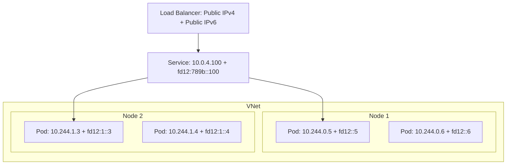

# How to Configure AKS Cluster with Dual-Stack IPv4 and IPv6 Networking

Author: [nawazdhandala](https://www.github.com/nawazdhandala)

Tags: AKS, IPv6, Dual-Stack, Networking, Kubernetes, Azure, IPv4

Description: Complete guide to setting up AKS with dual-stack IPv4 and IPv6 networking for pods, services, and external connectivity.

---

IPv6 adoption is accelerating, and many organizations now need their Kubernetes workloads to support both IPv4 and IPv6 traffic. Dual-stack networking on AKS assigns both an IPv4 and an IPv6 address to every pod and supports both address families for services and ingress. This guide walks through the full setup of a dual-stack AKS cluster, from VNet configuration to service exposure.

## Why Dual-Stack

Several factors drive the need for dual-stack:

- Mobile networks are increasingly IPv6-first, and NAT64 adds latency
- Government and enterprise compliance requirements mandate IPv6 support
- IoT devices often communicate over IPv6
- Some Azure regions and services work better with IPv6 native traffic

Dual-stack does not mean abandoning IPv4. It means your services can handle both, letting clients connect using whichever protocol they prefer.

## Prerequisites

Dual-stack AKS requires Kubernetes 1.27 or later, Azure CNI (overlay mode is recommended), and a VNet configured with both IPv4 and IPv6 address spaces. You need Azure CLI 2.48 or later.

## Step 1: Create a Dual-Stack VNet

The VNet needs address spaces for both IPv4 and IPv6, and each subnet needs both an IPv4 and IPv6 prefix.

```bash
# Create a resource group
az group create --name dualstack-rg --location eastus

# Create a VNet with both IPv4 and IPv6 address spaces
az network vnet create \
  --resource-group dualstack-rg \
  --name dualstack-vnet \
  --address-prefixes 10.0.0.0/16 fd00:db8::/48 \
  --subnet-name aks-subnet \
  --subnet-prefixes 10.0.0.0/24 fd00:db8::/64
```

The `fd00:db8::/48` is a Unique Local Address (ULA) range for IPv6. In production, you would use a globally routable IPv6 prefix assigned by Azure or your ISP.

## Step 2: Create the Dual-Stack AKS Cluster

Create the cluster with the dual-stack feature enabled and pointing to the VNet.

```bash
# Get the subnet ID
SUBNET_ID=$(az network vnet subnet show \
  --resource-group dualstack-rg \
  --vnet-name dualstack-vnet \
  --name aks-subnet \
  --query id -o tsv)

# Create a dual-stack AKS cluster
az aks create \
  --resource-group dualstack-rg \
  --name dualstack-cluster \
  --network-plugin azure \
  --vnet-subnet-id $SUBNET_ID \
  --pod-cidrs 10.244.0.0/16,fd12:3456:789a::/48 \
  --service-cidrs 10.0.4.0/24,fd12:3456:789b::/108 \
  --dns-service-ip 10.0.4.10 \
  --ip-families IPv4,IPv6 \
  --node-count 3 \
  --generate-ssh-keys
```

Key parameters to understand:

- `--pod-cidrs` takes two CIDR ranges - one for IPv4 pods and one for IPv6 pods
- `--service-cidrs` takes two ranges for service ClusterIPs
- `--ip-families IPv4,IPv6` enables dual-stack with IPv4 as the primary family
- The order of IP families matters - the first one is the primary

## Step 3: Verify Dual-Stack Configuration

After cluster creation, verify that nodes and pods have dual-stack addresses.

```bash
# Get cluster credentials
az aks get-credentials --resource-group dualstack-rg --name dualstack-cluster

# Check node addresses - should show both IPv4 and IPv6
kubectl get nodes -o wide

# Check node internal IPs
kubectl get nodes -o jsonpath='{range .items[*]}{.metadata.name}{"\t"}{range .status.addresses[*]}{.type}:{.address}{"\t"}{end}{"\n"}{end}'
```

Each node should have both an InternalIP (IPv4) and an InternalIP (IPv6).

## Step 4: Deploy a Dual-Stack Application

Deploy a simple application and verify it gets both IPv4 and IPv6 addresses.

```yaml
# dual-stack-app.yaml
# Application deployment for testing dual-stack networking
apiVersion: apps/v1
kind: Deployment
metadata:
  name: dual-stack-app
  namespace: default
spec:
  replicas: 3
  selector:
    matchLabels:
      app: dual-stack-app
  template:
    metadata:
      labels:
        app: dual-stack-app
    spec:
      containers:
        - name: nginx
          image: nginx:1.25
          ports:
            - containerPort: 80
```

Apply it and check the pod IPs.

```bash
# Deploy the application
kubectl apply -f dual-stack-app.yaml

# Check pod IPs - each pod should have both IPv4 and IPv6
kubectl get pods -o wide -l app=dual-stack-app

# Get detailed IP information
kubectl get pods -l app=dual-stack-app -o jsonpath='{range .items[*]}{.metadata.name}{"\t"}{.status.podIPs}{"\n"}{end}'
```

Each pod should show two IPs in the podIPs field - one from the IPv4 pod CIDR and one from the IPv6 pod CIDR.

## Step 5: Create Dual-Stack Services

Services in a dual-stack cluster can be configured for IPv4 only, IPv6 only, or both.

```yaml
# dual-stack-services.yaml
# Service that supports both IPv4 and IPv6 (dual-stack)
apiVersion: v1
kind: Service
metadata:
  name: dual-stack-svc
  namespace: default
spec:
  # RequireDualStack means the service gets both IPv4 and IPv6 ClusterIPs
  ipFamilyPolicy: RequireDualStack
  ipFamilies:
    - IPv4
    - IPv6
  selector:
    app: dual-stack-app
  ports:
    - port: 80
      targetPort: 80
---
# Service that only uses IPv4
apiVersion: v1
kind: Service
metadata:
  name: ipv4-only-svc
  namespace: default
spec:
  ipFamilyPolicy: SingleStack
  ipFamilies:
    - IPv4
  selector:
    app: dual-stack-app
  ports:
    - port: 80
      targetPort: 80
---
# Service that only uses IPv6
apiVersion: v1
kind: Service
metadata:
  name: ipv6-only-svc
  namespace: default
spec:
  ipFamilyPolicy: SingleStack
  ipFamilies:
    - IPv6
  selector:
    app: dual-stack-app
  ports:
    - port: 80
      targetPort: 80
```

Apply and verify.

```bash
# Create all three services
kubectl apply -f dual-stack-services.yaml

# Check ClusterIPs for each service
kubectl get svc dual-stack-svc ipv4-only-svc ipv6-only-svc
```

The dual-stack service should show two ClusterIPs (one IPv4, one IPv6). The single-stack services show only one each.

## Step 6: Expose Dual-Stack Services Externally

To expose a dual-stack service externally, use a LoadBalancer service. Azure supports dual-stack load balancers.

```yaml
# external-dual-stack.yaml
# LoadBalancer service with both IPv4 and IPv6 external IPs
apiVersion: v1
kind: Service
metadata:
  name: dual-stack-lb
  namespace: default
  annotations:
    # Request a dual-stack Azure Load Balancer
    service.beta.kubernetes.io/azure-load-balancer-ipv6: "true"
spec:
  type: LoadBalancer
  ipFamilyPolicy: RequireDualStack
  ipFamilies:
    - IPv4
    - IPv6
  selector:
    app: dual-stack-app
  ports:
    - port: 80
      targetPort: 80
```

```bash
# Create the LoadBalancer service
kubectl apply -f external-dual-stack.yaml

# Wait for external IPs to be assigned
kubectl get svc dual-stack-lb -w
```

The service should receive both an IPv4 and an IPv6 external IP address.

## Dual-Stack Network Architecture

Here is how the dual-stack networking is structured.



## Step 7: Configure Ingress for Dual-Stack

If you use NGINX Ingress Controller, configure it to listen on both IPv4 and IPv6.

```bash
# Install NGINX Ingress with dual-stack support
helm install ingress-nginx ingress-nginx/ingress-nginx \
  --namespace ingress-nginx \
  --create-namespace \
  --set controller.service.ipFamilyPolicy=RequireDualStack \
  --set controller.service.ipFamilies="{IPv4,IPv6}"
```

Then create your ingress resources as usual. NGINX will accept connections on both IPv4 and IPv6 addresses.

## Step 8: Test Connectivity

Verify that pods can communicate using both protocols.

```bash
# Deploy a test pod
kubectl run test-client --image=busybox:1.36 --rm -it -- /bin/sh

# Inside the test pod, test IPv4 connectivity
wget -qO- http://10.0.4.100  # IPv4 ClusterIP

# Test IPv6 connectivity
wget -qO- http://[fd12:3456:789b::100]  # IPv6 ClusterIP

# Test DNS resolution (should return both A and AAAA records)
nslookup dual-stack-svc.default.svc.cluster.local
```

## Troubleshooting

**Pods only get IPv4 addresses.** Verify the cluster was created with `--ip-families IPv4,IPv6` and the pod CIDRs include an IPv6 range. Check the Azure CNI configuration on the nodes.

**IPv6 service not reachable.** Check that kube-proxy is configured for dual-stack. On AKS, this should be automatic, but verify with `kubectl get configmap kube-proxy -n kube-system -o yaml`.

**External IPv6 not working.** Make sure your VNet has a public IPv6 prefix and the subnet is configured for dual-stack. Also verify that any NSG rules allow IPv6 traffic.

**DNS not returning AAAA records.** CoreDNS in AKS should automatically handle dual-stack. Check that the service has `ipFamilyPolicy: RequireDualStack` and both IP families are listed.

## Limitations to Be Aware Of

- Not all Azure regions support IPv6 for all VM sizes
- Azure network policies have limited IPv6 support; consider using Calico instead
- Some Azure PaaS services do not yet support IPv6 connectivity
- Windows node pools have limited dual-stack support

## Migration Strategy

If you are migrating an existing IPv4-only cluster to dual-stack, the safest approach is to create a new dual-stack cluster and migrate workloads. You cannot convert an existing single-stack cluster to dual-stack in place.

Dual-stack on AKS is production-ready and straightforward to set up. The key is planning your IPv6 address space carefully, just as you would with IPv4, and verifying that all components in your stack - ingress, services, DNS, and external load balancers - are configured to handle both protocols.
