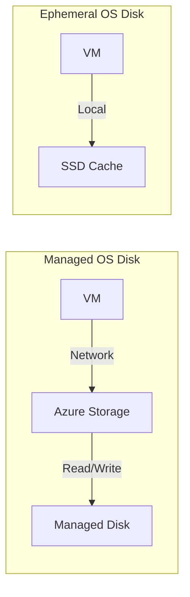

# How to Configure AKS Ephemeral OS Disks for Faster Node Scaling and Reduced Costs

Author: [nawazdhandala](https://www.github.com/nawazdhandala)

Tags: AKS, Ephemeral OS Disks, Kubernetes, Performance, Cost Optimization, Azure, Node Pools

Description: Learn how to configure AKS with ephemeral OS disks for faster node boot times, lower latency, and reduced storage costs.

---

Every AKS node has an OS disk, and by default that disk is a managed Azure disk stored remotely in Azure Storage. Every read and write to the OS disk goes over the network to the storage backend, adding latency. Ephemeral OS disks change this by using the VM's local SSD or temp disk for the OS. The disk lives on the physical machine hosting your VM, so reads and writes are local and fast. The tradeoff is that the data is lost if the VM is deallocated or reimaged - but for AKS nodes, that is perfectly fine since node state should be disposable anyway.

## Why Ephemeral OS Disks Matter

The performance difference is real and measurable. Here is what you get:

**Faster node boot times.** Creating a managed disk involves an API call to Azure Storage, provisioning the disk, and attaching it. With ephemeral disks, the OS image is copied to the local SSD, which is significantly faster. Nodes boot 30-50% quicker, which directly affects scaling speed.

**Lower read/write latency.** Container image pulls, log writes, and OS operations hit the local SSD instead of going over the network. This reduces P99 latency for IO-heavy operations.

**No disk costs.** Managed OS disks cost money - a 128GB Premium SSD runs about $19/month per node. With 100 nodes, that is $1,900/month just for OS disks you can eliminate.

**Faster reimaging.** When a node needs to be reimaged (for updates or recovery), ephemeral disks make the process much faster since there is no remote disk to detach and reattach.

## How Ephemeral OS Disks Work

Ephemeral OS disks can be placed in two locations:

**OS cache** - Uses the VM's OS disk cache. This is the default and preferred placement. The cache size depends on the VM size.

**Resource disk (temp disk)** - Uses the VM's temporary disk. This is available on VM sizes that have a temp disk and is useful when the cache is too small.

The OS image is written to the chosen location at VM creation time. All subsequent reads and writes happen locally. When the VM is deallocated, the data is gone. But since AKS nodes are managed by node pools and can be recreated at any time, this is expected behavior.

## Prerequisites

You need an AKS cluster and Azure CLI. The VM size you choose must support ephemeral OS disks, and the OS disk size must fit within the cache or temp disk size of the VM.

## Step 1: Check VM Size Compatibility

Not all VM sizes support ephemeral OS disks. The VM's cache or temp disk must be large enough to hold the OS image (typically 128GB for AKS).

```bash
# Check the cache size for a specific VM size
az vm list-sizes \
  --location eastus \
  --query "[?name=='Standard_D4s_v5'].{name:name, osDiskSizeMb:osDiskSizeInMb, cacheSizeGb:maxDataDiskCount, memoryGb:memoryInMb}" \
  --output table

# Common VM sizes that support ephemeral OS disks:
# Standard_D4s_v5 - 100GB cache
# Standard_D8s_v5 - 200GB cache
# Standard_D16s_v5 - 400GB cache
# Standard_E4s_v5 - 100GB cache
# Standard_E8s_v5 - 200GB cache
```

As a rule of thumb, most Ds_v5, Es_v5, and Fs_v2 series VMs with 4+ vCPUs support ephemeral OS disks with the default 128GB OS disk size.

## Step 2: Create a New AKS Cluster with Ephemeral OS Disks

When creating a new cluster, specify ephemeral OS disks for the default node pool.

```bash
# Create an AKS cluster with ephemeral OS disks
az aks create \
  --resource-group myResourceGroup \
  --name aks-ephemeral \
  --node-count 3 \
  --node-vm-size Standard_D4s_v5 \
  --node-osdisk-type Ephemeral \
  --node-osdisk-size 128 \
  --generate-ssh-keys
```

The `--node-osdisk-type Ephemeral` flag is all it takes. If the VM size does not support ephemeral disks, the command will fail with an error telling you why.

## Step 3: Add a Node Pool with Ephemeral OS Disks

For existing clusters, add new node pools with ephemeral OS disks.

```bash
# Add a node pool with ephemeral OS disks
az aks nodepool add \
  --resource-group myResourceGroup \
  --cluster-name aks-ephemeral \
  --name fastpool \
  --node-count 3 \
  --node-vm-size Standard_D8s_v5 \
  --node-osdisk-type Ephemeral \
  --node-osdisk-size 128

# Verify the node pool configuration
az aks nodepool show \
  --resource-group myResourceGroup \
  --cluster-name aks-ephemeral \
  --name fastpool \
  --query "osDiskType" -o tsv
```

## Step 4: Choose the Placement Location

By default, ephemeral OS disks use the OS cache. If you need a larger disk or the cache is too small, use the resource disk.

```bash
# Use resource disk placement (temp disk)
az aks nodepool add \
  --resource-group myResourceGroup \
  --cluster-name aks-ephemeral \
  --name temppool \
  --node-count 3 \
  --node-vm-size Standard_D4s_v5 \
  --node-osdisk-type Ephemeral \
  --node-osdisk-size 100 \
  --kubelet-disk-type Temporary
```

The `--kubelet-disk-type Temporary` flag tells AKS to use the resource disk for both the OS and kubelet data (container images, emptyDir volumes, etc.).

## Step 5: Verify the Configuration

After the nodes are running, verify that ephemeral disks are in use.

```bash
# Check the OS disk type for nodes in the pool
az aks nodepool show \
  --resource-group myResourceGroup \
  --cluster-name aks-ephemeral \
  --name fastpool \
  --query "{osDiskType: osDiskType, osDiskSizeGB: osDiskSizeGb, vmSize: vmSize}" -o json

# SSH into a node and check disk configuration
kubectl debug node/<node-name> -it --image=mcr.microsoft.com/cbl-mariner/base/core:2.0
# Inside the debug pod:
chroot /host
lsblk
df -h
```

With ephemeral OS disks on cache placement, you will see the root filesystem on a device like `/dev/sda1` backed by the local SSD cache.

## Performance Comparison

Here is a comparison of disk performance between managed and ephemeral OS disks.



Typical benchmarks for 4KB random reads:

| Metric | Managed Premium SSD | Ephemeral OS Disk |
|--------|-------------------|-------------------|
| Read latency | 1-3ms | 0.1-0.5ms |
| Write latency | 1-3ms | 0.1-0.5ms |
| IOPS | 5,000 | 20,000+ |
| Node boot time | 3-5 min | 1.5-3 min |

The improvement in container image pull times is particularly noticeable. Images stored on the local SSD load much faster than from a managed disk.

## Step 6: Migrate Existing Node Pools

You cannot change an existing node pool's OS disk type in place. To migrate, create a new pool with ephemeral disks, move your workloads, and delete the old pool.

```bash
# Create a new pool with ephemeral disks
az aks nodepool add \
  --resource-group myResourceGroup \
  --cluster-name aks-ephemeral \
  --name newpool \
  --node-count 3 \
  --node-vm-size Standard_D4s_v5 \
  --node-osdisk-type Ephemeral

# Cordon the old pool to prevent new pods from scheduling
kubectl cordon -l agentpool=oldpool

# Drain the old pool to move pods to the new pool
kubectl drain -l agentpool=oldpool \
  --ignore-daemonsets \
  --delete-emptydir-data

# Delete the old node pool
az aks nodepool delete \
  --resource-group myResourceGroup \
  --cluster-name aks-ephemeral \
  --name oldpool
```

## Considerations and Limitations

**Data is not persistent.** Anything written to the OS disk is lost on VM deallocation, reimaging, or during a host maintenance event that moves the VM. Do not store important data on the OS disk. Use persistent volumes for stateful workloads.

**OS disk size is limited by cache size.** If you need a large OS disk (for example, for storing many container images), make sure the VM's cache is large enough. The Standard_D4s_v5 has a 100GB cache, which means your OS disk must be 100GB or smaller.

**Not all VM sizes support ephemeral disks.** Burstable B-series VMs and some smaller VM sizes do not have sufficient cache or temp disk. Check the VM specifications before choosing.

**Container images are pulled fresh on new nodes.** Since the local disk is empty when a node is created, all container images must be pulled from the registry. Pre-pulling images or using proximity placement groups with the registry can help mitigate this.

## Cost Savings Calculation

Here is a quick cost comparison for a 50-node cluster running for a year.

```
Managed Premium SSD (128GB P10):
  50 nodes x $19.71/month = $985.50/month = $11,826/year

Ephemeral OS Disk:
  $0/year (included in VM cost)

Annual savings: $11,826
```

For larger clusters, the savings scale linearly. A 200-node cluster saves over $47,000 per year on OS disk costs alone, on top of the performance improvements.

Ephemeral OS disks are one of those optimizations that give you better performance and lower costs at the same time. Unless you have a specific reason to keep data on the OS disk between reimages (which you should not for AKS nodes), ephemeral disks should be the default choice for all your node pools.
