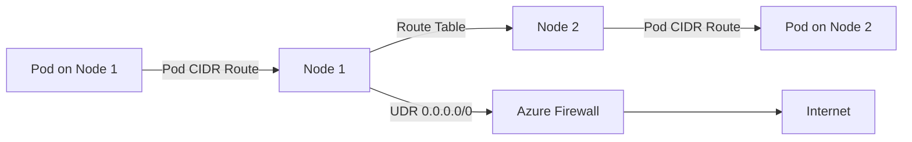

# How to Configure AKS Kubenet Networking with Custom Route Tables and UDR

Author: [nawazdhandala](https://www.github.com/nawazdhandala)

Tags: AKS, Kubenet, Networking, Azure, Route Tables, UDR, Kubernetes

Description: Learn how to configure Azure Kubernetes Service with Kubenet networking, custom route tables, and user-defined routes for granular traffic control.

---

When you spin up an AKS cluster, one of the first decisions you face is which network plugin to use. Azure CNI is the default go-to for many teams, but Kubenet still has its place - particularly when you need to conserve IP addresses or want tighter control over routing through custom route tables and user-defined routes (UDR). In this post, I will walk through setting up AKS with Kubenet networking and configuring custom route tables so that you have full control over how traffic flows in and out of your cluster.

## Why Choose Kubenet Over Azure CNI

Kubenet assigns pods IP addresses from a virtual address space that is separate from the Azure VNet. This means your pods do not consume IPs from your subnet directly, which is a big deal when your VNet has limited address space. The tradeoff is that Kubenet needs route tables to handle the routing between pod networks and the rest of your Azure infrastructure.

Azure CNI gives every pod a VNet-routable IP, which simplifies things but can burn through IP addresses fast, especially in large clusters. If you are running in an environment where subnets are tightly managed or IP space is scarce, Kubenet paired with custom route tables gives you a practical alternative.

## Prerequisites

Before diving in, make sure you have the following ready:

- Azure CLI installed and authenticated
- A resource group created for your AKS resources
- A VNet and subnet ready for the cluster
- Permissions to create and manage route tables

## Step 1: Create the Virtual Network and Subnet

First, set up the VNet and subnet that your AKS cluster will live in. You want to size the subnet for your nodes, not your pods, since Kubenet handles pod IPs separately.

The following commands create a resource group, VNet, and subnet for the cluster.

```bash
# Create a resource group for all AKS resources
az group create --name aks-kubenet-rg --location eastus

# Create a VNet with a /16 address space
az network vnet create \
  --resource-group aks-kubenet-rg \
  --name aks-vnet \
  --address-prefix 10.0.0.0/16 \
  --subnet-name aks-subnet \
  --subnet-prefix 10.0.1.0/24
```

A /24 subnet gives you 251 usable addresses, which is plenty for nodes in most cases. With Kubenet, each node gets a /24 CIDR block for pods by default, so the actual pod capacity is independent of this subnet size.

## Step 2: Create a Custom Route Table

The route table is where things get interesting. AKS with Kubenet requires a route table associated with the node subnet. AKS will automatically populate this route table with routes for pod-to-pod communication across nodes. But you can also add your own user-defined routes for custom traffic patterns.

```bash
# Create a route table that AKS will use for pod routing
az network route-table create \
  --resource-group aks-kubenet-rg \
  --name aks-route-table \
  --location eastus

# Associate the route table with the AKS subnet
az network vnet subnet update \
  --resource-group aks-kubenet-rg \
  --vnet-name aks-vnet \
  --name aks-subnet \
  --route-table aks-route-table
```

## Step 3: Add User-Defined Routes

If you need traffic to flow through a network virtual appliance (NVA) or Azure Firewall before leaving the cluster, you add UDRs to the route table. This is common in enterprise setups where all egress must pass through a centralized firewall.

```bash
# Add a UDR to send all internet-bound traffic through an Azure Firewall
az network route-table route create \
  --resource-group aks-kubenet-rg \
  --route-table-name aks-route-table \
  --name default-route \
  --address-prefix 0.0.0.0/0 \
  --next-hop-type VirtualAppliance \
  --next-hop-ip-address 10.0.2.4  # IP of your firewall or NVA
```

This route forces all traffic destined for the internet to go through your firewall at 10.0.2.4. You can add more specific routes for different address ranges as needed.

## Step 4: Create the AKS Cluster with Kubenet

Now create the AKS cluster, specifying Kubenet as the network plugin and pointing to the existing subnet and route table.

```bash
# Get the subnet resource ID for the AKS cluster
SUBNET_ID=$(az network vnet subnet show \
  --resource-group aks-kubenet-rg \
  --vnet-name aks-vnet \
  --name aks-subnet \
  --query id -o tsv)

# Create the AKS cluster with Kubenet networking
az aks create \
  --resource-group aks-kubenet-rg \
  --name aks-kubenet-cluster \
  --network-plugin kubenet \
  --vnet-subnet-id $SUBNET_ID \
  --pod-cidr 10.244.0.0/16 \
  --service-cidr 10.0.4.0/24 \
  --dns-service-ip 10.0.4.10 \
  --node-count 3 \
  --generate-ssh-keys \
  --outbound-type userDefinedRouting
```

A few things to note here. The `--pod-cidr` defines the address space for pod IPs. This must not overlap with your VNet address space. The `--outbound-type userDefinedRouting` tells AKS not to create a public load balancer for egress. Instead, it relies on your custom routes.

## Step 5: Verify the Route Table

After the cluster is created, AKS will have added routes to the route table for each node. You can verify this.

```bash
# List all routes in the route table
az network route-table route list \
  --resource-group aks-kubenet-rg \
  --route-table-name aks-route-table \
  --output table
```

You should see routes like `10.244.0.0/24 -> <node1-ip>`, `10.244.1.0/24 -> <node2-ip>`, and so on. These are the routes AKS created to enable pod-to-pod communication across nodes.

## Step 6: Assign the Right Permissions

AKS needs permissions to manage the route table. The cluster identity (either a managed identity or service principal) must have the Network Contributor role on the route table and subnet.

```bash
# Get the AKS managed identity principal ID
IDENTITY_ID=$(az aks show \
  --resource-group aks-kubenet-rg \
  --name aks-kubenet-cluster \
  --query identity.principalId -o tsv)

# Get the route table resource ID
RT_ID=$(az network route-table show \
  --resource-group aks-kubenet-rg \
  --name aks-route-table \
  --query id -o tsv)

# Assign Network Contributor role on the route table
az role assignment create \
  --assignee $IDENTITY_ID \
  --role "Network Contributor" \
  --scope $RT_ID
```

If you skip this step, AKS will not be able to update the route table when nodes are added or removed, and pod networking will break.

## Understanding the Traffic Flow

Here is how traffic flows in a Kubenet cluster with custom UDRs:



Pod-to-pod traffic within the same node stays local. Pod-to-pod traffic across nodes goes through the route table. All external traffic follows your UDR to the firewall.

## Common Pitfalls and How to Avoid Them

**Overlapping CIDR ranges.** The pod CIDR, service CIDR, and VNet address space must not overlap. Plan your IP address scheme carefully before creating anything.

**Missing route table association.** The route table must be associated with the subnet before cluster creation. If you forget this step, AKS will create its own route table and your custom routes will not apply.

**Insufficient permissions.** The AKS identity needs Network Contributor on both the subnet and the route table. If routes stop updating after scaling, check the role assignments first.

**Forgetting to allow required endpoints.** When using UDR with a firewall, you must allow traffic to required AKS endpoints. Microsoft publishes a list of FQDNs that AKS needs for control plane communication, image pulls, and monitoring. Block any of these and your cluster will misbehave.

## Scaling Considerations

Each node in a Kubenet cluster gets its own /24 CIDR block by default, supporting up to 250 pods per node. With a /16 pod CIDR, you can have up to 256 nodes. If you need more, use a larger pod CIDR like /14 or /12.

When you scale up, AKS automatically adds new routes to the route table. When you scale down, it removes them. As long as the permissions are correct, this happens transparently.

## When to Use This Setup

This configuration works well when you are operating in a hub-and-spoke network topology, need all egress to flow through a centralized firewall, have limited VNet IP space, or want explicit control over routing decisions. For simpler setups where IP conservation is not a concern and you do not need custom routing, Azure CNI with overlay networking might be a better fit.

Kubenet with custom route tables and UDR gives you the flexibility to fit AKS into tightly controlled network environments without sacrificing pod networking performance. The initial setup takes a bit more work, but once it is running, the operational overhead is minimal.
