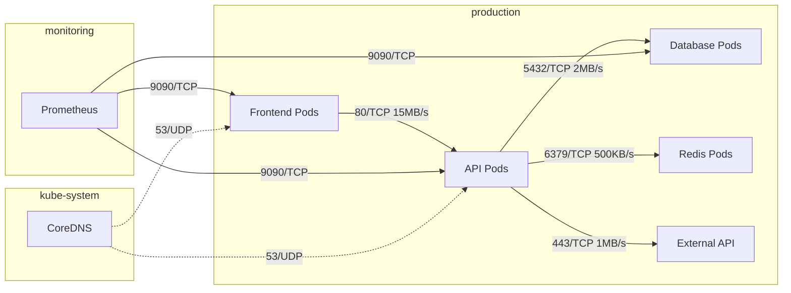

# How to Configure AKS Network Observability Add-On for Traffic Flow Visualization

Author: [nawazdhandala](https://www.github.com/nawazdhandala)

Tags: AKS, Kubernetes, Network Observability, Traffic Flows, Azure, Monitoring, eBPF

Description: Learn how to enable and configure the AKS network observability add-on to visualize network traffic flows, detect anomalies, and debug connectivity issues.

---

When a pod cannot connect to another service, the troubleshooting process on Kubernetes is painful. Is it a DNS issue? A network policy blocking traffic? A misconfigured service? A firewall rule? You end up running tcpdump inside pods, checking iptables rules, and scrolling through CNI logs. The AKS network observability add-on changes this by providing real-time visibility into network traffic flows across your cluster.

The add-on uses eBPF (extended Berkeley Packet Filter) to capture network metrics at the kernel level without modifying your applications or adding sidecars. It collects node-level metrics such as forwarded and dropped packets, bytes, and connection states, plus pod-level Hubble metrics for DNS, drops, TCP flags, and L4/L7 flows on Linux nodes. This data is exposed in Prometheus format and can flow into Azure Monitor managed Prometheus, where you can query it, build dashboards, and set up alerts.

## Enabling Network Observability

Container Network Observability is part of Advanced Container Networking Services (ACNS). It is available for AKS clusters using Azure CNI with Cilium or non-Cilium data planes. Cilium clusters support Container Network Observability starting with Kubernetes 1.29.

```bash
# Enable on a new cluster with Azure CNI

az aks create \
  --resource-group myRG \
  --name myAKS \
  --node-count 3 \
  --network-plugin azure \
  --enable-acns

# Enable on an existing cluster
az aks update \
  --resource-group myRG \
  --name myAKS \
  --enable-acns

# Verify the feature is enabled
az aks show \
  --resource-group myRG \
  --name myAKS \
  --query "networkProfile.advancedNetworking.observability.enabled" -o tsv
```

After enabling, AKS runs the network observability agents in `kube-system`. Non-Cilium clusters use Retina, while Cilium clusters use the Cilium/Hubble metrics path.

```bash
# Verify the network observability pods are running
kubectl get pods -n kube-system -l k8s-app=retina
kubectl get pods -n kube-system -l k8s-app=cilium

# Check the eBPF programs are loaded
kubectl logs -n kube-system -l k8s-app=retina --tail=20 | grep -i "ebpf\|bpf"
```

## What Metrics Are Collected

The add-on collects a rich set of network metrics. Here are the key ones.

**Flow metrics**: Hubble L4/L7 flow counts with source or destination workload labels, protocol, verdict, type, and subtype.

**Volume metrics**: Node-level forwarded and dropped byte and packet counts.

**TCP metrics**: TCP socket states, TCP connection statistics, and TCP flag counters.

**Drop metrics**: Packets dropped by network policies, conntrack failures, or other reasons. The drop reason is included.

**DNS metrics**: DNS query counts, response codes, and errors. On Cilium data planes, DNS metrics require a Cilium FQDN network policy.

These metrics are exposed as Prometheus metrics, which you can scrape with Azure Monitor managed Prometheus or your own Prometheus instance. The node-level metric names differ by data plane: non-Cilium clusters expose `networkobservability_*` metrics, while Cilium clusters expose `cilium_*` metrics for node-level forwarding and drops.

## Connecting to Azure Monitor Prometheus

If you have Azure Monitor managed Prometheus set up, the default network observability targets are scraped automatically. Some high-cardinality Hubble metrics, such as `hubble_flows_processed_total`, may require updating the Azure Monitor metrics keep-list before they appear. If Azure Monitor managed Prometheus is not set up, set it up first.

```bash
# Enable Azure Monitor metrics collection (if not already enabled)
MONITOR_WORKSPACE_ID=$(az monitor account show \
  --name my-prometheus-workspace \
  --resource-group monitoring-rg \
  --query id -o tsv)

az aks update \
  --resource-group myRG \
  --name myAKS \
  --enable-azure-monitor-metrics \
  --azure-monitor-workspace-resource-id "$MONITOR_WORKSPACE_ID"
```

Once connected, you can query network metrics in Grafana.

## Key PromQL Queries for Network Observability

Here are the most useful queries for understanding your cluster's network behavior.

```promql
# L4/L7 flow events between workloads
sum(rate(hubble_flows_processed_total[5m])) by (source, destination, protocol, verdict)

# Node-level packet drops by reason (non-Cilium data plane)
sum(rate(networkobservability_drop_count[5m])) by (reason, direction)

# DNS errors by workload
sum(rate(hubble_dns_responses_total{rcode!="NOERROR"}[5m])) by (source, destination, rcode)

# Top nodes by forwarded traffic (non-Cilium data plane)
topk(10, sum(rate(networkobservability_forward_bytes[5m])) by (instance, direction))

# TCP resets between workloads
sum(rate(hubble_tcp_flags_total{flag="RST"}[5m])) by (source, destination)

# Pod-level drops
sum(rate(hubble_drop_total[5m])) by (source, destination, reason, protocol)
```

## Building a Grafana Dashboard

Create a comprehensive network monitoring dashboard in Azure Managed Grafana.

```bash
# Get the Grafana endpoint
GRAFANA_URL=$(az grafana show \
  --name my-grafana \
  --resource-group monitoring-rg \
  --query "properties.endpoint" -o tsv)

echo "Grafana URL: $GRAFANA_URL"
```

Here is a dashboard JSON snippet for the key panels. Import this into Grafana.

```json
{
  "panels": [
    {
      "title": "Inter-Workload Flow Events",
      "type": "timeseries",
      "targets": [
        {
          "expr": "sum(rate(hubble_flows_processed_total[5m])) by (source, destination) > 0",
          "legendFormat": "{{source}} -> {{destination}}"
        }
      ]
    },
    {
      "title": "Packet Drops by Reason",
      "type": "timeseries",
      "targets": [
        {
          "expr": "sum(rate(networkobservability_drop_count[5m])) by (reason)",
          "legendFormat": "{{reason}}"
        }
      ]
    },
    {
      "title": "DNS Errors by Response Code",
      "type": "timeseries",
      "targets": [
        {
          "expr": "sum(rate(hubble_dns_responses_total{rcode!=\"NOERROR\"}[5m])) by (rcode)",
          "legendFormat": "{{rcode}}"
        }
      ]
    }
  ]
}
```

## Visualizing Traffic Flows

The network observability data enables you to build a traffic flow map showing how services communicate.


```mermaid
graph LR
    subgraph production
        FE[Frontend Pods] -->|80/TCP 15MB/s| API[API Pods]
        API -->|5432/TCP 2MB/s| DB[Database Pods]
        API -->|6379/TCP 500KB/s| Cache[Redis Pods]
        API -->|443/TCP 1MB/s| ExtAPI[External API]
    end

    subgraph monitoring
        Prom[Prometheus] -->|9090/TCP| FE
        Prom -->|9090/TCP| API
        Prom -->|9090/TCP| DB
    end

    subgraph kube-system
        DNS[CoreDNS] -.->|53/UDP| FE
        DNS -.->|53/UDP| API
    end
```

## Debugging Connectivity Issues

When a pod reports connection failures, use the network observability metrics to pinpoint the problem.

### Scenario: Pod Cannot Connect to a Service

```bash
# Check if there are drops between the source and destination
# Use the Prometheus query in Grafana or via the API

# Step 1: Identify the source and destination pods
SOURCE_POD="frontend-abc123"
DEST_SERVICE="api-service"

# Step 2: Check for network policy drops
# Query: hubble_drop_total{source=~".*/frontend-abc123", reason=~".*policy.*"}

# Step 3: Check DNS resolution
# Query: hubble_dns_responses_total{source=~".*/frontend-abc123", rcode!="NOERROR"}

# Step 4: Check TCP connection attempts
# Query: hubble_flows_processed_total{source=~".*/frontend-abc123", destination=~".*/api-service.*"}
```

### Scenario: Intermittent TCP Reset Spikes

```promql
# Check for TCP reset spikes between specific workloads
sum(rate(hubble_tcp_flags_total{
  source=~"production/.*",
  destination=~"production/.*",
  flag="RST"
}[5m])) by (source, destination) > 10
```

If you see TCP reset spikes correlating with high traffic volume or drops, it might indicate network saturation on specific nodes.

## Setting Up Alerts

Configure alerts for network anomalies.

```yaml
# network-alerts.yaml
# PrometheusRule for network observability alerts
apiVersion: monitoring.coreos.com/v1
kind: PrometheusRule
metadata:
  name: network-alerts
  namespace: monitoring
spec:
  groups:
    - name: network-observability
      interval: 30s
      rules:
        # Alert on high packet drop rate
        - alert: HighPacketDropRate
          expr: sum(rate(networkobservability_drop_count[5m])) > 100
          for: 5m
          labels:
            severity: warning
          annotations:
            summary: "High packet drop rate detected"
            description: "Cluster is dropping more than 100 packets per second"

        # Alert on DNS failures
        - alert: HighDNSFailureRate
          expr: |
            sum(rate(hubble_dns_responses_total{rcode!="NOERROR"}[5m]))
            /
            sum(rate(hubble_dns_responses_total[5m]))
            > 0.05
          for: 5m
          labels:
            severity: critical
          annotations:
            summary: "DNS failure rate exceeds 5%"

        # Alert on TCP resets
        - alert: HighTCPResetRate
          expr: sum(rate(hubble_tcp_flags_total{flag="RST"}[5m])) > 50
          for: 5m
          labels:
            severity: warning
          annotations:
            summary: "High rate of TCP resets"
```

## Performance Overhead

The eBPF-based collection is designed to keep overhead low because it collects signals in the kernel without application sidecars. Measure CPU, memory, and metric ingestion cost in your own cluster, especially before enabling high-cardinality Hubble flow metrics broadly.

The biggest cost factor is the metric storage, not the collection. If you have a large cluster with many pods, the cardinality of network flow metrics can be high. On Cilium clusters, use source-level metric filtering to keep only the metrics you need.

## Disabling Network Observability

If you need to disable the feature.

```bash
# Disable only observability while keeping other ACNS features on Cilium clusters
az aks update \
  --resource-group myRG \
  --name myAKS \
  --enable-acns \
  --disable-acns-observability

# Disable ACNS entirely. For non-Cilium clusters, this is how you disable observability.
az aks update \
  --resource-group myRG \
  --name myAKS \
  --disable-acns
```

This stops collection for the disabled feature. Historical data remains in your Azure Monitor workspace.

## Wrapping Up

The AKS network observability add-on turns your cluster's network from a black box into a transparent, observable system. eBPF-based collection means you get deep visibility without any application changes or sidecars. The integration with Prometheus and Grafana gives you the same query and dashboard experience you already know. Use it for proactive monitoring to catch packet drops and TCP resets before users notice, and for reactive debugging to quickly pinpoint why a specific pod cannot connect to a specific service. Once you have network observability enabled, you will wonder how you ever debugged network issues without it.
