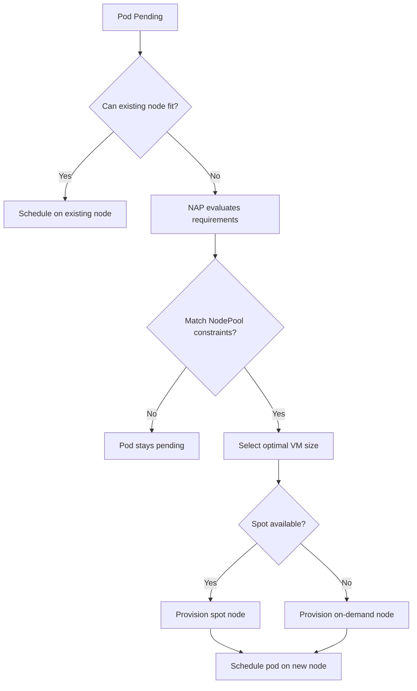

# How to Configure AKS Node Auto-Provisioning with NAP for Dynamic Workload Scheduling

Author: [nawazdhandala](https://www.github.com/nawazdhandala)

Tags: AKS, Node Auto-Provisioning, NAP, Kubernetes, Autoscaling, Karpenter, Azure

Description: Learn how to configure AKS Node Auto-Provisioning (NAP) to automatically select and provision the right VM sizes for your workloads.

---

The cluster autoscaler in AKS has been around for years and it works fine for basic scaling - add more nodes of the same type when pods are pending, remove nodes when they are underutilized. But it has a fundamental limitation: you have to pre-define your node pools with specific VM sizes. If a workload needs GPU nodes and you do not have a GPU node pool, you are stuck. Node Auto-Provisioning (NAP) changes this by automatically selecting the right VM size based on what your workloads actually need. Think of it as Karpenter for AKS. In this post, I will walk through setting up NAP and configuring it for dynamic, cost-efficient workload scheduling.

## What Node Auto-Provisioning Does Differently

With the traditional cluster autoscaler, the flow is: pending pod -> find a node pool that can fit it -> scale that node pool up. If no node pool matches, the pod stays pending forever.

With NAP, the flow is: pending pod -> analyze pod requirements (CPU, memory, GPU, architecture, topology) -> select the optimal VM size -> provision a new node. NAP does not need pre-defined node pools. It looks at what the pod needs and picks the best fit from the available Azure VM sizes, considering cost, availability, and resource efficiency.

NAP is built on the Karpenter project, adapted for Azure. If you have used Karpenter on AWS, the concepts will feel very familiar.

## Prerequisites

NAP is available on AKS clusters running Kubernetes 1.26 or later. You need Azure CLI 2.57 or later and the aks-preview extension. NAP requires the cluster to use Azure CNI with overlay networking and managed identity.

## Step 1: Install the AKS Preview Extension

NAP is still a preview feature, so you need the preview CLI extension.

```bash
# Install or update the aks-preview extension
az extension add --name aks-preview --allow-preview true
az extension update --name aks-preview --allow-preview true

# Register the NodeAutoProvisioningPreview feature flag
az feature register \
  --namespace Microsoft.ContainerService \
  --name NodeAutoProvisioningPreview

# Wait for registration to complete (check periodically)
az feature show \
  --namespace Microsoft.ContainerService \
  --name NodeAutoProvisioningPreview \
  --query "properties.state" -o tsv

# Propagate the registration
az provider register --namespace Microsoft.ContainerService
```

The feature registration can take several minutes. Wait until the state shows "Registered" before proceeding.

## Step 2: Create an AKS Cluster with NAP Enabled

Create a new cluster with NAP enabled from the start.

```bash
# Create a resource group
az group create --name nap-demo-rg --location eastus

# Create an AKS cluster with Node Auto-Provisioning enabled
az aks create \
  --resource-group nap-demo-rg \
  --name nap-cluster \
  --node-count 2 \
  --enable-node-auto-provisioning \
  --network-plugin azure \
  --network-plugin-mode overlay \
  --generate-ssh-keys
```

For existing clusters, enable NAP with an update command.

```bash
# Enable NAP on an existing cluster
az aks update \
  --resource-group nap-demo-rg \
  --name nap-cluster \
  --enable-node-auto-provisioning
```

## Step 3: Create a NodePool Resource

NAP uses a new Kubernetes custom resource called `NodePool` (from the Karpenter API) to define constraints for auto-provisioned nodes. This is where you specify what VM families, sizes, and capabilities are acceptable.

```yaml
# nodepool.yaml
# Define constraints for auto-provisioned nodes
apiVersion: karpenter.sh/v1alpha5
kind: NodePool
metadata:
  name: general-purpose
spec:
  template:
    spec:
      requirements:
        # Allow both AMD and Intel architectures
        - key: kubernetes.io/arch
          operator: In
          values:
            - amd64
        # Allow both on-demand and spot instances
        - key: karpenter.sh/capacity-type
          operator: In
          values:
            - on-demand
            - spot
        # Limit to specific VM families for cost control
        - key: node.kubernetes.io/instance-type
          operator: In
          values:
            - Standard_D2s_v5
            - Standard_D4s_v5
            - Standard_D8s_v5
            - Standard_D16s_v5
            - Standard_D2as_v5
            - Standard_D4as_v5
            - Standard_D8as_v5
      nodeClassRef:
        name: default
  # Remove nodes that have been empty for 30 seconds
  disruption:
    consolidationPolicy: WhenUnderutilized
    expireAfter: 720h  # Replace nodes after 30 days
  # Maximum cluster size limit
  limits:
    cpu: "100"
    memory: 400Gi
```

Apply the NodePool resource.

```bash
# Apply the NodePool definition
kubectl apply -f nodepool.yaml
```

The `limits` section is critical for cost control. It caps the total CPU and memory that NAP can provision across all nodes in this pool. Without limits, NAP could potentially scale your cluster to very large sizes.

## Step 4: Create an AKSNodeClass

The AKSNodeClass defines Azure-specific configuration for the nodes that NAP provisions.

```yaml
# aksnodeclass.yaml
# Azure-specific settings for auto-provisioned nodes
apiVersion: karpenter.azure.com/v1alpha2
kind: AKSNodeClass
metadata:
  name: default
spec:
  # Use the same VNet and subnet as the existing cluster
  vnetSubnetID: /subscriptions/<sub-id>/resourceGroups/nap-demo-rg/providers/Microsoft.Network/virtualNetworks/nap-vnet/subnets/aks-subnet
  # OS disk configuration
  osDiskSizeGB: 128
```

## Step 5: Test Auto-Provisioning

Deploy a workload that requires more resources than your current nodes can handle. NAP should automatically provision new nodes.

```yaml
# test-deployment.yaml
# Deployment that will trigger node auto-provisioning
apiVersion: apps/v1
kind: Deployment
metadata:
  name: inflate
  namespace: default
spec:
  replicas: 10
  selector:
    matchLabels:
      app: inflate
  template:
    metadata:
      labels:
        app: inflate
    spec:
      containers:
        - name: inflate
          image: mcr.microsoft.com/oss/kubernetes/pause:3.9
          resources:
            requests:
              # Each pod requests 1 CPU and 1Gi memory
              cpu: "1"
              memory: 1Gi
```

Apply and watch what happens.

```bash
# Deploy the resource-hungry workload
kubectl apply -f test-deployment.yaml

# Watch pods - some will be pending initially
kubectl get pods -l app=inflate -w

# Watch nodes - new nodes should appear
kubectl get nodes -w
```

NAP will analyze the pending pods, determine the total resource requirements, select the most cost-efficient VM size that can accommodate them, and provision new nodes. This typically takes 1-2 minutes.

## Step 6: Configure Spot Instance Priority

To optimize costs, configure NAP to prefer spot instances when available, falling back to on-demand only when spot capacity is unavailable.

```yaml
# spot-nodepool.yaml
# NodePool that prioritizes spot instances for cost savings
apiVersion: karpenter.sh/v1alpha5
kind: NodePool
metadata:
  name: spot-priority
spec:
  template:
    spec:
      requirements:
        - key: kubernetes.io/arch
          operator: In
          values:
            - amd64
        # Prefer spot instances
        - key: karpenter.sh/capacity-type
          operator: In
          values:
            - spot
        - key: node.kubernetes.io/instance-type
          operator: In
          values:
            - Standard_D4s_v5
            - Standard_D8s_v5
            - Standard_D4as_v5
            - Standard_D8as_v5
      nodeClassRef:
        name: default
  disruption:
    consolidationPolicy: WhenUnderutilized
  limits:
    cpu: "50"
    memory: 200Gi
  # Lower weight means higher priority
  weight: 10
```

## How NAP Scheduling Decisions Work

Here is the decision flow when a pod is pending.



## Step 7: Node Consolidation

One of the best features of NAP is automatic node consolidation. When workloads are removed or scaled down, NAP identifies underutilized nodes, moves their pods to other nodes, and terminates the empty nodes.

You can observe this by scaling down the test deployment.

```bash
# Scale down the test deployment
kubectl scale deployment inflate --replicas=2

# Watch nodes - underutilized ones will be drained and removed
kubectl get nodes -w
```

NAP will consolidate the remaining pods onto fewer nodes and terminate the extras. The `consolidationPolicy: WhenUnderutilized` setting in the NodePool controls this behavior.

## Step 8: GPU Workload Auto-Provisioning

NAP really shines with GPU workloads. Instead of maintaining an idle GPU node pool, NAP provisions GPU nodes only when a workload requests them.

```yaml
# gpu-nodepool.yaml
# NodePool for GPU workloads - only provisions when needed
apiVersion: karpenter.sh/v1alpha5
kind: NodePool
metadata:
  name: gpu-workloads
spec:
  template:
    spec:
      requirements:
        - key: karpenter.sh/capacity-type
          operator: In
          values:
            - on-demand
        - key: node.kubernetes.io/instance-type
          operator: In
          values:
            - Standard_NC6s_v3
            - Standard_NC12s_v3
            - Standard_NC24s_v3
      nodeClassRef:
        name: default
      taints:
        # Only GPU workloads should land on these nodes
        - key: nvidia.com/gpu
          value: "true"
          effect: NoSchedule
  limits:
    # Cap GPU spending
    cpu: "24"
    memory: 448Gi
```

When a pod with a GPU request and the matching toleration is created, NAP provisions the appropriate GPU VM. When the workload finishes and the node is empty, NAP removes it. No idle GPU VMs burning money.

## Monitoring and Cost Visibility

Keep an eye on NAP activity through Kubernetes events and metrics.

```bash
# View NAP provisioning events
kubectl get events --field-selector reason=Provisioned

# Check current NAP node count and types
kubectl get nodes -l karpenter.sh/nodepool -o wide

# View node utilization
kubectl top nodes
```

## Production Tips

**Set resource limits on every NodePool.** Without limits, NAP will keep provisioning until your Azure subscription quota is exhausted. Be explicit about maximum CPU and memory.

**Use multiple NodePools for different workload classes.** Create separate NodePools for general workloads, memory-intensive jobs, GPU tasks, and batch processing. This gives you fine-grained control over what VM types each workload class can use.

**Start with a conservative VM size list.** Do not allow every VM family. Limit to the families you have tested and that fit your budget.

**Monitor for spot evictions.** If using spot instances, ensure your workloads can handle interruptions gracefully. Use pod disruption budgets and graceful shutdown handlers.

NAP transforms AKS from a cluster you have to plan and size upfront into an infrastructure that adapts to your workloads automatically. The combination of intelligent VM selection, spot instance support, and automatic consolidation can significantly reduce both operational overhead and cloud costs.
