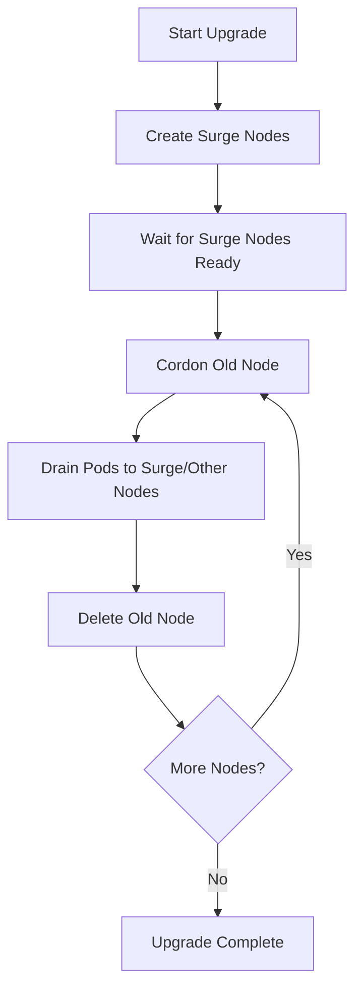

# How to Configure AKS Node Surge Upgrade Settings to Minimize Workload Disruption

Author: [nawazdhandala](https://www.github.com/nawazdhandala)

Tags: AKS, Node Surge, Upgrades, Kubernetes, Availability, Azure, Rolling Updates

Description: Learn how to configure AKS node surge upgrade settings to control the speed and safety of node pool upgrades while minimizing workload disruption.

---

Upgrading AKS node pools is one of those operations that should be routine but often causes unexpected downtime. By default, AKS upgrades nodes one at a time: it cordons a node, drains the pods, reimages the node with the new version, and then uncordons it. This is safe but slow. If you have a 20-node cluster, upgrading one node at a time can take hours.

Node surge upgrades let you control this tradeoff between speed and safety. You can tell AKS to spin up extra nodes during the upgrade so that workloads have somewhere to go before old nodes are drained. This guide covers how to configure surge settings, the tradeoffs involved, and practical patterns for different cluster profiles.

## How Node Surge Works

During a standard upgrade without surge, AKS follows this sequence for each node:

1. Cordon the node (prevent new pods from being scheduled)
2. Drain existing pods (evict them, respecting PodDisruptionBudgets)
3. Reimage or replace the node with the new version
4. Uncordon the node

With surge enabled, AKS creates additional nodes (the "surge" nodes) first, waits for them to be ready, and then starts draining old nodes. This means your workloads always have somewhere to run during the transition.



## Configuring Surge Settings

You set the surge value when creating or updating a node pool. The value can be an absolute number or a percentage.

```bash
# Set surge to 1 extra node (the default behavior)
az aks nodepool update \
  --resource-group myResourceGroup \
  --cluster-name myAKSCluster \
  --name nodepool1 \
  --max-surge 1

# Set surge to 33% of the node pool size
# For a 9-node pool, this creates 3 extra nodes during upgrade
az aks nodepool update \
  --resource-group myResourceGroup \
  --cluster-name myAKSCluster \
  --name nodepool1 \
  --max-surge 33%

# Set surge to 3 extra nodes (absolute value)
az aks nodepool update \
  --resource-group myResourceGroup \
  --cluster-name myAKSCluster \
  --name nodepool1 \
  --max-surge 3
```

You can also set this during node pool creation:

```bash
# Create a new node pool with surge settings configured
az aks nodepool add \
  --resource-group myResourceGroup \
  --cluster-name myAKSCluster \
  --name workerpool \
  --node-count 10 \
  --max-surge 33%
```

## Choosing the Right Surge Value

The right surge value depends on your cluster size, workload sensitivity, and budget for temporary extra compute.

### Small Clusters (3-5 nodes)

For small clusters, a surge of 1 node (the default) is usually fine. The upgrade completes in a reasonable time, and one extra node does not cost much.

```bash
# Small cluster: 1 node surge is sufficient
az aks nodepool update \
  --resource-group myResourceGroup \
  --cluster-name myAKSCluster \
  --name smallpool \
  --max-surge 1
```

### Medium Clusters (10-30 nodes)

For medium clusters, 33% surge strikes a good balance. It speeds up the upgrade significantly without doubling your compute costs.

```bash
# Medium cluster: 33% surge for faster upgrades
az aks nodepool update \
  --resource-group myResourceGroup \
  --cluster-name myAKSCluster \
  --name mediumpool \
  --max-surge 33%
```

### Large Clusters (50+ nodes)

For large clusters, keep the percentage lower (10-20%) to avoid temporarily doubling your VM count. The upgrade will still be faster than one-at-a-time.

```bash
# Large cluster: 10% surge to limit cost while improving speed
az aks nodepool update \
  --resource-group myResourceGroup \
  --cluster-name myAKSCluster \
  --name largepool \
  --max-surge 10%
```

### Maximum Speed

If you want the fastest possible upgrade and cost is not a concern, set surge to 100%. AKS creates a completely new set of nodes, shifts all workloads over, and then deletes the old nodes. This is essentially a blue-green upgrade at the node level.

```bash
# Maximum speed: 100% surge (blue-green node upgrade)
az aks nodepool update \
  --resource-group myResourceGroup \
  --cluster-name myAKSCluster \
  --name criticalpool \
  --max-surge 100%
```

## Working with PodDisruptionBudgets

Surge settings work hand-in-hand with PodDisruptionBudgets (PDBs). Even with high surge values, AKS respects PDBs during the drain phase. If a PDB prevents a pod from being evicted, the drain will wait (and eventually time out).

Make sure your PDBs allow at least one pod to be disrupted at a time, or upgrades will stall.

Here is an example PDB that works well with node surge upgrades:

```yaml
# pdb.yaml
# Allows up to 1 pod to be unavailable during upgrades
apiVersion: policy/v1
kind: PodDisruptionBudget
metadata:
  name: my-app-pdb
spec:
  # Allow at most 1 pod to be unavailable
  maxUnavailable: 1
  selector:
    matchLabels:
      app: my-app
```

For stateful workloads where you absolutely cannot have any disruption, consider using a separate node pool with taints and a high surge value:

```bash
# Create a dedicated node pool for stateful workloads with 100% surge
az aks nodepool add \
  --resource-group myResourceGroup \
  --cluster-name myAKSCluster \
  --name statefulpool \
  --node-count 3 \
  --max-surge 100% \
  --node-taints workload=stateful:NoSchedule
```

## Monitoring the Upgrade Process

During an upgrade, you can monitor progress through the Azure CLI or portal.

```bash
# Start the upgrade
az aks upgrade \
  --resource-group myResourceGroup \
  --name myAKSCluster \
  --kubernetes-version 1.29.2

# Monitor node pool upgrade status
az aks nodepool show \
  --resource-group myResourceGroup \
  --cluster-name myAKSCluster \
  --name nodepool1 \
  --query "{ \
    provisioningState: provisioningState, \
    currentOrchestratorVersion: currentOrchestratorVersion, \
    count: count \
  }" -o table

# Watch nodes in real time during upgrade
kubectl get nodes -w
```

During the upgrade with surge enabled, you will see the surge nodes appear first (with names containing "aks-nodepool1-temp-" or similar), and then old nodes will start to be cordoned and drained.

```bash
# View node cordon status during upgrade
kubectl get nodes -o custom-columns=\
NAME:.metadata.name,\
STATUS:.status.conditions[-1].type,\
SCHEDULABLE:.spec.unschedulable,\
VERSION:.status.nodeInfo.kubeletVersion
```

## Handling Upgrade Failures

Sometimes upgrades fail partway through. Common reasons include PDBs blocking drains, resource quotas preventing surge nodes from being created, or pods that will not terminate gracefully.

```bash
# Check for nodes stuck in cordon/drain state
kubectl get nodes | grep SchedulingDisabled

# Check for pods that are not being evicted
kubectl get pods --all-namespaces --field-selector=status.phase=Running \
  -o custom-columns=NAMESPACE:.metadata.namespace,NAME:.metadata.name,NODE:.spec.nodeName \
  | grep <cordoned-node-name>

# If the upgrade is stuck, check the activity log
az monitor activity-log list \
  --resource-group myResourceGroup \
  --query "[?contains(operationName.value, 'Microsoft.ContainerService')]" \
  --output table
```

If an upgrade is truly stuck, you can stop and restart it. The cluster will reconcile to the desired state.

## Cost Implications

Surge nodes incur compute costs for the duration of the upgrade. Here is a quick way to estimate:

- **1 node surge on a 10-node pool**: 10% temporary cost increase, upgrade takes roughly 10x single-node-time
- **33% surge on a 10-node pool (3 nodes)**: 30% temporary cost increase, upgrade takes roughly 3-4x single-node-time
- **100% surge on a 10-node pool**: 100% temporary cost increase (you briefly have 20 nodes), upgrade completes in 1-2x single-node-time

The cost is temporary since surge nodes are deleted as soon as old nodes are replaced. For most teams, the reduced upgrade duration and lower disruption risk is worth the small extra cost.

## Best Practices

1. **Always set surge explicitly** rather than relying on the default. Make it a conscious decision based on your cluster profile.

2. **Test upgrades in staging first** with the same surge settings you plan to use in production. This catches PDB issues and resource quota problems before they affect production.

3. **Use percentage-based surge** for node pools that auto-scale. An absolute number that works at 10 nodes might be too low at 50 nodes.

4. **Set up Pod Disruption Budgets** for all production workloads. Without PDBs, AKS will evict pods aggressively and you might see brief outages even with high surge values.

5. **Schedule upgrades during low-traffic windows** even with surge enabled. While surge minimizes disruption, there is always some risk during rolling updates.

6. **Monitor node pool quotas** before starting an upgrade. If your subscription does not have enough VM quota for the surge nodes, the upgrade will fail immediately.

Node surge is one of those AKS features that is easy to overlook but makes a real difference in operational stability. Spending five minutes configuring the right surge value saves you hours of upgrade-related incidents down the road.
