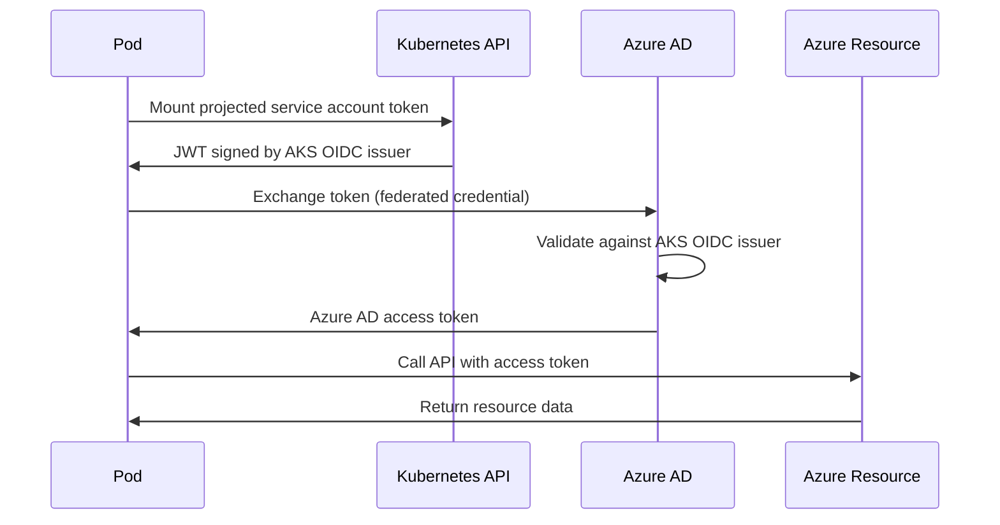

# How to Configure AKS Pod Identity with Azure Managed Identities for Resource Access

Author: [nawazdhandala](https://www.github.com/nawazdhandala)

Tags: AKS, Pod Identity, Managed Identity, Workload Identity, Azure, Kubernetes, Security

Description: How to configure Azure workload identity on AKS so pods can securely access Azure resources without storing credentials in the cluster.

---

Applications running in AKS often need to access Azure resources like Key Vault, Storage Accounts, SQL databases, and Service Bus. The old approach of creating service principal credentials and storing them as Kubernetes secrets is fragile and insecure. Azure Workload Identity (the successor to AAD Pod Identity) provides a better way: pods get Azure AD tokens automatically, without any credentials stored in the cluster.

## Pod Identity vs. Workload Identity

AKS has gone through two generations of pod-level identity:

**AAD Pod Identity (v1)** - Now deprecated. Used Node Managed Identity (NMI) pods to intercept Azure Instance Metadata Service (IMDS) requests. It had issues with scalability, race conditions, and required privileged DaemonSet pods.

**Azure Workload Identity (v2)** - The current recommended approach. Uses federated identity credentials and projected service account tokens. No privileged pods needed, no IMDS interception, and it works with standard Kubernetes service accounts.

This guide focuses on Workload Identity since it is the current and supported approach.

## How Workload Identity Works

The mechanism relies on OpenID Connect (OIDC) federation between the AKS cluster and Azure AD:

1. AKS acts as an OIDC token issuer.
2. A Kubernetes service account is annotated with an Azure managed identity client ID.
3. When a pod uses that service account, it receives a projected JWT token.
4. Azure AD validates the token against the AKS OIDC issuer.
5. Azure AD exchanges it for an Azure AD access token.
6. The pod uses that access token to call Azure APIs.



## Prerequisites

- AKS cluster running Kubernetes 1.22+
- Azure CLI 2.40+
- An Azure resource to access (Key Vault, Storage, etc.)
- Owner role on the resource group (to create role assignments)

## Step 1: Enable OIDC Issuer and Workload Identity

```bash
# Enable OIDC issuer and workload identity on the AKS cluster
az aks update \
  --resource-group myResourceGroup \
  --name myAKSCluster \
  --enable-oidc-issuer \
  --enable-workload-identity
```

Get the OIDC issuer URL. You will need it when creating the federated credential.

```bash
# Store the OIDC issuer URL
export AKS_OIDC_ISSUER=$(az aks show \
  --resource-group myResourceGroup \
  --name myAKSCluster \
  --query "oidcIssuerProfile.issuerUrl" \
  --output tsv)

echo "OIDC Issuer: $AKS_OIDC_ISSUER"
```

## Step 2: Create a User-Assigned Managed Identity

Create a managed identity that your pods will use. Each application (or group of applications) should have its own identity with minimal permissions.

```bash
# Create the managed identity
az identity create \
  --resource-group myResourceGroup \
  --name my-app-identity \
  --location eastus

# Store the client ID and tenant ID
export IDENTITY_CLIENT_ID=$(az identity show \
  --resource-group myResourceGroup \
  --name my-app-identity \
  --query clientId \
  --output tsv)

export IDENTITY_TENANT_ID=$(az identity show \
  --resource-group myResourceGroup \
  --name my-app-identity \
  --query tenantId \
  --output tsv)

echo "Client ID: $IDENTITY_CLIENT_ID"
```

## Step 3: Create the Federated Credential

The federated credential links a specific Kubernetes service account in a specific namespace to the managed identity. This is the trust relationship that makes the token exchange work.

```bash
# Create the federated identity credential
# The subject must match exactly: system:serviceaccount:<namespace>:<service-account-name>
az identity federated-credential create \
  --name my-app-federated-cred \
  --identity-name my-app-identity \
  --resource-group myResourceGroup \
  --issuer "$AKS_OIDC_ISSUER" \
  --subject "system:serviceaccount:default:my-app-sa" \
  --audience "api://AzureADTokenExchange"
```

The `--subject` parameter is critical. It must match the namespace and service account name exactly. If your app runs in the `production` namespace with a service account named `my-app-sa`, the subject would be `system:serviceaccount:production:my-app-sa`.

## Step 4: Assign Azure Roles to the Managed Identity

Grant the managed identity access to the Azure resources your application needs.

```bash
# Example: Grant access to a Key Vault
az role assignment create \
  --role "Key Vault Secrets User" \
  --assignee "$IDENTITY_CLIENT_ID" \
  --scope "/subscriptions/<sub-id>/resourceGroups/myResourceGroup/providers/Microsoft.KeyVault/vaults/myKeyVault"

# Example: Grant access to a Storage Account
az role assignment create \
  --role "Storage Blob Data Reader" \
  --assignee "$IDENTITY_CLIENT_ID" \
  --scope "/subscriptions/<sub-id>/resourceGroups/myResourceGroup/providers/Microsoft.Storage/storageAccounts/mystorageaccount"

# Example: Grant access to Azure SQL
az role assignment create \
  --role "Contributor" \
  --assignee "$IDENTITY_CLIENT_ID" \
  --scope "/subscriptions/<sub-id>/resourceGroups/myResourceGroup/providers/Microsoft.Sql/servers/mysqlserver"
```

Follow the principle of least privilege. Only assign the minimum role needed for each resource.

## Step 5: Create the Kubernetes Service Account

Create the service account with the annotation that links it to the managed identity.

```yaml
# service-account.yaml
# Kubernetes service account linked to the Azure managed identity
apiVersion: v1
kind: ServiceAccount
metadata:
  name: my-app-sa
  namespace: default
  annotations:
    # This annotation is required - it tells the workload identity webhook
    # which managed identity to use for token exchange
    azure.workload.identity/client-id: "<IDENTITY_CLIENT_ID>"
  labels:
    # This label enables the workload identity webhook for this service account
    azure.workload.identity/use: "true"
```

Replace `<IDENTITY_CLIENT_ID>` with the actual client ID from Step 2.

```bash
kubectl apply -f service-account.yaml
```

## Step 6: Deploy Your Application

Configure your deployment to use the service account.

```yaml
# app-deployment.yaml
# Application using workload identity to access Azure resources
apiVersion: apps/v1
kind: Deployment
metadata:
  name: my-app
  namespace: default
spec:
  replicas: 2
  selector:
    matchLabels:
      app: my-app
  template:
    metadata:
      labels:
        app: my-app
    spec:
      # Use the service account with the workload identity annotation
      serviceAccountName: my-app-sa
      containers:
      - name: my-app
        image: myacr.azurecr.io/my-app:1.0.0
        ports:
        - containerPort: 8080
        # The workload identity webhook automatically injects these env vars:
        # AZURE_CLIENT_ID - The managed identity client ID
        # AZURE_TENANT_ID - The Azure AD tenant ID
        # AZURE_FEDERATED_TOKEN_FILE - Path to the projected token file
        resources:
          requests:
            cpu: 100m
            memory: 128Mi
```

The workload identity admission webhook automatically injects three environment variables and a projected token volume into the pod. Azure SDK clients use these to authenticate without any code changes.

## Step 7: Update Your Application Code

Most Azure SDKs support workload identity through the `DefaultAzureCredential` class. Here are examples in different languages.

### Python

```python
# app.py
# Using DefaultAzureCredential to access Azure Key Vault
# No client secrets or certificates needed - workload identity handles authentication
from azure.identity import DefaultAzureCredential
from azure.keyvault.secrets import SecretClient

# DefaultAzureCredential automatically uses workload identity
# when running in an AKS pod with the right service account
credential = DefaultAzureCredential()

# Access Key Vault secrets
client = SecretClient(
    vault_url="https://mykeyvault.vault.azure.net/",
    credential=credential
)

secret = client.get_secret("database-password")
print(f"Secret retrieved successfully")
```

### Node.js

```javascript
// app.js
// Using DefaultAzureCredential in Node.js
// The SDK detects the workload identity environment variables automatically
const { DefaultAzureCredential } = require("@azure/identity");
const { SecretClient } = require("@azure/keyvault-secrets");

// Create credential - picks up workload identity automatically
const credential = new DefaultAzureCredential();

// Access Key Vault
const client = new SecretClient(
  "https://mykeyvault.vault.azure.net/",
  credential
);

async function getSecret() {
  const secret = await client.getSecret("database-password");
  console.log("Secret retrieved successfully");
}
```

### .NET

```csharp
// Program.cs
// Using DefaultAzureCredential in .NET
// Works seamlessly with workload identity on AKS
using Azure.Identity;
using Azure.Security.KeyVault.Secrets;

// DefaultAzureCredential detects workload identity environment
var credential = new DefaultAzureCredential();
var client = new SecretClient(
    new Uri("https://mykeyvault.vault.azure.net/"),
    credential
);

KeyVaultSecret secret = await client.GetSecretAsync("database-password");
Console.WriteLine("Secret retrieved successfully");
```

## Step 8: Verify Identity Is Working

Check that the pod has the injected environment variables and can authenticate.

```bash
# Check the injected environment variables
kubectl exec deployment/my-app -- env | grep AZURE

# Expected output:
# AZURE_CLIENT_ID=<client-id>
# AZURE_TENANT_ID=<tenant-id>
# AZURE_FEDERATED_TOKEN_FILE=/var/run/secrets/azure/tokens/azure-identity-token

# Verify the token file exists
kubectl exec deployment/my-app -- cat /var/run/secrets/azure/tokens/azure-identity-token
```

## Multiple Identities for Different Applications

Each application should have its own identity. Create separate managed identities, service accounts, and federated credentials for each.

```bash
# Identity for the payments service
az identity create --resource-group myResourceGroup --name payments-identity

# Identity for the notification service
az identity create --resource-group myResourceGroup --name notifications-identity
```

Create separate federated credentials for each, pointing to different service accounts.

## Troubleshooting

**"AADSTS70021: No matching federated identity record found"**: The most common error. The federated credential subject does not match. Double-check the namespace and service account name. The format must be `system:serviceaccount:<namespace>:<sa-name>`.

**Token file not present in the pod**: The workload identity webhook is not running or the service account does not have the `azure.workload.identity/use: "true"` label. Verify the webhook with `kubectl get pods -n kube-system -l azure-workload-identity.io/system=true`.

**"DefaultAzureCredential failed"**: Make sure you are using a recent version of the Azure SDK. Older versions do not support workload identity. The SDK tries multiple credential types in order - workload identity should be attempted automatically.

**Role assignment not taking effect**: Azure RBAC role assignments can take up to 5 minutes to propagate. Wait and retry before investigating further.

## Summary

Azure Workload Identity provides a secure, credential-free way for AKS pods to access Azure resources. The setup involves enabling OIDC on the cluster, creating managed identities with federated credentials, and annotating Kubernetes service accounts. Application code uses `DefaultAzureCredential` and does not need any changes to work with workload identity. Each application gets its own identity with least-privilege access, giving you a clean security model that is auditable and does not require secret rotation.
