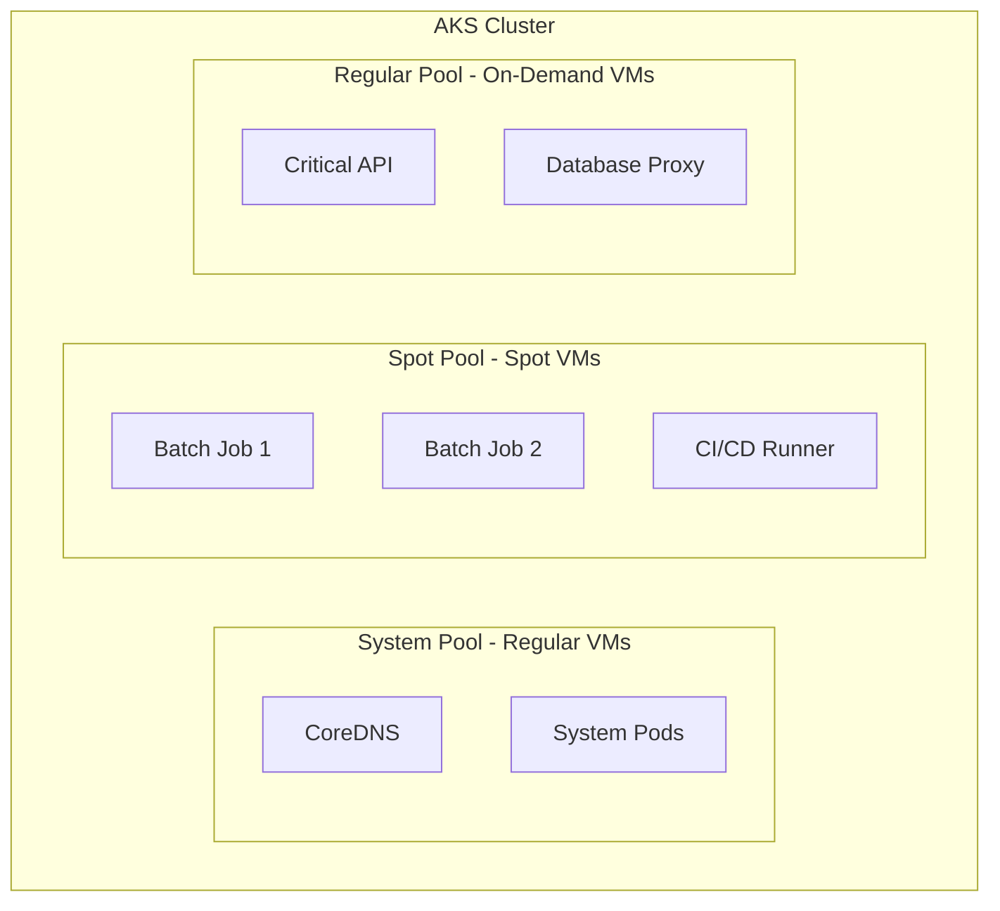

# How to Configure AKS Spot Node Pools for Cost Optimization of Batch Workloads

Author: [nawazdhandala](https://www.github.com/nawazdhandala)

Tags: AKS, Spot Instances, Cost Optimization, Kubernetes, Azure, Batch Processing, Node Pools

Description: Learn how to use AKS spot node pools to reduce compute costs by up to 90% for fault-tolerant batch workloads and development environments.

---

Azure Spot VMs offer unused Azure compute capacity at steep discounts - up to 90% off regular prices. The catch is that Azure can evict these VMs at any time when it needs the capacity back. For fault-tolerant workloads like batch processing, data pipelines, CI/CD jobs, and dev/test environments, spot nodes are a practical way to dramatically cut your AKS compute costs.

## How Spot Nodes Work in AKS

Spot node pools are standard AKS node pools backed by Azure Spot VMs instead of regular VMs. When you create a spot node pool, AKS provisions the nodes at the spot price. If Azure needs the capacity, it sends a 30-second eviction notice, and the node is deallocated. Kubernetes reschedules the evicted pods - either on other spot nodes (if available) or on regular nodes if your workloads can tolerate it.

The key constraint: spot node pools cannot be the system node pool. You always need at least one regular node pool for system components like CoreDNS and the kube-proxy.



## Prerequisites

- An AKS cluster with a regular system node pool
- Azure CLI 2.40+
- Workloads that can tolerate interruption and rescheduling

## Step 1: Add a Spot Node Pool

Create a spot node pool with the `--priority Spot` flag.

```bash
# Add a spot node pool to the cluster
# --priority Spot makes this a spot instance pool
# --eviction-policy Delete removes the VM on eviction (vs Deallocate which keeps the disk)
# --spot-max-price -1 means pay up to the on-demand price (maximum discount)
az aks nodepool add \
  --resource-group myResourceGroup \
  --cluster-name myAKSCluster \
  --name spotpool \
  --priority Spot \
  --eviction-policy Delete \
  --spot-max-price -1 \
  --node-count 3 \
  --node-vm-size Standard_D4s_v3 \
  --enable-cluster-autoscaler \
  --min-count 0 \
  --max-count 10 \
  --labels workload-type=batch \
  --node-taints "kubernetes.azure.com/scalesetpriority=spot:NoSchedule"
```

Breaking down the important flags:

- **--eviction-policy Delete**: When a spot node is evicted, the VM and its disk are deleted. Use `Deallocate` if you want to keep the disk (costs more but allows faster re-provisioning).
- **--spot-max-price -1**: Accept the current spot price up to the on-demand price. You can set a specific maximum (e.g., `0.05` for $0.05/hour) to limit spending.
- **--min-count 0**: Allow the pool to scale to zero when there are no jobs to run.
- **--node-taints**: Prevents regular workloads from being scheduled on spot nodes.

## Step 2: Set a Maximum Spot Price

If you want to control costs more precisely, set a maximum price you are willing to pay.

```bash
# Update the spot pool to set a maximum price of $0.10/hour
# If the spot price exceeds this, nodes will not be provisioned
az aks nodepool update \
  --resource-group myResourceGroup \
  --cluster-name myAKSCluster \
  --name spotpool \
  --spot-max-price 0.10
```

To check current spot prices for your VM size and region, use the Azure pricing page or the CLI.

```bash
# Check the current spot price for Standard_D4s_v3 in East US
az vm list-skus \
  --location eastus \
  --size Standard_D4s_v3 \
  --query "[].{name:name, tier:tier}" \
  --output table
```

## Step 3: Schedule Batch Workloads on Spot Nodes

Configure your batch jobs to target spot nodes using node selectors and tolerations.

```yaml
# batch-job.yaml
# Batch processing job that runs on spot nodes
apiVersion: batch/v1
kind: Job
metadata:
  name: data-processing-job
  namespace: default
spec:
  parallelism: 5
  completions: 20
  backoffLimit: 30
  template:
    spec:
      # Select spot nodes using the label we set on the pool
      nodeSelector:
        workload-type: batch
      # Tolerate the spot taint so the pod can be scheduled on spot nodes
      tolerations:
      - key: "kubernetes.azure.com/scalesetpriority"
        operator: "Equal"
        value: "spot"
        effect: "NoSchedule"
      restartPolicy: OnFailure
      containers:
      - name: processor
        image: myacr.azurecr.io/data-processor:1.0.0
        command: ["python", "process.py"]
        resources:
          requests:
            cpu: 1000m
            memory: 2Gi
          limits:
            cpu: 2000m
            memory: 4Gi
```

Key settings for spot-friendly jobs:

- **backoffLimit: 30**: Allow many retries since evictions cause pod failures.
- **restartPolicy: OnFailure**: Automatically restart on the same or a different node.
- **parallelism**: Run multiple pods simultaneously for faster completion.

## Step 4: Handle Spot Evictions Gracefully

When Azure evicts a spot node, Kubernetes receives a 30-second warning. Your application should handle this gracefully.

### Use Termination Grace Period

```yaml
# Set a termination grace period that gives your app time to checkpoint
spec:
  terminationGracePeriodSeconds: 25
  containers:
  - name: processor
    # Trap SIGTERM and save progress before exiting
    lifecycle:
      preStop:
        exec:
          command: ["/bin/sh", "-c", "python checkpoint.py && sleep 5"]
```

### Implement Checkpointing in Your Application

For long-running batch jobs, implement periodic checkpointing so work is not lost on eviction.

```python
# checkpoint.py
# Example of a batch processor with checkpoint support
import json
import os
import signal
import sys

CHECKPOINT_FILE = "/data/checkpoint.json"

def save_checkpoint(processed_count, last_item_id):
    """Save progress so the job can resume after eviction."""
    with open(CHECKPOINT_FILE, 'w') as f:
        json.dump({
            'processed_count': processed_count,
            'last_item_id': last_item_id
        }, f)
    print(f"Checkpoint saved: {processed_count} items processed")

def load_checkpoint():
    """Load previous progress if the job was evicted and restarted."""
    if os.path.exists(CHECKPOINT_FILE):
        with open(CHECKPOINT_FILE, 'r') as f:
            return json.load(f)
    return {'processed_count': 0, 'last_item_id': None}

def handle_sigterm(signum, frame):
    """Handle termination signal from Kubernetes on eviction."""
    print("Received SIGTERM - saving checkpoint before exit")
    save_checkpoint(current_count, current_item_id)
    sys.exit(0)

# Register signal handler for graceful shutdown
signal.signal(signal.SIGTERM, handle_sigterm)

# Resume from checkpoint
checkpoint = load_checkpoint()
current_count = checkpoint['processed_count']
current_item_id = checkpoint['last_item_id']

# Process items with periodic checkpointing
for item in get_items(start_after=current_item_id):
    process(item)
    current_count += 1
    current_item_id = item.id

    # Save checkpoint every 100 items
    if current_count % 100 == 0:
        save_checkpoint(current_count, current_item_id)
```

## Step 5: Use Pod Disruption Budgets

For workloads that can tolerate some eviction but not all at once, use Pod Disruption Budgets.

```yaml
# pdb-batch.yaml
# Keep at least 3 batch workers running during evictions
apiVersion: policy/v1
kind: PodDisruptionBudget
metadata:
  name: batch-worker-pdb
  namespace: default
spec:
  minAvailable: 3
  selector:
    matchLabels:
      app: batch-worker
```

Note that spot evictions bypass PDBs in some cases. PDBs are best-effort for spot nodes, not guaranteed protection.

## Step 6: Mix Spot and Regular Node Pools

For workloads that need a baseline of guaranteed capacity with burst capacity from spot nodes, use both pool types.

```bash
# Create a regular node pool for baseline capacity
az aks nodepool add \
  --resource-group myResourceGroup \
  --cluster-name myAKSCluster \
  --name regularpool \
  --node-count 2 \
  --node-vm-size Standard_D4s_v3 \
  --labels workload-type=batch

# The spot pool provides burst capacity on top
# Already created in Step 1
```

Then configure your workloads to prefer spot nodes but accept regular nodes.

```yaml
# batch-worker-mixed.yaml
# Prefer spot nodes but fall back to regular nodes
apiVersion: apps/v1
kind: Deployment
metadata:
  name: batch-worker
spec:
  replicas: 10
  selector:
    matchLabels:
      app: batch-worker
  template:
    metadata:
      labels:
        app: batch-worker
    spec:
      # Tolerate spot taint so pods CAN run on spot nodes
      tolerations:
      - key: "kubernetes.azure.com/scalesetpriority"
        operator: "Equal"
        value: "spot"
        effect: "NoSchedule"
      # Prefer spot nodes but do not require them
      affinity:
        nodeAffinity:
          preferredDuringSchedulingIgnoredDuringExecution:
          - weight: 100
            preference:
              matchExpressions:
              - key: "kubernetes.azure.com/scalesetpriority"
                operator: In
                values:
                - "spot"
      containers:
      - name: worker
        image: myacr.azurecr.io/batch-worker:1.0.0
```

With this setup, the scheduler places pods on spot nodes first (preferred) but schedules them on regular nodes if spot capacity is unavailable.

## Step 7: Monitor Spot Evictions

Track eviction events to understand patterns and optimize your spot strategy.

```bash
# Check for spot eviction events in the cluster
kubectl get events --all-namespaces --field-selector reason=Preempted

# View node conditions for spot-related information
kubectl get nodes -l "kubernetes.azure.com/scalesetpriority=spot" -o wide
```

## Cost Savings Estimates

Spot pricing varies by region, VM size, and demand. Here are typical savings:

| VM Size | On-Demand Price | Spot Price | Savings |
|---|---|---|---|
| Standard_D4s_v3 | ~$0.192/hr | ~$0.038/hr | 80% |
| Standard_D8s_v3 | ~$0.384/hr | ~$0.077/hr | 80% |
| Standard_F4s_v2 | ~$0.169/hr | ~$0.034/hr | 80% |

For a batch workload running 20 spot nodes for 8 hours daily, savings can exceed $1,000/month compared to on-demand pricing.

## Summary

Spot node pools on AKS provide significant cost savings for workloads that can handle interruptions. The setup is a single `az aks nodepool add` command with the right flags. Schedule workloads on spot nodes using taints, tolerations, and node selectors. Implement checkpointing in long-running jobs so work is not lost on eviction. Mix spot and regular pools for workloads that need guaranteed baseline capacity with burst capability. The 80-90% cost savings make spot nodes one of the most impactful cost optimization strategies for batch, CI/CD, and dev/test workloads on AKS.
