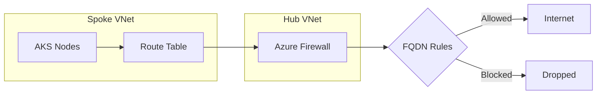

# How to Configure AKS with Azure Firewall for Egress Traffic Filtering and FQDN Rules

Author: [nawazdhandala](https://www.github.com/nawazdhandala)

Tags: AKS, Azure Firewall, Egress, Traffic Filtering, FQDN Rules, Networking, Security

Description: Learn how to route AKS cluster egress traffic through Azure Firewall with FQDN-based rules for granular outbound traffic control.

---

By default, AKS clusters have unrestricted outbound internet access. Any pod can reach any external endpoint. In regulated environments and security-conscious organizations, this is not acceptable. You need to know and control exactly what your cluster is talking to on the internet. Azure Firewall gives you that control by acting as a centralized egress point where you define FQDN-based rules that whitelist specific destinations. In this guide, I will walk through the complete setup of routing AKS egress through Azure Firewall and configuring the rules that AKS needs to function.

## Architecture Overview

The setup follows a hub-spoke network topology. The AKS cluster lives in a spoke VNet, and Azure Firewall lives in a hub VNet. All outbound traffic from the AKS subnet is routed through the firewall via user-defined routes. The firewall evaluates each connection against your rules and either allows or blocks it.



## Prerequisites

You need an Azure subscription with permissions to create VNets, firewalls, and AKS clusters. Azure CLI 2.44 or later is required. The setup involves creating multiple networking resources, so plan your IP address spaces carefully.

## Step 1: Create the Network Infrastructure

Set up the hub and spoke VNets with peering.

```bash
# Create the resource group
az group create --name aks-firewall-rg --location eastus

# Create the hub VNet for Azure Firewall
az network vnet create \
  --resource-group aks-firewall-rg \
  --name hub-vnet \
  --address-prefix 10.0.0.0/16 \
  --subnet-name AzureFirewallSubnet \
  --subnet-prefix 10.0.1.0/24

# Create the spoke VNet for AKS
az network vnet create \
  --resource-group aks-firewall-rg \
  --name spoke-vnet \
  --address-prefix 10.1.0.0/16 \
  --subnet-name aks-subnet \
  --subnet-prefix 10.1.0.0/24

# Peer hub to spoke
az network vnet peering create \
  --resource-group aks-firewall-rg \
  --name hub-to-spoke \
  --vnet-name hub-vnet \
  --remote-vnet spoke-vnet \
  --allow-forwarded-traffic \
  --allow-vnet-access

# Peer spoke to hub
az network vnet peering create \
  --resource-group aks-firewall-rg \
  --name spoke-to-hub \
  --vnet-name spoke-vnet \
  --remote-vnet hub-vnet \
  --allow-forwarded-traffic \
  --allow-vnet-access
```

## Step 2: Deploy Azure Firewall

Create the firewall with a public IP and a firewall policy.

```bash
# Create a public IP for the firewall
az network public-ip create \
  --resource-group aks-firewall-rg \
  --name firewall-pip \
  --sku Standard \
  --allocation-method Static

# Create a firewall policy
az network firewall policy create \
  --resource-group aks-firewall-rg \
  --name aks-firewall-policy \
  --location eastus

# Create the Azure Firewall
az network firewall create \
  --resource-group aks-firewall-rg \
  --name aks-firewall \
  --location eastus \
  --vnet-name hub-vnet \
  --firewall-policy aks-firewall-policy

# Configure the firewall IP
az network firewall ip-config create \
  --resource-group aks-firewall-rg \
  --firewall-name aks-firewall \
  --name firewall-ipconfig \
  --public-ip-address firewall-pip \
  --vnet-name hub-vnet

# Get the firewall private IP for routing
FIREWALL_PRIVATE_IP=$(az network firewall show \
  --resource-group aks-firewall-rg \
  --name aks-firewall \
  --query "ipConfigurations[0].privateIPAddress" -o tsv)

echo "Firewall Private IP: $FIREWALL_PRIVATE_IP"
```

## Step 3: Create Route Table for AKS Subnet

Route all outbound traffic from the AKS subnet through the firewall.

```bash
# Create a route table
az network route-table create \
  --resource-group aks-firewall-rg \
  --name aks-route-table \
  --location eastus

# Add a default route pointing to the firewall
az network route-table route create \
  --resource-group aks-firewall-rg \
  --route-table-name aks-route-table \
  --name default-route \
  --address-prefix 0.0.0.0/0 \
  --next-hop-type VirtualAppliance \
  --next-hop-ip-address $FIREWALL_PRIVATE_IP

# Associate the route table with the AKS subnet
az network vnet subnet update \
  --resource-group aks-firewall-rg \
  --vnet-name spoke-vnet \
  --name aks-subnet \
  --route-table aks-route-table
```

## Step 4: Configure Firewall Rules for AKS

AKS requires access to several Microsoft endpoints for the control plane, image pulls, and monitoring. Without these rules, the cluster will not function.

```bash
# Create a rule collection group
az network firewall policy rule-collection-group create \
  --resource-group aks-firewall-rg \
  --policy-name aks-firewall-policy \
  --name AKSRules \
  --priority 100

# Allow AKS required FQDN destinations
az network firewall policy rule-collection-group collection add-filter-collection \
  --resource-group aks-firewall-rg \
  --policy-name aks-firewall-policy \
  --rule-collection-group-name AKSRules \
  --name AKSRequired \
  --collection-priority 200 \
  --action Allow \
  --rule-type ApplicationRule \
  --protocols Https=443 \
  --source-addresses "10.1.0.0/24" \
  --fqdn-tags AzureKubernetesService
```

The `AzureKubernetesService` FQDN tag includes all required Microsoft endpoints. If you need more granular control, specify individual FQDNs instead.

```bash
# Add specific FQDN rules for container registries
az network firewall policy rule-collection-group collection add-filter-collection \
  --resource-group aks-firewall-rg \
  --policy-name aks-firewall-policy \
  --rule-collection-group-name AKSRules \
  --name ContainerRegistries \
  --collection-priority 300 \
  --action Allow \
  --rule-type ApplicationRule \
  --protocols Https=443 \
  --source-addresses "10.1.0.0/24" \
  --target-fqdns \
    "myregistry.azurecr.io" \
    "*.blob.core.windows.net" \
    "mcr.microsoft.com" \
    "*.data.mcr.microsoft.com"
```

Add rules for Docker Hub if you pull public images.

```bash
# Allow Docker Hub access
az network firewall policy rule-collection-group collection add-filter-collection \
  --resource-group aks-firewall-rg \
  --policy-name aks-firewall-policy \
  --rule-collection-group-name AKSRules \
  --name DockerHub \
  --collection-priority 400 \
  --action Allow \
  --rule-type ApplicationRule \
  --protocols Https=443 \
  --source-addresses "10.1.0.0/24" \
  --target-fqdns \
    "*.docker.io" \
    "production.cloudflare.docker.com" \
    "registry-1.docker.io"
```

You also need network rules for NTP and DNS.

```bash
# Network rules for UDP traffic (NTP and DNS)
az network firewall policy rule-collection-group collection add-filter-collection \
  --resource-group aks-firewall-rg \
  --policy-name aks-firewall-policy \
  --rule-collection-group-name AKSRules \
  --name NetworkRules \
  --collection-priority 500 \
  --action Allow \
  --rule-type NetworkRule \
  --ip-protocols UDP \
  --source-addresses "10.1.0.0/24" \
  --destination-addresses "*" \
  --destination-ports 123 1194
```

Port 123 is NTP (time sync), and port 1194 is used for the AKS tunnel communication between nodes and the API server.

## Step 5: Create the AKS Cluster

Now create the AKS cluster with user-defined routing for egress.

```bash
# Get the AKS subnet ID
AKS_SUBNET_ID=$(az network vnet subnet show \
  --resource-group aks-firewall-rg \
  --vnet-name spoke-vnet \
  --name aks-subnet \
  --query id -o tsv)

# Create the AKS cluster with UDR egress
az aks create \
  --resource-group aks-firewall-rg \
  --name aks-firewall-cluster \
  --network-plugin azure \
  --vnet-subnet-id $AKS_SUBNET_ID \
  --outbound-type userDefinedRouting \
  --node-count 3 \
  --generate-ssh-keys
```

The `--outbound-type userDefinedRouting` tells AKS not to create a public load balancer for egress. All outbound traffic follows the route table through the firewall.

## Step 6: Verify Egress Through Firewall

Test that outbound traffic is flowing through the firewall.

```bash
# Deploy a test pod
kubectl run test-egress --image=mcr.microsoft.com/cbl-mariner/base/core:2.0 \
  --rm -it -- /bin/bash

# Inside the pod, check your external IP
curl -s ifconfig.me
# This should show the Azure Firewall's public IP, not a load balancer IP
```

The external IP should match the firewall's public IP, confirming that egress is routed through the firewall.

## Step 7: Monitor Firewall Logs

Enable diagnostic logging on the firewall to see what traffic is being allowed and denied.

```bash
# Enable diagnostic logging to Log Analytics
az monitor diagnostic-settings create \
  --resource /subscriptions/<sub-id>/resourceGroups/aks-firewall-rg/providers/Microsoft.Network/azureFirewalls/aks-firewall \
  --name aks-firewall-logs \
  --workspace <log-analytics-workspace-id> \
  --logs '[{"category": "AzureFirewallApplicationRule", "enabled": true}, {"category": "AzureFirewallNetworkRule", "enabled": true}]'
```

Query the logs to find denied connections - these tell you what additional rules you might need.

```
AzureFirewallApplicationRule
| where msg_s contains "Deny"
| project TimeGenerated, msg_s
| order by TimeGenerated desc
```

## Handling Application-Specific Egress

Your applications likely need access to external APIs, package registries, or SaaS services. Create additional rule collections for these.

```bash
# Allow access to specific external APIs
az network firewall policy rule-collection-group collection add-filter-collection \
  --resource-group aks-firewall-rg \
  --policy-name aks-firewall-policy \
  --rule-collection-group-name AKSRules \
  --name ApplicationEgress \
  --collection-priority 600 \
  --action Allow \
  --rule-type ApplicationRule \
  --protocols Https=443 \
  --source-addresses "10.1.0.0/24" \
  --target-fqdns \
    "api.stripe.com" \
    "api.sendgrid.com" \
    "*.githubusercontent.com"
```

## Troubleshooting

**Cluster creation fails with timeout.** The firewall rules are probably missing required AKS endpoints. Make sure the `AzureKubernetesService` FQDN tag is allowed, and network rules for ports 123 and 1194 are in place.

**Image pulls fail.** Check that the container registry FQDN is allowed. For ACR, you need both the registry FQDN and `*.blob.core.windows.net` for layer downloads.

**Pods cannot resolve DNS.** Ensure the node can reach Azure DNS (168.63.129.16) or your custom DNS server through the firewall.

**Nodes show NotReady after firewall changes.** If you modify firewall rules and accidentally block required AKS endpoints, nodes will lose connectivity to the API server. Roll back the rule change and check the firewall deny logs.

Routing AKS egress through Azure Firewall gives you complete visibility and control over what your cluster communicates with externally. It takes more setup than the default outbound configuration, but the security benefits - knowing exactly what your workloads can reach and having an audit trail of every connection - make it essential for production environments with compliance requirements.
