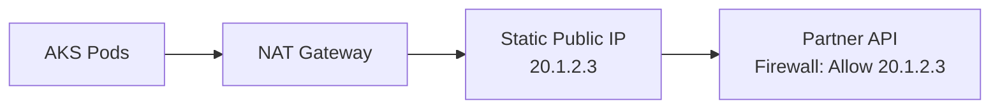

# How to Configure AKS with Azure NAT Gateway for Predictable Outbound IP Addresses

Author: [nawazdhandala](https://www.github.com/nawazdhandala)

Tags: AKS, NAT Gateway, Outbound IP, Networking, Kubernetes, Azure, Firewall

Description: Learn how to use Azure NAT Gateway with AKS to get static, predictable outbound IP addresses for firewall allowlisting and partner API integrations.

---

When your AKS pods make outbound connections to external services, those services see a source IP address. If that IP changes unpredictably, you are going to have a bad time with firewall rules, partner API allowlists, and compliance requirements that mandate known egress IPs. The default AKS load balancer outbound configuration uses a pool of IPs that can change during scale events or upgrades.

Azure NAT Gateway gives you a fixed set of outbound IP addresses that never change, regardless of what happens inside your cluster. This guide focuses specifically on the predictable IP use case - how to configure NAT Gateway so that every outbound connection from your AKS cluster uses a known, static IP that you can share with partners and configure in firewalls.

## The Problem with Default Outbound IPs

When AKS uses the default load balancer outbound type, it assigns public IPs to the load balancer frontend. The number of IPs depends on your configuration, and they can change during:

- Cluster upgrades
- Node pool scaling operations
- Load balancer reconfigurations
- Cluster reconciliation events

If a partner has allowlisted a specific IP and AKS changes it, your integrations break. You find out when the partner's API starts rejecting your requests, and you scramble to figure out which IP to give them now.

## NAT Gateway Solves This

With NAT Gateway, you create and own the public IP addresses. They are standard Azure public IP resources that you assign to the NAT Gateway. Unless you explicitly change them, they stay the same forever. Your outbound IP is deterministic and under your control.



## Step 1: Create Static Public IPs

Start by creating the public IPs that will be your permanent outbound addresses. Use the Standard SKU with static allocation.

```bash
# Create a resource group
az group create --name myNATRG --location eastus

# Create a static public IP for outbound traffic
# This IP will be your permanent outbound address
az network public-ip create \
  --resource-group myNATRG \
  --name aks-outbound-ip-1 \
  --sku Standard \
  --allocation-method Static \
  --zone 1 2 3

# Get the IP address - this is what you share with partners
az network public-ip show \
  --resource-group myNATRG \
  --name aks-outbound-ip-1 \
  --query ipAddress -o tsv
```

If you need multiple outbound IPs (for higher SNAT port capacity or for different use cases), create more:

```bash
# Create a second public IP
az network public-ip create \
  --resource-group myNATRG \
  --name aks-outbound-ip-2 \
  --sku Standard \
  --allocation-method Static \
  --zone 1 2 3
```

Alternatively, use a public IP prefix for a contiguous range:

```bash
# Create a public IP prefix with 4 IPs (/30)
az network public-ip prefix create \
  --resource-group myNATRG \
  --name aks-outbound-prefix \
  --length 30 \
  --zone 1 2 3
```

## Step 2: Create the NAT Gateway

Create a NAT Gateway resource and attach your static IPs to it.

```bash
# Create the NAT Gateway
az network nat gateway create \
  --resource-group myNATRG \
  --name aks-nat-gateway \
  --public-ip-addresses aks-outbound-ip-1 aks-outbound-ip-2 \
  --idle-timeout 10 \
  --location eastus
```

## Step 3: Create the VNet and Subnet

The NAT Gateway needs to be associated with the subnet that your AKS nodes will use.

```bash
# Create a VNet for the AKS cluster
az network vnet create \
  --resource-group myNATRG \
  --name aks-vnet \
  --address-prefixes 10.0.0.0/8 \
  --subnet-name aks-subnet \
  --subnet-prefix 10.240.0.0/16

# Associate the NAT Gateway with the subnet
az network vnet subnet update \
  --resource-group myNATRG \
  --vnet-name aks-vnet \
  --name aks-subnet \
  --nat-gateway aks-nat-gateway
```

## Step 4: Create the AKS Cluster

Deploy the AKS cluster using the subnet with the NAT Gateway attached.

```bash
# Get the subnet ID
SUBNET_ID=$(az network vnet subnet show \
  --resource-group myNATRG \
  --vnet-name aks-vnet \
  --name aks-subnet \
  --query id -o tsv)

# Create the AKS cluster with user-assigned NAT Gateway
az aks create \
  --resource-group myNATRG \
  --name myPredictableIPCluster \
  --node-count 3 \
  --network-plugin azure \
  --vnet-subnet-id $SUBNET_ID \
  --outbound-type userAssignedNATGateway \
  --generate-ssh-keys
```

## Step 5: Verify the Outbound IP

Confirm that all outbound traffic uses your static IP.

```bash
# Get cluster credentials
az aks get-credentials --resource-group myNATRG --name myPredictableIPCluster

# Check the outbound IP from inside the cluster
kubectl run ip-check --rm -it --image=curlimages/curl -- curl -s ifconfig.me
# Expected output: 20.1.2.3 (your static IP)

# Run the check multiple times to confirm consistency
for i in $(seq 1 5); do
  kubectl run "ip-check-$i" --rm -it --image=curlimages/curl -- curl -s ifconfig.me
  echo ""
done
```

Every run should return the same IP address. With the default load balancer outbound type, you might see different IPs depending on which frontend IP was selected.

## Step 6: Document and Share the IPs

Create a clear record of your outbound IPs for partner communications and firewall rules.

```bash
# List all outbound IPs associated with the NAT Gateway
az network nat gateway show \
  --resource-group myNATRG \
  --name aks-nat-gateway \
  --query "publicIpAddresses[].id" -o tsv | while read IP_ID; do
    az network public-ip show --ids $IP_ID --query "{name:name, ip:ipAddress}" -o table
done

# If using a prefix, list the IPs in the prefix
az network public-ip prefix show \
  --resource-group myNATRG \
  --name aks-outbound-prefix \
  --query "{prefix:ipPrefix, addresses:publicIPAddresses}" -o json
```

Share these IPs with:
- Partner API teams for allowlisting
- Your network team for firewall rules
- Compliance documentation for audit trails

## Working with Multiple Subnets

If your AKS cluster uses multiple node pools on different subnets, each subnet needs its own NAT Gateway or must share one via VNet peering.

```bash
# Create a second subnet for a GPU node pool
az network vnet subnet create \
  --resource-group myNATRG \
  --vnet-name aks-vnet \
  --name gpu-subnet \
  --address-prefixes 10.241.0.0/16 \
  --nat-gateway aks-nat-gateway

# Add a GPU node pool on the second subnet
az aks nodepool add \
  --resource-group myNATRG \
  --cluster-name myPredictableIPCluster \
  --name gpupool \
  --node-count 1 \
  --node-vm-size Standard_NC6s_v3 \
  --vnet-subnet-id $(az network vnet subnet show \
    --resource-group myNATRG \
    --vnet-name aks-vnet \
    --name gpu-subnet \
    --query id -o tsv)
```

Both subnets use the same NAT Gateway, so both node pools have the same outbound IPs.

## Monitoring Outbound Connections

Track your NAT Gateway metrics to ensure you have enough SNAT port capacity and that connections are healthy.

```bash
# Get NAT Gateway resource ID
NAT_GW_ID=$(az network nat gateway show \
  --resource-group myNATRG \
  --name aks-nat-gateway \
  --query id -o tsv)

# Check total SNAT connections
az monitor metrics list \
  --resource $NAT_GW_ID \
  --metric "TotalConnectionCount" \
  --interval PT5M \
  --aggregation Total \
  --output table

# Check dropped connections (indicates SNAT exhaustion)
az monitor metrics list \
  --resource $NAT_GW_ID \
  --metric "DroppedConnectionCount" \
  --interval PT5M \
  --aggregation Total \
  --output table
```

Set up alerts for dropped connections:

```bash
# Create an alert for dropped SNAT connections
az monitor metrics alert create \
  --resource-group myNATRG \
  --name "NAT-SNAT-Dropped" \
  --scopes $NAT_GW_ID \
  --condition "total DroppedConnectionCount > 100" \
  --window-size 5m \
  --evaluation-frequency 1m \
  --severity 2 \
  --description "NAT Gateway is dropping connections - possible SNAT exhaustion"
```

## Handling IP Changes Gracefully

In rare cases, you might need to change your outbound IPs (moving to a new prefix, expanding capacity). Here is how to do it without breaking existing integrations:

```bash
# Create a new IP
az network public-ip create \
  --resource-group myNATRG \
  --name aks-outbound-ip-new \
  --sku Standard \
  --allocation-method Static

# Add the new IP to the NAT Gateway (existing IPs remain)
az network nat gateway update \
  --resource-group myNATRG \
  --name aks-nat-gateway \
  --public-ip-addresses aks-outbound-ip-1 aks-outbound-ip-2 aks-outbound-ip-new

# Notify partners to add the new IP to their allowlists
# Wait for confirmation

# Remove old IP only after all partners have updated
az network nat gateway update \
  --resource-group myNATRG \
  --name aks-nat-gateway \
  --public-ip-addresses aks-outbound-ip-new
```

The key is to always add the new IP before removing the old one. During the transition period, both IPs may be used for outbound connections. Partners should allowlist both until the migration is complete.

## Cost Considerations

NAT Gateway costs include:

- **Resource hour charge**: Around $0.045 per hour for the NAT Gateway itself
- **Data processing**: Around $0.045 per GB of data processed
- **Public IP cost**: Standard static public IPs have a monthly charge

For most clusters, the NAT Gateway cost is a small fraction of the overall AKS spend. The reliability and predictability of outbound IPs is well worth it, especially when the alternative is debugging intermittent connection failures because an IP changed unexpectedly.

## Common Pitfalls

Do not use the managed NAT Gateway option if you need to control the IPs yourself. Managed NAT Gateway lets AKS create and manage the IPs, which means they could change during certain operations. Always use `userAssignedNATGateway` for predictable IP control.

Make sure the NAT Gateway, public IPs, VNet, and AKS cluster are all in the same region. Cross-region configurations are not supported.

Keep track of SNAT port usage as your cluster grows. Each public IP provides about 64,000 SNAT ports. If you are running hundreds of pods making outbound connections, you may need multiple IPs.

Using NAT Gateway for predictable outbound IPs is one of the most practical networking configurations for production AKS clusters. It eliminates an entire category of integration issues and gives you full control over your cluster's external identity.
