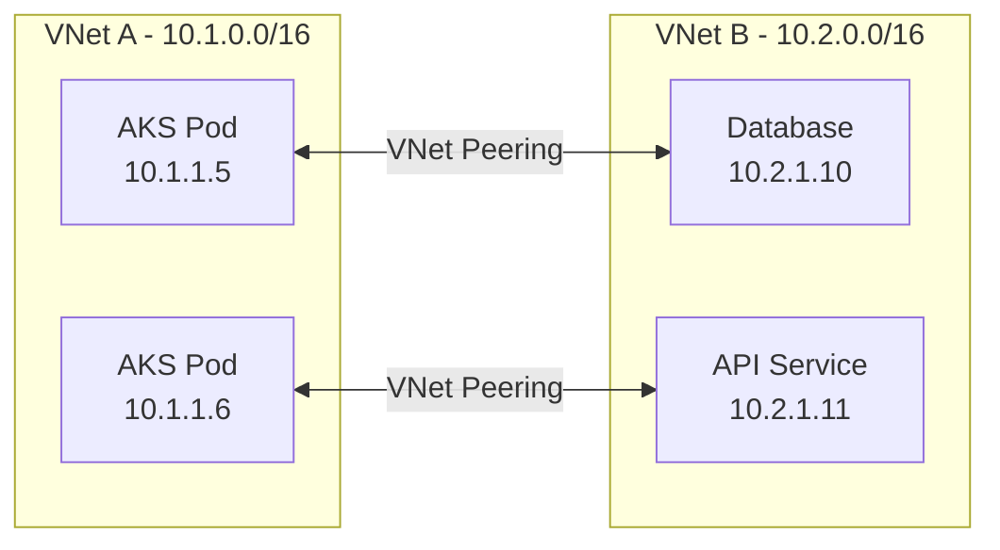
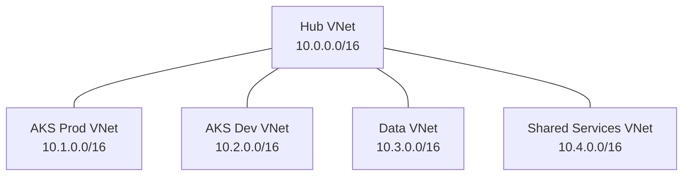

# How to Configure AKS with Azure Virtual Network Peering for Cross-VNet Pod Communication

Author: [nawazdhandala](https://www.github.com/nawazdhandala)

Tags: AKS, VNet Peering, Networking, Kubernetes, Azure, Cross-VNet, Pod Communication

Description: Learn how to set up Azure Virtual Network peering with AKS clusters to enable direct pod-to-pod and pod-to-service communication across different VNets.

---

In enterprise Azure environments, resources are typically spread across multiple virtual networks. You might have an AKS cluster in one VNet, a database server in another, and a shared services cluster in a third. By default, resources in different VNets cannot communicate with each other - they are isolated by design.

Azure Virtual Network peering connects two VNets so that resources in either network can communicate using private IP addresses, as if they were in the same network. When combined with AKS using Azure CNI (where pods get VNet IP addresses), this enables direct pod-to-service and even pod-to-pod communication across VNets without going through the public internet.

This guide covers setting up VNet peering between AKS clusters and other Azure resources, handling the networking details that trip people up, and testing cross-VNet connectivity.

## How VNet Peering Works with AKS

When you create an AKS cluster with Azure CNI, every pod gets an IP address from the VNet subnet. If you peer this VNet with another VNet, pods in your AKS cluster can directly reach resources in the peered VNet using their private IPs, and vice versa.



There is one critical requirement: the address spaces of the peered VNets must not overlap. If VNet A uses 10.1.0.0/16 and VNet B also uses 10.1.0.0/16, peering will fail.

## Prerequisites

- Two or more VNets with non-overlapping address spaces
- AKS clusters using Azure CNI (not kubenet - kubenet pods use a separate address space that is not directly routable)
- Azure CLI 2.50 or later
- Network Contributor permissions on both VNets

## Step 1: Plan Your Address Spaces

Before creating anything, plan your address spaces to avoid overlaps. Here is an example layout:

| VNet | Purpose | Address Space | AKS Subnet |
|------|---------|---------------|------------|
| VNet-AKS-Prod | Production AKS | 10.1.0.0/16 | 10.1.0.0/17 |
| VNet-AKS-Dev | Development AKS | 10.2.0.0/16 | 10.2.0.0/17 |
| VNet-Data | Databases and data services | 10.3.0.0/16 | N/A |
| VNet-Shared | Shared services | 10.4.0.0/16 | 10.4.0.0/17 |

## Step 2: Create the VNets and AKS Clusters

If you do not already have the VNets, create them:

```bash
# Create VNet for production AKS
az network vnet create \
  --resource-group prodRG \
  --name VNet-AKS-Prod \
  --address-prefixes 10.1.0.0/16 \
  --subnet-name aks-subnet \
  --subnet-prefix 10.1.0.0/17

# Create VNet for data services
az network vnet create \
  --resource-group dataRG \
  --name VNet-Data \
  --address-prefixes 10.3.0.0/16 \
  --subnet-name data-subnet \
  --subnet-prefix 10.3.0.0/24

# Create AKS cluster in the prod VNet using Azure CNI
SUBNET_ID=$(az network vnet subnet show \
  --resource-group prodRG \
  --vnet-name VNet-AKS-Prod \
  --name aks-subnet \
  --query id -o tsv)

az aks create \
  --resource-group prodRG \
  --name prodAKS \
  --node-count 3 \
  --network-plugin azure \
  --vnet-subnet-id $SUBNET_ID \
  --service-cidr 10.100.0.0/16 \
  --dns-service-ip 10.100.0.10 \
  --generate-ssh-keys
```

## Step 3: Create VNet Peering

VNet peering is bidirectional but requires creating a peering link in both directions.

```bash
# Get VNet resource IDs
PROD_VNET_ID=$(az network vnet show \
  --resource-group prodRG \
  --name VNet-AKS-Prod \
  --query id -o tsv)

DATA_VNET_ID=$(az network vnet show \
  --resource-group dataRG \
  --name VNet-Data \
  --query id -o tsv)

# Create peering from Prod VNet to Data VNet
az network vnet peering create \
  --resource-group prodRG \
  --name prod-to-data \
  --vnet-name VNet-AKS-Prod \
  --remote-vnet $DATA_VNET_ID \
  --allow-vnet-access \
  --allow-forwarded-traffic

# Create peering from Data VNet to Prod VNet
az network vnet peering create \
  --resource-group dataRG \
  --name data-to-prod \
  --vnet-name VNet-Data \
  --remote-vnet $PROD_VNET_ID \
  --allow-vnet-access \
  --allow-forwarded-traffic
```

The `--allow-vnet-access` flag enables standard communication between the VNets. The `--allow-forwarded-traffic` flag allows traffic that originated from outside either VNet to flow through the peering (useful for hub-and-spoke topologies).

## Step 4: Verify Peering Status

Both peering links must show "Connected" status.

```bash
# Check peering status from the Prod side
az network vnet peering show \
  --resource-group prodRG \
  --vnet-name VNet-AKS-Prod \
  --name prod-to-data \
  --query peeringState -o tsv
# Expected: Connected

# Check peering status from the Data side
az network vnet peering show \
  --resource-group dataRG \
  --vnet-name VNet-Data \
  --name data-to-prod \
  --query peeringState -o tsv
# Expected: Connected
```

If either side shows "Initiated" instead of "Connected", it means the other side's peering link has not been created yet.

## Step 5: Test Cross-VNet Connectivity

Deploy a test pod in your AKS cluster and try to reach a resource in the peered VNet.

```bash
# Get AKS credentials
az aks get-credentials --resource-group prodRG --name prodAKS

# Test connectivity to a database server in the Data VNet
# Replace 10.3.0.10 with the actual IP of your resource
kubectl run connectivity-test --rm -it --image=curlimages/curl -- \
  curl -v telnet://10.3.0.10:5432 --connect-timeout 5

# Test DNS resolution (if you have private DNS zones linked to both VNets)
kubectl run dns-test --rm -it --image=busybox -- \
  nslookup mydb.postgres.database.azure.com
```

## Step 6: Configure NSG Rules

VNet peering allows traffic to flow, but Network Security Groups (NSGs) on subnets can still block it. Make sure the NSG rules allow the traffic you need.

```bash
# Check NSG rules on the AKS subnet
AKS_NSG=$(az network vnet subnet show \
  --resource-group prodRG \
  --vnet-name VNet-AKS-Prod \
  --name aks-subnet \
  --query networkSecurityGroup.id -o tsv)

az network nsg rule list \
  --nsg-name $(basename $AKS_NSG) \
  --resource-group $(echo $AKS_NSG | cut -d'/' -f5) \
  -o table

# Add a rule to allow traffic from the data VNet if needed
az network nsg rule create \
  --resource-group prodRG \
  --nsg-name $(basename $AKS_NSG) \
  --name allow-data-vnet \
  --priority 200 \
  --direction Inbound \
  --source-address-prefixes 10.3.0.0/16 \
  --destination-port-ranges "*" \
  --protocol "*" \
  --access Allow
```

## Step 7: Peer Multiple AKS Clusters

For cluster-to-cluster communication, peer the VNets and use Kubernetes services with external IPs.

```bash
# Peer the Prod AKS VNet with the Dev AKS VNet
DEV_VNET_ID=$(az network vnet show \
  --resource-group devRG \
  --name VNet-AKS-Dev \
  --query id -o tsv)

# Create bidirectional peering
az network vnet peering create \
  --resource-group prodRG \
  --name prod-to-dev \
  --vnet-name VNet-AKS-Prod \
  --remote-vnet $DEV_VNET_ID \
  --allow-vnet-access

az network vnet peering create \
  --resource-group devRG \
  --name dev-to-prod \
  --vnet-name VNet-AKS-Dev \
  --remote-vnet $PROD_VNET_ID \
  --allow-vnet-access
```

To access a service in the other cluster, use an internal load balancer:

```yaml
# internal-lb-service.yaml
# Service exposed via internal load balancer for cross-VNet access
apiVersion: v1
kind: Service
metadata:
  name: my-api
  annotations:
    # Use an internal load balancer (no public IP)
    service.beta.kubernetes.io/azure-load-balancer-internal: "true"
spec:
  type: LoadBalancer
  ports:
  - port: 80
    targetPort: 8080
  selector:
    app: my-api
```

The internal load balancer gets a private IP from the AKS subnet, which is reachable from the peered VNet.

## Step 8: Set Up Private DNS Resolution

For resources that use private DNS (like Azure Private Link endpoints), link the private DNS zone to both VNets.

```bash
# Link a private DNS zone to the AKS VNet
az network private-dns link vnet create \
  --resource-group dnsRG \
  --zone-name privatelink.postgres.database.azure.com \
  --name aks-prod-link \
  --virtual-network $PROD_VNET_ID \
  --registration-enabled false
```

This allows pods in your AKS cluster to resolve private DNS names for resources in peered VNets.

## Hub and Spoke Topology

For larger environments, consider a hub-and-spoke topology where all VNets peer with a central hub VNet rather than peering with each other directly.



In this model, the hub VNet contains shared resources like firewalls, VPN gateways, and DNS resolvers. Traffic between spoke VNets routes through the hub.

```bash
# Enable gateway transit on the hub side (if using a VPN gateway)
az network vnet peering update \
  --resource-group hubRG \
  --vnet-name VNet-Hub \
  --name hub-to-prod \
  --set allowGatewayTransit=true

# Enable use of remote gateway on the spoke side
az network vnet peering update \
  --resource-group prodRG \
  --vnet-name VNet-AKS-Prod \
  --name prod-to-hub \
  --set useRemoteGateways=true
```

## Troubleshooting

**Peering shows Connected but traffic does not flow**: Check NSG rules on both sides. VNet peering opens the path, but NSGs can still block specific traffic.

**Pod IPs not reachable from peered VNet**: Make sure you are using Azure CNI. With kubenet, pod IPs are on a separate CIDR that is not advertised to peered VNets. With Azure CNI Overlay, you need User Defined Routes (UDR) to route pod traffic.

**DNS resolution fails across VNets**: Private DNS zones must be linked to each VNet that needs to resolve those names. Check the DNS zone links.

**Asymmetric peering**: Both peering links must be created and show "Connected". If only one side is configured, traffic will not flow.

VNet peering is a fundamental networking building block for enterprise AKS deployments. It enables secure, low-latency communication between your cluster and other Azure resources without exposing traffic to the public internet. Plan your address spaces carefully upfront, and the peering configuration itself is straightforward.
