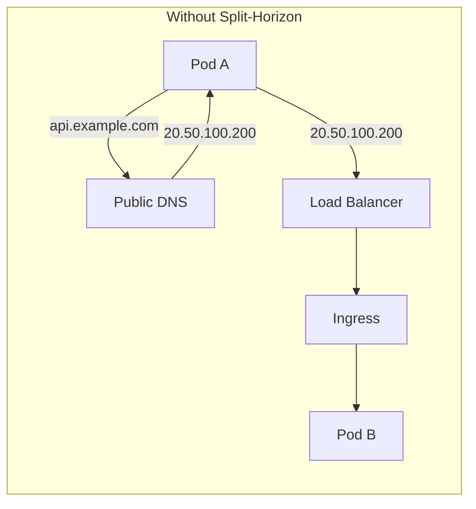
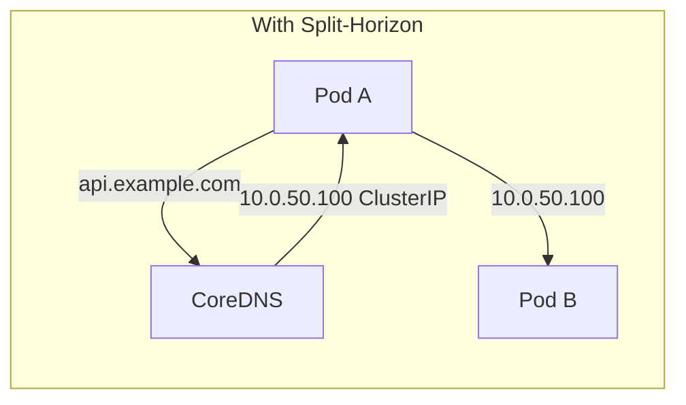

# How to Configure AKS with Custom CoreDNS Configuration for Split-Horizon DNS

Author: [nawazdhandala](https://www.github.com/nawazdhandala)

Tags: AKS, Kubernetes, CoreDNS, Split-Horizon DNS, Networking, Azure, DNS Configuration

Description: Learn how to configure custom CoreDNS rules on AKS to implement split-horizon DNS for resolving the same domain differently inside and outside the cluster.

---

Split-horizon DNS is one of those patterns that seems niche until you need it - and then it becomes essential. The idea is simple: the same domain name resolves to different IP addresses depending on where the query comes from. Inside your cluster, `api.example.com` resolves to a ClusterIP service. Outside the cluster, the same `api.example.com` resolves to a public load balancer IP. This eliminates unnecessary network hops for pod-to-pod communication and avoids hairpin routing through the load balancer.

On AKS, implementing split-horizon DNS requires customizing CoreDNS to intercept specific domains and resolve them differently than the public DNS servers would. This guide walks through the complete setup.

## Why Split-Horizon DNS Matters

Without split-horizon DNS, when a pod inside your cluster calls `api.example.com`, the request goes out to the public DNS server, gets the public IP of the load balancer, comes back through the Azure load balancer, hits the ingress controller, and finally reaches the destination pod. That is a round trip through the internet for traffic that could have gone directly between pods on the same network.





The split-horizon approach means less latency, no load balancer hairpinning, and reduced network costs.

## Understanding CoreDNS Custom Configuration on AKS

AKS manages the main CoreDNS configuration file (the Corefile). You cannot edit it directly. Instead, AKS provides a mechanism to add custom configuration through a ConfigMap called `coredns-custom` in the `kube-system` namespace.

When AKS detects this ConfigMap, it merges your custom configuration into the CoreDNS Corefile. The custom entries are imported into the main server block or as additional server blocks depending on how you structure them.

```bash
# Check if any custom CoreDNS config already exists
kubectl get configmap coredns-custom -n kube-system 2>/dev/null

# View the current CoreDNS configuration
kubectl get configmap coredns -n kube-system -o yaml
```

## Implementing Split-Horizon with Rewrite Rules

The simplest approach is to rewrite specific domain queries to point to Kubernetes service names, which CoreDNS resolves to ClusterIPs.

```yaml
# coredns-custom-rewrite.yaml
# Rewrite external domain queries to internal service addresses
apiVersion: v1
kind: ConfigMap
metadata:
  name: coredns-custom
  namespace: kube-system
data:
  # The key must end with .override to be included in the main server block
  split-horizon.override: |
    rewrite stop {
      name regex api\.example\.com api-service.production.svc.cluster.local
      answer name api-service.production.svc.cluster.local api.example.com
    }
    rewrite stop {
      name regex web\.example\.com web-service.production.svc.cluster.local
      answer name web-service.production.svc.cluster.local web.example.com
    }
    rewrite stop {
      name regex auth\.example\.com auth-service.production.svc.cluster.local
      answer name auth-service.production.svc.cluster.local auth.example.com
    }
```

The `rewrite` plugin works in two directions. The `name regex` part rewrites the incoming query. The `answer name` part rewrites the response so the client sees the original domain name in the DNS response, not the internal service name.

```bash
# Apply the configuration
kubectl apply -f coredns-custom-rewrite.yaml

# Restart CoreDNS to pick up changes
kubectl rollout restart deployment coredns -n kube-system

# Wait for the restart to complete
kubectl rollout status deployment coredns -n kube-system
```

## Implementing Split-Horizon with Custom Hosts

An alternative approach is to use the hosts plugin to map domains directly to specific IP addresses.

```yaml
# coredns-custom-hosts.yaml
# Map external domains to internal ClusterIP addresses
apiVersion: v1
kind: ConfigMap
metadata:
  name: coredns-custom
  namespace: kube-system
data:
  # Static hostname mappings for split-horizon DNS
  split-horizon-hosts.override: |
    hosts {
      10.0.50.100 api.example.com
      10.0.50.101 web.example.com
      10.0.50.102 auth.example.com
      10.0.50.103 metrics.example.com
      fallthrough
    }
```

The `fallthrough` directive is critical. Without it, CoreDNS stops processing after the hosts plugin, and any domain not listed in the hosts block will fail to resolve. With `fallthrough`, unmatched queries proceed to the next plugin in the chain (which forwards them to the upstream DNS).

The downside of the hosts approach is that you need to hardcode ClusterIP addresses. If a service's ClusterIP changes (rare, but possible during recreation), you need to update the hosts entries manually.

## Implementing Split-Horizon with Forward Rules

For domains that are resolved by an internal DNS server (like a corporate DNS), use forward rules.

```yaml
# coredns-custom-forward.yaml
# Forward specific domain zones to internal DNS servers
apiVersion: v1
kind: ConfigMap
metadata:
  name: coredns-custom
  namespace: kube-system
data:
  # Forward corporate domain queries to internal DNS
  corporate-dns.server: |
    corp.example.com:53 {
        forward . 10.0.0.10 10.0.0.11 {
            force_tcp
        }
        cache 300
        log
        errors
    }
  # Forward a partner domain to their DNS server
  partner-dns.server: |
    partner.example.com:53 {
        forward . 192.168.1.10 {
            force_tcp
        }
        cache 60
        errors
    }
```

Note the key naming convention. Keys ending with `.server` create new server blocks (for handling entire DNS zones). Keys ending with `.override` add configuration to the existing main server block.

## Combining Approaches

For a complete split-horizon setup, you often need to combine multiple techniques.

```yaml
# coredns-custom-complete.yaml
# Comprehensive split-horizon DNS configuration for AKS
apiVersion: v1
kind: ConfigMap
metadata:
  name: coredns-custom
  namespace: kube-system
data:
  # Rewrite public domain names to internal service names
  # These go into the main server block
  split-horizon-rewrites.override: |
    rewrite stop {
      name regex api\.mycompany\.com api-gateway.production.svc.cluster.local
      answer name api-gateway.production.svc.cluster.local api.mycompany.com
    }
    rewrite stop {
      name regex dashboard\.mycompany\.com dashboard-service.production.svc.cluster.local
      answer name dashboard-service.production.svc.cluster.local dashboard.mycompany.com
    }

  # Static mappings for services that use specific IPs
  static-hosts.override: |
    hosts {
      10.0.1.50 legacy-api.mycompany.com
      10.0.1.51 legacy-db.mycompany.com
      fallthrough
    }

  # Forward corporate internal domains to corporate DNS
  corporate.server: |
    internal.mycompany.com:53 {
        forward . 10.100.0.10 10.100.0.11
        cache 120
        errors
    }
```

```bash
# Apply the complete configuration
kubectl apply -f coredns-custom-complete.yaml

# Restart CoreDNS
kubectl rollout restart deployment coredns -n kube-system
```

## Testing Split-Horizon DNS

After applying the configuration, verify that domains resolve correctly from inside the cluster.

```bash
# Deploy a test pod
kubectl run dns-test --image=busybox:1.36 --restart=Never -- sleep 3600

# Test resolution of a split-horizon domain
kubectl exec dns-test -- nslookup api.example.com

# The result should show the internal ClusterIP or service address
# instead of the public IP

# Compare with external resolution
nslookup api.example.com 8.8.8.8
# This should show the public IP

# Test that non-split-horizon domains still resolve normally
kubectl exec dns-test -- nslookup google.com
```

## Handling TLS Certificate Validation

When you rewrite `api.example.com` to an internal address, TLS certificate validation can break if the internal service is not presenting a certificate for `api.example.com`. There are two approaches to handle this.

### Option 1: Use Certificates that Match the Public Domain

Configure your internal services to use TLS certificates that include `api.example.com` in their Subject Alternative Names (SANs). This is the correct approach for production.

```yaml
# cert-manager certificate for the internal service
apiVersion: cert-manager.io/v1
kind: Certificate
metadata:
  name: api-cert
  namespace: production
spec:
  secretName: api-tls
  issuerRef:
    name: letsencrypt-prod
    kind: ClusterIssuer
  dnsNames:
    - api.example.com
    - api-service.production.svc.cluster.local
```

### Option 2: Use HTTP Internally

For internal pod-to-pod communication, you might skip TLS entirely and use HTTP. This is acceptable if your cluster network is trusted and you have network policies in place.

```yaml
# Application config that uses HTTP for internal calls
apiVersion: v1
kind: ConfigMap
metadata:
  name: app-config
  namespace: production
data:
  # When calling api.example.com from inside the cluster,
  # the split-horizon DNS resolves to the ClusterIP.
  # Use HTTP since it is cluster-internal traffic.
  API_URL: "http://api.example.com"
```

## Debugging CoreDNS Custom Configuration

If your custom configuration is not working, check for syntax errors and verify the merge.

```bash
# Check CoreDNS logs for configuration errors
kubectl logs -n kube-system -l k8s-app=kube-dns --tail=50

# Verify the merged Corefile (the actual config CoreDNS is using)
kubectl exec -n kube-system -it $(kubectl get pods -n kube-system -l k8s-app=kube-dns -o name | head -1) -- cat /etc/coredns/Corefile

# Check if the custom ConfigMap is mounted
kubectl describe pod -n kube-system $(kubectl get pods -n kube-system -l k8s-app=kube-dns -o name | head -1) | grep -A 5 "coredns-custom"

# Enable CoreDNS logging for debugging
# Add this to your coredns-custom ConfigMap:
# log.override: |
#     log
```

## Performance Considerations

The rewrite plugin adds negligible latency to DNS queries - it is a simple string replacement that happens in memory. The hosts plugin is similarly fast. Forward rules add the latency of the additional DNS server hop.

For heavy DNS loads, enable caching in your forward rules.

```yaml
# Caching for forwarded zones
corporate.server: |
  corp.example.com:53 {
      forward . 10.0.0.10
      cache 600   # Cache responses for 10 minutes
      errors
  }
```

## Wrapping Up

Split-horizon DNS on AKS eliminates unnecessary network hops for internal traffic, reduces latency, and avoids load balancer hairpinning. The implementation uses CoreDNS custom configuration through the `coredns-custom` ConfigMap, with rewrite rules for mapping public domains to internal services and forward rules for corporate DNS integration. Test thoroughly after applying changes, pay attention to TLS certificate validation, and always include the `fallthrough` directive in hosts blocks. The result is a cleaner network architecture where internal traffic stays internal and external traffic goes through the proper ingress path.
