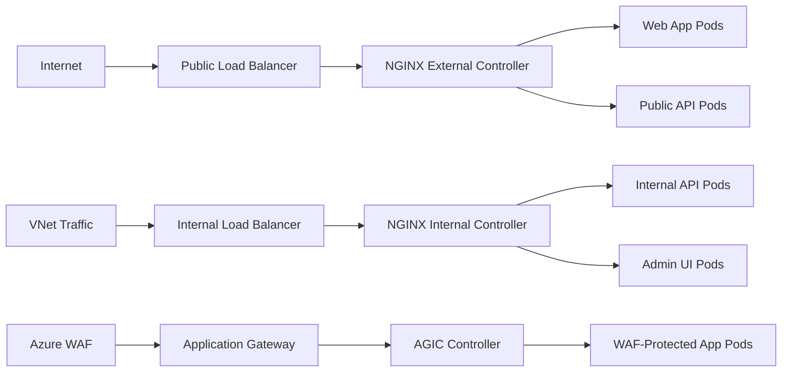

# How to Configure AKS with Multiple Ingress Controllers Using Ingress Class Annotations

Author: [nawazdhandala](https://www.github.com/nawazdhandala)

Tags: AKS, Kubernetes, Ingress, NGINX, Azure, Networking, Traffic Management

Description: Learn how to run multiple ingress controllers on AKS and use IngressClass annotations to route traffic to the correct controller for each service.

---

Running a single ingress controller on AKS works fine for simple setups, but as your cluster grows you often need multiple controllers. Maybe you want an internal NGINX ingress for backend services and a public one for customer-facing traffic. Or perhaps you need both NGINX and Azure Application Gateway to handle different traffic patterns. The key to making this work is IngressClass resources and the right annotations.

This guide walks through deploying multiple ingress controllers on AKS, configuring IngressClass resources, and routing ingress resources to the correct controller.

## Why Multiple Ingress Controllers

There are several legitimate reasons to run more than one ingress controller.

**Internal vs. external traffic**: You want public-facing services routed through one controller (with WAF, rate limiting, and public IP) and internal services through another (with a private IP on your VNet).

**Different capabilities**: NGINX handles certain use cases well (WebSockets, custom headers), while Azure Application Gateway Ingress Controller (AGIC) provides native Azure WAF integration and SSL offloading at scale.

**Team isolation**: Different teams manage their own ingress controllers with their own configurations, certificates, and IP addresses.

**Performance isolation**: High-traffic services get their own dedicated ingress controller so they do not compete for resources with lower-traffic services.

## Understanding IngressClass

IngressClass is a Kubernetes resource that identifies which controller should handle a given Ingress resource. Before IngressClass existed (Kubernetes 1.18), you used the `kubernetes.io/ingress.class` annotation. Both methods still work, but IngressClass resources are the modern approach.

Here is how they map together.

```yaml
# The old way - using an annotation (still works, but deprecated)
apiVersion: networking.k8s.io/v1
kind: Ingress
metadata:
  name: my-ingress
  annotations:
    kubernetes.io/ingress.class: nginx-internal
spec:
  rules:
    - host: api.internal.example.com
      http:
        paths:
          - path: /
            pathType: Prefix
            backend:
              service:
                name: api-service
                port:
                  number: 80

---
# The new way - using ingressClassName (preferred)
apiVersion: networking.k8s.io/v1
kind: Ingress
metadata:
  name: my-ingress
spec:
  ingressClassName: nginx-internal
  rules:
    - host: api.internal.example.com
      http:
        paths:
          - path: /
            pathType: Prefix
            backend:
              service:
                name: api-service
                port:
                  number: 80
```

## Deploying Two NGINX Ingress Controllers

Let us set up two NGINX ingress controllers - one for public traffic and one for internal traffic. We will use Helm to install both, each in its own namespace with its own IngressClass.

First, add the NGINX Helm repository.

```bash
# Add the ingress-nginx Helm repository
helm repo add ingress-nginx https://kubernetes.github.io/ingress-nginx
helm repo update
```

Deploy the public (external) ingress controller.

```bash
# Install the external NGINX ingress controller
helm install nginx-external ingress-nginx/ingress-nginx \
  --namespace ingress-external \
  --create-namespace \
  --set controller.ingressClassResource.name=nginx-external \
  --set controller.ingressClassResource.controllerValue="k8s.io/ingress-nginx-external" \
  --set controller.ingressClassResource.enabled=true \
  --set controller.ingressClassResource.default=false \
  --set controller.replicaCount=2 \
  --set controller.nodeSelector."kubernetes\.io/os"=linux \
  --set controller.service.annotations."service\.beta\.kubernetes\.io/azure-load-balancer-health-probe-request-path"="/healthz" \
  --set controller.service.externalTrafficPolicy=Local
```

Now deploy the internal ingress controller. The key difference is the Azure load balancer annotation that makes it internal.

```bash
# Install the internal NGINX ingress controller
helm install nginx-internal ingress-nginx/ingress-nginx \
  --namespace ingress-internal \
  --create-namespace \
  --set controller.ingressClassResource.name=nginx-internal \
  --set controller.ingressClassResource.controllerValue="k8s.io/ingress-nginx-internal" \
  --set controller.ingressClassResource.enabled=true \
  --set controller.ingressClassResource.default=false \
  --set controller.replicaCount=2 \
  --set controller.nodeSelector."kubernetes\.io/os"=linux \
  --set controller.service.annotations."service\.beta\.kubernetes\.io/azure-load-balancer-internal"="true" \
  --set controller.service.annotations."service\.beta\.kubernetes\.io/azure-load-balancer-health-probe-request-path"="/healthz" \
  --set controller.service.externalTrafficPolicy=Local
```

Verify both controllers are running and have their own IP addresses.

```bash
# Check both ingress controllers
kubectl get pods -n ingress-external
kubectl get pods -n ingress-internal

# Check that each has its own load balancer IP
kubectl get svc -n ingress-external
kubectl get svc -n ingress-internal

# Verify the IngressClass resources were created
kubectl get ingressclass
```

You should see two IngressClass resources: `nginx-external` and `nginx-internal`. Each points to a different controller.

## Creating Ingress Resources for Each Controller

Now when you create ingress resources, specify which controller should handle them.

```yaml
# external-ingress.yaml
# Public-facing web application routed through the external NGINX controller
apiVersion: networking.k8s.io/v1
kind: Ingress
metadata:
  name: public-webapp
  namespace: production
  annotations:
    # TLS redirect for public traffic
    nginx.ingress.kubernetes.io/ssl-redirect: "true"
    nginx.ingress.kubernetes.io/force-ssl-redirect: "true"
spec:
  # This routes to the external controller
  ingressClassName: nginx-external
  tls:
    - hosts:
        - app.example.com
      secretName: app-tls-secret
  rules:
    - host: app.example.com
      http:
        paths:
          - path: /
            pathType: Prefix
            backend:
              service:
                name: webapp-service
                port:
                  number: 80
---
# internal-ingress.yaml
# Internal API routed through the internal NGINX controller
apiVersion: networking.k8s.io/v1
kind: Ingress
metadata:
  name: internal-api
  namespace: production
  annotations:
    # Allow larger request bodies for API calls
    nginx.ingress.kubernetes.io/proxy-body-size: "50m"
spec:
  # This routes to the internal controller
  ingressClassName: nginx-internal
  rules:
    - host: api.internal.example.com
      http:
        paths:
          - path: /
            pathType: Prefix
            backend:
              service:
                name: api-service
                port:
                  number: 8080
```

## Adding Azure Application Gateway as a Third Controller

You can also mix controller types. Here is how to add the Azure Application Gateway Ingress Controller (AGIC) alongside your NGINX controllers.

```bash
# Enable the AGIC add-on on your AKS cluster
az aks enable-addons \
  --resource-group myRG \
  --name myAKS \
  --addons ingress-appgw \
  --appgw-name myAppGateway \
  --appgw-subnet-cidr "10.225.0.0/16"
```

AGIC creates its own IngressClass called `azure-application-gateway`. You can now route specific ingress resources to it.

```yaml
# agic-ingress.yaml
# Route through Azure Application Gateway for WAF protection
apiVersion: networking.k8s.io/v1
kind: Ingress
metadata:
  name: waf-protected-app
  namespace: production
  annotations:
    # AGIC-specific annotation for WAF policy
    appgw.ingress.kubernetes.io/waf-policy-for-path: "/subscriptions/<sub>/resourceGroups/myRG/providers/Microsoft.Network/applicationGatewayWebApplicationFirewallPolicies/myWAFPolicy"
spec:
  ingressClassName: azure-application-gateway
  tls:
    - hosts:
        - secure.example.com
      secretName: secure-tls-secret
  rules:
    - host: secure.example.com
      http:
        paths:
          - path: /
            pathType: Prefix
            backend:
              service:
                name: secure-app
                port:
                  number: 443
```

## Setting a Default IngressClass

If you want one controller to handle ingress resources that do not specify an `ingressClassName`, mark it as the default.

```bash
# Make the external NGINX controller the default
kubectl annotate ingressclass nginx-external \
  ingressclass.kubernetes.io/is-default-class=true

# Verify it is marked as default
kubectl get ingressclass
# The default class will show (default) next to its name
```

Only one IngressClass should be the default. If multiple are marked as default, the behavior is undefined and depends on which controller processes the resource first.

## Architecture Overview

Here is how the traffic flows through the cluster with multiple ingress controllers.



## Troubleshooting

### Ingress Not Being Picked Up

If an ingress resource is not working, the most common cause is a mismatch between the `ingressClassName` and the actual IngressClass resource.

```bash
# List all IngressClass resources and their controller values
kubectl get ingressclass -o custom-columns=NAME:.metadata.name,CONTROLLER:.spec.controller

# Check which ingresses exist and their class
kubectl get ingress --all-namespaces -o custom-columns=NAMESPACE:.metadata.namespace,NAME:.metadata.name,CLASS:.spec.ingressClassName,ADDRESS:.status.loadBalancer.ingress[0].ip

# Check the logs of a specific controller for errors
kubectl logs -n ingress-external -l app.kubernetes.io/name=ingress-nginx --tail=50
```

### Both Controllers Claiming the Same Ingress

If you see both controllers trying to handle the same ingress, it usually means the `ingressClassName` is not set and both controllers are configured to watch for unclassified ingress resources. Set the `ingressClassName` explicitly on every ingress resource to avoid this.

### Controller-Specific Annotations Not Working

NGINX and AGIC use different annotation prefixes. NGINX uses `nginx.ingress.kubernetes.io/` while AGIC uses `appgw.ingress.kubernetes.io/`. If you use NGINX annotations on an AGIC-routed ingress, they will be silently ignored.

## Wrapping Up

Running multiple ingress controllers on AKS is straightforward once you understand the IngressClass mechanism. Deploy each controller with its own IngressClass name and controller value, then reference the correct class in each Ingress resource. This pattern gives you the flexibility to handle different traffic types with the right tool for each job - NGINX for general-purpose routing, AGIC for WAF-protected traffic, and internal controllers for backend services. Keep your IngressClass names descriptive, always set `ingressClassName` explicitly, and avoid marking multiple classes as default.
