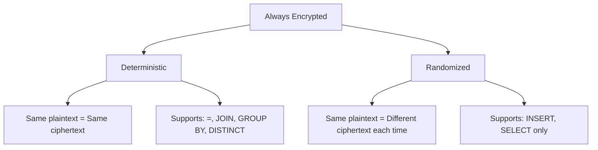

# How to Configure Always Encrypted in Azure SQL Database

Author: [nawazdhandala](https://www.github.com/nawazdhandala)

Tags: Azure SQL, Always Encrypted, Security, Encryption, Azure Key Vault, Database, Compliance

Description: A detailed guide to configuring Always Encrypted in Azure SQL Database to protect sensitive data so that even database administrators cannot see plaintext values.

---

Always Encrypted is a feature in Azure SQL Database that keeps sensitive data encrypted at all times - in transit, at rest, and even in memory on the server. The database engine never sees the plaintext data. Only the client application, which holds the encryption keys, can decrypt the values. This means that database administrators, Azure operators, and anyone with access to the database server cannot read the encrypted columns.

This is fundamentally different from TDE, which encrypts data at rest but decrypts it in the database engine's memory during query processing. Always Encrypted moves the encryption and decryption to the client side.

## When to Use Always Encrypted

Always Encrypted is designed for scenarios where you need to protect data from privileged users:

- Storing credit card numbers, Social Security numbers, or other regulated data where DBAs should not have access
- Compliance requirements that mandate separation between data owners and data administrators
- Multi-tenant applications where you want to guarantee tenant data isolation from operators
- Protecting data from potential insider threats

The trade-off is that Always Encrypted has more limitations than server-side encryption. Not all query operations work on encrypted columns, and the setup is more involved.

## Encryption Types

Always Encrypted supports two encryption types:

**Deterministic encryption**: The same plaintext always produces the same ciphertext. This allows equality comparisons, joins, and GROUP BY on encrypted columns. Use this when you need to query by exact match (e.g., looking up a user by SSN).

**Randomized encryption**: The same plaintext can produce different ciphertext each time. This is more secure but does not support any query operations on the encrypted column. You can only retrieve and display the value. Use this for highly sensitive data where you never need to search or filter by the column.



## Key Architecture

Always Encrypted uses a two-key hierarchy:

1. **Column Encryption Key (CEK)**: Symmetric key that actually encrypts the data in a column. Stored in the database in encrypted form.
2. **Column Master Key (CMK)**: Asymmetric key that protects (wraps) the CEK. Stored outside the database - in Azure Key Vault, Windows Certificate Store, or a hardware security module.

The database only ever has the encrypted CEK. To decrypt data, the client application retrieves the encrypted CEK from the database, sends it to the key store (e.g., Key Vault) to be unwrapped, and uses the decrypted CEK to decrypt the data locally.

## Setting Up Always Encrypted Using SSMS

SQL Server Management Studio provides a wizard that simplifies the setup considerably.

### Step 1: Connect to Your Database

Open SSMS and connect to your Azure SQL Database.

### Step 2: Launch the Always Encrypted Wizard

Right-click on the table you want to encrypt, then select "Encrypt Columns...". This opens the Always Encrypted Wizard.

### Step 3: Select Columns

Choose which columns to encrypt and select the encryption type for each:

- Deterministic for columns you need to search or join on
- Randomized for columns that are display-only

### Step 4: Configure the Column Master Key

The wizard asks where to store the CMK. Options include:

- **Azure Key Vault**: Recommended for production. Centralized key management with access policies and audit logging.
- **Windows Certificate Store**: Stores the key locally on the machine. Simpler for development but harder to manage across multiple application servers.

If you choose Azure Key Vault, you will need to sign in and select or create a key.

### Step 5: Review and Execute

The wizard generates T-SQL scripts to:
- Create the CMK metadata in the database
- Create the CEK and encrypt it with the CMK
- Encrypt the selected columns

Click "Finish" to execute. The wizard encrypts the existing data in the selected columns. For large tables, this can take some time.

## Setting Up Always Encrypted Using T-SQL and PowerShell

For more control and automation, you can set up Always Encrypted manually.

### Step 1: Create a Key in Azure Key Vault

```bash
# Create an RSA key in Key Vault for the Column Master Key
az keyvault key create \
    --vault-name mykeyvault \
    --name always-encrypted-cmk \
    --kty RSA \
    --size 2048
```

### Step 2: Create Column Master Key Metadata

Run this T-SQL in your database. Replace the Key Vault URL with your actual key URL.

```sql
-- Create the Column Master Key metadata pointing to Azure Key Vault
CREATE COLUMN MASTER KEY [CMK_KeyVault]
WITH (
    KEY_STORE_PROVIDER_NAME = N'AZURE_KEY_VAULT',
    KEY_PATH = N'https://mykeyvault.vault.azure.net/keys/always-encrypted-cmk/abc123...'
);
```

### Step 3: Create a Column Encryption Key

This step requires PowerShell because the CEK must be encrypted with the CMK, which is in Key Vault.

```powershell
# Import the SqlServer module
Import-Module SqlServer

# Define connection parameters
$serverName = "myserver.database.windows.net"
$databaseName = "mydb"
$connStr = "Server=$serverName;Database=$databaseName;Integrated Security=False;User ID=sqladmin;Password=YourPassword123!"

# Create the Column Encryption Key encrypted by the CMK
# The CEK is generated and wrapped with the CMK in Key Vault
New-SqlColumnEncryptionKey `
    -Name "CEK_1" `
    -InputObject (Get-SqlDatabase -ConnectionString $connStr) `
    -ColumnMasterKeyName "CMK_KeyVault"
```

### Step 4: Encrypt Columns

Use the `Set-SqlColumnEncryption` cmdlet to encrypt existing columns:

```powershell
# Define the encryption settings for each column
$encryptionChanges = @()

# Encrypt SSN with deterministic encryption (allows lookups)
$encryptionChanges += New-SqlColumnEncryptionSettings `
    -ColumnName "dbo.Customers.SSN" `
    -EncryptionType "Deterministic" `
    -EncryptionKey "CEK_1"

# Encrypt CreditCard with randomized encryption (display only)
$encryptionChanges += New-SqlColumnEncryptionSettings `
    -ColumnName "dbo.Customers.CreditCard" `
    -EncryptionType "Randomized" `
    -EncryptionKey "CEK_1"

# Apply the encryption
Set-SqlColumnEncryption `
    -InputObject (Get-SqlDatabase -ConnectionString $connStr) `
    -ColumnEncryptionSettings $encryptionChanges
```

## Connecting from an Application

Your application needs to be aware of Always Encrypted to handle the client-side encryption and decryption.

### .NET Application

In .NET, add the `Column Encryption Setting=Enabled` parameter to your connection string:

```csharp
// Connection string with Always Encrypted enabled
string connStr = "Server=myserver.database.windows.net;"
    + "Database=mydb;"
    + "User ID=appuser;"
    + "Password=YourPassword;"
    + "Column Encryption Setting=Enabled;";

// Register the Azure Key Vault provider for CMK access
SqlColumnEncryptionAzureKeyVaultProvider azureKeyVaultProvider =
    new SqlColumnEncryptionAzureKeyVaultProvider(tokenCredential);

Dictionary<string, SqlColumnEncryptionKeyStoreProvider> providers =
    new Dictionary<string, SqlColumnEncryptionKeyStoreProvider>
    {
        // Register the Key Vault provider so the driver can access the CMK
        { SqlColumnEncryptionAzureKeyVaultProvider.ProviderName, azureKeyVaultProvider }
    };

SqlConnection.RegisterColumnEncryptionKeyStoreProviders(providers);
```

With the provider registered, the ADO.NET driver automatically encrypts parameters sent to encrypted columns and decrypts values returned from encrypted columns. Your application code works with plaintext values as usual.

### Java Application

For Java with the Microsoft JDBC driver:

```java
// Connection string with Always Encrypted and Key Vault authentication
String connStr = "jdbc:sqlserver://myserver.database.windows.net:1433;"
    + "database=mydb;"
    + "user=appuser;"
    + "password=YourPassword;"
    + "columnEncryptionSetting=Enabled;"
    + "keyStoreAuthentication=KeyVaultClientSecret;"
    + "keyStorePrincipalId=<app-client-id>;"
    + "keyStoreSecret=<app-client-secret>;";
```

## Query Limitations

Always Encrypted has specific limitations on what you can do with encrypted columns:

**Deterministic columns support**:
- Equality comparisons (WHERE SSN = @ssn)
- JOIN on encrypted columns (both must use the same CEK)
- GROUP BY and DISTINCT

**Deterministic columns do not support**:
- Range comparisons (>, <, BETWEEN, LIKE)
- Arithmetic operations
- ORDER BY

**Randomized columns support**:
- INSERT and SELECT only

**General limitations**:
- Cannot use encrypted columns in computed columns
- Full-text search does not work on encrypted columns
- Triggers cannot reference plaintext of encrypted columns
- Temp tables can have encrypted columns, but the encryption must match

## Key Rotation

Regularly rotating keys is a security best practice.

### Rotating the Column Master Key

This involves creating a new CMK, re-encrypting the CEKs with the new CMK, and dropping the old CMK. SSMS provides a wizard for this under the "Column Master Key Rotation" option.

### Rotating the Column Encryption Key

This requires re-encrypting all data in the affected columns with a new CEK. For large tables, this is a significant operation. Plan for a maintenance window.

## Performance Considerations

Always Encrypted adds overhead because encryption and decryption happen on the client:

- INSERT operations are slightly slower because data must be encrypted before sending
- SELECT operations are slightly slower because data must be decrypted after receiving
- Index lookups on deterministic columns work efficiently because the ciphertext is consistent
- The main overhead is on the client CPU, not the database server

For most applications, the performance impact is acceptable, especially given the security benefits.

## Summary

Always Encrypted provides the strongest data protection available in Azure SQL Database by ensuring the database engine never sees plaintext data. Set it up using the SSMS wizard for simplicity or PowerShell for automation, store your Column Master Key in Azure Key Vault for production use, and design your schema with the query limitations in mind. Choose deterministic encryption for columns you need to search on and randomized encryption for columns that are display-only. The setup is more involved than TDE or dynamic data masking, but for truly sensitive data, the protection is worth the effort.
