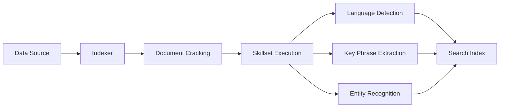

# How to Configure an Indexer with Skillsets in Azure AI Search for AI Enrichment

Author: [nawazdhandala](https://www.github.com/nawazdhandala)

Tags: Azure AI Search, Skillsets, Indexer, AI Enrichment, Cognitive Services, Azure, Search

Description: Learn how to configure an indexer with skillsets in Azure AI Search to enrich your data with AI capabilities during the indexing process.

---

Azure AI Search (formerly Azure Cognitive Search) does more than just index and query text. When you pair an indexer with a skillset, you can run AI enrichment on your data as it flows into the search index. This means you can extract key phrases, detect languages, perform OCR on images, and much more - all automatically during ingestion.

In this post, I will walk through the entire process of setting up an indexer that uses a skillset to enrich documents before they land in your search index.

## What Are Skillsets?

A skillset is a collection of AI skills that define how your data should be processed and enriched. Each skill takes an input, runs some form of AI processing, and produces an output. These skills can be built-in cognitive skills (powered by Azure AI services), custom skills (calling your own APIs), or utility skills for data shaping.

Some commonly used built-in skills include:

- **Entity Recognition** - extracts people, organizations, locations from text
- **Key Phrase Extraction** - pulls out important phrases
- **Language Detection** - identifies the language of a document
- **OCR** - reads text from images
- **Sentiment Analysis** - scores the sentiment of text content
- **Text Merge** - combines text from multiple fields

## Prerequisites

Before we begin, you need the following resources provisioned in Azure:

1. An Azure AI Search service (Basic tier or higher for skillsets)
2. An Azure AI services multi-service resource (for built-in cognitive skills)
3. A data source (Azure Blob Storage, Azure SQL Database, Cosmos DB, etc.)
4. Documents to index (PDFs, Word docs, images, or any supported format)

## Step 1: Create a Data Source

First, you need to tell Azure AI Search where your raw data lives. Here is an example using the REST API to register an Azure Blob Storage container as a data source.

```json
// POST to https://<search-service>.search.windows.net/datasources?api-version=2024-07-01
{
  "name": "my-blob-datasource",
  "type": "azureblob",
  "credentials": {
    // Connection string for your storage account
    "connectionString": "DefaultEndpointsProtocol=https;AccountName=mystorageaccount;AccountKey=<key>;EndpointSuffix=core.windows.net"
  },
  "container": {
    // The blob container holding your documents
    "name": "documents",
    "query": null
  }
}
```

You can also create the data source through the Azure portal or the .NET SDK. The REST API approach is useful when you want to automate the setup in a CI/CD pipeline.

## Step 2: Define the Skillset

This is where the AI enrichment magic happens. A skillset definition includes the list of skills, their inputs, outputs, and optionally a reference to your Azure AI services resource for billing.

Here is a skillset that performs key phrase extraction, language detection, and entity recognition.

```json
// POST to https://<search-service>.search.windows.net/skillsets?api-version=2024-07-01
{
  "name": "my-enrichment-skillset",
  "description": "Skillset for extracting key phrases, language, and entities",
  // Link to Azure AI services for billing built-in skills
  "cognitiveServices": {
    "@odata.type": "#Microsoft.Azure.Search.CognitiveServicesByKey",
    "key": "<your-ai-services-key>"
  },
  "skills": [
    {
      // Detect the language of each document
      "@odata.type": "#Microsoft.Skills.Text.LanguageDetectionSkill",
      "name": "language-detection",
      "context": "/document",
      "inputs": [
        { "name": "text", "source": "/document/content" }
      ],
      "outputs": [
        { "name": "languageCode", "targetName": "languageCode" }
      ]
    },
    {
      // Extract key phrases from the document content
      "@odata.type": "#Microsoft.Skills.Text.KeyPhraseExtractionSkill",
      "name": "keyphrases",
      "context": "/document",
      "inputs": [
        { "name": "text", "source": "/document/content" },
        { "name": "languageCode", "source": "/document/languageCode" }
      ],
      "outputs": [
        { "name": "keyPhrases", "targetName": "keyPhrases" }
      ]
    },
    {
      // Recognize entities like people, organizations, and locations
      "@odata.type": "#Microsoft.Skills.Text.V3.EntityRecognitionSkill",
      "name": "entity-recognition",
      "context": "/document",
      "categories": ["Person", "Organization", "Location"],
      "inputs": [
        { "name": "text", "source": "/document/content" },
        { "name": "languageCode", "source": "/document/languageCode" }
      ],
      "outputs": [
        { "name": "persons", "targetName": "people" },
        { "name": "organizations", "targetName": "organizations" },
        { "name": "locations", "targetName": "locations" }
      ]
    }
  ]
}
```

Notice how the language detection skill runs first and its output feeds into the other skills. This dependency chain is important - Azure AI Search automatically figures out the execution order based on input/output dependencies.

## Step 3: Create the Search Index

Your index needs fields to store both the original data and the enriched outputs. Here is an index definition that includes fields for key phrases, language, and entities.

```json
// POST to https://<search-service>.search.windows.net/indexes?api-version=2024-07-01
{
  "name": "my-enriched-index",
  "fields": [
    { "name": "id", "type": "Edm.String", "key": true, "filterable": true },
    { "name": "content", "type": "Edm.String", "searchable": true },
    { "name": "metadata_storage_path", "type": "Edm.String", "filterable": true },
    // Enriched fields from skillset
    { "name": "languageCode", "type": "Edm.String", "filterable": true, "facetable": true },
    { "name": "keyPhrases", "type": "Collection(Edm.String)", "searchable": true, "filterable": true },
    { "name": "people", "type": "Collection(Edm.String)", "searchable": true, "filterable": true },
    { "name": "organizations", "type": "Collection(Edm.String)", "searchable": true, "filterable": true },
    { "name": "locations", "type": "Collection(Edm.String)", "searchable": true, "filterable": true }
  ]
}
```

## Step 4: Create the Indexer

Now we tie everything together. The indexer connects the data source to the index and references the skillset. It also includes field mappings and output field mappings to route enriched data to the right index fields.

```json
// POST to https://<search-service>.search.windows.net/indexers?api-version=2024-07-01
{
  "name": "my-enriched-indexer",
  "dataSourceName": "my-blob-datasource",
  "targetIndexName": "my-enriched-index",
  "skillsetName": "my-enrichment-skillset",
  // Map fields from the data source to the index
  "fieldMappings": [
    {
      "sourceFieldName": "metadata_storage_path",
      "targetFieldName": "metadata_storage_path",
      "mappingFunction": { "name": "base64Encode" }
    },
    {
      "sourceFieldName": "metadata_storage_path",
      "targetFieldName": "id",
      "mappingFunction": { "name": "base64Encode" }
    }
  ],
  // Map enrichment outputs to index fields
  "outputFieldMappings": [
    { "sourceFieldName": "/document/languageCode", "targetFieldName": "languageCode" },
    { "sourceFieldName": "/document/keyPhrases", "targetFieldName": "keyPhrases" },
    { "sourceFieldName": "/document/people", "targetFieldName": "people" },
    { "sourceFieldName": "/document/organizations", "targetFieldName": "organizations" },
    { "sourceFieldName": "/document/locations", "targetFieldName": "locations" }
  ],
  "parameters": {
    "configuration": {
      // Enable cracking of PDFs, Office docs, etc.
      "dataToExtract": "contentAndMetadata",
      "imageAction": "generateNormalizedImages"
    }
  }
}
```

The `fieldMappings` section handles the raw source data, while `outputFieldMappings` routes the enriched fields from the skillset into your index.

## Step 5: Run and Monitor the Indexer

Once created, the indexer will start running automatically. You can check its status with a GET request.

```
GET https://<search-service>.search.windows.net/indexers/my-enriched-indexer/status?api-version=2024-07-01
```

The response will show you the execution history, including any warnings or errors. Common issues include:

- **Skill timeout** - large documents can exceed the processing time limit
- **Truncated content** - documents exceeding 64,000 characters get truncated by default
- **Missing AI services key** - built-in skills require a valid Azure AI services resource

## Adding Custom Skills

If the built-in skills do not cover your use case, you can create a custom skill that calls your own API or Azure Function. Here is what a custom skill definition looks like inside a skillset.

```json
{
  "@odata.type": "#Microsoft.Skills.Custom.WebApiSkill",
  "name": "my-custom-skill",
  "uri": "https://my-function-app.azurewebsites.net/api/custom-enrichment",
  "httpMethod": "POST",
  "timeout": "PT60S",
  "context": "/document",
  "inputs": [
    { "name": "text", "source": "/document/content" }
  ],
  "outputs": [
    { "name": "customField", "targetName": "customEnrichment" }
  ]
}
```

Your API needs to accept a specific request format and return results in the expected schema. Check the Azure documentation for the exact contract.

## The Enrichment Pipeline Flow

Here is how data flows through the entire pipeline from source to index.



## Tips for Production

A few things I have learned from running skillset-based indexers in production:

1. **Use incremental enrichment** - set up a cache so that unchanged documents do not get re-processed. This saves both time and money on AI services calls.
2. **Set reasonable batch sizes** - the default batch size works for most cases, but if you have very large documents, reduce it to avoid timeouts.
3. **Monitor costs** - each skill invocation is a billable transaction against your Azure AI services resource. Key phrase extraction on 100,000 documents adds up fast.
4. **Handle errors gracefully** - configure the indexer's `maxFailedItems` and `maxFailedItemsPerBatch` parameters so a few bad documents do not stop the entire run.

## Wrapping Up

Configuring an indexer with skillsets in Azure AI Search lets you build rich, AI-powered search experiences without writing custom ETL code. The platform handles document cracking, AI processing, and indexing in a single pipeline. Start with the built-in cognitive skills, and layer in custom skills when your requirements go beyond what the platform offers out of the box. Once your enriched index is ready, you can build powerful search applications that understand the content of your documents at a deeper level than simple keyword matching.
