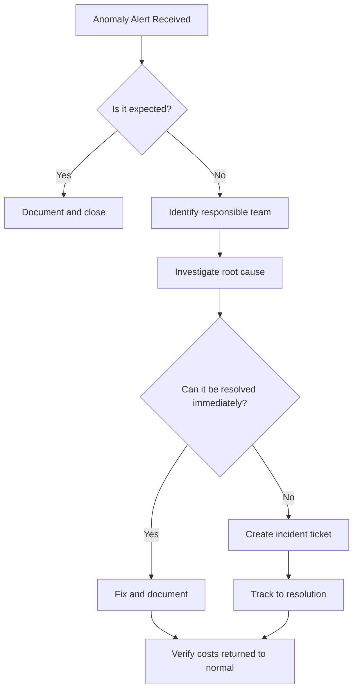

# How to Configure Anomaly Alerts in Azure Cost Management to Detect Unexpected Charges

Author: [nawazdhandala](https://www.github.com/nawazdhandala)

Tags: Azure Cost Management, Anomaly Detection, Cost Alerts, Cloud Spending, FinOps, Unexpected Charges

Description: Learn how to set up anomaly alerts in Azure Cost Management to automatically detect and get notified about unexpected cost increases in your Azure environment.

---

Budget alerts tell you when spending crosses a predetermined threshold. Anomaly alerts tell you when spending does something unexpected. The difference matters. A budget alert fires when you hit $4,000 of your $5,000 monthly budget, but it does not tell you if your daily spending suddenly doubled from $150 to $300 because someone accidentally deployed 20 VMs in a premium tier. Anomaly alerts catch those kinds of surprises by using machine learning to learn your normal spending patterns and flagging deviations.

This post covers how cost anomaly detection works in Azure Cost Management, how to configure alerts, how to investigate anomalies, and how to build a response workflow.

## How Cost Anomaly Detection Works

Azure Cost Management continuously analyzes your spending data and builds a model of your expected costs. The model accounts for:

- **Daily spending patterns** - Regular variations throughout the week.
- **Growth trends** - Gradual increases as your workloads grow.
- **Recurring events** - Monthly billing cycles, quarterly peaks, etc.

When actual spending deviates significantly from the expected range, the system flags it as an anomaly. The detection is fully automated - you do not need to define baselines or thresholds.

Anomaly detection runs daily and evaluates the most recent spending data. It typically detects anomalies with a 1-2 day delay because it needs the complete cost data for a day before it can compare against the model.

## Viewing Anomalies in Cost Analysis

Before setting up alerts, you can see existing anomalies in the cost analysis view.

1. Go to **Cost Management + Billing** > **Cost analysis**.
2. Switch to the **Daily costs** view.
3. Look for days marked with an anomaly indicator (a diamond icon or callout on the chart).
4. Click on the anomaly to see details: what service, resource group, or resource caused the unusual spending.

The cost analysis view highlights anomalies directly on the chart, making it easy to spot them visually.

## Configuring Anomaly Alerts

Anomaly alerts are configured through the Cost alerts feature in Cost Management.

### Via the Portal

1. Go to **Cost Management + Billing**.
2. Select a subscription scope.
3. Click **Cost alerts** in the left menu.
4. Click **Add** and select **Anomaly alert**.
5. Configure the alert:
   - **Name**: A descriptive name like "Daily cost anomaly detection".
   - **Scope**: The subscription or resource group to monitor.
   - **Email recipients**: Addresses that should receive anomaly notifications.
6. Click **Create**.

Anomaly alerts are currently available at the subscription level. Management group-level anomaly detection is supported in the cost analysis view but alerting may have limited scope options.

### Via ARM Templates

```json
{
  "type": "Microsoft.CostManagement/scheduledActions",
  "apiVersion": "2023-03-01",
  "name": "daily-anomaly-alert",
  "kind": "InsightAlert",
  "properties": {
    "displayName": "Daily Cost Anomaly Alert",
    "status": "Enabled",
    "viewId": "/subscriptions/<sub-id>/providers/Microsoft.CostManagement/views/ms:DailyAnomalyByResourceGroup",
    "notification": {
      "to": [
        "ops@example.com",
        "finance@example.com"
      ],
      "subject": "Azure Cost Anomaly Detected"
    },
    "schedule": {
      "frequency": "Daily",
      "startDate": "2026-02-16T00:00:00Z",
      "endDate": "2027-02-16T00:00:00Z"
    }
  }
}
```

### Via Azure CLI

```bash
# Create a scheduled action for anomaly alerting
az costmanagement scheduled-action create \
  --name "daily-anomaly-alert" \
  --display-name "Daily Cost Anomaly Alert" \
  --status "Enabled" \
  --kind "InsightAlert" \
  --scope "/subscriptions/<sub-id>" \
  --view-id "/subscriptions/<sub-id>/providers/Microsoft.CostManagement/views/ms:DailyAnomalyByResourceGroup" \
  --notification-to "ops@example.com" "finance@example.com" \
  --notification-subject "Azure Cost Anomaly Detected" \
  --schedule-frequency "Daily" \
  --schedule-start-date "2026-02-16T00:00:00Z" \
  --schedule-end-date "2027-02-16T00:00:00Z"
```

## What the Anomaly Alert Email Contains

When an anomaly is detected, the notification email includes:

- **The anomalous amount** - How much more was spent than expected.
- **The expected range** - What the model predicted spending would be.
- **The affected scope** - Which subscription or resource group.
- **Breakdown by service** - Which Azure services contributed to the anomaly.
- **A link to investigate** - Takes you directly to the cost analysis view for that day with the anomaly highlighted.

The email is designed to give you enough context to decide whether the anomaly requires immediate investigation or is a known, expected change.

## Investigating an Anomaly

When you receive an anomaly alert, follow this investigation workflow.

### Step 1: Open Cost Analysis

Click the link in the email or go to Cost Management > Cost analysis. Set the date range to include the anomalous day and a few days before and after for context.

### Step 2: Identify the Source

Group costs by different dimensions to narrow down the source:

1. **Service name** - Which Azure service spiked? (Compute, Storage, Networking, etc.)
2. **Resource group** - Which resource group is responsible?
3. **Resource** - Which specific resource?
4. **Meter** - What exact meter (line item) is driving the cost?

Each level of drilling narrows the scope until you find the specific resource or operation causing the anomaly.

### Step 3: Check the Activity Log

Once you know which resource is responsible, check the Activity Log for that resource to see what changed.

```bash
# Check activity log for changes on a specific resource
az monitor activity-log list \
  --resource-id "/subscriptions/<sub-id>/resourceGroups/rg-prod/providers/Microsoft.Compute/virtualMachines/vm-suspicious" \
  --start-time "2026-02-15" \
  --end-time "2026-02-17" \
  --query "[].{Time:eventTimestamp, Operation:operationName.localizedValue, Caller:caller, Status:status.localizedValue}" \
  -o table
```

Look for:

- New resource deployments.
- Scale-up operations (VM resized to a larger SKU).
- Configuration changes (storage account tier changed from Standard to Premium).
- New network configurations (data egress through a different path).

### Step 4: Determine If the Anomaly Is Expected

Not every anomaly is a problem. Common expected anomalies:

- **End-of-month billing adjustments** from Microsoft.
- **New project deployments** that were planned.
- **Seasonal traffic increases** driving auto-scale.
- **One-time data migrations** causing temporary storage spikes.
- **Reserved Instance purchases** that appear as a single-day charge.

If the anomaly is expected, document it and move on. If it is unexpected, take corrective action.

### Step 5: Take Corrective Action

For unexpected anomalies:

1. **Accidental deployment**: Delete or deallocate the unintended resources.
2. **Configuration error**: Revert the misconfiguration (wrong SKU, wrong tier, wrong region).
3. **Security breach**: If you suspect unauthorized resource creation, escalate to the security team and check Azure AD sign-in logs.
4. **Runaway auto-scale**: Adjust auto-scale rules and scale down the excess instances.

## Building an Anomaly Response Workflow

For organizations with multiple teams and subscriptions, a structured response workflow prevents anomalies from falling through the cracks.



### Automation Options

For faster response, connect anomaly detection to automation:

1. **Logic App integration**: When an anomaly email arrives at a shared mailbox, a Logic App parses it and creates a ticket in your tracking system.

2. **Custom Azure Function**: Query the Cost Management API daily for anomalies and post them to a Slack or Teams channel.

```python
# Python function to check for cost anomalies using the Cost Management API
import requests
from datetime import datetime, timedelta

def check_for_anomalies(subscription_id, access_token):
    """Query Cost Management for recent anomalies."""
    url = f"https://management.azure.com/subscriptions/{subscription_id}/providers/Microsoft.CostManagement/query?api-version=2023-03-01"

    # Query for daily costs over the past 7 days
    body = {
        "type": "ActualCost",
        "timeframe": "Custom",
        "timePeriod": {
            "from": (datetime.utcnow() - timedelta(days=7)).strftime("%Y-%m-%dT00:00:00Z"),
            "to": datetime.utcnow().strftime("%Y-%m-%dT00:00:00Z")
        },
        "dataset": {
            "granularity": "Daily",
            "aggregation": {
                "totalCost": {"name": "Cost", "function": "Sum"}
            }
        }
    }

    headers = {
        "Authorization": f"Bearer {access_token}",
        "Content-Type": "application/json"
    }

    response = requests.post(url, json=body, headers=headers)
    data = response.json()

    # Simple anomaly detection: flag days where cost exceeds 2x the average
    costs = [row[0] for row in data["properties"]["rows"]]
    avg_cost = sum(costs) / len(costs) if costs else 0

    anomalies = []
    for i, row in enumerate(data["properties"]["rows"]):
        if row[0] > avg_cost * 2:
            anomalies.append({
                "date": row[1],
                "cost": row[0],
                "expected_avg": avg_cost
            })

    return anomalies
```

## Combining Anomaly Alerts with Budget Alerts

Anomaly alerts and budget alerts serve different purposes and work best together.

| Feature | Budget Alerts | Anomaly Alerts |
|---------|--------------|----------------|
| What they detect | Spending crossing a threshold | Spending deviating from pattern |
| Configuration | You set the threshold | Machine learning sets the baseline |
| Best for | Staying within a planned budget | Catching unexpected cost spikes |
| Response time | Immediate (based on current spend) | 1-2 day delay (needs complete daily data) |
| False positives | Low (deterministic) | Moderate (depends on model accuracy) |

Use budget alerts as your primary financial guardrails and anomaly alerts as a supplementary detection layer that catches things budgets miss.

## Limitations

- **Detection delay**: Anomalies are detected 1-2 days after they occur because Azure needs complete daily cost data.
- **Subscription scope only**: Anomaly alerting is primarily available at the subscription level.
- **No custom sensitivity**: You cannot adjust how sensitive the anomaly detection is. It uses Azure's built-in model.
- **Email only by default**: Native anomaly alerts send email notifications. For other channels, you need to build custom integrations.
- **Learning period**: The model needs historical data to establish baselines. New subscriptions may not get accurate anomaly detection for the first few weeks.

## Best Practices

1. **Enable anomaly alerts on every production subscription.** The cost is zero and the value is high.
2. **Route alerts to a shared channel**, not just one person. Cost anomalies affect the whole team.
3. **Document expected anomalies proactively.** Before a big deployment or migration, let the team know to expect a cost spike so they do not waste time investigating a known change.
4. **Review anomaly history monthly.** Look for patterns - if the same resource group triggers anomalies repeatedly, it might need better budgeting or auto-scaling tuning.
5. **Combine with tagging.** Good resource tagging makes anomaly investigation faster because you can quickly identify which project, team, or environment is responsible.

## Wrapping Up

Cost anomaly alerts are your safety net for unexpected charges. They catch the things that budget alerts miss - sudden spikes, configuration mistakes, unauthorized deployments, and billing errors. Set them up on every production subscription, build a simple investigation workflow, and combine them with budget alerts for comprehensive financial monitoring. The setup takes five minutes, and it can save you thousands when it catches a runaway cost before it accumulates for days.
