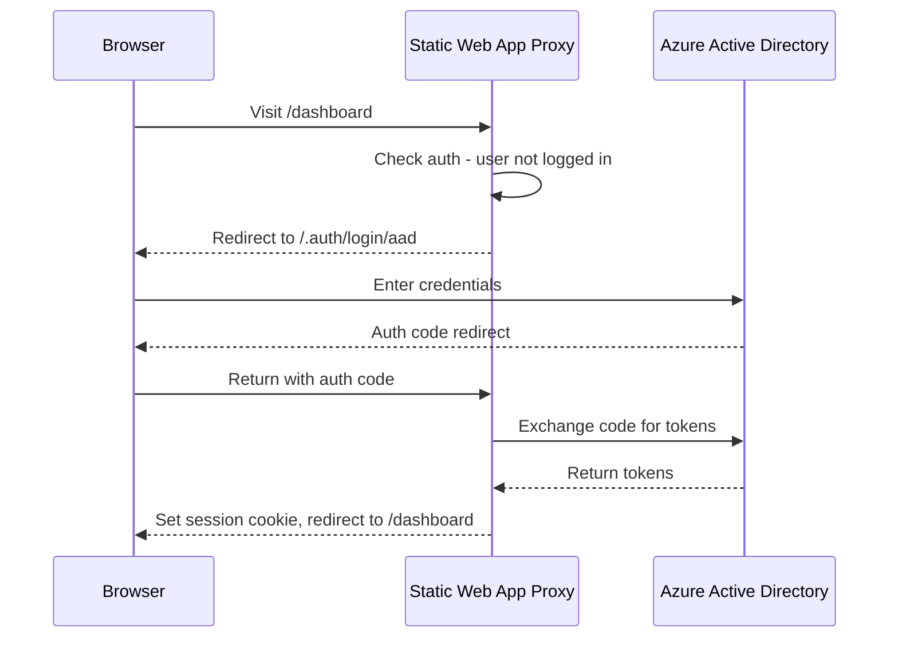

# How to Configure Authentication with Azure Active Directory in Azure Static Web Apps

Author: [nawazdhandala](https://www.github.com/nawazdhandala)

Tags: Azure, Static Web Apps, Azure Active Directory, Authentication, Security, Identity, Web Development

Description: Learn how to configure Azure Active Directory authentication for your Azure Static Web Apps to secure routes and manage user access effectively.

---

Authentication is one of those things that should be simple but rarely is. Azure Static Web Apps tries to change that by offering built-in authentication with zero backend code required. Among the supported providers, Azure Active Directory (Azure AD) is the most common choice for corporate and enterprise applications where you want to restrict access to users in your organization.

This guide covers setting up Azure AD authentication in Azure Static Web Apps, from basic configuration to role-based access control.

## How Authentication Works in Static Web Apps

Azure Static Web Apps provides a reverse proxy that sits between users and your app. When a user hits a protected route, the proxy redirects them to the identity provider (Azure AD in this case), handles the OAuth flow, and then sets a session cookie. Your frontend code never touches passwords or tokens directly.

The built-in endpoints are:

- `/.auth/login/aad` - Initiates Azure AD login.
- `/.auth/logout` - Logs the user out.
- `/.auth/me` - Returns the current user's profile as JSON.



## Prerequisites

You will need:

- An Azure subscription.
- A deployed Azure Static Web App.
- Access to Azure Active Directory (you need permission to register applications).

## Step 1: Register an Azure AD Application

First, register an application in Azure AD that represents your Static Web App.

1. Go to the Azure portal and navigate to Azure Active Directory.
2. Click "App registrations" and then "New registration."
3. Fill in the details:
   - **Name**: My Static Web App (or whatever makes sense for your project).
   - **Supported account types**: "Accounts in this organizational directory only" for single-tenant apps.
   - **Redirect URI**: Select "Web" and enter `https://your-app-name.azurestaticapps.net/.auth/login/aad/callback`.

4. Click Register.

After registration, note down the **Application (client) ID** and **Directory (tenant) ID** from the overview page. You will need these shortly.

## Step 2: Create a Client Secret

1. In your app registration, go to "Certificates & secrets."
2. Click "New client secret."
3. Add a description (like "Static Web App Auth") and choose an expiration period.
4. Click "Add" and immediately copy the secret value. You will not be able to see it again.

## Step 3: Configure the Static Web App

Create or update the `staticwebapp.config.json` file in your app's source directory. This file configures the authentication provider.

```json
{
  "auth": {
    "identityProviders": {
      "azureActiveDirectory": {
        "registration": {
          "openIdIssuer": "https://login.microsoftonline.com/YOUR_TENANT_ID/v2.0",
          "clientIdSettingName": "AAD_CLIENT_ID",
          "clientSecretSettingName": "AAD_CLIENT_SECRET"
        }
      }
    }
  },
  "routes": [
    {
      "route": "/login",
      "rewrite": "/.auth/login/aad"
    },
    {
      "route": "/logout",
      "redirect": "/.auth/logout"
    },
    {
      "route": "/dashboard/*",
      "allowedRoles": ["authenticated"]
    }
  ],
  "responseOverrides": {
    "401": {
      "redirect": "/.auth/login/aad",
      "statusCode": 302
    }
  },
  "navigationFallback": {
    "rewrite": "/index.html",
    "exclude": ["/images/*.{png,jpg}", "/css/*"]
  }
}
```

The `openIdIssuer` must include your specific tenant ID. Replace `YOUR_TENANT_ID` with the Directory (tenant) ID from step 1.

The `clientIdSettingName` and `clientSecretSettingName` are references to application settings - not the actual values. You set the values separately for security.

## Step 4: Add Application Settings

In the Azure portal, go to your Static Web App resource. Under Settings, click "Configuration" and add two application settings:

- **Name**: `AAD_CLIENT_ID` - **Value**: Your application (client) ID from step 1.
- **Name**: `AAD_CLIENT_SECRET` - **Value**: The client secret from step 2.

These settings are stored securely and referenced by the names you used in the config file.

You can also set these via the CLI.

```bash
# Set the AAD client ID as an application setting
az staticwebapp appsettings set \
  --name my-static-app \
  --resource-group myResourceGroup \
  --setting-names "AAD_CLIENT_ID=your-client-id-here"

# Set the AAD client secret as an application setting
az staticwebapp appsettings set \
  --name my-static-app \
  --resource-group myResourceGroup \
  --setting-names "AAD_CLIENT_SECRET=your-client-secret-here"
```

## Step 5: Protect Routes

The route configuration in `staticwebapp.config.json` controls which pages require authentication. The key property is `allowedRoles`.

Every authenticated user automatically gets the `authenticated` role. You can use this for basic protection.

```json
{
  "routes": [
    {
      "route": "/public/*",
      "allowedRoles": ["anonymous", "authenticated"]
    },
    {
      "route": "/app/*",
      "allowedRoles": ["authenticated"]
    },
    {
      "route": "/admin/*",
      "allowedRoles": ["admin"]
    }
  ]
}
```

Routes are evaluated in order. The first matching route wins. In this example:

- `/public/*` is accessible to everyone.
- `/app/*` requires login.
- `/admin/*` requires the `admin` role (which you assign manually - more on that below).

## Step 6: Assign Custom Roles

For fine-grained access control, you can assign custom roles to specific users through the Azure portal.

1. Go to your Static Web App resource.
2. Under Settings, click "Role management."
3. Click "Invite" and enter:
   - The user's email address.
   - The role to assign (for example, `admin`).
   - An optional expiration date.
4. Click Generate. This creates an invitation link.

Send the link to the user. When they click it and authenticate, they receive the assigned role.

For programmatic role assignment, you can use a custom function. Create an API endpoint that returns roles based on user claims.

```javascript
// api/get-roles/index.js
// This function assigns roles based on the user's identity claims
module.exports = async function (context, req) {
  const clientPrincipal = req.headers['x-ms-client-principal'];

  if (!clientPrincipal) {
    context.res = { status: 401 };
    return;
  }

  // Decode the client principal from the header
  const principal = JSON.parse(
    Buffer.from(clientPrincipal, 'base64').toString('utf8')
  );

  const roles = ['authenticated'];

  // Assign admin role to specific users
  const adminEmails = ['admin@yourcompany.com', 'teamlead@yourcompany.com'];
  if (adminEmails.includes(principal.userDetails)) {
    roles.push('admin');
  }

  // Return the roles for this user
  context.res = {
    body: {
      roles: roles
    }
  };
};
```

Then reference this function in your config.

```json
{
  "auth": {
    "rolesSource": "/api/get-roles",
    "identityProviders": {
      "azureActiveDirectory": {
        "registration": {
          "openIdIssuer": "https://login.microsoftonline.com/YOUR_TENANT_ID/v2.0",
          "clientIdSettingName": "AAD_CLIENT_ID",
          "clientSecretSettingName": "AAD_CLIENT_SECRET"
        }
      }
    }
  }
}
```

## Step 7: Access User Info in Your Frontend

Once a user is authenticated, you can fetch their profile from the `/.auth/me` endpoint.

```javascript
// Fetch the current user's authentication info
async function getUserInfo() {
  try {
    const response = await fetch('/.auth/me');
    const data = await response.json();

    // The clientPrincipal is null if the user is not authenticated
    if (data.clientPrincipal) {
      console.log('User ID:', data.clientPrincipal.userId);
      console.log('Identity Provider:', data.clientPrincipal.identityProvider);
      console.log('User Details:', data.clientPrincipal.userDetails);
      console.log('Roles:', data.clientPrincipal.userRoles);
      return data.clientPrincipal;
    }

    return null;
  } catch (error) {
    console.error('Failed to fetch user info:', error);
    return null;
  }
}
```

The `clientPrincipal` object includes the user's ID, their identity provider (`aad`), their display name or email in `userDetails`, and an array of assigned roles.

## Step 8: Handle Logout

Logging out is straightforward. Redirect the user to `/.auth/logout`, which clears the session cookie.

```javascript
// Log the user out and optionally redirect to a specific page
function logout() {
  // The post_logout_redirect_uri sends the user to this URL after logout
  window.location.href = '/.auth/logout?post_logout_redirect_uri=/';
}
```

## Common Pitfalls

**Redirect URI mismatch**: The redirect URI in your Azure AD app registration must exactly match `https://your-app.azurestaticapps.net/.auth/login/aad/callback`. If you use a custom domain, add that as an additional redirect URI.

**Tenant restrictions**: If you selected "single tenant" during app registration, only users from your Azure AD directory can log in. Switch to "multi-tenant" if you need external users.

**Config file location**: The `staticwebapp.config.json` must be in the root of your build output, not just in your source directory. For React apps, place it in the `public` folder so it gets copied to the `build` folder.

**Secret expiration**: Client secrets expire. Set a reminder to rotate them before they do, or your authentication will silently break.

## Summary

Azure Static Web Apps makes Azure AD authentication surprisingly accessible. The built-in proxy handles the OAuth flow, you configure routes declaratively in a JSON file, and you can add custom roles for granular access control. The combination of zero-backend auth with optional serverless functions for role assignment gives you flexibility without complexity. Just remember to keep your client secrets rotated and your redirect URIs up to date.
