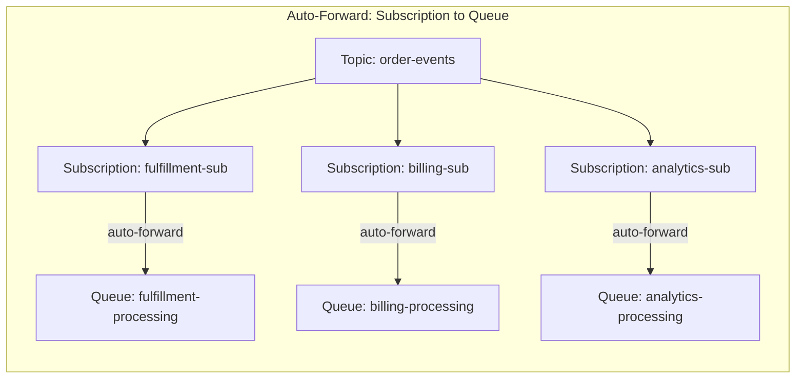

# How to Configure Auto-Forwarding Between Azure Service Bus Queues

Author: [nawazdhandala](https://www.github.com/nawazdhandala)

Tags: Azure Service Bus, Auto-Forwarding, Message Routing, Queue Chaining, Azure, Messaging, Architecture

Description: Set up auto-forwarding in Azure Service Bus to chain queues and subscriptions together for message routing, load leveling, and fan-out architectures.

---

Auto-forwarding is an Azure Service Bus feature that automatically moves messages from one queue or subscription to another queue or topic within the same namespace. The forwarding happens at the broker level with no consumer code needed. Messages arrive at the source entity and are immediately forwarded to the destination, as if they were sent there directly.

This might sound trivial, but auto-forwarding enables several powerful architectural patterns: fan-out from subscriptions to dedicated processing queues, aggregation of messages from multiple sources into a single queue, and multi-stage routing pipelines. In this post, I will show you how to configure auto-forwarding and walk through practical scenarios where it shines.

## How Auto-Forwarding Works

When auto-forwarding is enabled on a queue or subscription, any message that arrives at that entity is automatically transferred to the specified destination entity. The transfer happens within a Service Bus transaction, so either the message is successfully forwarded or it stays in the source entity.



The source entity acts as a routing intermediary. Consumers do not read from the subscriptions directly - they read from the destination queues, which might have their own configuration for sessions, dead-lettering, or partitioning.

## Setting Up Auto-Forwarding

Configure auto-forwarding when creating or updating a queue or subscription.

### Forwarding from a Subscription to a Queue

```bash
# Create the destination queues first
az servicebus queue create \
  --name fulfillment-processing \
  --namespace-name my-servicebus \
  --resource-group my-rg \
  --max-delivery-count 10

az servicebus queue create \
  --name billing-processing \
  --namespace-name my-servicebus \
  --resource-group my-rg \
  --max-delivery-count 10 \
  --enable-session true

# Create the topic
az servicebus topic create \
  --name order-events \
  --namespace-name my-servicebus \
  --resource-group my-rg

# Create subscriptions with auto-forwarding to the destination queues
az servicebus topic subscription create \
  --name fulfillment-sub \
  --topic-name order-events \
  --namespace-name my-servicebus \
  --resource-group my-rg \
  --forward-to fulfillment-processing

az servicebus topic subscription create \
  --name billing-sub \
  --topic-name order-events \
  --namespace-name my-servicebus \
  --resource-group my-rg \
  --forward-to billing-processing
```

### Forwarding from a Queue to Another Queue

```bash
# Create a chain: incoming -> processing -> archive
az servicebus queue create \
  --name processing \
  --namespace-name my-servicebus \
  --resource-group my-rg

az servicebus queue create \
  --name archive \
  --namespace-name my-servicebus \
  --resource-group my-rg

# Set up auto-forwarding on dead-letter messages
# When processing fails, forward dead letters to a centralized error queue
az servicebus queue update \
  --name processing \
  --namespace-name my-servicebus \
  --resource-group my-rg \
  --forward-dead-lettered-messages-to archive
```

## Pattern 1: Fan-Out with Dedicated Processing Queues

This is the most common use case. A topic receives events, and subscriptions with filters route different event types to dedicated processing queues. Each queue can have its own scaling, session, and retry settings.

```csharp
using Azure.Messaging.ServiceBus.Administration;

public class FanOutSetup
{
    private readonly ServiceBusAdministrationClient _adminClient;

    public FanOutSetup(ServiceBusAdministrationClient adminClient)
    {
        _adminClient = adminClient;
    }

    // Set up a fan-out architecture with auto-forwarding
    public async Task ConfigureFanOutAsync()
    {
        // Create the central topic
        if (!await _adminClient.TopicExistsAsync("order-events"))
        {
            await _adminClient.CreateTopicAsync(new CreateTopicOptions("order-events")
            {
                MaxSizeInMegabytes = 5120,
                DefaultMessageTimeToLive = TimeSpan.FromDays(7)
            });
        }

        // Create destination queues with settings appropriate for each workload
        await CreateQueueIfNotExistsAsync("fulfillment-queue", new CreateQueueOptions("fulfillment-queue")
        {
            MaxDeliveryCount = 10,
            LockDuration = TimeSpan.FromMinutes(5),
            // Fulfillment needs ordered processing per order
            RequiresSession = true
        });

        await CreateQueueIfNotExistsAsync("billing-queue", new CreateQueueOptions("billing-queue")
        {
            MaxDeliveryCount = 5,
            LockDuration = TimeSpan.FromMinutes(2),
            // Billing needs duplicate detection
            RequiresDuplicateDetection = true,
            DuplicateDetectionHistoryTimeWindow = TimeSpan.FromMinutes(10)
        });

        await CreateQueueIfNotExistsAsync("notification-queue", new CreateQueueOptions("notification-queue")
        {
            MaxDeliveryCount = 3,
            // Notifications have a short TTL - no point sending old notifications
            DefaultMessageTimeToLive = TimeSpan.FromHours(1)
        });

        // Create subscriptions with filters and auto-forwarding
        await CreateFilteredSubscriptionAsync(
            topicName: "order-events",
            subscriptionName: "fulfillment-sub",
            forwardTo: "fulfillment-queue",
            filterExpression: "EventType IN ('OrderCreated', 'OrderPaid', 'OrderShipped')");

        await CreateFilteredSubscriptionAsync(
            topicName: "order-events",
            subscriptionName: "billing-sub",
            forwardTo: "billing-queue",
            filterExpression: "EventType IN ('OrderPaid', 'RefundRequested')");

        await CreateFilteredSubscriptionAsync(
            topicName: "order-events",
            subscriptionName: "notification-sub",
            forwardTo: "notification-queue",
            filterExpression: "EventType != 'InternalUpdate'");
    }

    private async Task CreateFilteredSubscriptionAsync(
        string topicName, string subscriptionName,
        string forwardTo, string filterExpression)
    {
        if (!await _adminClient.SubscriptionExistsAsync(topicName, subscriptionName))
        {
            await _adminClient.CreateSubscriptionAsync(
                new CreateSubscriptionOptions(topicName, subscriptionName)
                {
                    ForwardTo = forwardTo,
                    // No need for a long lock duration since messages are auto-forwarded
                    LockDuration = TimeSpan.FromSeconds(30),
                    MaxDeliveryCount = 1
                });

            // Remove the default "match all" rule
            await _adminClient.DeleteRuleAsync(topicName, subscriptionName, "$Default");

            // Add the filter rule
            await _adminClient.CreateRuleAsync(topicName, subscriptionName,
                new CreateRuleOptions("TypeFilter", new SqlRuleFilter(filterExpression)));
        }
    }

    private async Task CreateQueueIfNotExistsAsync(string name, CreateQueueOptions options)
    {
        if (!await _adminClient.QueueExistsAsync(name))
        {
            await _adminClient.CreateQueueAsync(options);
        }
    }
}
```

## Pattern 2: Message Aggregation

Multiple sources send to different queues, and auto-forwarding consolidates them into a single processing queue.

```bash
# Queues that different systems publish to
az servicebus queue create --name orders-api \
  --namespace-name my-servicebus --resource-group my-rg \
  --forward-to all-orders

az servicebus queue create --name orders-import \
  --namespace-name my-servicebus --resource-group my-rg \
  --forward-to all-orders

az servicebus queue create --name orders-webhook \
  --namespace-name my-servicebus --resource-group my-rg \
  --forward-to all-orders

# Central processing queue that receives from all sources
az servicebus queue create --name all-orders \
  --namespace-name my-servicebus --resource-group my-rg \
  --max-delivery-count 10
```

Now all three input queues funnel messages into `all-orders`, where a single consumer processes them. The source queue names can be checked in the message's custom properties if you need to know where a message originated.

## Pattern 3: Dead-Letter Forwarding to a Central Error Queue

Instead of monitoring dead-letter sub-queues on every queue individually, forward all dead-lettered messages to a central error queue.

```bash
# Central error queue for all dead-lettered messages
az servicebus queue create --name central-errors \
  --namespace-name my-servicebus --resource-group my-rg

# Configure each queue to forward dead-letters to the central queue
az servicebus queue update --name orders \
  --namespace-name my-servicebus --resource-group my-rg \
  --forward-dead-lettered-messages-to central-errors

az servicebus queue update --name payments \
  --namespace-name my-servicebus --resource-group my-rg \
  --forward-dead-lettered-messages-to central-errors

az servicebus queue update --name notifications \
  --namespace-name my-servicebus --resource-group my-rg \
  --forward-dead-lettered-messages-to central-errors
```

Now you only need to monitor and process one queue for all errors across your entire messaging system.

## Processing the Forwarded Messages

Consumers read from the destination queues just like they would from any normal queue. The auto-forwarding is transparent.

```csharp
// Consumer for the fulfillment queue
// Does not need to know that messages were auto-forwarded from a subscription
[Function("ProcessFulfillment")]
public async Task ProcessFulfillment(
    [ServiceBusTrigger("fulfillment-queue",
        Connection = "ServiceBusConnection",
        IsSessionsEnabled = true)]
    ServiceBusReceivedMessage message,
    ServiceBusMessageActions messageActions)
{
    var order = message.Body.ToObjectFromJson<OrderEvent>();

    _logger.LogInformation(
        "Processing fulfillment for order {OrderId}, event: {Event}",
        order.OrderId, order.EventType);

    await _fulfillmentService.HandleEventAsync(order);
    await messageActions.CompleteMessageAsync(message);
}
```

## Limitations

Auto-forwarding has a few constraints to be aware of.

The destination entity must exist in the same Service Bus namespace. Cross-namespace forwarding is not supported.

You can chain up to 4 forwarding hops. So Queue A can forward to Queue B, which forwards to Queue C, which forwards to Queue D. But Queue D cannot forward to Queue E.

If the destination entity is full or unavailable, messages accumulate in the source entity. The transfer dead-letter queue captures messages that fail to forward after retries.

Auto-forwarding does not support transformation. The message arrives at the destination exactly as it was sent to the source. If you need to modify messages during routing, you need a consumer in between.

## Monitoring Auto-Forward Health

Check the transfer dead-letter queue to detect forwarding failures.

```csharp
// Monitor forwarding health by checking transfer dead-letter counts
public async Task CheckForwardingHealthAsync()
{
    var adminClient = new ServiceBusAdministrationClient(
        Environment.GetEnvironmentVariable("ServiceBusConnection"));

    await foreach (var queue in adminClient.GetQueuesAsync())
    {
        var runtime = await adminClient.GetQueueRuntimePropertiesAsync(queue.Name);

        if (runtime.Value.TransferDeadLetterMessageCount > 0)
        {
            _logger.LogWarning(
                "Queue {Queue} has {Count} transfer dead-letter messages - " +
                "auto-forwarding may be failing",
                queue.Name, runtime.Value.TransferDeadLetterMessageCount);
        }
    }
}
```

## Summary

Auto-forwarding in Azure Service Bus is a broker-level routing mechanism that chains queues and subscriptions together without custom code. Use it for fan-out from topics to dedicated processing queues, aggregating messages from multiple sources, and centralizing dead-letter handling. It is transactional, transparent to consumers, and requires zero application code. The main limitations are the same-namespace constraint and the 4-hop chain limit. For most messaging architectures, auto-forwarding simplifies the topology and reduces the amount of glue code you need to write.
