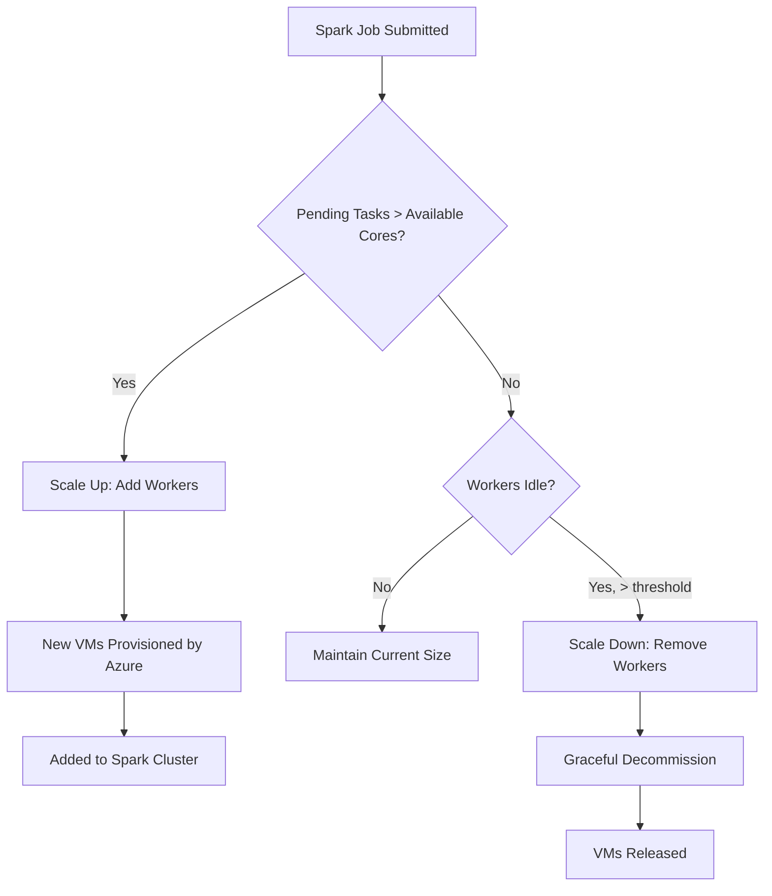

# How to Configure Auto-Scaling for Azure Databricks Clusters to Reduce Costs

Author: [nawazdhandala](https://www.github.com/nawazdhandala)

Tags: Azure Databricks, Auto-Scaling, Cost Optimization, Spark, Cluster Management, Cloud Computing, Performance

Description: Configure auto-scaling for Azure Databricks clusters to automatically adjust compute resources based on workload and reduce unnecessary cloud spending.

---

Databricks clusters are one of the largest line items on many Azure bills. A common mistake is provisioning a fixed-size cluster that is big enough for peak workloads but sits mostly idle during off-peak times. Auto-scaling solves this by dynamically adding and removing worker nodes based on the current workload demand.

The difference is significant. I have seen teams cut their Databricks compute costs by 40-60% just by switching from fixed-size clusters to properly configured auto-scaling clusters. The key is understanding the different scaling options and tuning them for your workload patterns.

## How Auto-Scaling Works in Databricks

Databricks auto-scaling monitors the pending task queue in Spark. When there are more tasks than available cores, it adds workers. When workers sit idle for a defined period, it removes them. The scaling happens at the VM level - Databricks requests new VMs from Azure, waits for them to provision, and adds them to the Spark cluster.



## Types of Clusters

Before configuring auto-scaling, understand the two cluster types:

**All-Purpose (Interactive) Clusters**: Used for development, ad-hoc queries, and notebooks. These stay running and are shared by multiple users.

**Job Clusters**: Created for a specific job run and terminated when the job finishes. These are the more cost-effective option for production workloads.

Both types support auto-scaling, but the tuning strategy differs.

## Step 1: Configure Auto-Scaling for Interactive Clusters

When creating or editing a cluster in the Databricks workspace, you will see options for worker count. To enable auto-scaling, set a minimum and maximum number of workers.

```json
{
    "cluster_name": "analytics-team-cluster",
    "spark_version": "13.3.x-scala2.12",
    "node_type_id": "Standard_DS3_v2",
    "driver_node_type_id": "Standard_DS4_v2",
    "autoscale": {
        "min_workers": 2,
        "max_workers": 16
    },
    "autotermination_minutes": 30,
    "spark_conf": {
        "spark.databricks.cluster.profile": "serverless",
        "spark.databricks.repl.allowedLanguages": "python,sql"
    },
    "custom_tags": {
        "team": "analytics",
        "environment": "development",
        "cost_center": "CC-123"
    }
}
```

Key settings to tune:

- **min_workers**: The minimum number of workers that always run. Set this to the baseline your team needs for interactive queries. Too low and users will wait for scale-up; too high and you pay for idle resources.
- **max_workers**: The ceiling. This prevents runaway costs from a badly written query that demands hundreds of cores.
- **autotermination_minutes**: How long the cluster idles before shutting down completely. 30 minutes is common for development clusters.

You can create clusters via the Databricks CLI:

```bash
# Create an auto-scaling interactive cluster using the Databricks CLI
databricks clusters create --json '{
    "cluster_name": "analytics-team",
    "spark_version": "13.3.x-scala2.12",
    "node_type_id": "Standard_DS3_v2",
    "autoscale": {
        "min_workers": 2,
        "max_workers": 16
    },
    "autotermination_minutes": 30
}'
```

## Step 2: Configure Auto-Scaling for Job Clusters

Job clusters are more aggressive about scaling because they exist only for the duration of a job. Set min_workers to a reasonable starting point and let max_workers accommodate peak parallelism.

```python
# job_config.py - Configure a Databricks job with auto-scaling cluster
from databricks.sdk import WorkspaceClient
from databricks.sdk.service.jobs import (
    JobSettings,
    Task,
    NotebookTask,
    ClusterSpec,
    AutoScale
)

w = WorkspaceClient()

# Define the job with an auto-scaling job cluster
job = w.jobs.create(
    name="daily-etl-pipeline",
    tasks=[
        Task(
            task_key="transform",
            notebook_task=NotebookTask(
                notebook_path="/Shared/pipelines/transform_data"
            ),
            new_cluster=ClusterSpec(
                spark_version="13.3.x-scala2.12",
                node_type_id="Standard_DS3_v2",
                # Auto-scaling configuration for the job cluster
                autoscale=AutoScale(
                    min_workers=4,   # Start with 4 workers
                    max_workers=32   # Scale up to 32 if needed
                ),
                spark_conf={
                    # Optimize Spark for the workload
                    "spark.sql.adaptive.enabled": "true",
                    "spark.sql.adaptive.coalescePartitions.enabled": "true"
                }
            )
        )
    ],
    max_concurrent_runs=1
)

print(f"Job created with ID: {job.job_id}")
```

## Step 3: Use Cluster Pools for Faster Scaling

The biggest complaint about auto-scaling is that it takes 3-5 minutes for new VMs to provision. Cluster pools solve this by keeping a set of idle VMs ready to go.

```bash
# Create a cluster pool with pre-warmed instances
databricks instance-pools create --json '{
    "instance_pool_name": "analytics-pool",
    "node_type_id": "Standard_DS3_v2",
    "min_idle_instances": 2,
    "max_capacity": 50,
    "idle_instance_autotermination_minutes": 15,
    "preloaded_spark_versions": ["13.3.x-scala2.12"],
    "custom_tags": {
        "team": "analytics"
    }
}'
```

Then configure your cluster to use the pool:

```json
{
    "cluster_name": "fast-scaling-cluster",
    "spark_version": "13.3.x-scala2.12",
    "instance_pool_id": "your-pool-id",
    "autoscale": {
        "min_workers": 2,
        "max_workers": 20
    },
    "driver_instance_pool_id": "your-pool-id"
}
```

With a pool, scale-up takes seconds instead of minutes because the VMs are already provisioned and have Spark pre-installed.

## Step 4: Optimize Spot Instances for Cost Savings

Azure Spot VMs are excess capacity that Azure sells at steep discounts (often 60-90% off). Databricks can use spot instances for worker nodes while keeping the driver on a regular (on-demand) instance for reliability.

```json
{
    "cluster_name": "cost-optimized-cluster",
    "spark_version": "13.3.x-scala2.12",
    "driver_node_type_id": "Standard_DS4_v2",
    "node_type_id": "Standard_DS3_v2",
    "autoscale": {
        "min_workers": 2,
        "max_workers": 20
    },
    "azure_attributes": {
        "first_on_demand": 1,
        "availability": "SPOT_WITH_FALLBACK_AZURE",
        "spot_bid_max_price": -1
    }
}
```

The settings:
- **first_on_demand: 1**: The driver (first instance) always uses on-demand pricing for reliability
- **availability: SPOT_WITH_FALLBACK_AZURE**: Use spot instances but fall back to on-demand if spots are not available
- **spot_bid_max_price: -1**: Pay up to the on-demand price (never lose instances due to pricing)

## Step 5: Monitor Scaling Behavior

Track how your clusters scale to identify optimization opportunities:

```python
# monitor_scaling.py - Analyze cluster scaling patterns
from databricks.sdk import WorkspaceClient
from datetime import datetime, timedelta

w = WorkspaceClient()

# Get cluster events for the last 24 hours
cluster_id = "your-cluster-id"
events = w.clusters.events(
    cluster_id=cluster_id,
    start_time=int((datetime.now() - timedelta(days=1)).timestamp() * 1000),
    end_time=int(datetime.now().timestamp() * 1000),
    event_types=["AUTOSCALING_STATS_REPORT", "NODES_ADDED", "NODES_REMOVED"]
)

# Analyze scaling events
scale_ups = 0
scale_downs = 0
max_nodes = 0

for event in events.events:
    if event.type.value == "NODES_ADDED":
        scale_ups += 1
        current = event.details.get("current_num_workers", 0)
        if current > max_nodes:
            max_nodes = current
        print(f"Scale up at {event.timestamp}: {current} workers")

    elif event.type.value == "NODES_REMOVED":
        scale_downs += 1
        current = event.details.get("current_num_workers", 0)
        print(f"Scale down at {event.timestamp}: {current} workers")

print(f"\nSummary:")
print(f"  Scale up events: {scale_ups}")
print(f"  Scale down events: {scale_downs}")
print(f"  Maximum workers reached: {max_nodes}")
```

## Step 6: Right-Size Your Auto-Scaling Configuration

After monitoring for a week or two, adjust your configuration:

**If the cluster frequently hits max_workers**: Either increase max_workers or optimize your Spark jobs to use fewer resources.

**If min_workers sit idle most of the time**: Reduce min_workers. For development clusters, min_workers of 1 or even 0 (with a pool) can work.

**If scale-up is too slow**: Use cluster pools to pre-warm instances, or increase min_workers to avoid cold starts.

**If you see frequent scale-up and scale-down cycles (thrashing)**: Increase the scale-down threshold or set a longer idle timeout.

## Cost Comparison Example

Here is a realistic comparison for a cluster running 12 hours per day, 5 days per week:

| Configuration | Avg Workers | Monthly Cost (approx) |
|---------------|-------------|----------------------|
| Fixed 16 workers | 16 | $4,800 |
| Auto-scale 2-16 | ~6 (average) | $1,800 |
| Auto-scale 2-16 + Spot | ~6 (average) | $900 |

The combination of auto-scaling and spot instances can reduce costs by over 80% compared to a fixed-size cluster.

## Summary

Auto-scaling is the single most effective cost optimization for Azure Databricks. Configure min_workers for your baseline needs, max_workers for peak capacity, and use cluster pools to minimize scale-up latency. Layer in spot instances for additional savings. Monitor your clusters regularly to identify tuning opportunities - the default settings are a good start, but workload-specific tuning can save you significantly more. The goal is to pay for exactly the compute you need, when you need it, and not a penny more.
